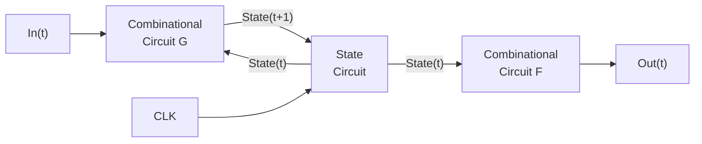
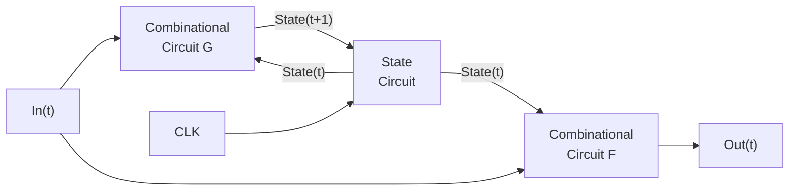

<!-- Page 1 -->

# 惠勒间接原理：<span style="color:red">间接</span>可解任意计算问题

- 计算机科学的任何问题都可以通过又一个间接层解决  
  Any problem in computer science can be solved with  
  another level of indirection

- 计算的任何问题都可以用又一个间接层解决  
  Any problem in computing can be solved with another  
  level of indirection

- 剑桥大学的大卫·惠勒教授提出了这个看起来很夸张的原理

- 巴特勒·兰普森（Butler Lampson）在图灵奖演说中引用了  
  这个“<span style="color:red">让计算现实</span>”的原理，使它成为一句智慧类名言

---

大卫·惠勒  
David Wheeler（1927-2004）  
全球第一个计算机**PhD**（1951）  
汇编语言发明者  
Bjarne Stroustrup (C++) 的博士生导师

巴特勒·兰普森  
Butler Lampson（1943-）  
1992年图灵奖得主

---

Lampson, B. (1993). Principles for computer system design.  
*ACM Turing award lectures.* https://dl.acm.org/doi/pdf/10.1145/1283920.2159562

Lampson, B. (2020). Hints and principles for computer system design.  
https://arxiv.org/pdf/2011.02455

1

---

<!-- Page 2 -->

# 计算机科学导论-课件10

课件中包含素材引用，特此致谢！

# 系统思维-1

## 抽象化与模块化实例

## 加法器：组合电路、时序电路实现

# Acu-Exams

## abstraction, modularization

徐志伟（zxu@qbu.edu.cn 18910338695）  
大湾区大学 信息科学技术学院

2

---

<!-- Page 3 -->

# 提纲

- 系统思维作用：让计算现实

- 系统思维核心：**以一耦万**
  - 一套抽象栈支持万千应用
  - 通过**一套**抽象，将模块组合成为系统，无缝执行**众多**应用
  - 关键原理：惠勒间接原理

- **组合电路——**让布尔逻辑现实
- **时序电路——**让状态机现实
- 相关知识与 **Python** 编程结构

## 万千应用

```text
┌──────────────┐
│   万千应用   │
└──────────────┘
┌──────────────┐
│ 程序         │  } 软件
│ 进程         │
│ 指令         │
│ 冯诺依曼架构 │
│ 指令流水线   │  } 硬件
│ 时序电路     │
│ 组合电路     │
└──────────────┘
```

## 问题场景——实现 4 比特加法器硬件电路

- 组合电路加法器
- 时序电路加法器

初步感受系统、部件、抽象、模块等概念  
体认惠勒原理、以一耦万

---

<!-- Page 4 -->

# 1. 逻辑门与组合电路

回忆布尔逻辑中的布尔运算

## AND

| X | Y | Z |
|---|---|---|
| 0 | 0 | 0 |
| 0 | 1 | 0 |
| 1 | 0 | 0 |
| 1 | 1 | 1 |

$Z = X \cdot Y$

## OR

| X | Y | Z |
|---|---|---|
| 0 | 0 | 0 |
| 0 | 1 | 1 |
| 1 | 0 | 1 |
| 1 | 1 | 1 |

$Z = X + Y$

## NOT

| X | Z |
|---|---|
| 0 | 1 |
| 1 | 0 |

$Z = \overline{X}$

## XOR

| X | Y | Z |
|---|---|---|
| 0 | 0 | 0 |
| 0 | 1 | 1 |
| 1 | 0 | 1 |
| 1 | 1 | 0 |

$Z = X \oplus Y$

## NAND

| X | Y | Z |
|---|---|---|
| 0 | 0 | 1 |
| 0 | 1 | 1 |
| 1 | 0 | 1 |
| 1 | 1 | 0 |

$Z = \overline{X \cdot Y}$

---

<!-- Page 5 -->

# 1. 逻辑门与组合电路

回忆布尔逻辑中的布尔运算； <span style="color:red;">**逻辑门（gate）是实现布尔运算的电路**</span>

## 与门

| X | Y | Z |
|---|---|---|
| 0 | 0 | 0 |
| 0 | 1 | 0 |
| 1 | 0 | 0 |
| 1 | 1 | 1 |

<span style="color:red;">与门</span>

AND

$Z = X \cdot Y$

## 或门

| X | Y | Z |
|---|---|---|
| 0 | 0 | 0 |
| 0 | 1 | 1 |
| 1 | 0 | 1 |
| 1 | 1 | 1 |

<span style="color:red;">或门</span>

OR

$Z = X + Y$

## 非门

| X | Z |
|---|---|
| 0 | 1 |
| 1 | 0 |

<span style="color:red;">非门</span>

NOT

$Z = \overline{X}$

## 异或门

| X | Y | Z |
|---|---|---|
| 0 | 0 | 0 |
| 0 | 1 | 1 |
| 1 | 0 | 1 |
| 1 | 1 | 0 |

<span style="color:red;">异或门</span>

XOR

$Z = X \oplus Y$

## 与非门

| X | Y | Z |
|---|---|---|
| 0 | 0 | 1 |
| 0 | 1 | 1 |
| 1 | 0 | 1 |
| 1 | 1 | 0 |

<span style="color:red;">与非门</span>

NAND

$Z = \overline{X \cdot Y}$

---

<!-- Page 6 -->

# 五种逻辑门

**与**  
**或**  
**非**  
**异或**  
**与非**

| Gate | Truth table | Formula |
|---|---|---|
| **AND** | \| X \| Y \| Z \|<br>\|---\|---\|---\|<br>\| 0 \| 0 \| 0 \|<br>\| 0 \| 1 \| 0 \|<br>\| 1 \| 0 \| 0 \|<br>\| 1 \| 1 \| 1 \| | $Z = X \cdot Y$ |
| **OR** | \| X \| Y \| Z \|<br>\|---\|---\|---\|<br>\| 0 \| 0 \| 0 \|<br>\| 0 \| 1 \| 1 \|<br>\| 1 \| 0 \| 1 \|<br>\| 1 \| 1 \| 1 \| | $Z = X + Y$ |
| **NOT** | \| X \| Z \|<br>\|---\|---\|<br>\| 0 \| 1 \|<br>\| 1 \| 0 \| | $Z = \overline{X}$ |
| **XOR** | \| X \| Y \| Z \|<br>\|---\|---\|---\|<br>\| 0 \| 0 \| 0 \|<br>\| 0 \| 1 \| 1 \|<br>\| 1 \| 0 \| 1 \|<br>\| 1 \| 1 \| 0 \| | $Z = X \oplus Y$ |
| **NAND** | \| X \| Y \| Z \|<br>\|---\|---\|---\|<br>\| 0 \| 0 \| 1 \|<br>\| 0 \| 1 \| 1 \|<br>\| 1 \| 0 \| 1 \|<br>\| 1 \| 1 \| 0 \| | $Z = \overline{X \cdot Y}$ |

## CMOS circuit for NAND

Inputs: $X$, $Y$  
Output: $Z$  
Power rails: $V_{dd}$, $V_{ss}$

MOSFET terminals:

- **Drain**
- **Gate**
- **Source**

**小圈表示 NOT（非）**

# 两个与非门级联形成的组合电路

及其 **CMOS** 电路

$$
Z = \overline{\left(\overline{X \cdot Y}\right) \cdot W}
$$

Logic structure:

```text
X ──┐
    ├── NAND A ──┐
Y ──┘            ├── NAND B ── Z
W ───────────────┘
```

Where:

$$
A = \overline{X \cdot Y}
$$

$$
Z = \overline{A \cdot W}
$$

---

<!-- Page 7 -->

# 逻辑门实现基本布尔运算，组合电路实现布尔表达式

- 使用逻辑线路图（logic diagram）表示组合电路
  - 不用更加繁杂的 CMOS 电路图
- 组合电路由逻辑门连接而成，没有反馈连线

## 布尔表达式

$$
z=\overline{\overline{(X\cdot Y)}\cdot W}
$$

## 逻辑线路图

输入：$X, Y, W$  
输出：$Z$

逻辑门：$A, B$

> 不允许反馈线路 ❌

## CMOS 电路图

标注：$V_{dd}$、$V_{SS}$、$X$、$Y$、$W$、$Z$

---

<!-- Page 8 -->

## 2. 加法器设计任务/问题：用逻辑门实现4位加法器

$Z_3Z_2Z_1Z_0 = X_3X_2X_1X_0 + Y_3Y_2Y_1Y_0$；并求出最高位进位 $C_4$，假设最低位进位 $C_0 = 0$

\[
\begin{array}{r}
X_3X_2X_1X_0 \\
+ \quad Y_3Y_2Y_1Y_0 \\
\hline
Z_3Z_2Z_1Z_0
\end{array}
\]

```text
          C4       Z3       Z2       Z1       Z0
          ↑        ↑        ↑        ↑        ↑
    ┌──────────────────────────────────────────────┐
    │                                              │
    │                  4位加法器                   │
    │                                              │
    └──────────────────────────────────────────────┘
      ↑    ↑    ↑    ↑    ↑    ↑    ↑    ↑    ↑
      X3   X2   X1   X0   Y3   Y2   Y1   Y0   C0
```

请同学们讲思路

已经

- 学了布尔逻辑
- 做了加法图灵机

8

---

<!-- Page 9 -->

# 要求： 比主析取范式方案更好

- 逻辑思维单元提供的现成方案：用主析取范式实现布尔函数
  - 任意布尔函数（理论上）可用三级门电路实现
    - $\boldsymbol{Z}=\boldsymbol{X}+\boldsymbol{Y}$；最低位进位 $\color{blue}{C_0=0}$，生成最高位进位 $\color{blue}{C_4}$
    - $\boldsymbol{Z_3Z_2Z_1Z_0}=\boldsymbol{X_3X_2X_1X_0}+\boldsymbol{Y_3Y_2Y_1Y_0}$
  - 特点：通用、稠密；难以解释，成本高

- 设计更加专业的加法器
  - 可实际电路实现，可解释，成本更低
  - 难点/要点：明确间接抽象

- 计算机的运算器
  - 比加法器更加通用
    - 加法、减法、左移、右移、逻辑运算

## 4位加法器

用主析取范式实现

```text
        C4          Z3          Z2          Z1          Z0
        ↑           ↑           ↑           ↑           ↑
     ┌─────┐     ┌─────┐     ┌─────┐     ┌─────┐     ┌─────┐
     │三级 │     │三级 │     │三级 │     │三级 │     │三级 │
     │门电路│    │门电路│    │门电路│    │门电路│    │门电路│
     └─────┘     └─────┘     └─────┘     └─────┘     └─────┘
        ↑           ↑           ↑           ↑           ↑
        └────────────── …… ────────────────┘
      X3   X2   X1   X0   Y3   Y2   Y1   Y0   C0
```

9

---

<!-- Page 10 -->

# 惠勒间接原理应用于加法器设计： 使用逻辑门实现4位加法器

## 目标

**4位加法器 4-Bit Adder**

## 逻辑门

| 输入 | 逻辑门 | 输出 |
|---|---|---|
| X, Y | AND | Z |
| X, Y | OR | Z |
| X | NOT | Z |
| X, Y | XOR | Z |
| X, Y | NAND | Z |

10

---

<!-- Page 11 -->

# 三种方式采用三种抽象，有不同的硬件成本和计算时延

## 目标

**4位加法器 4-Bit Adder**

| 抽象层次 | 方式一 | 方式二 | 方式三 |
|---|---|---|---|
| **间接2** | 波纹进位加法器<br>**Ripple-Carry Adder** | 先行进位加法器<br>**Carry-Lookahead Adder** | 比特串行加法器<br>**Bit-Serial Adder** |
| **间接1** | 全加器<br>**Full Adder** | 进位传播 **P**、进位生成 **G**<br>**Propagate, Generate** | 延迟触发器<br>**Delay Flip Flop** |
| **逻辑门** | AND 门：$X, Y \rightarrow Z$ | OR 门：$X, Y \rightarrow Z$ | NOT 门：$X \rightarrow Z$<br>XOR 门：$X, Y \rightarrow Z$<br>NAND 门：$X, Y \rightarrow Z$ |

---

<!-- Page 12 -->

# 这三种加法器电路都具备可解释性（interpretability）

## 即，能够让人明白，为什么这个加法器实现了加法

- 可解释性，是当前AI研究热点
  - 向人解释清楚，human-understandable
  - 当前AI往往是黑箱（black box）
    - Hurt trust, transparency, compliance
    - Difficult to debug, optimize

- 当前大语言模型（LLM）
  - 通用、稠密、不可解释，往往成本高
  - 就像用主析取范式实现布尔函数
    - 任意布尔函数（理论上）可用三级门电路实现
    - 通用、稠密、难以解释，往往成本高

- 本周的电路有各自抽象
  - 专用、稀疏、可解释，往往成本更低
  - 完全不同于主析取范式暴力实现方案

- **系统思维使计算现实！**

---

## 4位加法器

用主析取范式实现

输出：\(C_4\ Z_3\ Z_2\ Z_1\ Z_0\)

输入：\(X_3\ X_2\ X_1\ X_0\ Y_3\ Y_2\ Y_1\ Y_0\ C_0\)

---

November 13, 2025　Research　Publication

# Understanding neural networks through sparse circuits

We trained models to think in simpler, more traceable steps—so we can better understand how they work.

Read the paper ↗

https://openai.com/index/understanding-neural-networks-through-sparse-circuits/

最新研究

12

---

<!-- Page 13 -->

# 3. 从N位加法器看组合电路的四种设计方法

- 从被加数输入X与Y产生求和输出Z；其中X，Y，Z都是N位无符号数
  - 如下面N=16例子；要考虑进位C（N+1位数），尤其是进位输入比特$C_0$与进位输出比特$C_{16}$
- 方法1：直连逻辑门，在**全加器**例子中体现
- 方法2：模块串联，**波纹进位加法器**例子
- 方法3：模块并联，**先行进位加法器**例子
- 方法4：添加控制信号拓展功能，**加减器**例子

```text
          2^16  2^15  2^14  2^13  2^12  2^11  2^10  2^9  2^8  2^7  2^6  2^5  2^4  2^3  2^2  2^1  2^0
           位    位    位    位    位    位    位    位    位    位    位   32位  16位   8位   4位   2位  个位

      X          0     1     0     0     0     0     1    0    0    0    0    0    1    0    1    0
+     Y          1     1     0     0     0     0     1    0    0    0    0    0    1    0    0    1
------------------------------------------------------------------------------------------------------
      Z          0     0     0     0     0     1     0    0    0    0    0    1    0    0    1    1
      C    1     1     0     0     0     0     1     0    0    0    0    0    1    0    0    0    0

---

<!-- Page 14 -->

# 3.1 Full adder 全加器

## 代表了设计方法1：直接连接逻辑门，适合简单小系统

- 当 N=1 时，设计 1 位加法器，即 **全加器（full adder）**
  - “全”：考虑进位输入（$C_{in}$）与进位输出（$C_{out}$），而不只是本位输入（X,Y）与本位输出（Z）
- 此时，全加器是 **系统**，5 个逻辑门是 **模块**；注意两个与门、两个异或门被重用了
- 采用二进制加法原理导出真值表，继而导出输出 **Z** 和 $C_{out}$ 的布尔表达式
  - $Z = X \oplus Y \oplus C_{in}$
  - $C_{out} = (X \cdot Y) + (X \oplus Y) \cdot C_{in}$

## Full adder symbol

输入：$X$, $Y$, $C_{in}$  
输出：$Z$, $C_{out}$

全加器是 **系统**

## Truth table

| Cin | X | Y | Z | Cout |
|---:|---:|---:|---:|---:|
| 0 | 0 | 0 | 0 | 0 |
| 0 | 0 | 1 | 1 | 0 |
| 0 | 1 | 0 | 1 | 0 |
| 0 | 1 | 1 | 0 | 1 |
| 1 | 0 | 0 | 1 | 0 |
| 1 | 0 | 1 | 0 | 1 |
| 1 | 1 | 0 | 0 | 1 |
| 1 | 1 | 1 | 1 | 1 |

全加器真值表

## Implementation by gates

输入：$X$, $Y$, $C_{in}$  
输出：$Z$, $C_{out}$

逻辑门是 **模块**

---

<!-- Page 15 -->

# 3.2 Ripple-carry adder　波纹进位加法器

## 代表了设计方法2：串行连接多个模块，适合延迟不敏感系统

- 串联4个全加器（**模块**），实现一个4位波纹进位加法器（**系统**）
  - 用 \(X+Y=1011+1001=10100\) 验证
- 4位波纹进位加法器延迟：  
  \[
  2N+1=2*4+1=9
  \]
  级门
- 4位波纹进位加法器成本：  
  \[
  N*5=4*5=20
  \]
  个门

---

## Full adder symbol

全加器是**模块**

- 输入：\(X\)、\(Y\)、\(C_{in}\)
- 输出：\(Z\)、\(C_{out}\)

## Its implementation by gates

- 输入：\(X\)、\(Y\)、\(C_{in}\)
- 输出：\(Z\)、\(C_{out}\)

## A 4-bit ripple-carry adder

4位波纹进位加法器是**系统**

\[
C_0 \rightarrow FA_0 \rightarrow C_1 \rightarrow FA_1 \rightarrow C_2 \rightarrow FA_2 \rightarrow C_3 \rightarrow FA_3 \rightarrow C_4
\]

| 全加器 | 输入 | 进位输入 | 输出 | 进位输出 |
|---|---|---|---|---|
| \(FA_0\) | \(X_0, Y_0\) | \(C_0\) | \(Z_0\) | \(C_1\) |
| \(FA_1\) | \(X_1, Y_1\) | \(C_1\) | \(Z_1\) | \(C_2\) |
| \(FA_2\) | \(X_2, Y_2\) | \(C_2\) | \(Z_2\) | \(C_3\) |
| \(FA_3\) | \(X_3, Y_3\) | \(C_3\) | \(Z_3\) | \(C_4\) |

15

---

<!-- Page 16 -->

# 3.3 并行进位加法器（先行进位加法器、超前进位加法器）

## 代表了设计方法3：并行连接，使用中间模块GI和Pi

- 首先，一步并行算出全部进位比特值
  - 这一步需要三级门延迟
  - 为什么是3？
- 实际电路有扇入和扇出限制
  - 扇入（fan-in）：一个门支持的输入数
  - 扇出（fan-out）：一个门输出驱动的线路数

- 其后，一步并行算出Z的N个比特
  - 需要一级门延迟
  - 为什么是1？

- 总共只需4级门延迟　　$4\ \text{vs.}\ 2N+1$
  - 波纹进位加法器需要 $2N+1$ 级门延迟
- 成本：$(N+1) * N / 2 + 4N = 26$ 个门

---

## 算出全部输出比特

**Output:** $Z_3Z_2Z_1Z_0=0100$

| 位 | $Z_i$ | $X_i$ | $Y_i$ | $C_i$ |
|---|---:|---:|---:|---:|
| 3 | $Z_3=0$ | $X_3=1$ | $Y_3=1$ | $C_3=0$ |
| 2 | $Z_2=1$ | $X_2=0$ | $Y_2=0$ | $C_2=1$ |
| 1 | $Z_1=0$ | $X_1=1$ | $Y_1=0$ | $C_1=1$ |
| 0 | $Z_0=0$ | $X_0=1$ | $Y_0=1$ | $C_0=0$ |

**Input:** $X_3X_2X_1X_0=1011,\ Y_3Y_2Y_1Y_0=1001,\ C_3C_2C_1C_0=0110$

---

## 算出全部进位比特

**Output:** $C_4C_3C_2C_1=1011$

进位结果：

- $C_4=1$
- $C_3=0$
- $C_2=1$
- $C_1=1$

---

## 算出G和P

中间信号：

- $G_3=1$
- $G_2=0$
- $G_1=0$
- $G_0=1$
- $P_3=1$
- $P_2=0$
- $P_1=1$
- $P_0=0$

输入：

- $X_3X_2X_1X_0=1011$
- $Y_3Y_2Y_1Y_0=1001$
- $C_0=0$

标注：

- 扇出 fan-out $=4$
- 扇入 fan-in $=5$

---

<!-- Page 17 -->

# 抽象化（中间表示、间接层）是艺术，需要人的创造力

- 一步生成全部进位比特需要艺术
  - 利用了加法的领域专业知识
  - 体现在中间表示 **P，G**（**惠勒间接原理**）

- 根据加法性质，导出两个 **N** 比特字 $G$ 和 $P$
  - 进位生成 Generation：$G = G_3G_2G_1G_0$
    - $C_{i+1} = 1$ 若 $G_i = 1$
  - 进位传播 Propagation：$P = P_3P_2P_1P_0$
    - $C_{i+1} = 1$ 若 $P_i \cdot C_i = 1$

- 设最低位进位 $C_0 = 0$，有：
  - $G_i = X_i \cdot Y_i,\quad P_i = X_i \oplus Y_i$
  - $C_{i+1} = G_i + P_i \cdot C_i$
  - 如，$C_1 = G_0 + P_0 \cdot C_0$

---

$$
G_0 = X_0 \cdot Y_0,\quad
G_1 = X_1 \cdot Y_1,\quad
G_2 = X_2 \cdot Y_2,\quad
G_3 = X_3 \cdot Y_3
$$

$$
P_0 = X_0 \oplus Y_0,\quad
P_1 = X_1 \oplus Y_1,\quad
P_2 = X_2 \oplus Y_2,\quad
P_3 = X_3 \oplus Y_3
$$

将 $C_2$ 展开（便于一步并行产生所有进位），则有

$$
C_2 = G_1 + P_1 \cdot C_1
$$

$$
C_2 = G_1 + P_1 \cdot (G_0 + P_0 \cdot C_0)
= G_1 + P_1 \cdot G_0 + P_1 \cdot P_0 \cdot C_0
$$

同理可得出 $C_3$、$C_4$ 的布尔表达式

---

**Output:** $C_4C_3C_2C_1 = 1011$

- $C_4 = 1$
- $C_3 = 0$
- $C_2 = 1$
- $C_1 = 1$

中间信号：

$$
G_3=1,\quad G_2=0,\quad G_1=0,\quad G_0=1,\quad
P_3=1,\quad P_2=0,\quad P_1=1,\quad P_0=1
$$

**Input:**

$$
X_3X_2X_1X_0 = 1011
$$

$$
Y_3Y_2Y_1Y_0 = 1001
$$

$$
C_0 = 0
$$

---

<!-- Page 18 -->

# Python实现先行进位加法器

- 新知识：列表推导式
  - List comprehension

    `[ expression for item in iterable if condition ]`

    `[ 表达式 for 元素 in 可迭代对象 if 条件 ]`

    依照表达式迭代产生新列表元素，仅保留满足条件者

此条语句实现了 $P_0=X_0\oplus Y_0,\ P_1=X_1\oplus Y_1,\ P_2=X_2\oplus Y_2,\ P_3=X_3\oplus Y_3$

P绑定到列表 `[ X[0]^Y[0], X[1]^Y[1], X[2]^Y[2], X[3]^Y[3] ]`

- 应该称为列表概括式
  - 源自集合论的概括公理 The axiom of comprehension
  - 对概念的外延刻画和内涵刻画
    - 外延： $W=\{\text{陈春炎},\ldots,\text{吴锟琪}\}$
    - 内涵： $W=\{x\in \mathrm{GBU25}\mid \mathrm{Female}(x)\}$

- 实现了（模拟了）并行进位了吗？

```python
def cla(X, Y):  # n-bit CarryLookAheadAdder.py 简陋版
    """
    Notations match p.197 of 2023版中文教科书
    X, Y: lists of bits (LSB first); X, Y是被加数
    Returns: (Z, Cn)   Z=X+Y; Cn是进位溢出
    Z: list of Sum bits; Cn: Carry_out bit
    """
    n = len(X)

    # Use list comprehension to produce two lists of bits:
    # carry generation (G) and carry propagation (P)
    G = [ X[i] & Y[i] for i in range(n) ]
    P = [ X[i] ^ Y[i] for i in range(n) ]

    # Initialize, then fill up carry list C using
    # recurrence equation C[i+1] = G[i] + P[i]·C[i]
    C = [0] * (n + 1)
    C[0] = 0
    for i in range(n):
        C[i+1] = G[i] | P[i]&C[i]

    # Use list comprehension to produce the Sum list
    S = [P[i] ^ C[i] for i in range(n)]

    return S, C[n]

X,Y = ([1,1,0,1], [1,1,0,1])  # LSB first
Z,Cn = cla(X, Y)
print( f'二进制结果： X={X}, Y={Y}, Z={Z}, C4={Cn}' )

---

<!-- Page 19 -->

# 3.4 加减器

代表了设计方法4：使用<span style="color:red">多路复用器</span>和<span style="color:red">控制信号</span>（本例中的选择输入<span style="color:red">S</span>）

- 采用多路复用器（<span style="color:red">multiplexer</span>，MUX）的加减器  
  哪个是系统？哪个是模块？
  - 控制信号 $S$ 选择做加法 $(S=0)$ 还是做减法 $(S=1)$
  - 采用二进制补码，减法等价于加负数，$5-5=5+(-5)$
    - 因为 $-X$ 刚好是 $X$ 的二进制补码
  - 假设 $X=Y=5$。即，$X_3X_2X_1X_0=Y_3Y_2Y_1Y_0=0101$
    - Then, $X-Y=5+(-5)=5+(\text{5的补码})$

\[
\begin{aligned}
&\to 0101+\left(\overline{0}\,\overline{1}\,\overline{0}\,\overline{1}+0001\right) \\
&= 0101+1011 \\
&= 10000=C_4Z_3Z_2Z_1Z_0
\end{aligned}
\]

## A multiplexer <span style="color:red">多路复用器</span>

\[
z=
\begin{cases}
X, & \text{if } S=0 \\
Y, & \text{if } S=1
\end{cases}
\]

| S | X | Y | Z |
|---|---|---|---|
| 0 | 0 | 0 | 0 |
| 0 | 0 | 1 | 0 |
| 0 | 1 | 0 | 1 |
| 0 | 1 | 1 | 1 |
| 1 | 0 | 0 | 0 |
| 1 | 0 | 1 | 1 |
| 1 | 1 | 0 | 0 |
| 1 | 1 | 1 | 1 |

| S | Z |
|---|---|
| 0 | X |
| 1 | Y |

## A two‘s complement 4-bit adder <span style="color:red">加法器</span>

输入：$X_3Y_3,\ X_2Y_2,\ X_1Y_1,\ X_0Y_0$  
进位输入：$C_0$  
进位输出：$C_4$  
输出：$Z_3,\ Z_2,\ Z_1,\ Z_0$

## An adder-subtractor <span style="color:red">加减器</span>

控制信号：$S$  
输入：$X_3,X_2,X_1,X_0$；$Y_3,Y_2,Y_1,Y_0$  
进位输出：$C_4$  
输出：$Z_3,Z_2,Z_1,Z_0$

19

---

<!-- Page 20 -->

# 4. 设计时序电路，实现4位串行加法器（bit-serial adder）

- 相比图灵机加法器，设计工作要容易的多
  - 这是系统思维之实用性的一个体现

- 掌握**D**触发器入门知识

- 掌握时序电路一般结构
  - 我们只学习时钟同步的时序电路（synchronous sequential circuit）

- 理解特定时序电路的设计问题
  - 如4位串行加法器时序电路的设计

- 掌握设计特定时序电路的4步方法
  - 步骤1：确定所需**D**触发器个数
  - 步骤2：套用时序电路一般结构
  - 步骤3：求输出电路**F**与下一状态电路**G**的布尔表达式
  - 步骤4：验算

---

<!-- Page 21 -->

# <span style="color:#2b005d">4.1 D flip-flop</span> <span style="color:red">D触发器</span>

- 触发器是含反馈线路的逻辑门电路，提供了记忆功能
  - 注意：妙用悖论，产生新功能（组合电路没有的记忆功能）
    - “本句话是假的” 是悖论；但是，“‘本句话是假的’ 是假的” 是啥？双稳态电路？

```text
交叉耦合逻辑门输出：Q，\overline{Q}

---

<!-- Page 22 -->

# 一类常用触发器是D触发器（D flip-flop）

- 英文词有两个：Data flip-flop（数据触发器），以及Delay flip-flop（延迟触发器）
  - 下面讲的事实上是比D触发器更简单的D锁存器（D latch），本课程不区分
  - 它是2-输入-2-输出；两个输入分别是数据D（Data）、控制E（Enable）；两个状态输出互为其非
- 功能：当E为0时，状态$Q_{\text{next}}=Q$，即状态值维持不变；当E为1时，状态变为D，即$Q_{\text{next}}=D$
  - E（Enable）常常是时钟信号CLK
  - 第n+1个时钟周期的状态Q是第n个时钟周期的数据D
    - 写为$Q(n+1)=D(n)$
    - 即D延迟一时钟周期后变成Q

## D flip-flop: Truth table

| E | D | Q | $Q_{\text{next}}$ |
|---|---|---|---|
| 0 | 0 | 0 | 0 |
| 0 | 0 | 1 | 1 |
| 0 | 1 | 0 | 0 |
| 0 | 1 | 1 | 1 |
| 1 | 0 | 0 | 0 |
| 1 | 0 | 1 | 0 |
| 1 | 1 | 0 | 1 |
| 1 | 1 | 1 | 1 |

## Internal logic diagram

Inputs: D, E  
Outputs: Q, $\overline{Q}$

## Timing diagram

- 时钟周期1：D=1
- 时钟周期2：D=0，Q=1
- 时钟周期3：D=0，Q=0
- 时钟周期4：Q=0

时刻 $t=0,1,2,3,4$

CLK: square wave clock signal

## Symbol

D Flip Flop symbols:

- Inputs: D, E
- Outputs: Q, $\overline{Q}$

22

---

<!-- Page 23 -->

# 回应第一周的跬步千里：终于知道计算机为什么能够自动执行了

- **D**延迟一个时钟周期后变成**Q**
- 重要意义：在时钟信号控制下，
  - **D触发器硬件自动实现了  
    状态机的状态转移**

- 真的知道了吗？

## 时钟周期示意

- \(D=1\)
- \(D=0,\ Q=1\)
- \(D=0,\ Q=0\)
- \(Q=0\)

| 时钟周期 | 动作 |
|---|---|
| 时钟周期 1 | 左跬 右跬 |
| 时钟周期 2 | 左跬 右跬 |
| 时钟周期 3 | 左跬 右跬 |
| 时钟周期 4 | 左跬 右跬 |

时刻：\(t=0,\ 1,\ 2,\ 3,\ 4\)

CLK

## D flip-flop: Truth table

| E | D | Q | \(Q_{\text{next}}\) |
|---|---|---|---|
| 0 | 0 | 0 | 0 |
| 0 | 0 | 1 | 1 |
| 0 | 1 | 0 | 0 |
| 0 | 1 | 1 | 1 |
| 1 | 0 | 0 | 0 |
| 1 | 0 | 1 | 0 |
| 1 | 1 | 0 | 1 |
| 1 | 1 | 1 | 1 |

## Internal logic diagram

输入：D，E  
输出：Q，\(\overline{Q}\)

## Symbol

```text
┌─────────────┐
│ D         Q │
│             │
│ D Flip Flop │
│             │
│ E        Q̅ │
└─────────────┘

---

<!-- Page 24 -->

# 4.2 时序电路的一般结构（一般组成）

- 一个或多个输入信号 **In**，其在时钟周期 $t$ 的值记为 $\mathrm{In}(t)$
  - 除此之外，还有一个特殊的输入，即时钟信号 **CLK**
- 一个或多个输出信号 **Out**，其在时钟周期 $t$ 的值记为 $\mathrm{Out}(t)$
- 两个组合电路，一个状态电路，由时钟信号驱动
  - 状态电路由一个或多个 **D** 触发器组成
  - 两个组合电路是
    - 输出电路 **F**：$\mathrm{Out}(t)=F(\mathrm{In}(t),\mathrm{State}(t))$
    - 下一状态电路 **G**：$\mathrm{State}(t+1)=G(\mathrm{In}(t),\mathrm{State}(t))$
- 时序电路的逻辑线路图如下

```text
                         ┌───────────────────────────────────────────────┐
                         │                                               │
In(t) ────────────────┐  │                                               ▼
                      ▼  │      CLK          ┌──────────────┐      ┌──────────────────────┐
              ┌───────────────────┐ ───────▶ │              │      │ Combinational        │
              │ Combinational     │          │    State     │─────▶│ Circuit F            │────▶ Out(t)
              │ Circuit G         │────────▶ │   Circuit    │      └──────────────────────┘
              └───────────────────┘ State(t+1)└──────────────┘
                      ▲                              │
                      │                              │ State(t)
                      └──────────────────────────────┘

              产生下一状态的组合电路 G        状态电路              产生输出的组合电路 F

---

<!-- Page 25 -->

# 4.3 理解4位串行加法器（bit-serial adder）时序电路的设计问题

- 假设初始进位（最低位进位）\(C_0 = 0\)
- 在四个时钟周期完成加法
  - 生成4位和值 \(Z_3Z_2Z_1Z_0 = X_3X_2X_1X_0 + Y_3Y_2Y_1Y_0\)
  - 生成最高位进位 \(C_4\)
  - 每一时钟周期完成一个全加操作
- 用一个实例验证
  - \(11_{10} + 9_{10} = 1011_2 + 1001_2 = 10100_2 = 20_{10} = 4_{10}\) and overflow  
    输入 \(X=1011,\ Y=1001\)；则输出 \(Z=0100\) 且产生最高位进位 \(C_4 = 1\)



25

---

<!-- Page 26 -->

# 4.4 串行加法器设计过程

- 第1步： 首先确定状态电路，需要多少个D触发器?
- 只需要一个 **D触发器**，其状态**Q表示当前进位**



26

---

<!-- Page 27 -->

# 4位串行加法器设计过程

- 第1步： 首先确定状态电路，需要多少个D触发器？
- **只需要一个 D触发器，其状态Q表示当前进位C**

- **第2步： 套用时序电路一般结构**
- **In是输入X，Y；Out是输出Z；Q是进位C；Enable=时钟信号CLK**
  - 因为是bit-serial，X，Y，Z，C都是单比特变量

```mermaid
flowchart LR
    X([X]) --> G[下一状态电路<br/>G]
    Y([Y]) --> G

    G -->|C_next| DFF[D 触发器<br/>E<br/>D&nbsp;&nbsp;&nbsp;&nbsp;&nbsp;&nbsp;&nbsp;&nbsp;Q]
    CLK([时钟]) -->|Enable| DFF

    DFF -->|C| F[输出电路<br/>F]
    F --> Z([Z])

    DFF -->|Q = C| G

---

<!-- Page 28 -->

# 第3步：求输出电路 F 与下一状态电路 G 的布尔表达式

- 画出时序电路的状态转换图

## 时序电路框图

输入：

$$
X_3X_2X_1X_0 = 1011
$$

$$
Y_3Y_2Y_1Y_0 = 1001
$$

下一状态电路：

- 输入：$X, Y, C$
- 输出：$C_{\text{next}}$

D 触发器：

- 输入：$C_{\text{next}}$
- 时钟：时钟
- 输出：$C$

输出电路：

- 输入：$X, Y, C$
- 输出：$Z$

输出：

$$
C_4C_3C_2C_1C_0 = 10110
$$

$$
Z_3Z_2Z_1Z_0 = 0100
$$

## 状态转换图

XY/Z

```mermaid
stateDiagram-v2
    q0 --> q0: 00/0, 01/1, 10/1
    q0 --> q1: 11/0
    q1 --> q1: 01/0, 10/0, 11/1
    q1 --> q0: 00/1
```

画出时序电路的状态转换图

$$
q_0 \text{ denotes } C=0
$$

$$
q_1 \text{ denotes } C=1
$$

## 示例运算

$$
\begin{aligned}
&\phantom{+}\;1\ 0\ 1\ 1 = X \\
+&\phantom{+}\;1\ 0\ 0\ 1 = Y \\
\hline
&1\ 0\ 1\ 1\ 0 = C \\
&0\ 1\ 0\ 0 = Z
\end{aligned}
$$

28

---

<!-- Page 29 -->

# 第3步：求输出电路 F 与下一状态电路 G 的布尔表达式

- 画出时序电路的状态转换图；**进而导出真值表**

## 时序电路结构

- 输入：$X, Y$
- 下一状态电路：$G$
- 触发器：$D$ 触发器
- 状态变量：$C$
- 下一状态：$C_{\text{next}}$
- 输出电路：$F$
- 输出：$Z$
- 时钟：时钟

## 状态转换图

标注格式：$XY/Z$

- $q_0 \to q_0$：$00/0,\ 01/1,\ 10/1$
- $q_0 \to q_1$：$11/0$
- $q_1 \to q_0$：$00/1$
- $q_1 \to q_1$：$01/0,\ 10/0,\ 11/1$

其中：

- $q_0$ denotes $C=0$
- $q_1$ denotes $C=1$

## 状态真值表

| $C$ | $X$ | $Y$ | $Z$ | $C_{\text{next}}$ |
|---|---:|---:|---:|---|
| $q_0$ | 0 | 0 | 0 | $q_0$ |
| $q_0$ | 0 | 1 | 1 | $q_0$ |
| $q_0$ | 1 | 0 | 1 | $q_0$ |
| $q_0$ | 1 | 1 | 0 | $q_1$ |
| $q_1$ | 0 | 0 | 1 | $q_0$ |
| $q_1$ | 0 | 1 | 0 | $q_1$ |
| $q_1$ | 1 | 0 | 0 | $q_1$ |
| $q_1$ | 1 | 1 | 1 | $q_1$ |

## 二进制真值表

| $C$ | $X$ | $Y$ | $Z$ | $C_{\text{next}}$ |
|---:|---:|---:|---:|---:|
| 0 | 0 | 0 | 0 | 0 |
| 0 | 0 | 1 | 1 | 0 |
| 0 | 1 | 0 | 1 | 0 |
| 0 | 1 | 1 | 0 | 1 |
| 1 | 0 | 0 | 1 | 0 |
| 1 | 0 | 1 | 0 | 1 |
| 1 | 1 | 0 | 0 | 1 |
| 1 | 1 | 1 | 1 | 1 |

---

<!-- Page 30 -->

# 第3步：求输出电路F与下一状态电路G的布尔表达式

- 画出时序电路的状态转换图；进而导出真值表；**进而求出F和G的布尔表达式**

## 时序电路结构

输入：X、Y  
下一状态电路：G  
触发器：D触发器  
输出电路：F  
输出：Z  
状态变量：C  
下一状态：$C_{\text{next}}$  
时钟：时钟

## 状态转换图

状态标记：XY/Z

- $q_0$ denotes $C=0$
- $q_1$ denotes $C=1$

状态转移：

| 当前状态 | 输入/输出 | 下一状态 |
|---|---|---|
| $q_0$ | 00/0 | $q_0$ |
| $q_0$ | 01/1 | $q_0$ |
| $q_0$ | 10/1 | $q_0$ |
| $q_0$ | 11/0 | $q_1$ |
| $q_1$ | 01/0 | $q_1$ |
| $q_1$ | 10/0 | $q_1$ |
| $q_1$ | 11/1 | $q_1$ |
| $q_1$ | 00/1 | $q_0$ |

## 真值表

| C | X | Y | Z | $C_{\text{next}}$ |
|---|---|---|---|---|
| 0 | 0 | 0 | 0 | 0 |
| 0 | 0 | 1 | 1 | 0 |
| 0 | 1 | 0 | 1 | 0 |
| 0 | 1 | 1 | 0 | 1 |
| 1 | 0 | 0 | 1 | 0 |
| 1 | 0 | 1 | 0 | 1 |
| 1 | 1 | 0 | 0 | 1 |
| 1 | 1 | 1 | 1 | 1 |

## 布尔表达式

$$
Z = F(X,Y,C) = X \oplus Y \oplus C
$$

$$
C_{\text{next}} = G(X,Y,C) = (X \cdot Y) + (X \oplus Y) \cdot C
$$

## F与G的组合电路图说明

画出F与G的电路图，它们可合并成一个组合电路图。

输入：X、Y、$C_{\text{in}}$  
输出：Z、$C_{\text{out}}$

---

<!-- Page 31 -->

# <span style="color:#2b0055">设计过程</span><span style="color:red">第4步： 验算</span>

- 给定
  - （1）设计好的下图时序电路，
  - （2）输入 $X_3X_2X_1X_0=1011$，$Y_3Y_2Y_1Y_0=1001$，以及初始进位 $C_0=0$
  - 正确结果应为 $Z_3Z_2Z_1Z_0=0100$，且有 $C_4=1$ 表示溢出
- 验算步骤
  - 时钟周期0：$Z_0=X_0\oplus Y_0\oplus C_0=1\oplus1\oplus0$；
  - $C_1=(X_0\cdot Y_0)+(X_0\oplus Y_0)\cdot C_0=(1\cdot1)+(1\oplus1)\cdot0$

```text
        X3 X2 X1 X0
        1  0  1  1
        1  0  0  1
        Y3 Y2 Y1 Y0
```

```text
X = 1
Y = 1
C = 0
```

```text
┌──────────────┐      Cnext      ┌──────────┐      C      ┌──────────┐      Z
│ 下一状态电路 │ ─────────────▶ │ D触发器  │ ─────────▶ │ 输出电路 │ ─────▶
│      G       │                 │          │             │    F     │
└──────────────┘                 └──────────┘             └──────────┘
        ▲                              │
        └──────────────────────────────┘
```

$$
G:\ C_{\text{next}}=(X\cdot Y)+(X\oplus Y)\cdot C
$$

$$
F:\ Z=X\oplus Y\oplus C
$$

$$
Z_3Z_2Z_1Z_0
$$

$$
C_4C_3C_2C_1C_0
$$

$$
C_0=0
$$

---

<!-- Page 32 -->

# <span style="color:#2b0057">设计过程</span><span style="color:red">第4步： 验算</span>

- 给定
  - （1）设计好的下图时序电路，
  - （2）输入 $X_3X_2X_1X_0=1011,\;Y_3Y_2Y_1Y_0=1001$，与初始进位 $C_0=0$
  - 正确结果应为 $Z_3Z_2Z_1Z_0=0100$，且有 $C_4=1$ 表示溢出

- 验算步骤
  - 时钟周期 0：$Z_0=X_0\oplus Y_0\oplus C_0=1\oplus1\oplus0=$ <span style="color:red">0</span>；
  - $C_1=(X_0\cdot Y_0)+(X_0\oplus Y_0)\cdot C_0=(1\cdot1)+(1\oplus1)\cdot0=$ <span style="color:red">1</span>

$$
\begin{array}{c}
X_3X_2X_1X_0\\
1\;0\;1\;\color{red}{1}\\
1\;0\;0\;\color{red}{1}\\
Y_3Y_2Y_1Y_0
\end{array}
$$

$$
G:\; C_{\text{next}}=(X\cdot Y)+(X\oplus Y)\cdot C
$$

$$
F:\; Z=X\oplus Y\oplus C
$$

$$
Z_3Z_2Z_1Z_0:\quad \color{red}{0}
$$

$$
C_4C_3C_2C_1C_0:\quad \color{red}{1}\;0
$$

32

---

<!-- Page 33 -->

# 设计过程第4步：验算

- 给定
  - （1）设计好的下图时序电路，
  - （2）输入 $X_3X_2X_1X_0=1011,\ Y_3Y_2Y_1Y_0=1001$，与初始进位 $C_0=0$
  - 正确结果应为 $Z_3Z_2Z_1Z_0=0100$，且有 $C_4=1$ 表示溢出

- 验算步骤
  - 时钟周期0：  
    $Z_0=X_0\oplus Y_0\oplus C_0=1\oplus1\oplus0=0$；  
    $C_1=(X_0\cdot Y_0)+(X_0\oplus Y_0)\cdot C_0=(1\cdot1)+(1\oplus1)\cdot0=1$
  - **时钟周期1**：  
    $Z_1=X_1\oplus Y_1\oplus C_1=1\oplus0\oplus1$；  
    $C_2=(X_1\cdot Y_1)+(X_1\oplus Y_1)\cdot C_1=(1\cdot0)+(1\oplus0)\cdot1$

---

输入：

$$
\begin{array}{c}
X_3X_2X_1X_0\\
1\ 0\ 1\ 1\\
1\ 0\ 0\ 1\\
Y_3Y_2Y_1Y_0
\end{array}
$$

当前时钟周期输入与状态：

$$
X=1,\quad Y=0,\quad C=1
$$

时序电路：

```text
        时钟
          ↓
X,Y,C → [下一状态电路 G] -- C_next --> [D 触发器] -- C --> [输出电路 F] -- Z
          ↑                                      │
          └──────────────────────────────────────┘
```

其中：

$$
G:\ C_{\text{next}}=(X\cdot Y)+(X\oplus Y)\cdot C
$$

$$
F:\ Z=X\oplus Y\oplus C
$$

输出：

$$
Z_3Z_2Z_1Z_0:\quad 0
$$

进位：

$$
C_4C_3C_2C_1C_0:\quad 1\ 0
$$

---

<!-- Page 34 -->

# 设计过程<span style="color:red">第4步：验算</span>

- 给定
  - （1）设计好的下图时序电路，
  - （2）输入 $X_3X_2X_1X_0=1011,\ Y_3Y_2Y_1Y_0=1001$，与初始进位 $C_0=0$
  - 正确结果应为 $Z_3Z_2Z_1Z_0=0100$，且有 $C_4=1$ 表示溢出

- 验算步骤
  - 时钟周期0：$Z_0=X_0\oplus Y_0\oplus C_0=1\oplus1\oplus0=0$；$C_1=(X_0\cdot Y_0)+(X_0\oplus Y_0)\cdot C_0=(1\cdot1)+(1\oplus1)\cdot0=1$
  - <span style="color:red">时钟周期1：</span> $Z_1=X_1\oplus Y_1\oplus C_1=1\oplus0\oplus1=\span style="color:red">0</span>$；$C_2=(X_1\cdot Y_1)+(X_1\oplus Y_1)\cdot C_1=(1\cdot0)+(1\oplus0)\cdot1=\span style="color:red">1</span>$

| $X_3X_2X_1X_0$ |  |
|---|---|
| $1\ 0\ \span style="color:red">1</span>\ 1$ |  |
| $1\ 0\ \span style="color:red">0</span>\ 1$ |  |
| $Y_3Y_2Y_1Y_0$ |  |

```text
X = 1
Y = 0

        ┌───────────────┐      C_next      ┌───────────┐      C      ┌──────────┐
时钟 →  │ 下一状态电路 G │ ───────────────→ │ D 触发器  │ ─────────→ │ 输出电路 F │ → Z
        └───────────────┘                  └───────────┘             └──────────┘
```

$G:\ C_{\text{next}}=(X\cdot Y)+(X\oplus Y)\cdot C$

$F:\ Z=X\oplus Y\oplus C$

$C_4C_3C_2C_1C_0$

$\span style="color:red">1</span>\ 1\ 0$

$Z_3Z_2Z_1Z_0$

$\span style="color:red">0</span>\ 0$

---

<!-- Page 35 -->

# 设计过程第4步：验算

- 给定
  - （1）设计好的下图时序电路，
  - （2）输入 $X_3X_2X_1X_0=1011,\ Y_3Y_2Y_1Y_0=1001$，与初始进位 $C_0=0$
  - 正确结果应为 $Z_3Z_2Z_1Z_0=0100$，且有 $C_4=1$ 表示溢出

- 验算步骤
  - 时钟周期0：$Z_0=X_0\oplus Y_0\oplus C_0=1\oplus1\oplus0=0$；$C_1=(X_0\cdot Y_0)+(X_0\oplus Y_0)\cdot C_0=(1\cdot1)+(1\oplus1)\cdot0=1$
  - 时钟周期1：$Z_1=X_1\oplus Y_1\oplus C_1=1\oplus0\oplus1=0$；$C_2=(X_1\cdot Y_1)+(X_1\oplus Y_1)\cdot C_1=(1\cdot0)+(1\oplus0)\cdot1=1$
  - 时钟周期2：$Z_2=X_2\oplus Y_2\oplus C_2=0\oplus0\oplus1=1$；$C_3=(X_2\cdot Y_2)+(X_2\oplus Y_2)\cdot C_2=(0\cdot0)+(0\oplus0)\cdot1=0$
  - 时钟周期3：$Z_3=X_3\oplus Y_3\oplus C_3=1\oplus1\oplus0=0$；$C_4=(X_3\cdot Y_3)+(X_3\oplus Y_3)\cdot C_3=(1\cdot1)+(1\oplus1)\cdot0=1$

## 下图时序电路标注

| 输入 | $X_3$ | $X_2$ | $X_1$ | $X_0$ |
|---|---:|---:|---:|---:|
| $X$ | 1 | 0 | 1 | 1 |
| $Y$ | 1 | 0 | 0 | 1 |
| 输入 | $Y_3$ | $Y_2$ | $Y_1$ | $Y_0$ |

- 下一状态电路：$G$
- $G:\ C_{\text{next}}=(X\cdot Y)+(X\oplus Y)\cdot C$
- $D$ 触发器
- 输出电路：$F$
- $F:\ Z=X\oplus Y\oplus C$

| 输出 | $Z_3$ | $Z_2$ | $Z_1$ | $Z_0$ |
|---|---:|---:|---:|---:|
| $Z$ | 0 | 1 | 0 | 0 |

| 进位 | $C_4$ | $C_3$ | $C_2$ | $C_1$ | $C_0$ |
|---|---:|---:|---:|---:|---:|
| $C$ | 1 | 0 | 1 | 1 | 0 |

---

<!-- Page 36 -->

# 5. Python 面向对象入门

> **对象** 是具有状态和明确定义行为的数据  
> Object —— Any data with state (<span style="color:red">attributes</span> or value) and defined behavior (<span style="color:red">methods</span>).  
> Python 3.13 documentation

- Pascal语言作者维尔特名言
  - 算法 **+** 数据结构 **=** 程序

- 什么是数据结构？广义的数据结构包含下列三者
  - 数据类型
    - 计算机硬件、操作系统和编程语言直接支持的数据，平台自动检查其语法和静态语义是否合法
    - 用户可直接使用，不用定义；但平台定死了（如列表没有自动排序好，不支持二分查找）
    - 如布尔类型、整数、浮点数、`None`；字符串、列表、元组、字典、集合
  - 数据结构（狭义的数据结构）
    - 平台不支持，需要用户自己写程序实现的数据类型（user-defined data），如图、树、张量
  - 数据抽象：**将数据<span style="color:red">属性</span>及其操作函数（<span style="color:red">方法</span>）封装在一起**
    - 排序为例：数据列表L与排序函数quicksort(L)是分开的两个实体，没有封装成一个实体

- Python中不用过分区分三者；因为“Python中一切皆对象”

---

<!-- Page 37 -->

# Python中通过<span style="color:red">类</span>（class）定义对象

## 配合标蓝调用程序，更容易理解

> **对象**是具有状态和明确定义行为的数据  
> Object —— Any data with state (**attributes** or value) and defined behavior (**methods**).  
> Python 3.13 documentation

```python
class Cat:        # kitty.py
    def __init__(self, name):
        self.name = name

    def print_name(self):
        print(self.name)

    def greet(self):
        print(f"喵！ 我的名字是{self.name}")
```

- 类 `Cat` 将数据属性 `name` 和其方法 `print_name`、`greet` 封装在一起了
- 构造函数，在创建对象时自动调用，如标蓝程序中的 `kitty = Cat("猫咪")`
- 类 `Cat` 有一个属性 `name`，其值为构造函数的参数 `name`
- 类方法 `print_name`
- 方法：操作数据属性的函数
- 输出当前对象中的 `name` 属性
- 类方法的第一个参数 `self` 表示调用该类方法的实例对象，如标蓝程序中的 `kitty`

```python
kitty = Cat("猫咪")
kitty.greet()
print(kitty.name)
```

- 对象 `kitty` 是 `Cat` 类的一个实例（instance）；变量 `kitty` 绑定到了对象 `Cat("猫咪")`
- 尽量只用类方法访问对象的属性
- 这种方式（直接访问对象属性）不推荐，要小心使用；但对教学有益

```bash
$ python3 kitty.py
喵！ 我的名字是猫咪
猫咪
$
```

> **让用户自定义数据类型的工作**  
> **更有条理、更简单、更不容易出错**

---

<!-- Page 38 -->

# 课程追求：珍惜时代、体认思维、学生走心、作品牵引

## 李晓明 徐志伟 | 大湾区大学

---

<!-- Page 39 -->

# （n盘）三柱汉诺塔问题：算法和Python程序

- 将n个圆盘逐一从A柱移动到C柱，大盘不能放在小盘上；B柱作为辅助
  - 每一步移动一个最上面圆盘，打印出源柱与目的柱
  - A -> C，意味着将A柱最上面圆盘移动到C柱，成为C柱最上面圆盘
  - 打印出合法的步骤移动序列
    - 如n=3时，应打印出

      ```text
      A -> C
      A -> B
      C -> B
      A -> C
      B -> A
      B -> C
      A -> C
      ```

```text
hanoi(8, 'A', 'B', 'C')
分解成三步
    hanoi(7, 'A', 'C', 'B')
    print("A -> C")
    hanoi(7, 'A', 'C', 'B')

程序必须考虑base case
```

```python
def hanoi(n, src, aux, dest):
    if n == 1:
        print(f"{src} -> {dest}")
    else:
        hanoi(n-1, src, dest, aux)
        print(f"{src} -> {dest}")
        hanoi(n-1, aux, src, dest)

hanoi(8, 'A', 'B', 'C')
```

- 采用如下记号，导出分治算法和程序
  - n盘问题的A柱：称为源柱（src，即source）；子问题的源柱不一定再是A柱
  - n盘问题的B柱：称为辅助柱（aux，即auxi）
  - n盘问题的C柱：称为目的柱（src，即source）