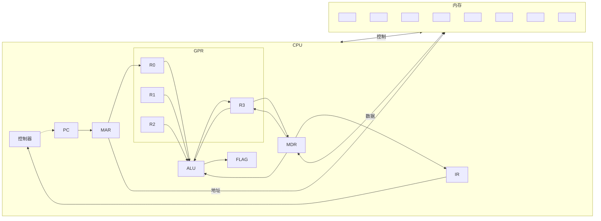
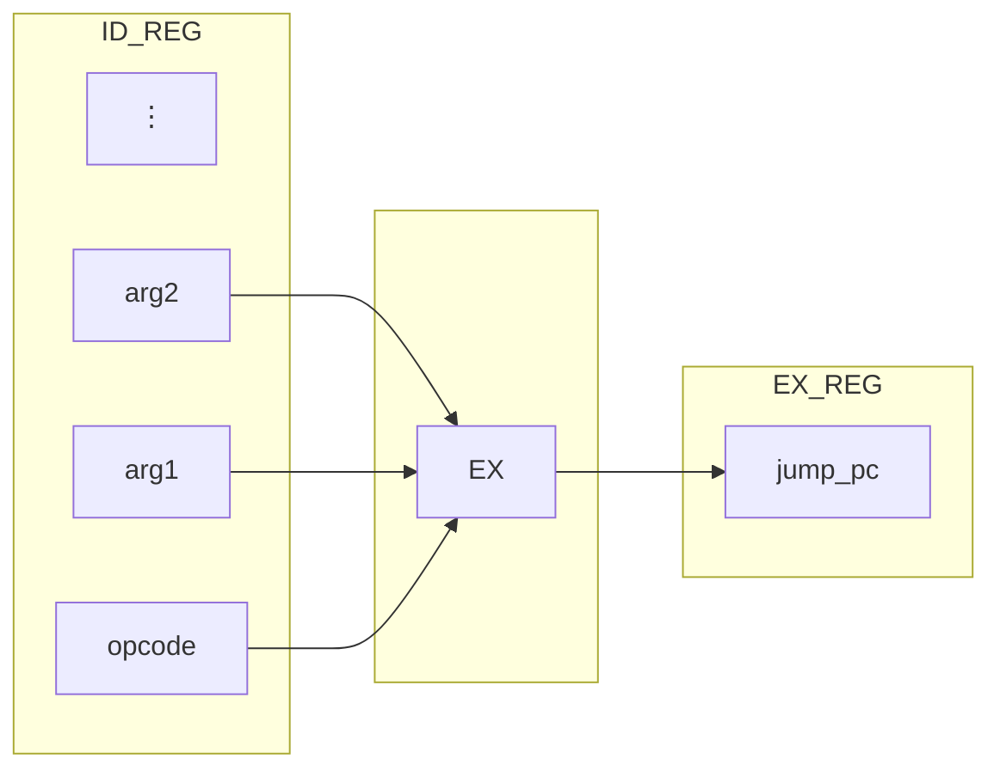
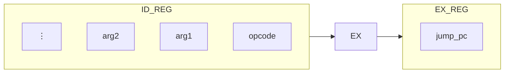

<!-- Page 1 -->

# 实验-计算机科学导论-课件11

# 硬件模拟-2

## 流水线

大湾区大学

---

<!-- Page 2 -->

# 硬件模拟-2（4学时）

- **学时1：** 软硬件视角之从高级语言程序到指令集体系架构
- **学时2：** 处理器硬件结构之三级流水线
- **学时3：** **Python** 模拟三级流水线
- **学时4：** 尝试实现模拟三级流水线

---

<!-- Page 3 -->

# 1. 计算机怎样执行程序

- 高级语言 **Python**
  - 我们小班课写的 **Python** 程序并不能被计算机直接理解
  - **Python** 将人类易于理解的高级语言程序**解释**为机器能够处理的指令序列
    - 由二进制编码构成的最基本的操作命令：机器指令

- 机器指令
  - 由指令集架构 **ISA** 定义，每一种处理器体系结构（如 PC 常用的 **x86-64**，手机常用的 **ARM** 等）都有自己的指令集架构

| Python 高级语言 | Python 字节码 | x86-64 汇编代码 | x86-64 机器指令 |
|---|---|---|---|
| ```python<br>print("hello")<br>``` | ```text<br>0 RESUME        0<br>1 LOAD_NAME     0 (print)<br>  PUSH_NULL<br>  LOAD_CONST    0 ('hello')<br>  CALL          1<br>  POP_TOP<br>  LOAD_CONST    1 (None)<br>  RETURN_VALUE<br>``` | ```asm<br>mov eax, 1<br>mov edi, 1<br>lea rsi, [rel msg]<br>mov edx, len<br>syscall<br>``` | ```text<br>b8 01 00 00 00<br>bf 01 00 00 00<br>48 8d 35 00 00 00 00<br>ba 06 00 00 00<br>0f 05<br>``` |

Python 高级语言 → Python 字节码 → x86-64 汇编代码 → x86-64 机器指令

3

---

<!-- Page 4 -->

# 指令集架构 ISA Instruction Set Architecture

- 指令集架构——软件和硬件交互的接口
  - 程序员（或编译器）视角下看到的计算机
  - 架构和具体实现分离
    - `Intel` 的处理器和 `AMD` 的处理器都支持 `x86-64 ISA`
    - 程序员针对 `x86-64` 架构编写的程序可以在 `Intel` 和 `AMD` 的处理器上无缝运行
  - 一种规约：规定了如何使用硬件
    - 指令系统：支持的操作有哪些，算术、访存、控制流
    - 存储架构：寄存器、内存
    - 寻址模式：如何访问内存或寄存器中的数据
    - 数据类型：支持操作什么数据
    - ...
  - 教学用 `ISA`：斐波那契计算机架构 `FCA`：专为计算斐波那契数设计的 `ISA`

---

<!-- Page 5 -->

# 指令集架构之指令系统

- 指令系统：支持的操作有哪些，算术、访存、控制流
  - 运算指令：`ADD`, `INC`
  - 访存指令：`MOVI`, `MOVR`
  - 控制流指令：`NOP`, `CMP`, `JL`, `HALT`

---

<!-- Page 6 -->

# 指令集架构之存储架构

- 存储架构：寄存器
  - 加法运算的操作数存放在哪里？ 内存？
    - 内存访问效率**低**，从内存读取一个数据可以执行**上百次**加法运算
      - 执行一次加法运算：`100` 周期内存读 + `1` 周期求和 + `100` 周期内存写，计算比例 $\frac{1}{201} \approx 0.5\%$
    - 引入一个高速存储器：寄存器，容量**远小于**内存但是访问速度**极快**
  - FCA 设计了 4 个**通用**寄存器（`R0, R1, R2, R3`）用于临时存放数据
  - 运算时：临时结果先写入寄存器中，计算完成后将最终计算结果从寄存器搬运到内存
  - FCA 同时有两个**状态**寄存器：指令寄存器 `PC` 和标志寄存器 `FLAGS`
  - 指令寄存器 `PC` Program Counter 寄存器记录要执行**指令的地址**
  - 标志寄存器 `FLAGS` 记录比较指令的比较结果

---

<!-- Page 7 -->

# 指令集架构之存储架构

- 存储架构：内存
  - 一个寄存器只能存放单个操作数，寄存器的总容量小，内存不可或缺
  - 指令/数据如何存储到内存中？存储的基本单位是什么？操作数的单位是什么？
  - 在 **FCA** 中我们有如下约定
    - 八**比特**构成一**字节**：数据存储的最小单位
    - 八**字节**构成一个**字/操作数**：指令按照字为单位进行操作
      - 如：加法一次加一个字而不是字节
    - 内存以**字节**为单位进行寻址
    - 内存中数据以**小端法**形式存储

---

<!-- Page 8 -->

# 指令集架构之存储架构

- 存储架构：内存
  - 按字节寻址：给定一个地址（正整数），每个地址对应于一个字节
    - 地址 `0x03` 对应的数据是 `0xCB` （一个字节）
  - 小端法存储：一个字包含八个字节，其中**低字节**存放在内存**低地址**处
    - 在地址 `0x4` 处存放的一个字是 `0x`<span style="color:#ff6600">01</span><span style="color:#99ffcc">EF</span><span style="color:#ff3399">DE</span><span style="color:#7030a0">CD</span><span style="color:#0070c0">BC</span><span style="color:#7ac943">AB</span><span style="color:#ffc000">AA</span><span style="color:#c00000">BA</span>
    - 在地址 `0x6` 处存放的一个字是？
    - 在地址 `0x2` 处存放 `0xABCD` 后会变成什么？

| 内存 | <span style="color:#002060">FE</span> | <span style="color:#002060">ED</span> | <span style="color:#002060">DC</span> | <span style="color:#002060">CB</span> | <span style="color:#c00000">BA</span> | <span style="color:#ffc000">AA</span> | <span style="color:#7ac943">AB</span> | <span style="color:#0070c0">BC</span> | <span style="color:#7030a0">CD</span> | <span style="color:#ff3399">DE</span> | <span style="color:#99ffcc">EF</span> | <span style="color:#ff6600">01</span> | <span style="color:#002060">12</span> | <span style="color:#002060">23</span> | <span style="color:#002060">34</span> | <span style="color:#002060">45</span> |
|---|---|---|---|---|---|---|---|---|---|---|---|---|---|---|---|---|
| 地址 | `00` | `01` | `02` | `03` | `04` | `05` | `06` | `07` | `08` | `09` | `0A` | `0B` | `0C` | `0D` | `0E` | `0F` |

---

<!-- Page 9 -->

# 指令集架构之存储架构

- 存储架构： 内存 - 字/操作数
  - 寄存器的大小： 一个寄存器刚好存放一个字
  - 指令的大小： 一条机器指令长度为一个字
  - 指令操作的基本单位
    - `ADD` 指令将一个字看成一个整数进行运算
    - `ADD M[0x4], R1` 表示将 `R1` 的值加上内存地址 `0x4` 处的**字**的值
    - 即 `R1 = R1 + 0x01EFDECDBCABAABA`

|      | 00 | 01 | 02 | 03 | 04 | 05 | 06 | 07 | 08 | 09 | 0A | 0B | 0C | 0D | 0E | 0F |
| ---- | -- | -- | -- | -- | -- | -- | -- | -- | -- | -- | -- | -- | -- | -- | -- | -- |
| 内存 | FF | ED | DC | CB | BA | AA | AB | BC | CD | DE | EF | 01 | 12 | 23 | 34 | 45 |
| 地址 | 00 | 01 | 02 | 03 | 04 | 05 | 06 | 07 | 08 | 09 | 0A | 0B | 0C | 0D | 0E | 0F |

---

<!-- Page 10 -->

# 指令集架构之寻址模式

- 寻址模式：如何访问内存或寄存器中的数据
  - 寄存器：使用 `R0, R1, R2, R3` 四个标识符直接访问
  - 内存：基址-变址-比例-位移寻址 `Base-Index-Scale-Displacement`
    - 地址 = 基址 + 变址 * 比例因子 + 位移
    - `Address = Base + Index * Scale + Displacement`
    - 在 FCA 中我们约定：`R0` 寄存器存放基址；`R2` 寄存器存放变址；比例因子和位移编码在指令中
    - 举例：如果 `R0 = 100`，`R2 = 4`，指令 `MOVR R1, M[R0 + R2*8 + 7]` 起什么作用？
    - 将内存位置 `R0 + R2*8 + 7 = 100 + 4*8 + 7 = 139` 处写入寄存器 `R1` 的值

---

<!-- Page 11 -->

# 指令集架构之数据类型

- 数据类型：支持操作什么数据
  - **FCA** 只支持 <span style="color:red">64 比特</span>的<span style="color:#0070C0">二进制补码</span><span style="color:#7030A0">整数</span>数据类型：一个字长的整数数据类型
  - 加法等运算符合二进制补码运算规则
  - 访存指令一次读取/写入的均为完整的一个字
  - **ADD/INC/MOVR** 等运算、访存指令都是以该类型为<span style="color:#002060">**单位**</span>进行处理

---

<!-- Page 12 -->

# 指令总结

- 作业说明
  - 本次作业分为基础得分和额外加分
  - 正确实现对 `NOP`，`MOVI`，`MOVR`，`ADD`，`INC`，`HALT` 指令的模拟可得基础分
  - 正确实现对 `CMP`，`JL` 指令的模拟可获得额外加分（20分）

| 指令助记符 | OPCODE | 例子 | 说明 |
|---|---|---|---|
| `NOP` | `0b000` | `NOP` | 不执行任何操作 |
| `MOVI` | `0b001` | `MOVI 0, R1` | 将立即数 0 赋予到寄存器 `R1`，即 $R1 = 0$ |
| `MOVR` | `0b010` | `MOVR R1, M[R0]` | 寄存器 `R1` 值赋予到内存单元 `R0`，即 $M[R0] = R1$ |
| `ADD` | `0b011` | `ADD M[A], R1` | 内存地址 `A` 的值累加到寄存器 `R1`，即 $R1 = R1 + M[A]$ |
| `INC` | `0b100` | `INC R2` | `R2` 寄存器值 +1，即 $R2 = R2 + 1$ |
| `CMP` | `0b101` | `CMP 4, R2` | 如果 `R2 < 4`，将“小于”写入 `FLAGS` 寄存器 |
| `JL` | `0b110` | `JL 40` | 如果 `FLAGS` 是“小于”，跳转到地址 `40` 执行 |
| `HALT` | `0b111` | `HALT` | 停机 |

---

<!-- Page 13 -->

# 2. 从指令集架构到硬件实现

- 指令集架构——软件和**硬件**交互的接口
  - 指导硬件设计的思想——周期机制
    - 一个程序的执行体现为周而复始执行一条又一条指令的过程
    - 计算过程的每一步骤都可以映射到自动机的一个时刻变换
    - 从当前输入 $In(t)$ 与状态 $State(t)$ 得出输出 $Out(t)$ 与下一状态 $State(t+1)$

```text
        ┌────────────────────────┐
        │        执行指令        │
        │    修改处理器状态      │
        └────────────────────────┘
             ↑                │
             └────────────────┘
```

13

---

<!-- Page 14 -->

# 处理器系统的结构



14

---

<!-- Page 15 -->

# 硬件架构概览

- 硬件是怎么执行指令的
  - 一条指令的生命周期有什么？
    - 取指令：从内存中获取一条指令，存放到指令寄存器 `IR` 中
      - 一个字，64位二进制数
    - 解析指令：将 `IR` 中这个64比特二进制数交由控制器转换成控制信号
      - “加法指令”，一个操作数是 `M[112]`，另一个操作数是 `R1` 寄存器
    - 执行指令：根据控制信号控制运算器、内存等部件执行任务
      - 从内存中获取地址 `112` 处的数据
      - 从寄存器中获取 `R1` 的数据
      - 将两者相加后写回 `R1` 寄存器
  - 一条指令的执行从时间上的开始到结束构成一个完整的生命周期/指令周期

---

<!-- Page 16 -->

# 硬件架构概览

- 硬件是怎么执行指令的
  - 一条指令的生命周期有什么？
    - 取指令（取指 **I**nstruction **F**etch）：从内存中获取一条指令
    - 解析指令（译码 **I**nstruction **D**ecode）：将这个64比特二进制数转换成控制信号
    - 执行指令（执行 **EX**ecute）：根据控制信号控制运算器、内存等部件执行任务
  - 硬件在周而复始的执行这三个步骤
  - 这三个步骤可以看成三个自动机级联

指令流：$\cdots\ I_4\ I_3\ I_2\ I_1$

```text
In_IF(t)        In_ID(t)        In_EX(t)
   ↓              ↓              ↓
┌──────┐  →   ┌──────┐  →   ┌──────┐
│ 取指 │      │ 译码 │      │ 执行 │
└──────┘      └──────┘      └──────┘
   ↓              ↓              ↓
Out_IF(t)     Out_ID(t)     Out_EX(t)
```

```text
                 时钟
                  ↓
In_IF(t) → ┌──────────┐  S(t+1)  ┌──────────┐  S(t)  ┌──────────┐ → Out_IF(t)
           │ 组合电路 │ ───────→ │ 状态电路 │ ─────→ │ 组合电路 │
           │    G     │          │          │        │    F     │
           └──────────┘          └──────────┘        └──────────┘
```

16

---

<!-- Page 17 -->

# 三级流水线

- 流水线
  - 每条指令有：取指 **IF**，译码 **ID**，执行 **EX** 三个阶段
  - 每个阶段有状态电路（触发器）记录输出信号供下一个周期使用
  - 每个阶段的电路部件独立工作，每条指令在三个阶段部件中流动，故称为流水线

## 流水线时序图

| Clock | 0 | 1 | 2 | 3 | 4 | 5 | 6 |
|---|---|---|---|---|---|---|---|
| 指令 1 | IF | ID | EX |  |  |  |  |
| 指令 2 |  | IF | ID | EX |  |  |  |
| 指令 3 |  |  | IF | ID | EX |  |  |
| 指令 4 |  |  |  | IF | ID | EX |  |
| 指令 5 |  |  |  |  | IF | ID | EX |

## 三级流水线结构示意

指令流：\(\cdots, I_4, I_3, I_2, I_1 \rightarrow\) 取指 \(\rightarrow\) 译码 \(\rightarrow\) 执行

- 取指阶段：
  - 输入：\(\mathrm{In}_{\mathrm{IF}}(t)\)
  - 输出：\(\mathrm{Out}_{\mathrm{IF}}(t)\)
- 译码阶段：
  - 输入：\(\mathrm{In}_{\mathrm{ID}}(t)\)
  - 输出：\(\mathrm{Out}_{\mathrm{ID}}(t)\)
- 执行阶段：
  - 输入：\(\mathrm{In}_{\mathrm{EX}}(t)\)
  - 输出：\(\mathrm{Out}_{\mathrm{EX}}(t)\)

## 阶段内部电路示意

\[
\mathrm{In}_{\mathrm{IF}}(t) \rightarrow \text{组合电路 } G \xrightarrow{S(t+1)} \text{状态电路} \xrightarrow{S(t)} \text{组合电路 } F \rightarrow \mathrm{Out}_{\mathrm{IF}}(t)
\]

- 状态电路由时钟控制
- \(S(t)\) 反馈到组合电路 \(G\)  
- \(\mathrm{In}_{\mathrm{IF}}(t)\) 同时输入组合电路 \(G\) 和组合电路 \(F\)

17

---

<!-- Page 18 -->

## 3. 代码实现

- 触发器
  - `class FlipFlop`
- 存储器
  - `class Memory`
- 流水线
  - `class Pipeline`

---

<!-- Page 19 -->

# 触发器（寄存器）

- 上周实现的 `FlipFlop`
  - 给出使能信号时，立刻把数据存进去
  - 思考：如果上一级算完后，数据立刻流到下一级，会发生什么？
- 本周使用的 `FlipFlop`
  - 更新不再立刻改变当前输出
  - 只记录下一次该变为什么
  - 下一个时钟周期到来才真正更新

```python
class FlipFlop: # 上次课程的代码
    def __init__(self, init=0):
        self.q = init
    def update(self, E, D):
        if E:
            self.q = D
    def get(self):
        return self.q
```

```python
class FlipFlop: # 本次课程的代码
    def __init__(self):
        self.q = 0      # 当前周期的值
        self.next_q = 0 # 下一周期的值

    def update(self, D):
        self.next_q = D

    def get(self):
        return self.q

    def tick(self): # 下一个时钟周期到来
        self.q = self.next_q

---

<!-- Page 20 -->

# 存储器

- **Memory** 存储器
  - 从 0 字节开始存放指令
  - 指令后面存放数据
  - 使用小端法存储

```python
class Memory:
    def __init__(self, len):
        # 模拟内存空间，每个元素为1个字节
        self.data = [0] * len # 包含指令和数据
```

## Memory

| 地址 | 内容 |
|---|---|
| 0 | **Code** |
| 1 |  |
| 2 |  |
| 3 | …… |
|  | `MOV R1, M[R0+R2*8-16]` |
| 0 | `fib[0]` |
| 1 | `fib[1]` |
|  | **Data** |

## Processor

- R0
- R1
- R2
- ALU
- PC
- FLAGS
- Controller

20

---

<!-- Page 21 -->

# 存储器

- Memory 存储器
  - 字节寻址
  - 按字读取
  - `load_bytes` 函数：加载任意位长度数据
    - 从指定地址开始，按小端法读取指定长度的字节，并组合成一个整数
    - `self.data[address + i]` 从内存中取出的第 `i` 个字节

| 内存 | FE | ED | DC | CB | BA | AA | AB | BC | CD |
|---|---|---|---|---|---|---|---|---|---|
| 地址 | 00 | 01 | 02 | 03 | 04 | 05 | 06 | 07 | 08 |

```text
load_bytes(0,8) => 0xBCABAABACBDCEDFE
```

```python
class Memory:
    # --snip--

    def load_bytes(self, address, len):
        data = 0
        for i in range(len):
            data = ??? # 将内存中第 i 个字节读出，并移动到 data 中对应的位置
        return data
```

21

---

<!-- Page 22 -->

# 存储器

- Memory 存储器
  - 字节寻址
  - 按字读取
  - `store_bytes` 函数：将任意位整数存放到内存中
    - 将一个整数按小端法拆分成字节
    - 将字节数据顺序存储到指定内存地址

|      | 00 | 01 | 02 | 03 | 04 | 05 | 06 | 07 | 08 |
| ---- | -- | -- | -- | -- | -- | -- | -- | -- | -- |
| 内存 | FE | ED | DC | CB | BA | AA | AB | BC | CD |

`store_bytes(0, 0xBCABAABACBDCEDFE, 8)`

```python
class Memory:
    # --snip--

    def store_bytes(self, address, data, len):
        for i in range(len):
            # TODO: 取出 data 对应位置的字节并存入到对应地址中

---

<!-- Page 23 -->

# 存储器

- Memory 存储器
  - 在流水线中，使用 `load_word` 与 `store_word` 从存储器读/存数据

```python
class Memory:
    # --snip--

    def load_byte(self, address):          # 读取单个字节
        return self.load_bytes(address, 1)

    def store_byte(self, address, data):   # 存储单个字节
        self.store_bytes(address, data, 1)

    def load_word(self, address):          # 读取 1 个字
        return self.load_bytes(address, 8)

    def store_word(self, address, data):
        self.store_bytes(address, data, 8) # 存储 1 个字

---

<!-- Page 24 -->

# 课堂小测验

- 请补全类 `Memory` 并在平台上提交
- 可以使用下面的代码进行测试，但不要在平台上提交测试代码

```python
class Memory:
    def __init__(self, len):
        self.data = [0] * len

    # --snip--
```

[使用电脑的同学可点此链接]()

```python
# 可以使用的测试代码
mem   = Memory(256)
addr  = 4
value = 0x1122334455667788
mem.store_word(addr, value)
print(f"地址 {addr}: 0x{mem.data[addr]:X}")
print(f"地址 {addr+3}: 0x{mem.data[addr+3]:X}")
print(f"地址 {addr+7}: 0x{mem.data[addr+7]:X}")
read_val = mem.load_word(addr)
print(f"读取值: {read_val:X}")
```

24

---

<!-- Page 25 -->

# 4. 流水线设计

- 处理器中包含4个通用寄存器
  - `R0, R1, R2, R3`
- 需要支持 6 条指令

```text
REG_R0 = 0
REG_R1 = 1
REG_R2 = 2
REG_R3 = 3

INST_NOP  = 0 # 空指令
INST_MOVI = 1 # 立即数指令
INST_MOVR = 2 # 存储指令
INST_ADD  = 3 # 加法指令
INST_INC  = 4 # 自增指令
INST_HALT = 7 # 停机指令
```

```text
控制器  PC  MAR  内存
IR  FLAG  ALU  MDR

CPU
地址
控制
数据

GPR
R0
R1
R2
R3
```

25

---

<!-- Page 26 -->

# 流水线寄存器

- 流水线设计
  - 一条指令的生命周期有什么？
    - 取指令（取指 <span style="color:red">I</span>nstruction <span style="color:red">F</span>etch）：从内存中获取一条指令
    - 解析指令（译码 <span style="color:red">I</span>nstruction <span style="color:red">D</span>ecode）：将这个64比特二进制数转换成控制信号
    - 执行指令（执行 <span style="color:red">EX</span>ecute）：根据控制信号控制运算器、内存等部件执行任务
  - 三个阶段如何交互？
    - **IF** 阶段取出的指令放在哪里？
    - **ID** 阶段的控制信号如何传递给 **EX** 阶段？
    - **EX** 阶段跳转的目标地址如何传递给 **IF** 阶段？
      - 使用流水线寄存器！

---

<!-- Page 27 -->

# 流水线寄存器

- 流水线设计
  - 三个阶段如何交互？
    - `IF` 阶段取出的指令放在哪里？
    - `ID` 阶段的控制信号如何传递给 `EX` 阶段？
    - 使用流水线寄存器 `REG`！

```text
┌┄┄┄┄┄┄┄┐          ┌──────┐          ┌┄┄┄┄┄┄┄┐          ┌──────┐          ┌┄┄┄┄┄┄┄┐          ┌──────┐          ┌┄┄┄┄┄┄┄┐
┆       ┆ ───────▶ │      │ ───────▶ ┆       ┆ ───────▶ │      │ ───────▶ ┆  ...  ┆ ───────▶ │      │ ───────▶ ┆       ┆
┆       ┆ ───────▶ │  IF  │ ───────▶ ┆ inst  ┆ ───────▶ │  ID  │ ───────▶ ┆ arg2  ┆ ───────▶ │  EX  │ ───────▶ ┆       ┆
┆       ┆ ───────▶ │      │ ───────▶ ┆       ┆ ───────▶ │      │ ───────▶ ┆ arg1  ┆ ───────▶ │      │ ───────▶ ┆       ┆
┆       ┆          └──────┘          ┆       ┆          └──────┘          ┆opcode ┆          └──────┘          ┆       ┆
└┄┄┄┄┄┄┄┘                            └┄┄┄┄┄┄┄┘                            └┄┄┄┄┄┄┄┘                            └┄┄┄┄┄┄┄┘
 EX_REG                               IF_REG                               ID_REG                               EX_REG
```

27

---

<!-- Page 28 -->

# 取指阶段

- 取指阶段
  - 从**Memory**中取出当前**PC**指向的指令
  - 更新指令寄存器的值

```python
class Pipeline:
    def __init__(self, mem: Memory):
        self.mem     = mem
        self.if_inst = FlipFlop()
        # --snip--

    def instruction_fetch(self): # IF 阶段逻辑
        inst = self.mem.load_word(self.pc) # 获取 PC 地址处的指令
        self.if_inst.update(inst)          # 更新指令寄存器的值
```

```text
[IF] ---> [inst]
          IF_REG
```

28

---

<!-- Page 29 -->

# 译码阶段

- 译码阶段
  - 将指令转化为执行的操作码和操作数

| 类型 | 64–61 | 61–14 | 14–10 | 10–2 | 2–0 | 指令 |
|---|---|---|---|---|---|---|
| IR 型 | `opcode` | `immediate` | `immediate` | `immediate` | `register` | `MOVI` |
| M 型 | `opcode` | — | `scale` | `displacement` | `register` | `MOVR, ADD` |
| R 型 | `opcode` | — | — | — | `register` | `INC` |
| C 型 | `opcode` | — | — | — | — | `NOP, HALT` |

---

<!-- Page 30 -->

# 译码阶段

- 译码阶段
  - 操作码与操作数
    - `opcode`
    - `arg1: immediate`，有符号补码
    - `arg2: register`，无符号
    - `arg1_scale`，无符号
    - `arg1_disp`，有符号补码
  - 辅助函数
    - `gen_mask` 函数用于生成掩码序列，生成连续的比特 1
    - `sign_ext` 函数用于有符号补码数扩展为 Python `int` 类型

```python
# 生成一个bits位长的掩码序列
# 如gen_mask(3)返回0b111
def gen_mask(bits):
    return (1 << bits) - 1


# 将一个长为bits位的补码整数raw变成Python int类型并返回
# 如 sign_ext(0b111, 3) 返回-1
def sign_ext(raw, bits):
    assert bits > 1
    s = 1 << (bits - 1)
    return (raw & (s - 1)) - (raw & s)

---

<!-- Page 31 -->

# 译码阶段

```python
class Pipeline:
    def __init__(self, mem: Memory):
        # --snip--
        self.id_op   = FlipFlop()
        self.id_arg1 = FlipFlop()
        self.id_arg2 = FlipFlop()
        ??? # 还应该有哪些寄存器?

    def instruction_decode(self):
        inst = self.if_inst.get()
        opcode     = (inst >> 61) & gen_mask( 3) # opcode 部分
        arg1       = (inst >>  2) & gen_mask(59) # immediate 部分
        arg1_scale = (arg1 >>  8) & gen_mask( 4) # M 型指令 scale 部分
        arg1_disp  = ??? # M 型指令 displacement 部分
        arg2       = ??? # register 部分
        # immediate 和 displacement 需要进行符号扩展，指令中存储的是有符号数
        arg1      = sign_ext(arg1, 59)
        arg1_disp = ???
        # 将译码结果存放到流水线寄存器中
        self.id_op.update(opcode)
        ???
```

```text
IF_REG                         ID_REG

┌────────┐                     ┌────────┐
│        │                     │  ...   │
│        │                     ├────────┤
│        │                     │  arg2  │
│ inst ──┼──▶ ┌──────┐ ─────▶ ├────────┤
│        │    │  ID  │ ─────▶ │  arg1  │
│        │    └──────┘ ─────▶ ├────────┤
│        │                     │ opcode │
└────────┘                     └────────┘

---

<!-- Page 32 -->

# 执行阶段

```python
class Pipeline:
    def __init__(self, mem: Memory):
        # --snip--
        self.is_running   = False   # 是否停机
        self.reg          = [0] * 4 # 4 个通用寄存器

    def execute(self):
        opcode = self.id_op.get()
        arg1   = self.id_arg1.get()
        ??? # 还有哪些

        if opcode == INST_NOP: # 空指令什么都不做
            pass
        elif opcode == INST_MOVI: # MOVI 指令将立即数存放到寄存器中
            self.reg[arg2] = arg1 # 将 arg1 存入 reg[arg2]
        ??? # 补全 INST_MOVR, INST_ADD, INST_INC
        elif opcode == INST_HALT:
            self.is_running = False # HALT指令更新停机标志
        else:
            raise Exception(f"unknown opcode: {opcode}")
```

```text
ID_REG                         EX_REG
┌------┐                       ┌------┐
│  ⋮   │                       │      │
├------┤                       │      │
│ arg2 │───────┐               │      │
├------┤       │               │      │
│ arg1 │───────┼──▶┌────┐─────▶│      │
├------┤       │   │ EX │─────▶│      │
│opcode│───────┘   └────┘─────▶│      │
└------┘                       └------┘
```

32

---

<!-- Page 33 -->

# <span style="color:#2b0054">更新寄存器</span>

- <span style="color:red">三级流水线</span>
  - 取指阶段 `instruction_fetch`
  - 译码阶段 `instruction_decode`
  - 执行阶段 `execute`
  - 还缺少什么逻辑？
    - 从上一个阶段的流水线寄存器读取数据
    - 更新下一个阶段的流水线寄存器
    - <span style="color:red">流水线寄存器需要更新！</span>
    - <span style="color:red">PC 指令寄存器需要更新！</span>

---

<!-- Page 34 -->

# 更新寄存器

- 模拟时钟周期：更新寄存器
  - 流水线寄存器需要更新！
  - PC 指令寄存器需要更新！

```python
class Pipeline:
    def tick(self): # 每个周期结束后执行状态更新逻辑
        # 更新流水线寄存器
        self.if_inst.tick()
        ... # 补全剩下的流水线寄存器更新逻辑

        # 更新 PC 指令寄存器
        self.pc += ??? # 下一条指令的地址，一条指令长度是多少？

---

<!-- Page 35 -->

# 三级流水线

- 组合所有的流水线阶段和更新逻辑
  - 想一想：`IF`，`ID`，`EX` 三个阶段函数调用有顺序要求吗？

```python
class Pipeline:
    def run(self): # 模拟入口
        # 开始模拟
        self.is_running = True
        while self.is_running:
            # 以下三个函数调用有顺序要求吗?
            self.instruction_fetch()
            self.instruction_decode()
            self.execute()
            # 模拟时钟
            self.tick()

---

<!-- Page 36 -->

# 测试代码

- 从文件初始化内存
  - 文件从地址 0 开始一次存放内存初始化数据
  - 文件中每行是一个整数，对应内存中的一个字

```python
# mem 为 Memory 对象, filename 为内存数据文件
def load_program(mem, filename):
    with open(filename, 'r') as f:
        for i, v in enumerate(f):
            mem.store_word(???, int(v)) # 地址应该是什么？
```

```python
# 创建一个 512 字节大小的内存并加载数据
mem = Memory(512)
load_program(mem, "program.txt")
# 创建流水线
cpu = Pipeline(mem)
cpu.run() # 执行
# 停机后输出内存内容
for i in range(7):
    addr = 288 + i * 8
    print(f'MEM[{addr}] = {mem.load_word(addr)}')

---

<!-- Page 37 -->

# 测试数据： 程序重复标红代码4次，算出前4个斐波那契数1、2、3、5

- 下方分别为汇编代码，`program.txt`，样例输出

## 汇编代码

<pre><code>MOVI 288, R0
MOVI   0, R1
MOVR  R1, M[R0 + R2 * 0 + 0]
MOVI   1, R1
MOVR  R1, M[R0 + R2 * 0 + 8]
MOVI   2, R2
<span style="color:red">MOVI   0, R1
ADD  M[R0 + R2 * 8 - 16], R1
ADD  M[R0 + R2 * 8 -  8], R1
MOVR  R1, M[R0 + R2 * 8 + 0]
INC   R2</span>
MOVI   0, R1
ADD  M[R0 + R2 * 8 - 16], R1
ADD  M[R0 + R2 * 8 -  8], R1
MOVR  R1, M[R0 + R2 * 8 + 0]
INC   R2
MOVI   0, R1
ADD  M[R0 + R2 * 8 - 16], R1
ADD  M[R0 + R2 * 8 -  8], R1
MOVR  R1, M[R0 + R2 * 8 + 0]
INC   R2
MOVI   0, R1
ADD  M[R0 + R2 * 8 - 16], R1
ADD  M[R0 + R2 * 8 -  8], R1
MOVR  R1, M[R0 + R2 * 8 + 0]
INC   R2
HALT</code></pre>

## `program.txt`

<pre><code>2305843009213695104
2305843009213693953
4611686018427387905
2305843009213693957
4611686018427387937
2305843009213693962
<span style="color:red">2305843009213693953
6917529027641091009
6917529027641091041
4611686018427396097
9223372036854775810</span>
2305843009213693953
6917529027641091009
6917529027641091041
4611686018427396097
9223372036854775810
2305843009213693953
6917529027641091009
6917529027641091041
4611686018427396097
9223372036854775810
2305843009213693953
6917529027641091009
6917529027641091041
4611686018427396097
9223372036854775810
16140901064495857664</code></pre>

## 样例输出

<pre><code>MEM[288] = 0
MEM[296] = 1
<span style="color:red">MEM[304] = 1
MEM[312] = 2
MEM[320] = 3
MEM[328] = 5</span>
MEM[336] = 0</code></pre>

---

<!-- Page 38 -->

# 小班课作业

- 请按照平台作业说明提交代码
  - 不要包含测试代码

---

<!-- Page 39 -->

# 课程追求：珍惜时代、体认思维、学生走心、作品牵引

## 李晓明 徐志伟 | 大湾区大学

---

<!-- Page 40 -->

# 补充内容： 从直线程序到控制流

- 这一部分内容不做强制要求，欢迎有兴趣的同学学习
  - 基础内容只要求实现对 `NOP`，`MOVI`，`MOVR`，`ADD`，`INC`，`HALT` 指令的模拟
  - 只能用于编写直线程序！没有分支，`PC` 只能单方向逐指令递增
  - 增加 `CMP`，`JL` 指令：允许 `PC` 跳转到任意位置，实现分支

---

<!-- Page 41 -->

# 控制流

- 如何让程序跳转到任意位置处开始执行？
  - 在什么阶段我们能得知需要跳转？
    - `JL` 指令在 `Execute` 阶段根据状态标志判断是否需要跳转以及生成跳转目标地址
  - `PC` 指令地址更新发生在哪个阶段？
    - `EX` 阶段下一个时钟周期开始（`tick` 函数）
    - `EX` 阶段需要用流水线寄存器传递跳转的目标 `PC`
  - `PC` 更新时需要判断：
    1. 没有跳转：执行下一条指令，地址自增一个字长
    2. 跳转：地址变更为目标地址

---

<!-- Page 42 -->

# 流水线设计

- 支持全部 **8** 条指令
  - 新增 **CMP** 和 **JL** 指令
  - **CMP** 产生是否跳转的状态标志；**JL** 根据状态标志控制跳转

```text
REG_R0 = 0
REG_R1 = 1
REG_R2 = 2
REG_R3 = 3


INST_NOP  = 0 # 空指令
INST_MOVI = 1 # 立即数指令
INST_MOVR = 2 # 存储指令
INST_ADD  = 3 # 加法指令
INST_INC  = 4 # 自增指令
INST_CMP  = 5 # 比较指令
INST_JL   = 6 # 跳转指令
INST_HALT = 7 # 停机指令
```

## CPU 结构示意

- 控制器
- PC
- MAR
- IR
- FLAG
- ALU
- MDR
- GPR
  - R0
  - R1
  - R2
  - R3
- 内存
- 总线/信号
  - 地址
  - 控制
  - 数据

42

---

<!-- Page 43 -->

# 译码阶段

- 译码阶段
  - 加入 **CMP** 和 **JL** 后完整的指令编码

<table>
  <thead>
    <tr>
      <th>类型</th>
      <th>64–61</th>
      <th>61–14</th>
      <th>14–10</th>
      <th>10–2</th>
      <th>2–0</th>
      <th>指令</th>
    </tr>
  </thead>
  <tbody>
    <tr>
      <td>IR 型</td>
      <td>opcode</td>
      <td colspan="3">immediate</td>
      <td>register</td>
      <td>MOVI, CMP</td>
    </tr>
    <tr>
      <td>I 型</td>
      <td>opcode</td>
      <td colspan="3">immediate</td>
      <td>—</td>
      <td>JL</td>
    </tr>
    <tr>
      <td>M 型</td>
      <td>opcode</td>
      <td>—</td>
      <td>scale</td>
      <td>displacement</td>
      <td>register</td>
      <td>MOVR, ADD</td>
    </tr>
    <tr>
      <td>R 型</td>
      <td>opcode</td>
      <td colspan="3">—</td>
      <td>register</td>
      <td>INC</td>
    </tr>
    <tr>
      <td>C 型</td>
      <td>opcode</td>
      <td colspan="4">—</td>
      <td>NOP, HALT</td>
    </tr>
  </tbody>
</table>

---

<!-- Page 44 -->

# 流水线寄存器

- 流水线设计
  - EX 阶段后新增 `jump_pc` 流水线寄存器
    - 记录跳转目标地址

```text
┌────────┐      ┌────┐      ┌────────┐      ┌────┐      ┌────────┐      ┌────────┐
│        │ ---> │    │ ---> │        │ ---> │    │ ---> │  ...   │ ---> │        │
│jump_pc │ ---> │ IF │ ---> │  inst  │ ---> │ ID │ ---> │  arg2  │ ---> │   EX   │ ---> ┌────────┐
│        │ ---> │    │ ---> │        │ ---> │    │ ---> │  arg1  │ ---> │        │ ---> │jump_pc │
│        │      └────┘      │        │      └────┘      │ opcode │      └────────┘      │        │
└────────┘                  └────────┘                  └────────┘                      └────────┘
 EX_REG                      IF_REG                      ID_REG                          EX_REG

---

<!-- Page 45 -->

# 执行阶段

```python
class Pipeline:
    def __init__(self, mem: Memory):
        # --snip--
        self.is_running = False   # 是否停机
        self.reg        = [0] * 4 # 4 个通用寄存器
        self.flag       = ''      # 标志寄存器
    def execute(self):
        opcode = self.id_op.get()
        arg1   = self.id_arg1.get()
        ??? # 还有哪些
        if opcode == INST_NOP: # NOP指令什么也不做
            pass
        elif opcode == INST_MOVI: # MOVI 指令将立即数存放到寄存器中
            self.reg[arg2] = arg1 # 将 arg1 存入 reg[arg2]
        elif opcode == INST_JL:  # 条件跳转
            if self.flag == ???: # 当 CMP 产生了 “<” 状态后进行跳转
                self.ex_jump_pc.update(arg1) # 将目标地址写入寄存器
        ??? # 补全 INST_MOVR, INST_ADD, INST_INC, INST_CMP
        elif opcode == INST_HALT:
            self.is_running = False # HALT指令更新停机标志
        else:
            raise Exception(f"unknown opcode: {opcode}")
```



45

---

<!-- Page 46 -->

# 执行阶段

```python
elif opcode == INST_JL:
    if self.flag == ???:
        self.ex_jump_pc.update(arg1)
```

- `JL` 指令只需要更新 `jump_pc` 吗？
  - 在下方的流水线示意图中：`JL 1` 执行后发生了什么？
  - `JL` 指令在第几个周期被 `EX` 执行？
  - 如果发生了跳转，在 `JL` 处于 `EX` 阶段时
    - `IF` 和 `ID` 分别是哪一条指令？



| Clock | 0  | 1  | 2  | 3  | 4  | 5  | 6  |
|------:|:--:|:--:|:--:|:--:|:--:|:--:|:--:|
| 1     | IF | ID | EX |    |    |    |    |
| JL 1  |    | IF | ID | EX |    |    |    |
| 3     |    |    | IF | ID | EX |    |    |
| 4     |    |    |    | IF | ID | EX |    |
| 5     |    |    |    |    | IF | ID | EX |

46

---

<!-- Page 47 -->

# 执行阶段

```python
elif opcode == INST_JL:
    if self.flag == ???:
        self.ex_jump_pc.update(arg1)
        self.should_flush = ???
```

- `should_flush` 清空流水线标志
  - 要清空什么东西？
  - 为什么需要清空流水线？

| Clock | 0 | 1 | 2 | 3 | 4 | 5 | 6 |
|---|---|---|---|---|---|---|---|
| 1 | IF | ID | EX |  |  |  |  |
| JL 1 |  | IF | ID | EX |  |  |  |
| 3 |  |  | IF | ID | EX |  |  |
| 4 |  |  |  | IF | ID | EX |  |
| 5 |  |  |  |  | IF | ID | EX |

```text
ID_REG                         EX_REG
┌────────┐                    ┌─────────┐
│  ...   │                    │         │
├────────┤                    │         │
│ arg2   │ ─────┐             │         │
├────────┤      ├──▶ ┌────┐ ─▶│ jump_pc │
│ arg1   │ ─────┤    │ EX │ ─▶│         │
├────────┤      ├──▶ └────┘ ─▶│         │
│ opcode │ ─────┘             │         │
└────────┘                    └─────────┘
```

- JL 指令在第几个周期被 EX 执行？
- 如果发生了跳转，在 JL 处于 EX 阶段时
  - IF 和 ID 分别是哪一条指令？

---

<!-- Page 48 -->

# 执行阶段

```python
elif opcode == INST_JL:
    if self.flag == ???:
        self.ex_jump_pc.update(arg1)
        self.should_flush = ???
```

- `should_flush` 清空流水线标志
  - 要清空什么东西？
  - 为什么需要清空流水线？

| Clock | 0  | 1  | 2  | 3  | 4 | 5 | 6  |
|---|---|---|---|---|---|---|---|
| 1 | IF | ID | EX |   |   |   |   |
| JL 1 |   | IF | ID | EX |   |   |   |
| 3 |   |   | IF | ID | X |   |   |
| 4 |   |   |   | IF | X | X |   |
| 1 |   |   |   |   | IF | ID | EX |

```text
ID_REG                                      EX_REG
┌──────────┐                               ┌──────────┐
│   ...    │                               │          │
├──────────┤                               │          │
│  arg2    │───┐                           │          │
├──────────┤   │                           │          │
│  arg1    │───┼──▶ ┌──────┐ ───────────▶ │ jump_pc  │
├──────────┤   │    │  EX  │              │          │
│ opcode   │───┘    └──────┘              │          │
└──────────┘                               └──────────┘
```

- 我们希望的流水线应该变成左图所示
  - 其中 `X` 表示不执行任何操作
  - 为什么要空开两个周期？
- 怎么实现？
  - 让 `IF_REG` 和 `ID_REG` 流水线寄存器内容清空！
  - `NOP` 指令的编码刚好是全零

---

<!-- Page 49 -->

# 触发器（寄存器）

- 支持在下一个时钟周期到来时选择是否清空寄存器内容

```python
class FlipFlop:
    def __init__(self):
        self.q = 0       # 当前周期的值
        self.next_q = 0  # 下一周期的值

    def update(self, D):
        self.next_q = D

    def get(self):
        return self.q

    def tick(self, reset): # 下一个时钟周期到来
        self.q = self.next_q if not reset else 0

---

<!-- Page 50 -->

# 流水线

- 流水线清空逻辑

```python
class Pipeline:
    def tick(self): # 每个周期结束后执行状态更新逻辑
        # 更新流水线寄存器
        self.if_inst.tick(self.should_flush) # 执行这行代码执行发生了什么?
                                             # tick 函数传递的参数有什么意义?
                                             # 什么情况下应该刷新流水线寄存器？该刷新哪些流水线寄存器?

        ... # 补全剩下的流水线寄存器更新逻辑
        # 更新 PC 指令寄存器
        if self.should_flush:
            self.pc = self.ex_pc.get() # 需要清空流水线 -> 发生了跳转 -> 从 ex_pc 中获取跳转的目标地址
        else:
            self.pc += ??? # 没有跳转发生，取下一条指令，一条指令长度是多少?
        # 状态更新完成，清除清空流水线标志
        self.should_flush = False

---

<!-- Page 51 -->

# 流水线

- 可重入的流水线
  - 之前的设计中 `run` 可以反复执行吗？第二次调用 `run` 会发生什么？
  - 加入 `reset` 逻辑将所有寄存器初始化（清空）

```python
class Pipeline:
    def reset(): # 初始化流水线：清空所有寄存器和状态
        # 清空流水线寄存器
        self.if_inst.tick(True)
        ... # 补全剩下的流水线寄存器清空逻辑
        # 清空通用寄存器寄存器
        self.reg[REG_R0] = 0
        ... # 补全剩下的流水线寄存器清空逻辑
        # 清空其它寄存器
        self.pc = 0
        self.flag = ''
        self.is_running = False
        self.should_flush = False
```

```python
class Pipeline:
    def run(self): # 模拟入口
        # 先初始化流水线状态
        self.reset()
        # 开始模拟
        self.is_running = True
        while self.is_running:
            self.instruction_fetch()
            self.instruction_decode()
            self.execute()
            # 模拟时钟
            self.tick()

---

<!-- Page 52 -->

# 测试数据

- 下方分别为汇编代码，`program.txt`，样例输出

```text
MOVI 112, R0
MOVI   0, R1
MOVR  R1, M[R0 + R2 * 0 + 0]
MOVI   1, R1
MOVR  R1, M[R0 + R2 * 0 + 8]
MOVI   2, R2
MOVI   0, R1
ADD  M[R0 + R2 * 8 - 16], R1
ADD  M[R0 + R2 * 8 -  8], R1
MOVR  R1, M[R0 + R2 * 8 + 0]
INC   R2
CMP   15, R2
JL    48
HALT
```

```text
2305843009213694400
2305843009213693953
4611686018427387905
2305843009213693957
4611686018427387937
2305843009213693962
2305843009213693953
6917529027641091009
6917529027641091041
4611686018427396097
9223372036854775810
11529215046068469822
13835058055282163904
16140901064495857664
```

```text
MEM[112] = 0
MEM[120] = 1
MEM[128] = 1
MEM[136] = 2
MEM[144] = 3
MEM[152] = 5
MEM[160] = 8
MEM[168] = 13
MEM[176] = 21
MEM[184] = 34
MEM[192] = 55
MEM[200] = 89
MEM[208] = 144
MEM[216] = 233
MEM[224] = 377
MEM[232] = 0