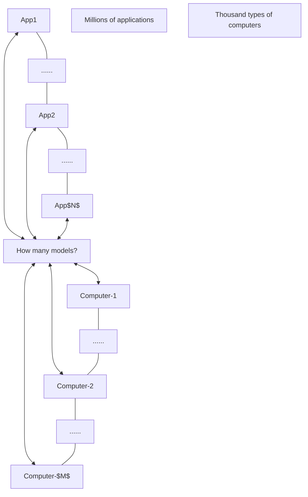

<!-- Page 1 -->

# （n盘）三柱汉诺塔问题：算法和Python程序

**表扬！**

- 将n个圆盘逐一从A柱移动到C柱，大盘不能放在小盘上；B柱作为辅助
  - 每一步移动一个最上面圆盘，打印出源柱与目的柱
  - A -> C，意味着将A柱最上面圆盘移动到C柱，成为C柱最上面圆盘
  - 打印出合法的步骤移动序列

```text
hanoi(8, 'A', 'B', 'C')
分解成三步
    hanoi(7, 'A', 'C', 'B')
    hanoi(1, 'A', 'B', 'C')
    hanoi(7, 'A', 'C', 'B')

程序必须考虑base case
```

A -> C

```text
hanoi(8, 'A', 'B', 'C')
分解成三步
    hanoi(7, 'A', 'C', 'B')
    print("A -> C")
    hanoi(7, 'A', 'C', 'B')

程序必须考虑base case
```

```python
def hanoi(n, src, aux, dest):
    if n == 1:
        print(f"{src} -> {dest}")
    else:
        hanoi(n-1, src, dest, aux)
        print(f"{src} -> {dest}")
        hanoi(n-1, aux, src, dest)

hanoi(8, 'A', 'B', 'C')
```

- 采用如下记号，导出分治算法和程序
  - n盘问题的A柱：称为源柱（src，即source）；子问题的源柱不一定再是A柱
  - n盘问题的B柱：称为辅助柱（aux，即auxi）
  - n盘问题的C柱：称为目的柱（dest，即destination）

---

<!-- Page 2 -->

# 抽象栈思路在科学技术领域广泛使用

## 考维尔太极图

引自美国国家科学基金会主任瑞塔•考维尔（Rita Colwell）于2002年11月在国际超级计算会议（SC’02）上所作的主旨报告。沿着集成法主轴（Integration）看，标注分别为原子级、分子级、细胞级、组织、器官、生物体、栖息地、种群、群落社区、生态系统、行星级、宇宙级。

考维尔博士是一名环境微生物学家。她的<span style="color:red">生物复杂性</span>图，展示了自然科学抽象栈在21世纪的两种基本发展趋势：

1. 跨学科趋势，一门学问（如生命科学）将在多个层次/级别/尺度、从多个学科角度研究；
2. 集成法（Integration）将补充盛行几百年的规约法（Reductionism）。

https://nsf.gov/news/speeches/colwell/rc02_sc2002/sld020.htm

**【注】： <span style="color:red">计算抽象</span>，不同于其他学科的抽象，  
是 应对复杂性的、比特精准的、自动执行的、以一驭万的 信息变换抽象**

---

<!-- Page 3 -->

# 计算机科学导论-课件11

课件中包含素材引用，特此致谢！

# 系统思维-2

## 抽象化与模块化原理

## 斐波那契计算机模拟器

**Acu-Exams**

徐志伟（zxu@gbu.edu.cn 18910338695）  
大湾区大学 信息科学技术学院

3

---

<!-- Page 4 -->

# 提纲

- 系统思维聚焦点：<span style="color:red">以一藕万</span>
  - 上周：通过<span style="color:red">一套</span>抽象，将模块组合成为系统，无缝执行<span style="color:red">众多</span>应用
  - 本周：通过一套<span style="color:red">抽象</span>，将<span style="color:red">模块</span>组合成为系统，无缝执行众多应用
  - <span style="color:blue">本质：抽象赋能可解释稀疏 **abstractions enable interpretable sparsity**</span>
    - <span style="color:blue">抽象与稀疏互为具身：**abstraction (sparsity) embodies sparsity (abstraction)**</span>
- 抽象与模块原理（强调应对复杂性的抽象栈思路）
  - 封装原理、信息隐藏原理
  - 抽象三性质（COG）
  - 惠勒间接原理
- Python硬件模拟器
  - 组合电路加法器（上周）
  - 时序电路加法器（上周）
  - <span style="color:red">指令流水线</span>
  - <span style="color:red">斐波那契计算机</span>

---

本课程的  
<span style="color:red">以一藕万</span>抽象栈

| 万千应用 |
|---|
| 程序<br>进程<br>指令<br>冯诺依曼架构<br>指令流水线<br>时序电路<br>组合电路 |

- 程序 / 进程 / 指令：软件
- 冯诺依曼架构 / 指令流水线 / 时序电路 / 组合电路：硬件

---

## 问题场景——实现斐波那契计算机

- 组合电路加法器模拟器
- 时序电路加法器模拟器
- <span style="color:red">指令流水线</span>模拟器
- <span style="color:red">斐波那契计算机</span>模拟器
- Python编程结构相关知识

---

<!-- Page 5 -->

# 1. 回顾上周的4位加法器设计，并复习惠勒间接原理

$$
Z_3Z_2Z_1Z_0 = X_3X_2X_1X_0 + Y_3Y_2Y_1Y_0；
$$

并求出最高位进位 $C_4$，假设最低位进位 $C_0 = 0$

$$
\begin{array}{r}
X_3X_2X_1X_0 \\
+\,Y_3Y_2Y_1Y_0 \\
\hline
Z_3Z_2Z_1Z_0
\end{array}
$$

## 4位加法器

**输出：** $C_4,\ Z_3,\ Z_2,\ Z_1,\ Z_0$

**输入：** $X_3,\ X_2,\ X_1,\ X_0,\ Y_3,\ Y_2,\ Y_1,\ Y_0,\ C_0$

<span style="color:red">请同学们对比思路</span>

<span style="color:blue">逻辑思维单元</span>

- <span style="color:blue">学了布尔逻辑</span>
- <span style="color:blue">做了加法图灵机</span>

- 系统思维单元有啥进步
- 啥是惠勒间接原理
- 如何体现到加法器设计

---

<!-- Page 6 -->

# 主析取范式方案不够好

- 逻辑思维单元提供的现成方案
  - 任意布尔函数可用三级门主析取范式电路实现
  - 特点：通用、稠密；难以解释，成本高
    - 试写出 \(C_4\) 的主析取范式

- 需要专业设计：设计更加专业的加法器
  - “使计算现实”
    - 更符合实际需求
    - 可用实际电路实现，成本更低
  - 专用、稀疏、可解释

---

用主析取范式实现**4位加法器**  
N位约需 \(O(2^N)\) 个门

示意：

- 输出：\(C_4, Z_3, Z_2, Z_1, Z_0\)
- 每个输出由“三级门电路”实现
- 输入：\(X_3, X_2, X_1, X_0, Y_3, Y_2, Y_1, Y_0, C_0\)

---

波纹进位**4位加法器**  
N位需 \(5N\) 个门

示意：

\[
(X_0,Y_0,C_0) \rightarrow \text{Full Adder} \rightarrow (Z_0,C_1)
\]

\[
(X_1,Y_1,C_1) \rightarrow \text{Full Adder} \rightarrow (Z_1,C_2)
\]

\[
(X_2,Y_2,C_2) \rightarrow \text{Full Adder} \rightarrow (Z_2,C_3)
\]

\[
(X_3,Y_3,C_3) \rightarrow \text{Full Adder} \rightarrow (Z_3,C_4)
\]

---

<!-- Page 7 -->

# 三种方式采用三种抽象，有不同的硬件成本和计算时延

## 目标

### N位加法器 **N-Bit Adder**

| 方式 | 成本 | 延迟 |
|---|---:|---:|
| 波纹进位加法器 **Ripple-Carry Adder** | \(5N\)个门 | \(2N+1\)级门 |
| 先行进位加法器 **Carry-Lookahead Adder** | \((N+1)N/2+4N\)个门 | 4级门 |
| 比特串行加法器 **Bit-Serial Adder** | 9个门 | \(N\)个周期，每周期5级门 |

## 抽象层次

| 抽象层次 | 波纹进位加法器 | 先行进位加法器 | 比特串行加法器 |
|---|---|---|---|
| 间接2 | 波纹进位加法器<br>**Ripple-Carry Adder** | 先行进位加法器<br>**Carry-Lookahead Adder** | 比特串行加法器<br>**Bit-Serial Adder** |
| 间接1 | 全加器<br>**Full Adder** | 进位传播P、进位生成G<br>**Propagate, Generate** | 延迟触发器<br>**Delay Flip Flop** |
| 逻辑门 | \(X,Y \rightarrow \text{AND} \rightarrow Z\) | \(X,Y \rightarrow \text{OR} \rightarrow Z\)<br>\(X \rightarrow \text{NOT} \rightarrow Z\) | \(X,Y \rightarrow \text{XOR} \rightarrow Z\)<br>\(X,Y \rightarrow \text{NAND} \rightarrow Z\) |

7

---

<!-- Page 8 -->

# 并行进位加法器

- Carry Lookahead Adder
  - 先行进位加法器
  - 超前进位加法器
- 使用惠勒间接原理
  - 引入生成字 G 和传播字 P（间接比特）
- 并行电路结构
  - 1级门求出 G 和 P 的全部比特
  - 2级门求出 C 的全部比特（进位比特）
  - 1级门求出 Z 的全部比特（输出比特）
- 总开销
  - 延迟：N 位加法器需 4 级门
    - 波纹进位加法器需要 $2N+1$ 级门延迟
  - 成本：$(N+1) \times N / 2 + 4N = 26$ 个门
    - 波纹进位加法器需要 $2N+1$ 级门延迟

## ① 算出 G 和 P

**Input:**

$$
X_3X_2X_1X_0 = 1011
$$

$$
Y_3Y_2Y_1Y_0 = 1001
$$

$$
C_0 = 0
$$

| 比特 | $X_i$ | $Y_i$ | $G_i$ | $P_i$ |
|---|---:|---:|---:|---:|
| 3 | 1 | 1 | 1 | 1 |
| 2 | 0 | 0 | 0 | 0 |
| 1 | 1 | 0 | 0 | 1 |
| 0 | 1 | 1 | 1 | 1 |

## ② 算出全部进位比特 C

**Output:**

$$
C_4C_3C_2C_1 = 1011
$$

| 进位比特 | 值 |
|---|---:|
| $C_4$ | 1 |
| $C_3$ | 0 |
| $C_2$ | 1 |
| $C_1$ | 1 |

**Input:**

$$
X_3X_2X_1X_0 = 1011
$$

$$
Y_3Y_2Y_1Y_0 = 1001
$$

$$
C_0 = 0
$$

## ③ 算出全部输出比特 Z

**Output:**

$$
Z_3Z_2Z_1Z_0 = 0100
$$

| 输出比特 | 值 | 输入 |
|---|---:|---|
| $Z_3$ | 0 | $X_3=1,\ C_3=0,\ Y_3=1$ |
| $Z_2$ | 1 | $X_2=0,\ C_2=1,\ Y_2=0$ |
| $Z_1$ | 0 | $X_1=1,\ C_1=1,\ Y_1=0$ |
| $Z_0$ | 0 | $X_0=1,\ C_0=0,\ Y_0=1$ |

**Input:**

$$
X_3X_2X_1X_0 = 1011
$$

$$
Y_3Y_2Y_1Y_0 = 1001
$$

$$
C_3C_2C_1C_0 = 0110
$$

8

---

<!-- Page 9 -->

# 上周的三种加法器电路都具备可解释性（interpretability）

## 即，能够让人明白，为什么这个加法器实现了加法

- 可解释性，是当前AI研究热点
  - 向人解释清楚，human-understandable
  - 当前AI往往是黑箱（black box），5个缺点
    - Hurt trust, transparency, compliance
    - Difficult to debug, optimize

- 当前大语言模型（LLM）
  - 通用、稠密、不可解释，往往成本高
  - 就像用主析取范式实现布尔函数
    - 任意布尔函数（理论上）可用三级门电路实现

- 硬件模拟器实验的电路有各自抽象
  - 专用、稀疏、可解释，往往成本更低
  - 完全不同于主析取范式暴力实现方案

- **系统思维使计算现实！**
  - 成本低、可解释、稀疏

---

## Understanding neural networks through sparse circuits

November 13, 2025　Research　Publication

**Understanding neural networks through sparse circuits**

We trained models to think in simpler, more traceable steps—so we can better understand how they work.

[https://openai.com/index/understanding-neural-networks-through-sparse-circuits/](https://openai.com/index/understanding-neural-networks-through-sparse-circuits/)

最新研究

---

## arXiv

**Computer Science > Machine Learning**

Submitted on 17 Nov 2025

# Weight-sparse transformers have interpretable circuits

Leo Gao, Achyuta Rajaram, Jacob Coxon, Soham V. Govande, Bowen Baker, Dan Mossing

Finding human-understandable circuits in language models is a central goal of the field of mechanistic interpretability. We train models to have more understandable circuits by constraining most of their weights to be zeros, so that each neuron only has a few connections. To recover fine-grained circuits underlying each of several hand-crafted tasks, we prune the models to isolate the part responsible for the task. These circuits often contain neurons and residual channels that correspond to natural concepts, with a small number of straightforwardly interpretable connections between them. We study how these models scale and find that making weights sparser trades off capability for interpretability, and scaling model size improves the capability-interpretability frontier. However, scaling sparse models beyond tens of millions of nonzero parameters while preserving interpretability remains a challenge.

[https://arxiv.org/abs/2511.13653](https://arxiv.org/abs/2511.13653)

9

---

<!-- Page 10 -->

# 2. 封装原理与信息隐藏原理

- 封装（encapsulation）与信息隐藏（information hiding）是普遍性的抽象化与模块化原理，以各种方式呈现于硬件和软件中

- 硬件实例

- 软件实例

- 通过小班作业理解封装原理与信息隐藏
  - 用自定义函数和类，实现指令流水线
    - 满分要求：直线程序求前几个斐波那契数
    - 加分要求：循环程序求前几个斐波那契数

---

<!-- Page 11 -->

# 2.1 封装原理与信息隐藏原理：硬件实例

- 封装原理：将多个部件有条理地组织成一个整体模块，便于整体重用
  - 图示电路的三个黄色区域表示同样的 2-输入-1-输出与非门
  - 多个部件（4 个晶体管）按 CMOS 方式组织成一个整体模块（与非门）；该整体被用了两次

- 信息隐藏原理：模块仅暴露接口和可见行为，隐藏内部细节和内部行为

- 图示电路有三种表示，它们逻辑等价（有相同真值表）
  - Boolean expression　　布尔表达式
  - Logic diagram　　逻辑线路图
  - CMOS circuit　　CMOS 电路

$$
Z=\overline{\overline{(X\cdot Y)}\cdot W}
$$

- 布尔表达式、逻辑线路图
  - 更简洁；允许不同实现

- CMOS 电路最复杂
  - 暴露了内部；固定了实现

---

<!-- Page 12 -->

## 2.2 逻辑思维不够，需要系统思维

- 逻辑思维单元提供的现成方案
  - 任意布尔函数可用三级门主析取范式电路实现
  - 特点：通用、稠密；难以解释，成本高
    - 试写出 $C_4$ 的主析取范式
  - **类比：Python语言内置的对象、表达式和语句**
    - Built-in objects, expressions and statements

- 设计更加专业的加法器
  - “使计算现实”
    - 更符合实际需求
    - 可用实际电路实现，成本更低
  - 专用、稀疏、可解释
  - **类比：Python程序中的自定义函数和对象**
    - User-defined functions (**def**) and objects (**class**)

> Python提供了 **def** 与 **class** 定义语句，包括它们的语言结构（constructs）与机制（mechanisms），使得用户自定义函数和对象更加简便、可靠

---

用主析取范式实现**4位加法器**  
N位约需 $O(2^N)$ 个门

- 输出：$C_4,\ Z_3,\ Z_2,\ Z_1,\ Z_0$
- 输入：$X_3,\ X_2,\ X_1,\ X_0,\ Y_3,\ Y_2,\ Y_1,\ Y_0,\ C_0$
- 每个输出由“三级门电路”实现

---

波纹进位**4位加法器**  
N位需 $5N$ 个门

| 输入 | 模块 | 进位输出 | 和输出 |
|---|---|---|---|
| $X_0,\ Y_0,\ C_0$ | Full Adder | $C_1$ | $Z_0$ |
| $X_1,\ Y_1,\ C_1$ | Full Adder | $C_2$ | $Z_1$ |
| $X_2,\ Y_2,\ C_2$ | Full Adder | $C_3$ | $Z_2$ |
| $X_3,\ Y_3,\ C_3$ | Full Adder | $C_4$ | $Z_3$ |

12

---

<!-- Page 13 -->

# Python中的封装原理与信息隐藏原理

> **对象**是具有状态和明确定义行为的数据  
> Object —— Any data with state (attributes or value) and defined behavior (methods).  
> Python 3.13 documentation

- 数据抽象：**将数据<span style="color:red">属性</span>及其操作函数（<span style="color:red">方法</span>）封装在一起**
  - 以数据为重点设计程序
    - 对标：函数抽象将子程序（代码块及其数据）封装在一起，以子程序为重点设计程序
    - 对标：控制抽象或过程抽象，如直线程序、控制流（条件、循环）、函数
- “Python中一切皆对象”

---

<!-- Page 14 -->

# Python “一切皆对象” 有什么意义

> **对象**是具有状态和明确定义行为的数据  
> Object —— Any data with <span style="color:red">state</span> (attributes or value) and defined <span style="color:red">behavior</span> (methods).  
> Python 3.13 documentation

- Objects are Python’s abstraction for data.
  - <span style="color:red">All data</span> in a Python program is represented by objects or by relations between objects.
  - Even <span style="color:red">code</span> is represented by objects.

- Every object has an <span style="color:red">identity</span>, a <span style="color:red"><strong>type</strong></span> and a <span style="color:red">value</span>.
  - An object’s type determines the operations that the object and also defines the possible values for objects of that type.
  - The type() function returns an object’s type (which is an object itself).
  - Like its identity, an object’s type is also unchangeable.

- The value of some objects can change.
  - Objects whose value can change are said to be mutable.
  - Objects whose value is unchangeable once they are created are called immutable.
    - (The value of an immutable container object that contains a reference to a mutable object can change when the latter’s value is changed; however the container is still considered immutable, because the collection of objects it contains cannot be changed.)
  - An object’s mutability is determined by its type
    - For instance, numbers, strings and tuples are immutable, while dictionaries and lists are mutable.

- Objects are never explicitly destroyed; may be garbage-collected.

所有<span style="color:red">数据</span>与<span style="color:red">代码</span>都表示成对象  
每一个对象都有<span style="color:red">标识</span>、<span style="color:red">类型</span>、<span style="color:red">值</span>  
对象的标识与类型<span style="color:red">不可变</span>  
某些对象的值<span style="color:red">可变</span>

对象的<span style="color:red">类型</span>确定了该对象的  
①<span style="color:red">操作</span>集合，②允许的<span style="color:red">值</span>的集合，  
③<span style="color:red">可变性</span>；以及④内存<span style="color:red">表示</span>

<span style="color:red">不可变容器对象</span>的元素值可以变

14

---

<!-- Page 15 -->

## 2.3 学习建议：对象是状态机

> 将**对象**想成是一台独立计算机  
> Think of an object as an independent computer.  
> Lampson, B. (2020). Hints and principles for computer system design. arXiv:2011.02455.

15

---

<!-- Page 16 -->

# 3. What is abstraction? 什么是抽象?

- 抽象 = 抽象过程
  - The creative process of abstracting a high-level entity from low-level instances by focusing on the essential  
    从底层实例中，抓住本质提取出高一级实体的创造性过程

- 抽象 = 抽象过程的结果
  - Also the outcome of the creative process of abstracting

本课程涉及的四种抽象

- 数据抽象
- 控制抽象
- <span style="color:red">体系结构</span>
- 硬件电路

<div align="center">

<span style="color:red; font-size:2em">万千应用</span>

|  |
|---|
| 程序 |
| 进程 |
| 指令 |
| <span style="color:red">冯氏结构</span> |
| 指令流水线 |
| 时序电路 |
| 组合电路 |

</div>

---

<!-- Page 17 -->

# 什么是抽象？ 放在本课程的<span style="color:red">以一耦万</span>抽象栈场景中更易理解

- 通过<span style="color:red">抽象栈</span>与<span style="color:red">周期</span>实现以一耦万
  - 一套抽象栈支持万千应用

<div align="center" style="background-color:#99ff33; border:1px solid #000; padding:12px; font-size:48px; color:#cc0000; font-weight:bold;">
万千应用
</div>

| 层次 | 抽象栈 | 周期 |
|---|---|---|
| 软件 | 程序 | 程序周期 |
| 软件 | 进程 | **指令周期** |
| 软件 | 指令 | **指令周期** |
| 软件 | <span style="color:red; font-weight:bold">冯氏结构</span> | **指令周期** |
| 硬件 | 指令流水线 | **指令周期** |
| 硬件 | 时序电路 | 时钟周期 |
| 硬件 | 组合电路 |  |

17

---

<!-- Page 18 -->

# 比特精准地将抽象映射到最底层硬件

## 万千应用

程序  
进程  
指令  
冯氏结构  
指令流水线  
时序电路  
**组合电路**

```c
fib[0] = 0
fib[1] = 1
for i := 2; i < 51; i++ {
    fib[i] = fib[i-1] + fib[i-2]
}
```

```asm
MOV 0, R1
MOV R1, M[R0]
MOV 1, R1
MOV R1, M[R0+8]
MOV 2, R2      // i:=2
MOV 0, R1      // label Loop
ADD M[R0+R2*8-16], R1
ADD M[R0+R2*8-8], R1
MOV R1, M[R0+R2*8-0]
INC R2         // i++
CMP 51, R2     // i < 51?
JL Loop        // if ‘<’ goto Loop
```

## 指令流

$\cdots\ I_4\ I_3\ I_2\ I_1$

| $In_{IF}(t)$ | $In_{ID}(t)$ | $In_{EX}(t)$ |
|---|---|---|
| 取指 | 译码 | 执行 |
| $Out_{IF}(t)$ | $Out_{ID}(t)$ | $Out_{EX}(t)$ |

## 内存

| 地址 | 内容 |
|---:|---|
| 0 | MOV 0, R1 |
| 2 | MOV R1, M[R0] |
| … | … |
| 12 | **ADD** … 程序 |
|  | 数据 |

## 处理器

- R0
- R1
- R2
- ALU
- MAR
- MDR
- IR
- PC
  - 12
- FLAGS
- Controller
- 控制信号

标注：① ② ③ ④

## 组合电路示意

输入：$X,\ Y,\ C_{in}$  
输出：$Z,\ C_{out}$

## 加法器

| 位 | 输入 | 进位输入 | 模块 | 输出 | 进位输出 |
|---|---|---|---|---|---|
| 0 | $X_0,\ Y_0$ | $C_0$ | Full Adder | $Z_0$ | $C_1$ |
| 1 | $X_1,\ Y_1$ | $C_1$ | Full Adder | $Z_1$ | $C_2$ |
| 2 | $X_2,\ Y_2$ | $C_2$ | Full Adder | $Z_2$ | $C_3$ |
| 3 | $X_3,\ Y_3$ | $C_3$ | Full Adder | $Z_3$ | $C_4$ |

18

---

<!-- Page 19 -->

# The COG properties 抽象的齿轮三性质

- 受限（**C**onstrained），客观（**O**bjective），泛化（**G**eneralizable）
  - **受限**，才能忽略/隐藏无关细节，从而应对复杂性
  - **客观**，才能将本质定义成为精确概念，从而支持比特精准与自动执行
  - **泛化**，才能提取本质、保留本质，从而实现以一耦万

| 应对复杂性 | 比特精准自动执行 | 以一耦万 |
|---|---|---|
| **受限**<br>忽略无关 | **客观**<br>定义精准 | **泛化**<br>保留本质 |

**提取本质**

理解抽象的关键问题：

- 啥是它的抽象三性质
- 它如何体现三个原理？
  - 惠勒间接原理
  - 封装原理
  - 信息隐藏原理
- 后面举例

19

---

<!-- Page 20 -->

# 惠勒间接原理应用实例： Unicode + UTF-8

- 问题：Encoding the world’s writing systems，即推广ASCII思路，“编码世界上所有字符”
  - “世界上所有字符”的集合远大于ASCII字符集，且在不断增长；当前预留了百万字符的空间
- 简单粗暴方法：英文字符需要**1字节**编码 → 世界上所有百万字符需要**4字节**编码

- 1M英文字符构成的程序文件需要多少存储空间？
- 1M英文字符构成的程序文件需要**4MB**，而不是ASCII码的1MB

- 惠勒间接原理应用，添加一个间接层（表示编码）

---

<!-- Page 21 -->

# 惠勒间接原理应用实例： Unicode + UTF-8

- 问题： Encoding the world’s writing systems，即推广ASCII思路“编码世界上所有字符”
  - “世界上所有字符”的集合远大于ASCII字符集，且在不断增长；当前预留了百万字符的空间
- 简单粗暴方法： 英文字符需要**1**字节编码 → 世界上所有百万字符需要**4**字节编码
- 1M英文字符构成的程序文件需要多少存储空间？
- 1M英文字符构成的程序文件需要4MB，而不是ASCII码的1MB

- 惠勒间接原理应用，添加一个间接层（表示编码）

|  |  |
|---|---|
| 字符（如ASCII的‘?’） | 字符（如表情包😀） |
| ↓<br>人工编码（由人规定） | ↓<br>人工编码 |
| 编码（如ASCII的00111111） | 表示编码（Unicode码点 U+1F600）<br>↓<br>自动映射<br>实现编码（UTF-8编码 F09F9880） |

---

<!-- Page 22 -->

# <span style="color:#2b005f">Unicode实例： 字符→</span><span style="color:red">码点</span>

- 抽象过程： Encoding the world’s texts
- 抽象结果： <span style="color:red">Unicode</span>, with COG properties
- 受限 Constrained: focus on the essential; ignore irrelevant details
  - Unicode码点 U+5174 表示字符 ‘兴’
  - 忽略了高兴、兴奋、兴起等含义
  - 忽略了各种印出来的形态

---

<!-- Page 23 -->

# 符号是文明的载体

- 永乐大典中体现
- “兴”的数千年历史演变
  - 篆书
  - 隶书
  - 真书（楷书）
  - 草书
  - 章草

- 数字符号是当代文明的载体
  - “兴”的**Unicode编码： U+5174**

照片来源：  
教师在国家图书馆拍的

---

<!-- Page 24 -->

# Unicode实例： 字符→码点

- 抽象过程： Encoding the world’s texts； 抽象结果： Unicode, with COG properties
- 受限 **Constrained**: focus on the essential; ignore irrelevant details
  - Unicode码点 U+5174 表示字符 “兴”， 忽略了很多东西，如高兴、兴奋等含义
  - 忽略，才能应对复杂性
- 客观 **Objective**: a named, objective entity, no vagueness or ambiguity
  - 定义精准概念，使得 比特精准与自动执行 成为可能
- 泛化 **Generalizable**: to unseen instances or unexpected scenarios
  - 如当代才出现的表情包 😀 （U+1F600）
  - 泛化性是为什么一套抽象能够“以一耦万”的重要原因

| Symbol | Description | Unicode |
|---|---|---|
| T | English capital letter T | U+0054 |
| Ω | Greek letter Omega | U+03A9 |
| € | The Euro sign | U+20AC |
| 志 | A Chinese character | U+5FD7 |
| 𐍈 | A Gothic letter | U+10348 |

---

<!-- Page 25 -->

# Unicode表示　+　UTF-8实现

- “全球字符的二进制表示”问题通过两步解决
  - Unicode表示：将每个字符**映射**到其Unicode码点
  - UTF-8实现：将每个Unicode码点**实现**为其UTF-8编码，即在内存中的摆放

- 英文字符
  - “?”的Unicode码点是U+003F=00000000 00111111，位于第1行，需要1个字节
  - 其UTF-8编码为 0xxxxxxx = 00111111

| Unicode码点范围 | 对应的UTF-8编码1~6个字节 | 字节数 |
|---|---|---|
| **0000~007F** | **0xxxxxxx** | **1** |
| 0080~07FF | 110xxxxx 10xxxxxx | 2 |
| 0800~FFFF | 1110xxxx 10xxxxxx 10xxxxxx | 3 |
| 10000~1FFFFF | 11110xxx 10xxxxxx 10xxxxxx 10xxxxxx | 4 |
| 200000~3FFFFFF | 111110xx 10xxxxxx 10xxxxxx 10xxxxxx 10xxxxxx | 5 |
| 4000000~7FFFFFFF | 1111110x 10xxxxxx 10xxxxxx 10xxxxxx 10xxxxxx 10xxxxxx | 6 |

---

<!-- Page 26 -->

# Unicode表示 + UTF-8实现

- “全球字符的二进制表示”问题通过两步解决
  - Unicode表示：将每个字符**映射**到其Unicode码点
  - UTF-8实现：将每个Unicode码点**实现**为其UTF-8编码，即在内存中的摆放

- 中文字符
  - ‘你’的Unicode码点是 **U+4F60** = `0100 111101 100000`，位于第3行，需要**3个字节**
  - UTF-8编码为 `1110xxxx 10xxxxxx 10xxxxxx` = `11100100 10111101 10100000` = **E4BDA0**
    - `1110xxxx`：起始字节
    - `10xxxxxx`：跟随字节
    - `10xxxxxx`：跟随字节

| Unicode码点范围 | 对应的UTF-8编码1~6个字节 | 字节数 |
|---|---|---:|
| 0000~007F | 0xxxxxxx | 1 |
| 0080~07FF | 110xxxxx 10xxxxxx | 2 |
| **0800~FFFF** | **1110xxxx 10xxxxxx 10xxxxxx** | **3** |
| 10000~1FFFFF | 11110xxx 10xxxxxx 10xxxxxx 10xxxxxx | 4 |
| 200000~3FFFFFF | 111110xx 10xxxxxx 10xxxxxx 10xxxxxx 10xxxxxx | 5 |
| 4000000~7FFFFFFF | 1111110x 10xxxxxx 10xxxxxx 10xxxxxx 10xxxxxx 10xxxxxx | 6 |

---

<!-- Page 27 -->

# Unicode表示 + UTF-8实现

- “全球字符的二进制表示”问题通过两步解决
  - Unicode表示：将每个字符**映射**到其Unicode码点
  - UTF-8实现：将每个Unicode码点**实现**为其UTF-8编码，即在内存中的摆放

- 中文字符
  - ‘你’的Unicode码点是 **U+4F60** = `0100 111101 100000`，位于第3行，需要3个字节
  - UTF-8编码为 `1110xxxx 10xxxxxx 10xxxxxx` = `11100100 10111101 10100000` = **E4BDA0**
    - `1110xxxx`：起始字节
    - `10xxxxxx`：跟随字节
    - `10xxxxxx`：跟随字节

- 既能表示全球字符，又能减小所需字节数
  - 1M英文字符构成的程序文件，只需1MB；直接使用4字节Unicode存储需要4MB

| Unicode码点范围 | 对应的UTF-8编码1~6个字节 | 字节数 |
|---|---|---|
| 0000~007F | `0xxxxxxx` | 1 |
| 0080~07FF | `110xxxxx 10xxxxxx` | 2 |
| 0800~FFFF | `1110xxxx 10xxxxxx 10xxxxxx` | 3 |
| 10000~1FFFFF | `11110xxx 10xxxxxx 10xxxxxx 10xxxxxx` | 4 |
| 200000~3FFFFFF | `111110xx 10xxxxxx 10xxxxxx 10xxxxxx 10xxxxxx` | 5 |
| 4000000~7FFFFFFF | `1111110x 10xxxxxx 10xxxxxx 10xxxxxx 10xxxxxx 10xxxxxx` | 6 |

---

<!-- Page 28 -->

# 抽象不能忽略必要细节

## 包括无聊的、但又必不可少的细节选择

- 数据的**大端**（big endian）与**小端**（little endian）表示
  - 大端：将最高位字节 `0x40` 放在起始地址 A；`0x41` 在 A+1，`0x42` 在 A+2，`0x43` 在 A+3
  - 小端：将最低位字节 `0x43` 放在起始地址 A；`0x42` 在 A+1，`0x41` 在 A+2，`0x40` 在 A+3

- **尽快定下一个即可**
  - Danny Cohen: “Agreement upon an order is more important than the order agreed upon.”

- 现状：两种都在使用，必要时转换
  - 大端派：TCP/IP 网络，MIPS处理器
  - 小端派：x86，ARM，RISC-V处理器

\(32\) 位整数 \(0x40414243 = 1078018627_{10}\)  
包含 4 个字节

最高位

- Byte0：`01000000 = 0x40`
- Byte1：`01000001 = 0x41`
- Byte2：`01000010 = 0x42`
- Byte3：`01000011 = 0x43`

最低位

`0x40`，`0x41`，`0x42`，`0x43` 四个字节如何摆放在  
内存地址 A，A+1，A+2，A+3？

## Address of this number starts at A

| Address | Big endian |
|---|---|
| ... | ... |
| A | 40 |
| A+1 | 41 |
| A+2 | 42 |
| A+3 | 43 |
| ... | ... |

| Byte0 | Byte1 | Byte2 | Byte3 |
|---|---|---|---|
| 40 | 41 | 42 | 43 |

| Address | Little endian |
|---|---|
| ... | ... |
| A | 43 |
| A+1 | 42 |
| A+2 | 41 |
| A+3 | 40 |
| ... | ... |

How is the integer \(1078018627\) represented in **big** and **little** endians

28

---

<!-- Page 29 -->

# 4. 指令周期与指令流水线

## 小班作业有细节完善

- 处理器的核心是指令流水线
  - 指令流水线的每一级  
    是一个时序电路

- 例子：三级指令流水线
  - 一个指令周期包含三个步骤（三级）  
    取指、译码、执行

- 例子：三级指令流水线  
  执行指令 **MOV 0, R1**
  - <span style="color:red">Instruction Fetch</span> (IF) stage:  
    $IR \leftarrow M[PC]$  
    <span style="color:red">取指（IF）</span>
    - 将内存单元 $M[PC]$ 的指令取到指令寄存器 $IR$
  - <span style="color:red">Instruction Decode</span> (ID):  
    Control Signals = Decode(IR)  
    <span style="color:red">译码（ID）</span>
    - 从指令产生控制信号
  - <span style="color:red">Instruction Execute</span> (EX):  
    $R1 \leftarrow 0;\ PC \leftarrow PC + 1$  
    <span style="color:red">执行（EX）</span>
    - 根据控制信号执行指令操作，并将程序计数器增量

```text
Instruction Stream
...... I4 I3 I2 I1  →  IF  →  ID  →  EX

In_IF(t) ↓              In_ID(t) ↓              In_EX(t) ↓
        IF  →                 ID  →                 EX
Out_IF(t) ↓             Out_ID(t) ↓             Out_EX(t) ↓
```

```text
In(t) → Combinational Circuit G → State Circuit → Combinational Circuit F → Out(t)
                    ↑ CLK                 ↓ State(t)
                    └────── State(t+1) ───┘

---

<!-- Page 30 -->

# 指令周期与指令流水线

- 处理器的核心是指令流水线
  - 指令流水线的每一级  
    是一个时序电路

- **真实处理器的指令流水线有 5~31 级**

- 例子：三级指令流水线  
  执行指令 `MOV 0, R1`
  - **Instruction Fetch** (IF) stage: $IR \leftarrow M[PC]$
    - 将内存单元 $M[PC]$ 的指令取到指令寄存器 $IR$
  - **Instruction Decode** (ID): $\text{Control Signals}=\text{Decode}(IR)$
    - 从指令产生控制信号
  - **Instruction Execute** (EX): $R1 \leftarrow 0;\ PC \leftarrow PC+1$
    - 根据控制信号执行指令操作，并将程序计数器增量

## 指令流水线示意

Instruction Stream  
$\cdots\ I_4\ I_3\ I_2\ I_1$

| Stage | Input | Output | 中文说明 |
|---|---|---|---|
| IF | $In_{\mathrm{IF}}(t)$ | $Out_{\mathrm{IF}}(t)$ | 取指（**IF**） |
| ID | $In_{\mathrm{ID}}(t)$ | $Out_{\mathrm{ID}}(t)$ | 译码（**ID**） |
| EX | $In_{\mathrm{EX}}(t)$ | $Out_{\mathrm{EX}}(t)$ | 执行（**EX**） |

## 时序电路结构

| 输入/信号 | 电路模块 | 输出/状态 |
|---|---|---|
| $In(t)$、$CLK$ | Combinational Circuit G | $State(t+1)$ |
| $State(t+1)$ | State Circuit | $State(t)$ |
| $State(t)$ | Combinational Circuit F | $Out(t)$ |

---

<!-- Page 31 -->

# 4.1 设计斐波那契计算机的指令集

- 继续英文教科书2.3节内容

```text
fib[0] = 0                  MOV 0, R1
                            MOV R1, M[R0]          //R0=12 initially
fib[1] = 1                  MOV 1, R1
                            MOV R1, M[R0+8]
for i := 2; i < 51; i++ {   MOV 2, R2              // i:=2
  fib[i] = fib[i-1] + fib[i-2]
                            MOV 0, R1              // label Loop
                            ADD M[R0+R2*8-16], R1
                            ADD M[R0+R2*8-8], R1
                            MOV R1, M[R0+R2*8-0]
                            INC R2                 // i++
                            CMP 51, R2             // i < 51?
}                           JL Loop                // if Yes, goto Loop
```

- Design an instruction set for FC
  - Any instruction consists of an **opcode** and one or more **operands**
    - 每条指令包含一个**操作码**和若干**操作数**
  - In mnemonics, e.g., **MOV** **0**, **R1**  
    汇编语言记号表达
  - In binary, e.g., **000** **000000** **01**  
    二进制表达

31

---

<!-- Page 32 -->

# 指令集设计过程

- <span style="color:red">初始条件</span>：给定汇编语言代码
- <span style="color:red">步骤1</span>：确定（可见的）存储器与寄存器
  - FLAGS: CPU status register <span style="color:red">状态寄存器</span>
    - Holding status value of instruction execution, such as if the result is overflow, zero, less than, etc.
    - Only “less than” is used in this example
  - PC: program counter <span style="color:red">程序计数器</span>
    - Holding the address of the next instruction to be executed
  - R0, R1, and R2: general purpose registers  
    三个<span style="color:red">通用寄存器</span>
    - Holding operands of instructions

| 汇编语言代码 | 指令 |
|---|---|
| <pre>fib[0] = 0<br><br>fib[1] = 1<br><br>for i := 2; i &lt; 51; i++ {<br>  fib[i] = fib[i-1] + fib[i-2]<br><br>}</pre> | <pre><span style="color:red">MOV 0, R1</span><br>MOV R1, M[R0]<br><span style="color:red">MOV 1, R1</span><br>MOV R1, M[R0+8]<br><span style="color:red">MOV 2, R2</span><br><span style="color:red">MOV 0, R1</span>    // <span style="color:red">Loop</span><br>ADD M[R0+R2*8-16], R1<br>ADD M[R0+R2*8-8], R1<br>MOV R1, M[R0+R2*8-0]<br>INC R2<br>CMP 51, R2<br>JL Loop</pre> |

- <span style="color:red">步骤2：合并同类指令，确定操作码</span>
  - 合并同类指令，例如，
  - MOV 0, R1
  - MOV 1, R1
  - MOV 2, R2

---

<!-- Page 33 -->

# 指令集设计过程: 步骤2

- FC has a memory and five registers
  - FLAGS, PC, R0, R1, and R2
- Determine the types of instructions  
  and decide the opcodes (one for a type)
  - Merge similar instructions into a type  
    合并同类指令，如 MOV 0, R1; MOV 1, R1; MOV 2, R2
  - E.g., 3 instructions move an  
    immediate value to a register
    - MOV 0, R1; MOV 1, R1; MOV 2, R2
    - They belong to one type of instruction
- There are six types of instructions, needing 3 bits to specify  
  6种指令，需要3比特操作码

```text
fib[0] = 0                         MOV 0, R1
                                   MOV R1, M[R0]
fib[1] = 1                         MOV 1, R1
                                   MOV R1, M[R0+8]
for i := 2; i < 51; i++ {          MOV 2, R2
    fib[i] = fib[i-1] + fib[i-2]   MOV 0, R1        // Loop
                                   ADD M[R0+R2*8-16], R1
                                   ADD M[R0+R2*8-8], R1
                                   MOV R1, M[R0+R2*8-0]
                                   INC R2
                                   CMP 51, R2
}                                  JL Loop
```

| Instruction Type | Opcode | Semantics 指令语义 |
|---|---:|---|
| MOV to Register | 000 | Assign an immediate value to a register |
| MOV to Memory | 001 | Assign the content of a register to M[Address] |
| ADD | 010 | R1 + M[Address] $\rightarrow$ R1 |
| INC | 011 | R + 1 $\rightarrow$ R（R is a register） |
| CMP | 100 | Compare to a value, assign the result to FLAGS |
| JL | 101 | If FLAGS is '<' (less than), Loop $\rightarrow$ PC |

---

<!-- Page 34 -->

# 指令集设计过程：步骤2

- FC has a memory and five registers
  - FLAGS, PC, R0, R1, and R2
- Determine the types of instructions and decide the opcodes
  - Merge similar instructions into a type
  - E.g., 3 instructions move an immediate value to a register
    - MOV 0, R1; MOV 1, R1; MOV 2, R2
    - They belong to one type of instruction
- There are six types of instructions

```text
fib[0] = 0                         MOV 0, R1
                                   MOV R1, M[R0] √
fib[1] = 1                         MOV 1, R1
                                   MOV R1, M[R0+8] √
for i := 2; i < 51; i++ {          MOV 2, R2
  fib[i] = fib[i-1] + fib[i-2]     MOV 0, R1    // Loop
                                   ADD M[R0+R2*8-16], R1
                                   ADD M[R0+R2*8-8], R1
                                   MOV R1, M[R0+R2*8-0] √
                                   INC R2
                                   CMP 51, R2
}                                  JL Loop
```

| Instruction Type | Opcode | Semantics |
|---|---:|---|
| MOV to Register | 000 | Assign an immediate value to a register |
| MOV to Memory | 001 | Assign the content of a register to M[Address] |
| ADD | 010 | R1 + M[Address] → R1 |
| INC | 011 | R + 1 → R（R is a register） |
| CMP | 100 | Compare to a value, assign the result to FLAGS |
| JL | 101 | If FLAGS is '<' (less than), Loop → PC |

---

<!-- Page 35 -->

# 指令集设计过程：步骤2

- FC has a memory and five registers
  - FLAGS, PC, R0, R1, and R2
- Determine the types of instructions  
  and decide the opcodes
  - Merge similar instructions into a type
  - E.g., 3 instructions move an immediate value to a  
    register
    - MOV 0, R1; MOV 1, R1; MOV 2, R2
    - They belong to one type of instruction
- There are six types of instructions

```text
fib[0] = 0

fib[1] = 1

for i := 2; i < 51; i++ {
  fib[i] = fib[i-1] + fib[i-2]
}
```

```text
MOV 0, R1
MOV R1, M[R0] √
MOV 1, R1
MOV R1, M[R0+8] √
MOV 2, R2
MOV 0, R1    // Loop
ADD M[R0+R2*8-16], R1 √
ADD M[R0+R2*8-8], R1 √
MOV R1, M[R0+R2*8-0] √
INC R2
CMP 51, R2
JL Loop
```

| Instruction Type | Opcode | Semantics |
|---|---|---|
| MOV to Register | 000 | Assign an immediate value to a register |
| MOV to Memory | 001 | Assign the content of a register to M[Address] |
| ADD | 010 | R1 + M[Address] $\rightarrow$ R1 |
| INC | 011 | R + 1 $\rightarrow$ R (R is a register) |
| CMP | 100 | Compare to a value, assign the result to FLAGS |
| JL | 101 | If FLAGS is '<' (less than), Loop $\rightarrow$ PC |

---

<!-- Page 36 -->

# 指令集设计过程：步骤2

- FC has a memory and five registers
  - FLAGS, PC, R0, R1, and R2
- Determine the types of instructions and decide the opcodes
  - Merge similar instructions into a type
  - E.g., 3 instructions move an immediate value to a register
    - MOV 0, R1; MOV 1, R1; MOV 2, R2
    - They belong to one type of instruction
- There are six types of instructions

```text
fib[0] = 0                         MOV 0, R1
                                   MOV R1, M[R0] √
fib[1] = 1                         MOV 1, R1
                                   MOV R1, M[R0+8] √
for i := 2; i < 51; i++ {          MOV 2, R2
  fib[i] = fib[i-1] + fib[i-2]     MOV 0, R1      // Loop
                                   ADD M[R0+R2*8-16], R1 √
                                   ADD M[R0+R2*8-8], R1 √
                                   MOV R1, M[R0+R2*8-0] √
                                   INC R2 √
                                   CMP 51, R2
}                                  JL Loop
```

| Instruction Type | Opcode | Semantics |
|---|---:|---|
| MOV to Register | 000 | Assign an immediate value to a register |
| MOV to Memory | 001 | Assign the content of a register to M[Address] |
| ADD | 010 | R1 + M[Address] $\rightarrow$ R1 |
| INC | 011 | R + 1 $\rightarrow$ R（R is a register） |
| CMP | 100 | Compare to a value, assign the result to FLAGS |
| JL | 101 | If FLAGS is '<' (less than), Loop $\rightarrow$ PC |

---

<!-- Page 37 -->

# 指令集设计过程： 步骤2

- FC has a memory and five registers
  - FLAGS, PC, R0, R1, and R2
- Determine the types of instructions and decide the opcodes
  - Merge similar instructions into a type
  - E.g., 3 instructions move an immediate value to a register
    - MOV 0, R1; MOV 1, R1; MOV 2, R2
    - They belong to one type of instruction
- There are six types of instructions

```text
fib[0] = 0

fib[1] = 1

for i := 2; i < 51; i++ {
  fib[i] = fib[i-1] + fib[i-2]
}
```

```asm
MOV 0, R1
MOV R1, M[R0] √
MOV 1, R1
MOV R1, M[R0+8] √
MOV 2, R2
MOV 0, R1    // Loop
ADD M[R0+R2*8-16], R1 √
ADD M[R0+R2*8-8], R1 √
MOV R1, M[R0+R2*8-0] √
INC R2 √
CMP 51, R2 √
JL Loop
```

| Instruction Type | Opcode | Semantics |
|---|---:|---|
| MOV to Register | 000 | Assign an immediate value to a register |
| MOV to Memory | 001 | Assign the content of a register to M[Address] |
| ADD | 010 | \(R1 + M[\text{Address}] \rightarrow R1\) |
| INC | 011 | \(R + 1 \rightarrow R\) (R is a register) |
| CMP | 100 | Compare to a value, assign the result to FLAGS |
| JL | 101 | If FLAGS is '<' (less than), Loop \(\rightarrow\) PC |

---

<!-- Page 38 -->

# 指令集设计过程：步骤2

- FC has a memory and five registers
  - FLAGS, PC, R0, R1, and R2
- Determine the types of instructions  
  and decide the opcodes
  - Merge similar instructions into a type
  - E.g., 3 instructions move an immediate value to a register
    - MOV 0, R1; MOV 1, R1; MOV 2, R2
    - They belong to one type of instruction
- There are six types of instructions

```text
fib[0] = 0                         MOV 0, R1
                                   MOV R1, M[R0] √
fib[1] = 1                         MOV 1, R1
                                   MOV R1, M[R0+8] √

for i := 2; i < 51; i++ {          MOV 2, R2
  fib[i] = fib[i-1] + fib[i-2]     MOV 0, R1    // Loop
                                   ADD M[R0+R2*8-16], R1 √
                                   ADD M[R0+R2*8-8], R1 √
                                   MOV R1, M[R0+R2*8-0] √
                                   INC R2 √
                                   CMP 51, R2 √
}                                  JL Loop √
```

| Instruction Type | Opcode | Semantics |
|---|---|---|
| MOV to Register | 000 | Assign an immediate value to a register |
| MOV to Memory | 001 | Assign the content of a register to M\[Address\] |
| ADD | 010 | R1 + M\[Address\] → R1 |
| INC | 011 | R + 1 → R（R is a register） |
| CMP | 100 | Compare to a value, assign the result to FLAGS |
| JL | 101 | If FLAGS is '<' (less than), Loop → PC |

---

<!-- Page 39 -->

# 步骤3：确定操作数

- FC has a memory and five registers
  - FLAGS, PC, R0, R1, and R2
- Determine the types of instructions  
  and decide the opcodes
- For each opcode, determine its operands **确定操作数**
  - Assuming the instruction length = 11 bits
  - There are 3 data registers,  
    needing 2 bits
  - Leave 6 bits for immediate value
  - The base+index+offset mode
    - Address = R0 + R2\*I + J, where  
      R0, R2 are fixed  
      I = 0, 1, 2, 4, 8  
      J = 0, ± 4, ± 8, ± 16
    - 5×7 = 35 possible (I, J) pairs
    - 35<2^6, 6 bits are enough
- Notes
  - For **INC R2**, operand 1 is not used
  - **JL** has only one operand

In practice, assume 8, 16, 32 or 64 bits

```text
fib[0] = 0                              MOV 0, R1
                                        MOV R1, M[R0]
fib[1] = 1                              MOV 1, R1
                                        MOV R1, M[R0+8]

for i := 2; i < 51; i++ {              MOV 2, R2
    fib[i] = fib[i-1] + fib[i-2]       MOV 0, R1      // Loop
                                        ADD M[R0+R2*8-16], R1
                                        ADD M[R0+R2*8-8], R1
                                        MOV R1, M[R0+R2*8-0]
                                        INC R2
                                        CMP 51, R2
}                                       JL Loop
```

| Opcode<br>3-bit | Operand 1<br>Immediate Value, 6-bit | Operand 2<br>Register, 2-bit | Instruction |
|---|---|---|---|
| 000 | 000000 | 01 | MOV 0, R1 |
| 000 | 000001 | 01 | MOV 1, R1 |
| 000 | 000010 | 10 | MOV 2, R2 |
| 011 |  | 10 | INC R2 |
| 100 | 110011 | 10 | CMP 51, R2 |
| 101 | 00000101 |  | JL Loop |

| Opcode<br>3-bit | Operand 1<br>Memory Address, 6-bit | Operand 2<br>Register, 2-bit | Instruction |
|---|---|---|---|
| 001 | R0+R2\*0+0 | 01 | MOV R1, M[R0] |
| 001 | R0+R2\*0+8 | 01 | MOV R1, M[R0+8] |
| 001 | R0+R2\*8-0 | 01 | MOV R1, M[R0+R2\*8-0] |
| 010 | R0+R2\*8-8 | 01 | ADD M[R0+R2\*8-8], R1 |
| 010 | R0+R2\*8-16 | 01 | ADD M[R0+R2\*8-16], R1 |

---

<!-- Page 40 -->

# 4.2 一条指令在处理器内部是如何执行的？

- To see an example of executing instruction **MOV 0, R1**
  - by a **3-stage instruction pipeline**
    - Instruction Fetch (IF): $\mathrm{IR} \leftarrow \mathrm{M}[\mathrm{PC}]$
    - Instruction Decode (ID): $\mathrm{Signals} = \mathrm{Decode}(\mathrm{IR})$
    - Instruction Execute (EX): $\mathrm{R1} \leftarrow 0;\ \mathrm{PC} \leftarrow \mathrm{PC}+1$

  **三级指令流水线**
  - 取指
  - 译码
  - 执行

- Internal components  
  not visible to user  
  需要关心内部部件（不可见）
  - **IR**: Instruction Register holding the instruction being executed
  - **MAR**: Memory Address Register, holding the memory address used
  - **MDR**: Memory Data Register, holding the data for a load or store
  - **Controller**: control circuit to generate control signals

## Memory

| Address | Content |
|---|---|
| 0 | System Software |
| 1 | |
| 2 | |
| 3 | …… |
| 4 | |
| 5 | MOV 0, R1 |
| 6 | MOV R1, M[R0+R2\*8-16] |

Data

## Computer

### Processor (CPU)

| Component | Value / Label |
|---|---|
| R0 | 12 |
| R1 | 1 |
| R2 | 2 |
| ALU | |
| MAR | |
| MDR | |
| PC | 5 |
| IR | |
| FLAGS | |
| Controller | |

40

---

<!-- Page 41 -->

# Execution details

- Instruction Fetch (IF): $\mathrm{IR} \leftarrow \mathrm{M}[\mathrm{PC}]$
- Instruction Decode (ID): Signals = Decode(IR)
- Instruction Execute (EX): $\mathrm{R1} \leftarrow 0;\ \mathrm{PC} \leftarrow \mathrm{PC}+1$

- IF stage (micro operations ①②③④) 取指

## Memory

| Address | Content |
|---:|---|
|  | System Software |
| 0 |  |
| 1 |  |
| 2 |  |
| 3 | …… |
| 4 |  |
| 5 | MOV 0, R1 |
| 6 | MOV R1, M[R0+R2*8-16] |
|  | Data |

## Computer

### Processor (CPU)

#### 内存地址寄存器 MAR

| Register | Value |
|---|---:|
| MAR | 5 |

#### 内存数据寄存器 MDR

| Register | Value |
|---|---|
| MDR | MOV 0, R1 |

#### 程序计数器 PC

| Register | Value |
|---|---:|
| PC | 5 |

#### 指令寄存器 IR

| Register | Value |
|---|---|
| IR | MOV 0, R1 |

#### Registers

| Register | Value |
|---|---:|
| R0 | 12 |
| R1 | 1 |
| R2 | 2 |

#### Other Components

| Component | Label |
|---|---|
| ALU | ALU |
| FLAGS | 状态寄存器 |
| Controller | 控制器 |

① ② ③ ④

---

<!-- Page 42 -->

- Instruction Fetch (IF): $\mathrm{IR} \leftarrow \mathrm{M}[\mathrm{PC}]$
- Instruction Decode (ID): $\mathrm{Signals} = \mathrm{Decode}(\mathrm{IR})$
- Instruction Execute (EX): $\mathrm{R1} \leftarrow 0;\ \mathrm{PC} \leftarrow \mathrm{PC}+1$

- IF stage (micro operations ①②③④) 取指
- ID stage (micro operation ⑤) 译码

## Memory

| Address | Content |
|---:|---|
| 0 | System Software |
| 1 |  |
| 2 |  |
| 3 | …… |
| 4 |  |
| 5 | MOV 0, R1 |
| 6 | MOV R1, M[R0+R2\*8-16] |
|  | Data |

## Computer

### Processor (CPU)

| Component | Value / Content |
|---|---|
| R0 | 12 |
| R1 | 1 |
| R2 | 2 |
| ALU |  |
| MAR | 5 |
| MDR | MOV 0, R1 |
| PC | 5 |
| IR | MOV 0, R1 |
| FLAGS |  |
| Controller | Signals |

译码:  
控制器从 **IR** 的当前指令产生控制信号

42

---

<!-- Page 43 -->

- Instruction Fetch (IF): \(IR \leftarrow M[PC]\)
- Instruction Decode (ID): Signals = Decode(IR)
- Instruction Execute (EX): \(R1 \leftarrow 0;\ PC \leftarrow PC+1\)

- IF stage (micro operations ①②③④)　取指
- ID stage (micro operation ⑤)　译码
- EX stage (micro operations ⑥⑦)　执行
  - \(0 \rightarrow R1;\ PC+1 \rightarrow PC\)

## Memory

| Address | Content |
|---:|---|
|  | System Software |
| 0 |  |
| 1 |  |
| 2 |  |
| 3 | …… |
| 4 |  |
| 5 | MOV 0, R1 |
| 6 | MOV R1, M[R0+R2\*8-16] |
|  | Data |

## Computer

### Processor (CPU)

- MAR: 5
- MDR: MOV 0, R1
- PC: 6 ⑦
- IR: MOV 0, R1
- Registers:
  - R0: 12
  - R1: 0 ⑥
  - R2: 2
- ALU
- FLAGS
- Controller
- Signals ⑤

执行：  
控制信号驱动相关部件，例如使能相关 **MUX**，执行指令要求的操作

\(0 \rightarrow R1\)  
\(PC+1 \rightarrow PC\)

43

---

<!-- Page 44 -->

## 4.3 多条指令的重叠执行（overlapping）

- 用一个例子阐述多条指令的重叠执行
  - 甲乙丙丁4位同学面试研究生，由子丑寅卯4位老师面试。针对每个同学，每位老师有3分钟问答时间。考虑两种面试方式。
    - 方式1. 子丑寅卯4位老师在一间面试室里，4位同学依次面试。  
      每位同学一共耗时12分钟。4位同学总计面试时间为：$4 \times (3 \times 4) = 48$ 分钟。
    - 方式2. 子丑寅卯4位老师在相邻的4间办公室里，4位同学依次到每位老师办公室面试。每位同学仍然一共耗时12分钟。4位同学总计面试时间是多少？

（图示：方式1为子、丑、寅、卯4位老师在同一面试室，甲、乙、丙、丁4位同学依次等待；方式2为子、丑、寅、卯4位老师分别在相邻4间办公室，甲、乙、丙、丁4位同学依次进入各办公室面试。）

---

<!-- Page 45 -->

# 多条指令的重叠执行（overlapping）

- 用一个例子阐述多条指令的重叠执行
  - 甲乙丙丁4位同学面试研究生，由子丑寅卯4位老师面试。针对每个同学，每位老师有3分钟问答时间。考虑两种面试方式。
    - 方式1. 子丑寅卯4位老师在一间面试室里，4位同学依次面试。  
      每位同学一共耗时12分钟。4位同学总计面试时间为：\(4 \times (3 \times 4) = 48\) 分钟。
    - 方式2. 子丑寅卯4位老师在相邻的4间办公室里，4位同学依次到每位老师办公室面试。每位同学仍然一共耗时12分钟。4位同学总计面试时间是多少？
  - **假如有100名同学参加面试呢？**

示意图：

- 方式1：一间面试室内有老师：子、丑、寅、卯；学生队列：甲、乙、丙、丁。
- 方式2：四间相邻办公室分别有老师：子｜丑｜寅｜卯；学生队列：甲、乙、丙、丁。

---

<!-- Page 46 -->

# 课程追求：珍惜时代、体认思维、学生走心、作品牵引

## 李晓明 徐志伟 \| 大湾区大学

---

<!-- Page 47 -->

# 通过<span style="color:red">抽象栈</span>与<span style="color:red">周期</span>实现以一驭万

- 一套抽象栈支持万千应用

<div align="center">

<span style="color:red; font-size:2em">万千应用</span>

| 层次 | 周期 |
|---|---|
| 程序 | 程序周期 |
| 进程 | 指令周期 |
| 指令 | 指令周期 |
| <span style="color:red">冯氏结构</span> | 指令周期 |
| 指令流水线 | 时钟周期 |
| 时序电路 |  |
| 组合电路 |  |

</div>

软件：程序、进程、指令

硬件：冯氏结构、指令流水线、时序电路、组合电路

47

---

<!-- Page 48 -->

# 通过**抽象栈**与**周期**实现以一驭万

## 知行合一要求：掌握一个程序的实现即可

# 万千应用

```text
fib[0] = 0
fib[1] = 1
for i := 2; i < 51; i++ {
    fib[i] = fib[i-1] + fib[i-2]
}
```

程序  
进程  
指令  
冯氏结构  
指令流水线  
时序电路  
组合电路

---

<!-- Page 49 -->

# 抽象栈的作用

## 比特精准地将高级抽象映射到最底层硬件

```c
fib[0] = 0
fib[1] = 1
for i := 2; i < 51; i++ {
    fib[i] = fib[i-1] + fib[i-2]
}
```

```text
┌──────────┐
│ 万千应用 │
└──────────┘
     │
┌──────────┐
│ 程序     │
│ 进程     │
│ 指令     │
│ 冯氏结构 │
│ 指令流水线 │
│ 时序电路 │
│ 组合电路 │
└──────────┘
```

49

---

<!-- Page 50 -->

# 比特精准地将抽象映射到最底层硬件

## 万千应用

程序  
进程  
**指令**  
冯氏结构  
指令流水线  
时序电路  
组合电路

```asm
MOV 0, R1
MOV R1, M[R0]
MOV 1, R1
MOV R1, M[R0+8]
MOV 2, R2    // i:=2
MOV 0, R1    // label Loop
ADD M[R0+R2*8-16], R1
ADD M[R0+R2*8-8], R1
MOV R1, M[R0+R2*8-0]
INC R2       // i++
CMP 51, R2   // i < 51?
JL Loop      // if '<' goto Loop
```

```c
fib[0] = 0
fib[1] = 1
for i := 2; i < 51; i++ {
    fib[i] = fib[i-1] + fib[i-2]
}
```

50

---

<!-- Page 51 -->

# 比特精准地将抽象映射到最底层硬件

## 万千应用

- 程序
- 进程
- 指令
- 冯氏结构
- **指令流水线**
- 时序电路
- 组合电路

```asm
MOV 0, R1
MOV R1, M[R0]
MOV 1, R1
MOV R1, M[R0+8]
MOV 2, R2    // i:=2
MOV 0, R1    // label Loop
ADD M[R0+R2*8-16], R1
ADD M[R0+R2*8-8], R1
MOV R1, M[R0+R2*8-0]
INC R2       // i++
CMP 51, R2   // i < 51?
JL Loop      // if ‘<’ goto Loop
```

```c
fib[0] = 0
fib[1] = 1
for i := 2; i < 51; i++ {
    fib[i] = fib[i-1] + fib[i-2]
}
```

## 指令流

\[
\cdots\ I_4\ I_3\ I_2\ I_1
\]

\[
\operatorname{In}_{IF}(t) \rightarrow \boxed{\text{取指}} \rightarrow
\operatorname{In}_{ID}(t) \rightarrow \boxed{\text{译码}} \rightarrow
\operatorname{In}_{EX}(t) \rightarrow \boxed{\text{执行}}
\]

\[
\operatorname{Out}_{IF}(t) \qquad
\operatorname{Out}_{ID}(t) \qquad
\operatorname{Out}_{EX}(t)
\]

51

---

<!-- Page 52 -->

# 比特精准地将抽象映射到最底层硬件

## 万千应用

- 程序
- 进程
- 指令
- 冯氏结构
- **指令流水线**
- **时序电路**
- 组合电路

```c
fib[0] = 0
fib[1] = 1
for i := 2; i < 51; i++ {
    fib[i] = fib[i-1] + fib[i-2]
}
```

```asm
MOV 0, R1
MOV R1, M[R0]
MOV 1, R1
MOV R1, M[R0+8]
MOV 2, R2     // i:=2
MOV 0, R1     // label Loop
ADD M[R0+R2*8-16], R1
ADD M[R0+R2*8-8], R1
MOV R1, M[R0+R2*8-0]
INC R2        // i++
CMP 51, R2    // i < 51?
JL Loop       // if ‘<’ goto Loop
```

## 指令流水线

指令流：$\cdots\ I_4\ I_3\ I_2\ I_1$

| 阶段 | 输入 | 输出 |
|---|---|---|
| 取指 | $\mathrm{In}_{\mathrm{IF}}(t)$ | $\mathrm{Out}_{\mathrm{IF}}(t)$ |
| 译码 | $\mathrm{In}_{\mathrm{ID}}(t)$ | $\mathrm{Out}_{\mathrm{ID}}(t)$ |
| 执行 | $\mathrm{In}_{\mathrm{EX}}(t)$ | $\mathrm{Out}_{\mathrm{EX}}(t)$ |

## 内存

| 地址 | 内容 |
|---:|---|
|  | 其他程序 |
| 0 | `MOV 0, R1` |
| 2 | `MOV R1, M[R0]` |
| ... | ... |
| 12 | `ADD ...` 程序 |
|  | 数据 |

## 处理器

- 寄存器：R0、R1、R2
- ALU
- MAR
- MDR
- IR
- PC：12
- FLAGS
- Controller
- 控制信号

执行流程标注：

1. PC 指向地址 12
2. 从内存取出 `ADD ...` 程序
3. 指令进入 IR
4. Controller 发出控制信号

52

---

<!-- Page 53 -->

# 比特精准地将抽象映射到最底层硬件

## 万千应用

- 程序
- 进程
- 指令
- 冯氏结构
- 指令流水线
- 时序电路
- **组合电路**

## 示例程序

```asm
MOV 0, R1
MOV R1, M[R0]
MOV 1, R1
MOV R1, M[R0+8]
MOV 2, R2    // i:=2
MOV 0, R1    // label Loop
ADD M[R0+R2*8-16], R1
ADD M[R0+R2*8-8], R1
MOV R1, M[R0+R2*8-0]
INC R2       // i++
CMP 51, R2   // i < 51?
JL Loop      // if ‘<’ goto Loop
```

```c
fib[0] = 0
fib[1] = 1
for i := 2; i < 51; i++ {
    fib[i] = fib[i-1] + fib[i-2]
}
```

## 指令流水线

指令流：$\cdots\ I_4\ I_3\ I_2\ I_1$

```text
I_IF(t)        I_ID(t)        I_EX(t)
   ↓              ↓              ↓
[取指]  →  [译码]  →  [执行]
   ↓              ↓              ↓
Out_IF(t)      Out_ID(t)      Out_EX(t)
```

## 内存

```text
┌──────────────┐
│ 其他程序     │
├──────────────┤
│ 0  MOV 0, R1 │
│ 2  MOV R1, M[R0] │
│ …            │
│ 12 ADD … 程序 │
├──────────────┤
│ 数据         │
└──────────────┘
```

## 处理器

```text
┌──────────────────────────────────────┐
│ R0 ┌──────┐      ┌──────┐            │
│ R1 ├──────┤  ↔   │ ALU  │            │
│ R2 ├──────┤      └──────┘            │
│    └──────┘                          │
│                                      │
│ MAR ┌──────┐                         │
│ MDR ┌──────┐                         │
│ IR  ┌──────┐                         │
│ PC  ┌──────┐  12                     │
│ FLAGS ┌──────┐                       │
│ Controller ┌──────────┐              │
│ 控制信号 ④ ↓↓↓↓↓↓↓     │
└──────────────────────────────────────┘
```

标注：

1. PC 指向地址 $12$
2. 从内存取指到 MAR/MDR
3. 指令进入 IR
4. Controller 发出控制信号

## 4 位全加器链

```text
X3  Y3        X2  Y2        X1  Y1        X0  Y0
↓   ↓         ↓   ↓         ↓   ↓         ↓   ↓
┌────────┐ C3 ┌────────┐ C2 ┌────────┐ C1 ┌────────┐ ← C0
│ Full   │ ←  │ Full   │ ←  │ Full   │ ←  │ Full   │
│ Adder  │    │ Adder  │    │ Adder  │    │ Adder  │
└────────┘    └────────┘    └────────┘    └────────┘
   ↓             ↓             ↓             ↓
  Z3            Z2            Z1            Z0

C4 ←
```

53

---

<!-- Page 54 -->

# 比特精准地将抽象映射到最底层硬件

## 万千应用

- 程序
- 进程
- 指令
- 冯氏结构
- 指令流水线
- 时序电路
- **组合电路**

```c
fib[0] = 0
fib[1] = 1
for i := 2; i < 51; i++ {
    fib[i] = fib[i-1] + fib[i-2]
}
```

```asm
MOV 0, R1
MOV R1, M[R0]
MOV 1, R1
MOV R1, M[R0+8]
MOV 2, R2      // i:=2
MOV 0, R1      // label Loop
ADD M[R0+R2*8-16], R1
ADD M[R0+R2*8-8], R1
MOV R1, M[R0+R2*8-0]
INC R2         // i++
CMP 51, R2     // i < 51?
JL Loop        // if ‘<’ goto Loop
```

## 指令流水线

指令流：$\cdots\ I_4\ I_3\ I_2\ I_1$

| 阶段 | 输入 | 输出 |
|---|---|---|
| 取指 | $\mathrm{In}_{\mathrm{IF}}(t)$ | $\mathrm{Out}_{\mathrm{IF}}(t)$ |
| 译码 | $\mathrm{In}_{\mathrm{ID}}(t)$ | $\mathrm{Out}_{\mathrm{ID}}(t)$ |
| 执行 | $\mathrm{In}_{\mathrm{EX}}(t)$ | $\mathrm{Out}_{\mathrm{EX}}(t)$ |

## 内存

| 地址 | 内容 |
|---|---|
| 0 | `MOV 0, R1` |
| 2 | `MOV R1, M[R0]` |
| ... | ... |
| 12 | `ADD ...` 程序 |

- 其他程序
- 数据

## 处理器

- 寄存器：R0、R1、R2
- ALU
- MAR
- MDR
- IR
- PC：12
- FLAGS
- Controller
- 控制信号：④

执行步骤标注：①、②、③

## 组合电路示意

输入：$X$、$Y$、$C_{\mathrm{in}}$  
输出：$Z$、$C_{\mathrm{out}}$

## 4 位加法器

| 位 | 输入 | 进位输入 | 输出 |
|---|---|---|---|
| 0 | $X_0,\ Y_0$ | $C_0$ | $Z_0$ |
| 1 | $X_1,\ Y_1$ | $C_1$ | $Z_1$ |
| 2 | $X_2,\ Y_2$ | $C_2$ | $Z_2$ |
| 3 | $X_3,\ Y_3$ | $C_3$ | $Z_3$ |

输出进位：$C_4$

---

<!-- Page 55 -->

# Coping with complexity

## 应对<span style="color:red">复杂性</span>

- 系统复杂性不同于算法复杂度
- 系统越复杂，越难设计、实现、使用
  - 越难被人驾驭

- 复杂性客观存在，有四个表象和因素
  - **多：** 系统规模大，部件多
  - **杂：** 系统的部件有多种多类，异构性大
  - **乱：** 系统的组织杂乱无章
  - **变：** 系统的组织或部件随意变化

<div style="background-color:#ffff80; padding: 12px 24px; width: fit-content;">

### <span style="color:red">微信系统</span>

- **多：** 用户数超过十亿
- **杂：** 设备种类高达数千
- **乱：** 灵活，并非杂乱无章
- **变：** 每天都在升级变化

</div>

---

<!-- Page 56 -->

# 桥接模型：应对“变”带来的复杂性

- 本课程的同学们在做Go/Python/Web编程时，看见多少种计算机型号？
  - 计科导开课十余年，Go/Python/Web编程的程序不断变化，计算机系统也不断变化



Millions of applications

Thousand types of computers

---

<!-- Page 57 -->

# 桥接模型：应对“变”带来的复杂性

- 本课程的数千名同学们在做 Go/Python/Web 编程时，看见多少种计算机型号？

<span style="color:red">A.</span>　1种

- 冯诺依曼模型是桥接模型（bridging model）
  - 桥接<span style="color:red">应用</span>与<span style="color:red">真实计算机</span>
  - 针对冯诺依曼模型写的程序，可变换成真实计算机上运行的程序
  - 性能差别只有 <span style="color:red">$O(1)$</span>
  - 针对真实计算机写的程序（假设性能是<span style="color:red">$T(N)$</span>），变换成图灵机程序运行，性能差别可能高达 <span style="color:red">$O((T(N))^2)$</span>

```text
        Appl          App2          ......          AppN
          \            |                              /
           \           |                             /
            \          |                            /
             \         |                           /
              \        |                          /
               +--------------------------------+
               |        How many models?        |
               +--------------------------------+
              /        |                         \
             /         |                          \
            /          |                           \
   Computer-1     Computer-2       ......        Computer-M
```

Millions of applications

<span style="color:red">1种计算机： **von Neumann Model**</span>

Thousand types of computers

57

---

<!-- Page 58 -->

# 当代计算机主要使用 **CMOS** 半导体电路，包含 **NMOS、PMOS** 三极管

- **CMOS**: 互补式金属氧化物半导体
  - Complementary Metal Oxide Semiconductor

- **NMOS、PMOS** 两类三极管都有
  - 栅极（Gate）、源极（Source）、漏极（Drain）
  - 两类都实现开关行为：栅极**控制**源漏导通或断开

- **NMOS、PMOS** 三极管的开关行为**互补**
  - NMOS 三极管的逻辑开关行为
    - Gate 为 1（高电平）时源漏**导通**
    - Gate 为 0（低电平）时源漏**断开**
  - PMOS 三极管的逻辑开关行为
    - Gate 为 1（高电平）时源漏**断开**
    - Gate 为 0（低电平）时源漏**导通**

## NMOS 三极管行为

| Gate | 漏极 Drain | 源极 Source | 行为 |
|---|---|---|---|
| 1 | 漏极 Drain | 源极 Source | 导通 |
| 0 | 漏极 Drain | 源极 Source | 断开 |

## PMOS 三极管行为

| Gate | 漏极 Drain | 源极 Source | 行为 |
|---|---|---|---|
| 1 | 漏极 Drain | 源极 Source | 断开 |
| 0 | 漏极 Drain | 源极 Source | 导通 |

58

---

<!-- Page 59 -->

# 与非门的**CMOS**电路

- 与非门的布尔表达式：$Z=\overline{X\cdot Y}$

- 与非门的逻辑线路图记号与真值表

| X | Y | Z |
|---|---|---|
| 0 | 0 | 1 |
| 0 | 1 | 1 |
| 1 | 0 | 1 |
| 1 | 1 | 0 |

```text
X ──┐
    )o── Z
Y ──┘
```

- 与非门的**CMOS**电路
  - Vss: ground (0)
  - Vdd: high voltage (1)
  - 每个输入信号作用于两个互补的三极管

```text
Vdd
X
Y
Z
X
Y
Vss

Drain
Gate
Source
```

59

---

<!-- Page 60 -->

# 与非门的 **CMOS** 电路

- 与非门的布尔表达式：  
  $Z=\overline{X\cdot Y}$

- 与非门的逻辑线路图记号与真值表

| X | Y | Z |
|---|---|---|
| 0 | 0 | 1 |
| 0 | 1 | 1 |
| 1 | 0 | 1 |
| 1 | 1 | 0 |

逻辑符号：$X,Y \rightarrow \text{NAND} \rightarrow Z$

- 与非门的 **CMOS** 电路
  - Vss: ground (0)
  - Vdd: high voltage (1)
  - 每个输入信号作用于两个互补的三极管

- X,Y都是高电平（1）时发生什么？

CMOS 电路标注：

- $V_{dd}=1$
- $V_{ss}=0$
- $X=1$
- $Y=1$
- 输出：$Z$
- Drain
- Gate
- Source

---

<!-- Page 61 -->

# 与非门的 CMOS 电路

- 与非门的布尔表达式：  
  $$
  Z=\overline{X\cdot Y}
  $$

- 与非门的逻辑线路图记号与真值表

  | X | Y | Z |
  |---|---|---|
  | 0 | 0 | 1 |
  | 0 | 1 | 1 |
  | 1 | 0 | 1 |
  | 1 | 1 | 0 |

  与非门逻辑符号：输入 $X,Y$，输出 $Z$

- 与非门的 **CMOS** 电路
  - Vss: ground (0)
  - Vdd: high voltage (1)
  - 每个输入信号作用于两个互补的三极管

- X,Y 都是高电平（1）时
  - 下两个晶体管导通
  - 上两个晶体管断开
  - 输出 Z 连接到地线（0）

  电路标注：
  - $V_{dd}=1$
  - $V_{ss}=0$
  - $X=1$
  - $Y=1$
  - $Z=0$
  - Drain
  - Gate
  - Source

---

<!-- Page 62 -->

# 时序电路

- 时序电路 = 组合电路 + 状态电路
- 有了状态，可以实现多步计算过程
  - 每一步从两类值
    - 当前输入
    - 当前状态
  - 计算出两类值
    - 当前输出
    - 下一状态
- 逻辑电路与逻辑思维之大致对应
  - 组合电路实现布尔表达式；时序电路实现自动机（状态机）
- 状态电路有两种实现方法：存储单元与触发器
  - 触发器：带反馈回路的组合电路
    - 只需理解D触发器

---

<!-- Page 63 -->

# 四类存储器

- 非易失存储器（Non-volatile memory，NVM）
  - 计算机下电后，非易失存储器中的内容不会丢失
  - **ROM** (read-only memory) 只读存储器  
    例子：开机后读取数据与指令
  - Read-write **NVM** 可读可写的非易失存储器  
    例子：U盘

- 易失存储器（Volatile memory）
  - 计算机下电后，易失存储器中的内容会丢失
  - **DRAM** 动态随机访问存储器  
    **RAM**：指令可访问任意内存地址；图灵机只能访问当前格子
    - 成本低，但需要刷新（每 $7.8\text{-}128\ \mu s$ 刷新一次），速度较慢
    - 因为电容会漏电；因此，称为动态
  - **SRAM** 静态随机访问存储器
    - 成本高，但避免了刷新开销

| Type | Latency | Price $/GB |
|---|---|---|
| 寄存器 Register | 数百 ps | 无标准数据 |
| SRAM内存 | 数百 ps ~ 10 ns | 数百上千美元 / GB |
| DRAM内存 | 数十上百 ns | 2~4美元 / GB |
| NVM内存 | 100 ns ~ 10 μs | 6~10美元 / GB |
| NVM固态硬盘 SSD | 10 μs ~ 1 ms | 10~20美分 / GB |
| 机械硬盘 HDD | 2~10 ms | 2美分 / GB |

## DRAM cell

- Word Line
- Bit Line
- 只需一个晶体管

## SRAM cell

- $\overline{B}$, $B$
- $W$
- $V_{dd}$
- $Q$, $Q$
- $V_{ss}$
- 需要6个晶体管

---

<!-- Page 64 -->

# 系统思维不仅关注实用性，也关注巧妙性

- 一个例子是**存储层次**  
  Memory Hierarchy
  - 用户看见硬盘的大容量、低成本、非易失性
  - 以及缓存的高速度

## 一台电脑的存储层次

```text
                 一台电脑的存储层次

容量                                   速度、成本
小  4MB                                  高
    │                                    ↑
    │                  /\                │
    │                 /  \               │
    │                / 缓存 \            │
    │               / Cache\             │
    │              /--------\            │
    │             /   内存   \           │
    │  16GB      /  Memory   \          │
    │           /------------\           │
    │          /   硬盘 Disk  \          │
    │         /----------------\         │
    ↓                                    │
大  1TB                                  低
```

64

---

<!-- Page 65 -->

# 系统思维也关注巧妙性

- 一个例子是 <span style="color:red">存储层次</span>  
  Memory Hierarchy
  - 用户看见硬盘的大容量、低成本、非易失性
  - 以及缓存的高速度

## 一台电脑的存储层次

```text
            /\
           /  \
          / 缓存 \
         / Cache \
        /--------\
       /   内存   \
      /  Memory  \
     /------------\
    /   硬盘 Disk  \
   /________________\
```

<span style="color:red">易失性存储</span>  
<span style="color:blue">访问“字”（word） by load/store/move instruction</span>

<span style="color:red">非易失性存储</span>  
<span style="color:blue">读写“文件”（file） by read/write function</span>

65

---

<!-- Page 66 -->

# 系统思维也关注巧妙性

- 一个例子是<span style="color:red">存储层次</span>  
  **Memory Hierarchy**
  - 用户看见硬盘的大容量、低成本、非易失性
  - 以及缓存的高速度

一台电脑的存储层次

| 层次 | 说明 |
|---|---|
| 缓存 **Cache** | 容量小；速度、成本高 |
| 内存 **Memory** |  |
| 硬盘 **Disk** |  |
| 磁带 **Tape** | 容量大；速度、成本低 |

容量：小 ↓ 大

速度、成本：高 ↑ 低

---

水龙头  
↑  
小区水塔  
↑  
城市水厂、长江

66

---

<!-- Page 67 -->

# 计算机需要寄存器

- 家庭做饭比喻　　指令：$X + Y \rightarrow Z$　　水+米$\rightarrow$饭
  - 长江、东北农家 $\leftrightarrow$ 硬盘
  - 水塔、附近超市 $\leftrightarrow$ 内存
  - 水龙头、米袋 $\leftrightarrow$ 缓存

**为什么还需要寄存器？**

## 当代计算机基本组成：冯诺依曼模型

### 存储器：内存 Memory

| 地址 | 内容 |
|---|---|
| 0 | 系统软件 |
| 1 | 系统软件 |
| 2 | 系统软件 |
| 3 | 系统软件 |
|  | 程序 |
|  | 数据 |
| 4G-1 |  |

### 计算机

- 处理器：中央处理器 CPU
  - 寄存器
  - 寄存器
  - 寄存器
  - 运算器 ALU
  - 指令寄存器
  - 状态寄存器
  - 控制器

### I/O

- I/O 例子
  - 键盘
  - 鼠标
  - 显示器
  - **硬盘**
  - U盘
  - 网络

存储器 $\leftrightarrow$ 处理器  
寄存器 $\leftrightarrow$ 运算器 ALU  
I/O 输入输出设备

67

---

<!-- Page 68 -->

# 计算机需要寄存器

- 使用 **RAM** 技术实现寄存器？
  - 假设 **CPU** 主频是 **3GHz**
    - 时钟周期 \(= 0.333\,\text{ns} = 333\,\text{ps}\)

| 存储技术 | 延时 | 价格 \$/GB |
|---|---|---|
| 寄存器 Register | 数百 ps | 无标准数据 |
| SRAM 内存 | 数百 ps ~ 10 ns | 数百上千美元 / GB |
| DRAM 内存 | 数十上百 ns | 2~4 美元 / GB |
| NVM 内存 | 100 ns ~ 10 μs | 6~10 美元 / GB |
| 固态硬盘 SSD | 10 μs ~ 1 ms | 10~20 美分 / GB |
| 机械硬盘 HDD | 2~10 ms | 2 美分 / GB |

## 当代计算机基本组成：冯诺依曼模型

- 存储器：内存 Memory
  - 地址：0、1、2、3、……、4G-1
  - 系统软件
  - 程序
  - 数据

- 计算机
  - 处理器：中央处理器 CPU
    - 寄存器
    - 运算器 ALU
    - 指令寄存器
    - 状态寄存器
    - 控制器
  - I/O 输入输出设备

- I/O 例子
  - 键盘
  - 鼠标
  - 显示器
  - 硬盘
  - U 盘
  - 网络

68

---

<!-- Page 69 -->

# 计算机需要寄存器

- 常常采用另一类状态电路（触发器）实现寄存器
  - 寄存器在处理器（**CPU**）中
  - 与运算器和控制器直接交互
  - 触发器：组合电路 + 反馈线路

| 存储技术 | 延时 | 价格 $/GB |
|---|---|---|
| 寄存器 Register | 数百 ps | 无标准数据 |
| SRAM内存 | 数百 ps ~ 10 ns | 数百上千美元 / GB |
| DRAM内存 | 数十上百 ns | 2~4美元 / GB |
| NVM内存 | 100 ns ~ 10 μs | 6~10美元 / GB |
| 固态硬盘 SSD | 10 μs ~ 1 ms | 10~20美分 / GB |
| 机械硬盘 HDD | 2~10 ms | 2美分 / GB |

## 当代计算机基本组成：冯诺依曼模型

### 存储器：内存 Memory

地址：

- 0
- 1
- 2
- 3
- …
- 4G-1

内存区域：

- 系统软件
- 程序
- 数据

### 计算机

#### 处理器：中央处理器 CPU

- 寄存器
- 寄存器
- 寄存器
- 运算器 ALU
- 指令寄存器
- 状态寄存器
- 控制器

#### I/O 输入输出设备

I/O例子：

- 键盘
- 鼠标
- 显示器
- 硬盘
- U盘
- 网络

69