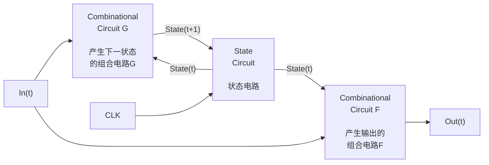
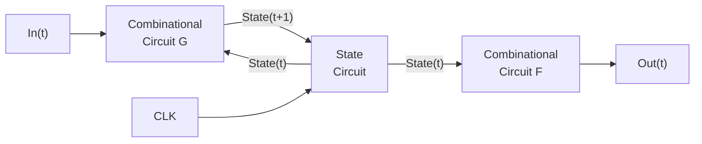
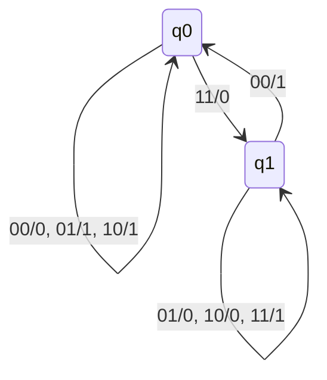

<!-- Page 1 -->

# 计算机科学导论-课件16

课件中包含素材引用，特此致谢！

# 期末复习

徐志伟（zxu@gbu.edu.cn 18910338695）  
大湾区大学 信息科学技术学院

1

---

<!-- Page 2 -->

# 提纲

- 期末复习建议
- 看到自己的进步
- 融会贯通例子：数字符号表示，计算机中一切终究是二进制表示
- 融会贯通例子：从排序算法，贯通分治范式算法的设计与分析
- 融会贯通例子：单比特加法，从自然语言、逻辑，直到时序电路

- 本复习强调融会贯通实例，并未覆盖全体内容

---

<!-- Page 3 -->

# 1. 期末复习建议

- 期末复习目的
  - 增强自信：不再是0基础；初步体认了计算思维，提升了自学能力和想象力
    - 证据：大部分同学小班课作业得了满分，大班课作业优良
  - 融会贯通《计算机科学导论-上》知识点
  - 期末考试取得好成绩
    - **120**分钟正常考试 **+ 40**分钟加分考试
      - 正常考试满分即期末考试满分
    - <span style="color:red">闭卷书面笔试</span>，没有机考，不要带电脑
    - 内容覆盖大班课、小班课、作业、教科书，比例不等
- 期末复习方法建议
  - 系统地复习大班课与小班课课件
  - 辅之以教科书内容

---

图示：

- 课堂  
  主动参与
- 实践  
  亲自做
- 教科书  
  通读中文版
- <span style="color:red">课件既是讲授类<br>也是阅读类材料</span>

3

---

<!-- Page 4 -->

## <span style="color:#2b005b">2. 同学们已经学到了不少知识和技能</span>

### <span style="color:#2b005b">比照《计算机科学基础报告》</span>

“计算机科学是研究计算机以及它们能干什么的一门学科。它研究<span style="color:red">抽象计算机</span>的能力与局限，<span style="color:blue">真实计算机</span>的构造与特征，以及用于求解问题的无数<span style="color:#a000d0">计算机应用</span>。”

本课程的具体知识点一般都融合了这三者

- 计算机科学
  - 涉及<span style="color:red">符号</span>及其操作；
  - 关注多种<span style="color:red">抽象</span>概念的创造和操作；
  - 创造并研究<span style="color:red">算法</span>；
  - 创造各种<span style="color:red">人工结构（作品）</span>，尤其是不受物理定律限制的结构；
  - 利用并应对<span style="color:red">指数增长</span>；
  - 探索计算能力的<span style="color:red">基本极限</span>；
  - 关注与人类<span style="color:red">智能</span>相关的复杂的、分析的、理性的活动。

---

<!-- Page 5 -->

# 知道概念，能够举例说明其特点

- “计算机科学是研究计算机以及它们能干什么的一门学科。  
  它研究<span style="color:red">抽象计算机</span>的能力与局限，<span style="color:red">真实计算机</span>的构造与特征，  
  以及用于求解问题的无数<span style="color:red">计算机应用</span>。”

  - 计算机科学涉及<span style="color:red">符号</span>及其操作；
  - 关注多种<span style="color:red">抽象</span>概念的创造和操作；
  - 创造并研究<span style="color:red">算法</span>；
  - 创造各种<span style="color:red">人工结构（作品）</span>，尤其是不受物理定律限制的结构；
  - 利用并应对<span style="color:red">指数增长</span>；
  - 探索计算能力的<span style="color:red">基本极限</span>；
  - 关注与人类<span style="color:red">智能</span>相关的复杂的、分析的、理性的活动。

## 标注

- <span style="color:red">有限状态机、图灵机、冯诺依曼模型</span>
- <span style="color:red">笔记本电脑</span>
- <span style="color:red">快速排序程序，分治</span>
- <span style="color:red">各种编程抽象</span>
- <span style="color:red">斐波那契递归程序</span>
- <span style="color:red">P与NP</span>
- <span style="color:red">图灵机不可计算问题</span>
- <span style="color:red">哥德尔不完备定理</span>
- <span style="color:red">逻辑推理</span>
- <span style="color:red">命题逻辑</span>
- <span style="color:red">谓词逻辑</span>

5

---

<!-- Page 6 -->

# 同学们知道了计算思维的基本思路：活力法（PEPS）

- 定义领域<span style="color:red">问题</span>（<span style="color:red">P</span>roblem in target domain）
- <span style="color:red">建模</span>（<span style="color:red">E</span>ncoding）到信息空间（赛博空间，cyberspace）的计算问题
- 自动执行计算<span style="color:red">系统</span>（<span style="color:red">S</span>ystem）上的计算<span style="color:red">过程</span>（<span style="color:red">P</span>rocess），解决问题
  - 计算系统 = 计算机；用算法、程序、状态转移表等刻画计算过程
- 映射回到目标领域

---

## 图示

### 目标领域 Target Domain

**人工**

科学、工程、社会  
中的<span style="color:red">问题</span> Problems

### <span style="color:red">E</span>ncoding（Modeling）  
### 建模

↔

## 问题求解 Problem Solving

**人工**

**自动执行**

### 计算<span style="color:red">过程</span>  
Computational  
<span style="color:red">P</span>rocesses

### 计算<span style="color:red">系统</span>  
Computing <span style="color:red">S</span>ystems

信息空间 Cyberspace

6

---

<!-- Page 7 -->

# 实践中的PEPS（问题-建模-计算过程-系统）

- **P**roblem, 目标领域中的待解问题
- **E**ncoding, 建模
- Computational **P**rocess, 计算过程（Python 程序）
- Computing **S**ystem, 计算系统（冯诺依曼模型）

| 精力占比 | P | E | P | S |
|---|---:|---:|---:|---:|
| 斐波那契 | 1% | 1% | 78% | 20% |
| 个人作品 | 40% | 10% | 30% | 20% |

个人作品需要更多时间定义问题

```text
目标领域 Target Domain

科学、工程、社会中的问题 Problems

Encoding
(Modeling)
建模

计算过程
Computational Processes

计算系统
Computing Systems

信息空间 Cyberspace
```

7

---

<!-- Page 8 -->

# 计算思维基本方法

- 一种认识世界、定义问题、解决问题的科学方法
  - 计算系统 = 计算机
  - 使用算法、程序、状态转移表等刻画计算过程
- 建模是双向映射
- 目标领域也可以是赛博空间

> 计算机科学研究  
> <span style="color:red">抽象计算机，</span>  
> <span style="color:blue">真实计算机，</span>  
> <span style="color:purple">计算机应用。</span>

## 图示

**人工**

```text
┌──────────────────────────┐
│ 自然科学、工程学科、社会科学 │
│ 等目标领域中的各种问题与过程 │
└──────────────────────────┘
```

**目标领域**（Target Domain）

**人工**

**建模：** 将目标领域的各种问题与过程映射到信息空间，作为计算问题与计算过程求解，并返回目标领域检验

←────────────────────────→

<span style="color:red">抽象计算机</span>

**自动执行**

```text
┌──────────────────────────┐
│   计算机应用              │
│ ┌──────────────┐          │
│ │  计算过程    │          │
│ └──────────────┘          │
│ ┌──────────────┐          │
│ │  计算系统    │          │
│ └──────────────┘          │
│   真实计算机              │
└──────────────────────────┘
```

**赛博空间**（Cyberspace）

8

---

<!-- Page 9 -->

# 知道了对计算思维的十个理解: <span style="color:red">Acu-Exams-CP</span>

|  |  |
|---|---|
| (**<span style="color:red">A</span>**): **Automatically execution** | **自动执行：** 计算机能够自动执行由离散步骤组成的计算过程。 |
| (**<span style="color:red">C</span>**): **Correctness** | **正确性：** 计算机求解问题的正确性可以比特精准地定义并分析。 |
| (**<span style="color:red">U</span>**): **Universality** | **通用性：** 计算机能够求解任意可计算问题。 |
| (**<span style="color:red">E</span>**): **Effectiveness** | **构造性：** 人们能够构造出聪明的方法让计算机有效地解决问题。 |
| (**<span style="color:red">X</span>**): **Complexity** | **复杂度：** 这些聪明的方法（算法）具备时间/空间复杂度。 |
| (**<span style="color:red">A</span>**): **Abstraction** | **抽象化：** 少数精心构造的计算抽象可产生万千应用系统。 |
| (**<span style="color:red">M</span>**): **Modularity** | **模块化：** 多个模块有规律地组合成为计算系统。 |
| (**<span style="color:red">S</span>**): **Seamless Transition** | **无缝衔接：** 计算过程在计算系统中流畅地执行。 |
| (**<span style="color:red">C</span>**): Connectivity | **连接性：** 很多问题涉及用户/数据/算法的连接体，而非单体。 |
| (**<span style="color:red">P</span>**): Protocol Stack | **协议栈：** 连接体的节点之间通过协议栈交互。 |

---

<!-- Page 10 -->

# 3. 融会贯通例子：用二进制数字符号表示数、字符、程序

- 数的二进制表示
  - **123.456**对应的二进制表示是啥
  - 整数的原码、补码表示
- 字符的二进制表示
  - 英文问号的**ASCII**码表示
  - 中文字符“中”的**Unicode**和**UTF-8**编码
- 程序的二进制表示
  - **Python**源码的二进制表示
  - 斐波那契计算机的加法指令的二进制表示
- 不需要背诵，只需要知道原理

---

<!-- Page 11 -->

# 4. 融会贯通例子： quicksort算法

- 用分治范式和随机范式设计算法
  - 重点理解分治范式
  - 为啥要用随机标杆（pivot）？
    - pivot也翻译成“基准数”
- 算法分析得到的性质
  - 空间复杂度为$O(N)$，因为这是in-place算法
  - 平均情况下时间复杂度为$N * \log N$
  - 最坏情况下时间复杂度为$N^2$

```python
import random
import sys

sys.setrecursionlimit(1000000)

def quicksort(A, p, r):
    if p < r:
        q = partition(A, p, r)
        quicksort(A, p, q-1)
        quicksort(A, q+1, r)

def partition(A, p, r):
    random_index = random.randint(p, r)
    A[r], A[random_index] = A[random_index], A[r]
    pivot = A[r]
    i = p - 1

    for j in range(p, r):
        if A[j] < pivot:
            i += 1
            A[i], A[j] = A[j], A[i]
    A[i+1], A[r] = A[r], A[i+1]
    return i + 1

N = 1000000
A = [0] * N
for i in range(N):
    # A[i] = random.randint(1, N)
    A[i] = i
print("Before:", A[:5], "...", A[-5:])
quicksort(A, 0, len(A) - 1)
print("After:", A[:5], "...", A[-5:])

---

<!-- Page 12 -->

# 5. 融会贯通例子：单比特加法，可推广到多比特加法

- 用传统数学的自然语言理解并描述单比特加法
  - 如，**Z** 等于 1，当且仅当 **X**、**Y**、**Cin** 有奇数个 1
  - 同学们应该能够自行描述 **Cout** 的充分必要条件
- 逻辑思维：将自然语言描述转换成布尔逻辑表达式
  - **Z = X⊕Y⊕Cin**，其中 ⊕ 是异或算符
  - 同学们自行推出 **Cout = f(X, Y, Cin)** 的具体表达式
- 系统思维：
  - 组合电路：全加器电路（右图）
  - 利用惠勒间接原理，深刻理解全加器（右图）
    - 添加 **G**、**P** 中间变量，它们不依赖于 **Cin**
    - 可推广到多比特的先行进位加法器
  - 时序电路：设计比特串行加法器的 **4** 步骤

---

<!-- Page 13 -->

# 时序电路入门基础

- 两个组合电路，一个状态电路；时钟信号驱动
- 状态电路由一个或多个 **D** 触发器组成
- 两个组合电路是
  - 输出电路 **F**：$Out(t)=F(In(t), State(t))$
  - 下一状态电路 **G**：$State(t+1)=G(In(t), State(t))$
- 时序电路的逻辑线路图（时序电路的一般结构）
  - 也称为时钟同步的时序电路（synchronous sequential circuit）



13

---

<!-- Page 14 -->

# 示例：设计4位串行加法器的4个步骤

- 在四个时钟周期完成加法  
  \(Z_3Z_2Z_1Z_0 = X_3X_2X_1X_0 + Y_3Y_2Y_1Y_0\)
  - 每一周期完成一个全加操作

- 再用一个实例验证
  - \(11_{10} + 9_{10} = 1011_2 + 1001_2 = 10100_2 = 20_{10} = 4_{10}\) and overflow  
    输入X=1011，Y=1001；则输出Z=0100且产生进位溢出

- 设计过程
  - <span style="color:red">第1步：首先确定状态电路，需要多少个D触发器？</span>
  - <span style="color:blue">只需要一个 D触发器，其状态Q表示当前进位</span>



14

---

<!-- Page 15 -->

# 设计4位串行加法器

- **第2步：套用时序电路一般结构**
  - **In是输入X，Y；Out是输出Z；Q是进位C，D是Cnext；Enable=时钟信号CLK**

## 时序电路一般结构

```text
In(t) ──► [ Combinational Circuit G ] ── State(t+1) ──► [ State Circuit ] ── State(t) ──► [ Combinational Circuit F ] ──► Out(t)
                         ▲                                  ▲       │
                         │                                  │       │
                         └──────────────────────────────────┘       │
                                           CLK                       │
                                                                     └───────────────┐
```

## 套用一般结构后得到的串行加法器时序电路

```text
X
Y ──► [ 状态电路 G ] ── C_next ──► [ D 触发器 ] ── C ──► [ 输出电路 F ] ──► Z
          ▲                         ▲   │E          │Q
          │                         │   │D          │
          └─────────────────────────┴───┴───────────┘
                         时钟
```

15

---

<!-- Page 16 -->

# 第3步：求输出电路 F 与下一状态电路 G 的布尔表达式

- 画出时序电路的状态转换图

## 时序电路结构

输入：

\[
X_3X_2X_1X_0 = 1011
\]

\[
Y_3Y_2Y_1Y_0 = 1001
\]

下一状态电路：

\[
G
\]

触发器：

\[
D\ \text{触发器}
\]

输出电路：

\[
F
\]

中间状态：

\[
C_{\text{next}}
\]

\[
C_4C_3C_2C_1 = 1011
\]

\[
C_4C_3C_2C_1C_0 = 10110
\]

输出：

\[
Z_3Z_2Z_1Z_0 = 0100
\]

## 状态转换图

状态标注：

\[
XY/Z
\]



画出时序电路的状态转换图

\[
q_0 \text{ denotes } C = 0
\]

\[
q_1 \text{ denotes } C = 1
\]

## 加法示意

\[
\begin{array}{rcl}
1011 &=& X \\
+\,1001 &=& Y \\
\hline
10110 &=& C \\
0100 &=& Z
\end{array}
\]

16

---

<!-- Page 17 -->

# 第3步：求输出电路 F 与下一状态电路 G 的布尔表达式

- 画出时序电路的状态转换图；**进而导出真值表**

## 时序电路结构

输入：$X, Y$  
状态：$C$  
下一状态：$C_{\text{next}}$  
输出：$Z$

结构关系：

$X, Y, C \rightarrow$ 下一状态电路 $G \rightarrow C_{\text{next}} \rightarrow D$ 触发器 $\rightarrow C$

$X, Y, C \rightarrow$ 输出电路 $F \rightarrow Z$

## 状态转换图

标注格式：$XY/Z$

- 状态 $q_0$
  - 自环：$00/0,\ 01/1,\ 10/1$
  - 转移到 $q_1$：$11/0$

- 状态 $q_1$
  - 自环：$01/0,\ 10/0,\ 11/1$
  - 转移到 $q_0$：$00/1$

$q_0$ denotes $C=0$  
$q_1$ denotes $C=1$

## 真值表（状态符号表示）

| $C$ | $X$ | $Y$ | $Z$ | $C_{\text{next}}$ |
|---|---:|---:|---:|---|
| $q_0$ | 0 | 0 | 0 | $q_0$ |
| $q_0$ | 0 | 1 | 1 | $q_0$ |
| $q_0$ | 1 | 0 | 1 | $q_0$ |
| $q_0$ | 1 | 1 | 0 | $q_1$ |
| $q_1$ | 0 | 0 | 1 | $q_0$ |
| $q_1$ | 0 | 1 | 0 | $q_1$ |
| $q_1$ | 1 | 0 | 0 | $q_1$ |
| $q_1$ | 1 | 1 | 1 | $q_1$ |

## 真值表（二进制表示）

| $C$ | $X$ | $Y$ | $Z$ | $C_{\text{next}}$ |
|---:|---:|---:|---:|---:|
| 0 | 0 | 0 | 0 | 0 |
| 0 | 0 | 1 | 1 | 0 |
| 0 | 1 | 0 | 1 | 0 |
| 0 | 1 | 1 | 0 | 1 |
| 1 | 0 | 0 | 1 | 0 |
| 1 | 0 | 1 | 0 | 1 |
| 1 | 1 | 0 | 0 | 1 |
| 1 | 1 | 1 | 1 | 1 |

---

<!-- Page 18 -->

# 第3步：求输出电路F与下一状态电路G的布尔表达式

- 画出时序电路的状态转换图；进而导出真值表；**进而求出F和G的布尔表达式**

## 时序电路框图

输入：$X, Y$  
下一状态电路：$G$  
触发器：$D$ 触发器  
输出电路：$F$  
状态：$C$  
下一状态：$C_{\text{next}}$  
输出：$Z$

## 状态转换图

标注格式：$XY/Z$

- $q_0$ denotes $C=0$
- $q_1$ denotes $C=1$

状态转移：

| 当前状态 | 输入/输出 | 下一状态 |
|---|---|---|
| $q_0$ | $00/0$ | $q_0$ |
| $q_0$ | $01/1$ | $q_0$ |
| $q_0$ | $10/1$ | $q_0$ |
| $q_0$ | $11/0$ | $q_1$ |
| $q_1$ | $00/1$ | $q_0$ |
| $q_1$ | $01/0$ | $q_1$ |
| $q_1$ | $10/0$ | $q_1$ |
| $q_1$ | $11/1$ | $q_1$ |

## 真值表

| $C$ | $X$ | $Y$ | $Z$ | $C_{\text{next}}$ |
|---|---|---|---|---|
| 0 | 0 | 0 | 0 | 0 |
| 0 | 0 | 1 | 1 | 0 |
| 0 | 1 | 0 | 1 | 0 |
| 0 | 1 | 1 | 0 | 1 |
| 1 | 0 | 0 | 1 | 0 |
| 1 | 0 | 1 | 0 | 1 |
| 1 | 1 | 0 | 0 | 1 |
| 1 | 1 | 1 | 1 | 1 |

## 布尔表达式

$$
Z = F(X,Y,C) = X \oplus Y \oplus C
$$

$$
C_{\text{next}} = G(X,Y,C) = (X \cdot Y) + (X \oplus Y) \cdot C
$$

## 电路图说明

画出 $F$ 与 $G$ 的电路图，它们可合并成一个组合电路图。

输入：$X, Y, C_{\text{in}}$  
输出：$Z, C_{\text{out}}$

---

<!-- Page 19 -->

# 设计过程第4步：验算

- 给定
  - （1）设计好的下图时序电路，
  - （2）输入 $X_3X_2X_1X_0=1011,\ Y_3Y_2Y_1Y_0=1001$，与初始进位 $C_0=0$
  - 正确结果应为 $Z_3Z_2Z_1Z_0=0100$，且有 $C_4=1$ 表示溢出

- 验算步骤
  - 时钟周期0：$Z_0=X_0\oplus Y_0\oplus C_0=1\oplus1\oplus0=0$；$C_1=(X_0\cdot Y_0)+(X_0\oplus Y_0)\cdot C_0=(1\cdot1)+(1\oplus1)\cdot0=1$
  - 时钟周期1：$Z_1=X_1\oplus Y_1\oplus C_1=1\oplus0\oplus1=0$；$C_2=(X_1\cdot Y_1)+(X_1\oplus Y_1)\cdot C_1=(1\cdot0)+(1\oplus0)\cdot1=1$
  - 时钟周期2：$Z_2=X_2\oplus Y_2\oplus C_2=0\oplus0\oplus1=1$；$C_3=(X_2\cdot Y_2)+(X_2\oplus Y_2)\cdot C_2=(0\cdot0)+(0\oplus0)\cdot1=0$
  - 时钟周期3：$Z_3=X_3\oplus Y_3\oplus C_3=1\oplus1\oplus0=0$；$C_4=(X_3\cdot Y_3)+(X_3\oplus Y_3)\cdot C_3=(1\cdot1)+(1\oplus1)\cdot0=1$

---

输入：

$$
\begin{array}{c}
X_3X_2X_1X_0 \\
1\ 0\ 1\ 1 \\
1\ 0\ 0\ 1 \\
Y_3Y_2Y_1Y_0
\end{array}
$$

时序电路标注：

- 下一状态电路：$G$
- $G:C_{next}=(X\cdot Y)+(X\oplus Y)\cdot C$
- $C_{next}\rightarrow D$ 触发器
- 输出电路：$F$
- $F:Z=X\oplus Y\oplus C$
- 输出：$Z=0$
- 结果：

$$
\begin{array}{c}
z_3z_2z_1z_0 \\
0\ 1\ 0\ 0
\end{array}
$$

进位序列：

$$
\begin{array}{c}
C_4C_3C_2C_1C_0 \\
1\ 0\ 1\ 1\ 0
\end{array}
$$

19

---

<!-- Page 20 -->

# 课程追求：珍惜时代、体认思维、学生走心、作品牵引

## 李晓明 徐志伟 | 大湾区大学