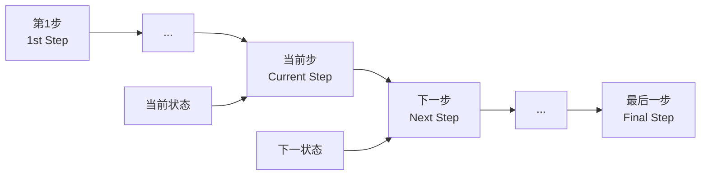
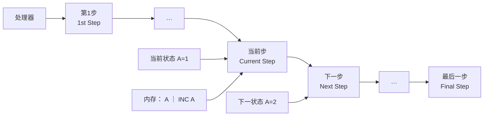
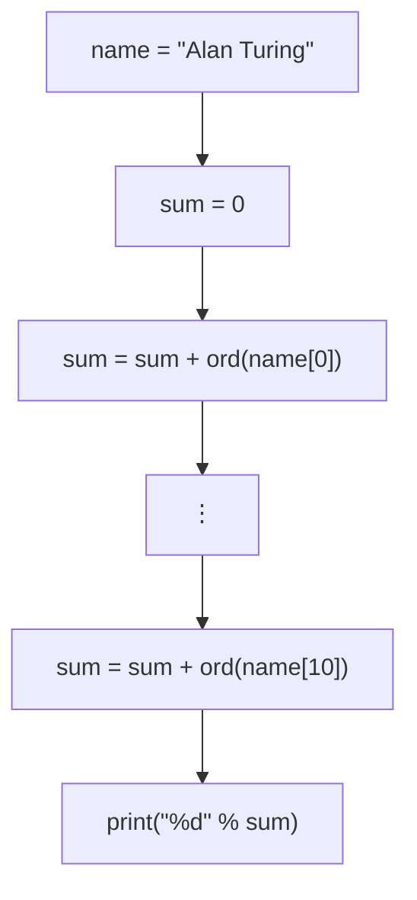
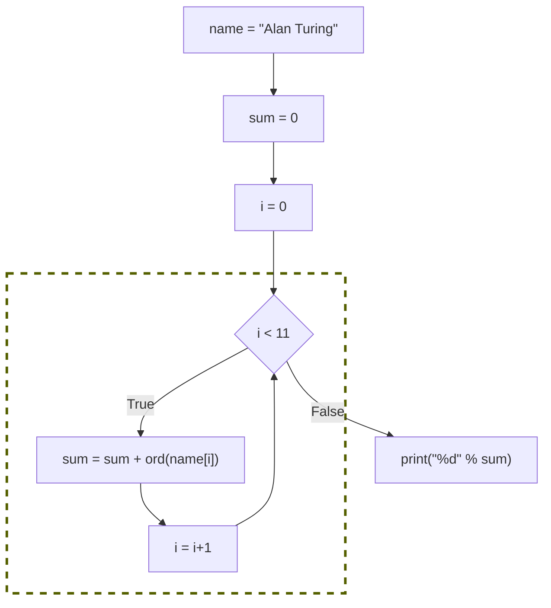
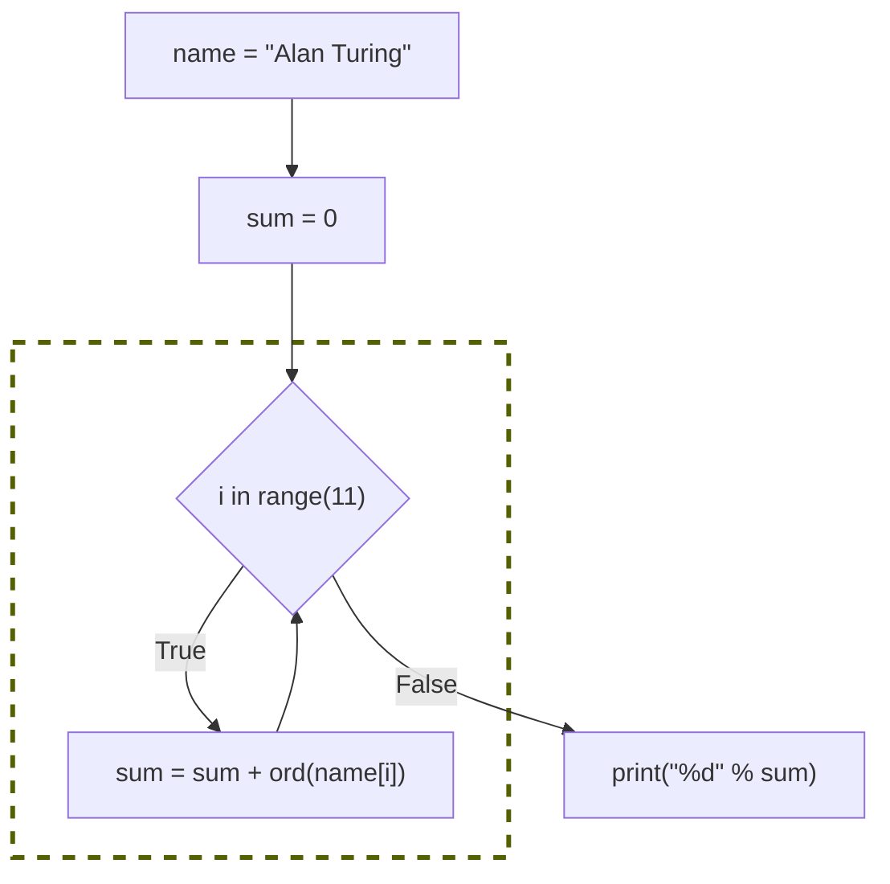

<!-- Page 1 -->

# Talents are evenly distributed,  
# but opportunities are not

John Hopcraft教授（1986年获图灵奖）  
积极推动中国大学教育的“101计划”  
本课程秉承他的高品质追求：  
<span style="color:red">提供机会</span>**领悟CS本质**

## 证书

中华人民共和国  
国际科学技术合作奖

*The International Science and Technology Cooperation Award of the People's Republic of China*

证书  
CERTIFICATE

**John Edward Hopcroft** 荣获  
中华人民共和国国际科学技术合作奖，  
特颁发此证书。

This certificate is issued to **John Edward Hopcroft** for winning  
the International Science and Technology Cooperation  
Award of the People's Republic of China.

2024年6月

证书号：2023-HZ-01

---

<!-- Page 2 -->

# 计算机科学导论-课件2

# 计算机与计算过程-2

## 计算思维**ABC**之**B**——比特精准

## 计算思维**ABC**之**C**——良构抽象

徐志伟（**zxu@gbu.edu.cn 18910338695**）

大湾区大学 信息科学技术学院

2

---

<!-- Page 3 -->

# 提纲

- 上周我们学习了
  - 计算思维概述：计算思维ABC，计算思维基础方法PEPS（活力法）
    - 计算思维ABC之**A**（自动执行）：自动机概念、基本词汇、**直线程序**
  - 实验课暴露了四类错误，揭示了自动执行的两类需求  
    ①极少犯错（远不止“万无一失”）；②“有限描述无穷”
    - 理论计算不犯错，实际计算少犯错

- 比特精准：计算思维ABC之B（bit accuracy）
  - 应对①**极少犯错**需求
    - 当代计算机为什么采用二进制？
    - 为什么要有“数据类型”概念？

- 良构抽象，也叫构造性抽象（计算思维ABC之C）
  - **C**onstructive abstraction，以及well-formed abstraction
  - 活力法（PEPS）如何应对②**有限描述无穷**需求
    - 自底向上法——姓名编码程序，循环和数组的配合
    - 下周：自顶向下法——快速排序程序（fastsort.py），递归函数

| 计算过程 |
|---|
| 计算机 |

赛博空间  
Cyberspace

---

**问题场景——姓名编码**

**期中考试成绩发布的两种方式**

| 实名方式 |  | 编码后方式 |  |
|---|---:|---|---:|
| 学生姓名 | 成绩 | 学生编码 | 成绩 |
| 安宏江 | 50 | #634 | 70 |
| … |  | … |  |
| 欧阳孔明 | 90 | #1124 | 50 |
| … |  | … |  |
| 翟羽 | 70 | #1485 | 90 |

进而初步体认良构抽象本质  
①循环抽象：以有限描述无穷  
②**循环**控制结构与**数组**数据类型天然配合  
　　不变的有限结构，可变的无穷实例

---

<!-- Page 4 -->

# 1. 数字抽象——当代计算机为什么采用二进制？

- 本质原因：二进制数（比特）是最简单的**数字抽象**
- 数字抽象，即数字符号及其操作，是当代计算机科学最本质的基础抽象
  - 万物皆0、1　　用有限个比特（数字符号）表示任意具体或抽象的事物
  - 万事与非成　　用针对有限个比特的有限步“与非操作”，实现任意信息变换过程（计算过程）
- 计算机科学通过**数字符号操作**实现计算过程，而不是用模拟信号表示并处理信息

**Digital symbol manipulation**

- 同时，计算机科学研究并使用模拟电路，以实现更好的（如能效更高的）数字抽象

---

**数字世界：**

> **数字化应用（数字计算过程）**  
> **数字计算机与网络系统**  
> **数字部件**

⬆️

**数字抽象**  
**数字化**

⬆️

**模拟世界：** 用模拟信号，表示并处理电、光、磁等信息

---

<!-- Page 5 -->

# 1.1 为什么不直接使用模拟计算？

- 模拟计算过程本质上难以保真：每个步骤都有噪声，且多个步骤的噪声累积叠加

---

<!-- Page 6 -->

# 例子：模拟电视存在雪花点噪声

- 模拟图像多次复制与翻转操作的结果，出现严重失真
  - $\left(\mathrm{Copy}^{1}\mathrm{Inv}^{2}\right)^{400}$ 含义是：重复 400 遍“一次复制两次翻转”
    - 无噪声时，图像应该不变

原始图像 $\xrightarrow{\left(\mathrm{Copy}^{1}\mathrm{Inv}^{2}\right)^{400}}$ 失真图像

## 假设：

- 像素色深（pixel color depth）$X$ 取值在实数闭区间 $[0,255]$
- 复制操作：$\mathrm{Copy}(X)=X$
- 翻转操作：$\mathrm{Inv}(X)=255-X$
- 雪花点噪声产生千分之一噪声量

---

<!-- Page 7 -->

# 例子：模拟电视存在雪花点噪声

- 模拟图像多次复制与翻转操作的结果，出现严重失真

  \[
  \text{图像} \xrightarrow{(\mathrm{Copy}^1\mathrm{Inv}^2)^{400}} \text{严重失真图像}
  \]

- 反之，万亿步骤的数字计算过程能够保真，噪声不会积累

  \[
  \text{图像} \xrightarrow{(\mathrm{Copy}^1\mathrm{Inv}^2)^{400}} \text{保真图像}
  \]

## 假设：

- 像素色深（pixel color depth）\(X\) 取值在实数闭区间 \([0, 255]\)
- 复制操作：\(\mathrm{Copy}(X)=X\)
- 翻转操作：\(\mathrm{Inv}(X)=255-X\)
- 雪花点噪声产生千分之一噪声量

---

<!-- Page 8 -->

# 例子：模拟电视存在雪花点噪声

- 模拟图像多次复制与翻转操作的结果，出现严重失真
- 反之，万亿步骤的数字计算过程能够保真，噪声不会积累

模拟图像：$(\mathrm{Copy}^1\mathrm{Inv}^2)^{400}$ → 严重失真

数字图像：$(\mathrm{Copy}^1\mathrm{Inv}^2)^{400}$ → 保真

复制并翻转原图：**数字**图像

> 复制 1 次并翻转 2 次

复制并翻转原图：**模拟**图像

## 假设：

- 像素色深（pixel color depth）$X$ 取值在实数闭区间 $[0, 255]$
- 复制操作：$\mathrm{Copy}(X)=X$
- 翻转操作：$\mathrm{Inv}(X)=255-X$
- 雪花点噪声产生千分之一噪声量

---

<!-- Page 9 -->

# 当代计算机为什么用二进制？ 因为二进制数是**最简单**的**数字抽象**

- **本质**原因：数字抽象带来保真性
  - 模拟计算本质上难以保真，因为每个步骤都有噪声，且多个步骤的噪声累积叠加
  - 反之，数字计算过程能够保真；系统思维单元会讲原因：Postel’s Robustness Principle

- **最简性**原因：二进制数是**最简单**的数字抽象
  - 二进制同时支持算术运算（加减乘除等）和逻辑运算（与或非等）
  - 相比十进制算术，二进制算术的硬件实现更简单
  - 在逻辑思维单元、系统思维单元详细阐述

| 数字图像复制100次并翻转200次 | 原图 | 模拟图像复制100次并翻转200次 |
|---|---|---|
|  |  |  |

---

<!-- Page 10 -->

## 1.2 二进制赋能**比特精准**

- **比特精准：** 计算过程的每一个比特都是**正确**的
  - 每一个步骤按照程序指令执行，产生指令规定的输出比特
  - **Bit accuracy:** every bit of a computational process is accurate and precise, according to instructions

- 计算结果精准度由应用建模确定
  - 某些应用（如蛋白质结构预测）不强求完全精准的结果

---

### 计算机科学与比特精准、领域精准

```text
输入 → 计算过程 → 输出
        ↑
   问题 / 模型 / 算法 / 程序
        ↓
       系统
```

- 目标**领域精准**性
- **比特精准**
- 计算机科学用**比特精准**
- 支持各专业的**领域精准**

---

### 完全精准的结果

求斐波那契数 $F(n)$

$F(50)=12586269025$

$$
F(n)=
\begin{cases}
0, & n=0 \\
1, & n=1 \\
F(n-1)+F(n-2), & n>1
\end{cases}
$$

```python
fib = [0]*51
fib[0] = 0
fib[1] = 1
for i in range(2,51):
    fib[i] = fib[i-1] + fib[i-2]
```

---

### 非完全精准的结果

蛋白质结构预测

精度 >50% 就有用

红：预测；蓝：真实

图片来源：许锦波教授

10

---

<!-- Page 11 -->

# 精准 = 准确与精确

- **精准度**包括两种误差的度量：**准确度**和**精确度**  
  **准确**（Accuracy，形容词 accurate）：计算结果与真实值的接近程度  
  **精确**（Precision，形容词 precise）：计算结果彼此之间的接近程度

> **ISO definition (ISO 5725), 1994**  
> Probability density  
> Reference value  
> Average value  
> Trueness  
> Precision  
> Value

---

- **案例1：π 的取值**
  - 准确：3.14159265358979323846...
  - 精确：保留到小数点后七位的 π 值是 3.1415927  
    **精度：8位（10进制）**

- **案例2：飞镖**  
  将飞镖靶的靶心（中心）视为真实值，飞镖距离靶心越近，就越准确

| 情况 | Precision | Accuracy | 说明 |
|---|---|---|---|
| 6个飞镖正中靶心 | √ Exact |  | 完全精准 |
| 飞镖集中且靠近靶心 | √ Precise | √ Accurate | 既精确又准确 |
| 飞镖分散但平均靠近靶心 | × Precise | √ Accurate | 准确但不精确 |
| 飞镖集中但远离靶心 | √ Precise | × Accurate | 精确但不准确 |
| 飞镖分散且远离靶心 | × Precise | × Accurate | 既不精确又不准确 |

---

<!-- Page 12 -->

# 计算机科学用**比特精准**支持各专业和行业的领域精准

## 软件

| 层次 | 内容 |
|---|---|
| 应用算法和程序 | 各种应用算法和程序，如日出程序 `sunRise.py` |
| **高级语言接口** | Python 编程环境：如 Python3 解释器命令 `python3 sunRise.py` |
| **低级语言接口** | Linux 操作系统（通过 shell 命令操作），如 `ls`、`code`、`python3` |

## 硬件

### 计算机

#### 存储器

地址：

```text
0
1
2
3
```

| 区域 |
|---|
| 系统软件 |
| 程序 |
| 数据 |

#### 处理器：中央处理器 CPU

- 寄存器
- 寄存器
- 寄存器
- 运算器 ALU
- 指令寄存器
- 状态寄存器
- 控制器

#### I/O 输入输出设备

## 精准层次

- 领域精准
- 比特精准

---

<!-- Page 13 -->

# 统计方法的恐龙数据集现象

## The “dinosaur data sets” phenomenon

- These data sets are the **same but different**
  - show quite different graphs (varied appearance), but
  - have the same statistics (up to two digits after the decimal point)

- 这些数据集的五个统计度量  
  一模一样精确到小数点后两位

- 但恐龙图像与五角星图像  
  看起来完全不同

- 这是统计学专业领域和大数据  
  与人工智能的领域精准问题

## Dinosaur data set


```text
X Mean: 54.2659224
Y Mean: 47.8313999
X SD  : 16.7649829
Y SD  : 26.9342120
Corr. : -0.0642526
```

## Star data set


```text
X Mean: 54.2662794
Y Mean: 47.8355028
X SD  : 16.7633382
Y SD  : 26.9375333
Corr. : -0.0625894

---

<!-- Page 14 -->

# 统计方法的恐龙数据集现象

- These data sets are the **same but different**
  - 5个统计指标相同（精确到小数点后两位）
  - 但视觉看起来完全不同

> 1973年，统计学家F.J. Anscombe首先发现类似现象，文献中称为Anscombe’s quartet **“安斯库姆四重奏” 的启示：**
>
> - 统计指标有局限性，不能完全依赖
> - 区别很大的散点图，统计指标可完全相同
>
> 计算机科学提供比特精准的数据可视化，有助于暴露数据矛盾

| 指标 | 数值 |
|---|---:|
| X Mean | 54.2659224 |
| Y Mean | 47.8313999 |
| X SD | 16.7649829 |
| Y SD | 26.9342120 |
| Corr. | -0.0642526 |

Justin Matejka and George Fitzmaurice. (2017). Same Stats, Different Graphs: Generating Datasets with Varied Appearance and Identical Statistics through Simulated Annealing. In Proceedings of the 2017 CHI Conference on Human Factors in Computing Systems (CHI '17). ACM, New York, NY, USA, 1290-1294.

14

---

<!-- Page 15 -->

# 2. 比特精准使能 “逐步执行的自动计算过程”

**Bit accuracy enables finite, step-by-step, automatic computational processes**

- 计算机上的计算过程是一个状态机（state machine）
  - 状态是变量的赋值
  - 执行当前步骤的效果是从当前状态变换到下一状态
  - 本课程仅关注有限的逐步步骤序列  
    ①确定允许的步骤；②定位第一步、最后一步；③在当前步骤定位下一步骤



15

---

<!-- Page 16 -->

# 如何使能状态机？

## How to enable a computational process on a state machine

- 计算机上的计算过程是一个状态机（state machine）
  - 状态是变量的赋值
  - 执行当前步骤的效果是从当前状态变换到下一状态
    - **输出结果操作数 = 操作(输入操作数)**，如 $A = \mathit{increment}(A)$，其指令是 INC A  
      Python 为 `A += 1`

- 操作数、操作码、指令，都存放在内存里



$A = \mathit{increment}(A)$

| 内存 | A | INC A |
|---|---|---|

---

## 如何使能状态机？

通过编码

## 编码什么？

- 编码资源地址或名字  
  Address is coded position  
  内存地址、寄存器号、操作符  
  还包括 I/O 设备号，等

- 编码数据  
  Data is coded information

- 编码程序  
  Program is coded algorithm

---

<!-- Page 17 -->

# 2.1 比特精准地编码内存地址

**概念：** 字节寻址内存地址空间（**byte addressable memory address space**）

- 操作数、操作码、指令，都存放在内存里
  - 输出结果操作数 = 操作(输入操作数)，如 $A=\textit{increment}(A)$，其指令是 INC A
- 比特精准地编码内存地址，便于处理器精准地定位当前步骤与下一步骤
  - 十六进制数地址 **0x00000003** 等同于二进制地址 00000000000000000000000000000011
  - 字节寻址：每个内存地址存放一个字节（8比特）的数据
  - 一个 64 比特整数包含 8 个字节，需要 8 个地址，但指令只需说明该整数的起始地址

## 处理器执行步骤示意

**当前状态 A=1** → **下一状态 A=2**

| 处理器流程 |
|---|
| 第1步<br>1st Step → … → 当前步<br>Current Step → 下一步<br>Next Step → … → 最后一步<br>Final Step |

当前步执行：

$$
A=\textit{increment}(A)
$$

内存中包含：

| 内存 |
|---|
| **A** |
| **INC A** |

## 内存地址空间示意

容量为 **40亿字节（4GB）** 的内存

| 地址 | 内容 |
|---|---|
| 0x00000000 | 系统软件 |
| 0x00000001 | 系统软件 |
| 0x00000002 | 系统软件 |
| 0x00000003 | 系统软件 |
|  |  |
| **PC → 0x0F000004** | 程序 |
| **0x0F00000c** | INC A |
|  |  |
|  | 数据 |
| **A** | **1** |
|  |  |
| 0xFFFFFFFE |  |
| 0xFFFFFFFF |  |

---

<!-- Page 18 -->

# 比特精准地编码内存地址

## 字节寻址内存地址空间（byte addressable memory address space）

- 操作数、操作码、指令，都存放在内存里
  - $\text{输出结果操作数} = \text{操作}(\text{输入操作数})$，如 $A = \mathit{increment}(A)$，其指令是 INC A

- 比特精准地编码内存地址，便于处理器精准地定位当前步骤与下一步骤
  - 十六进制数地址 **0x00000003** 等同于二进制地址 **00000000000000000000000000000011**
  - 字节寻址：每个内存地址存放一个字节（8比特）的数据
  - 一个64比特整数包含8个字节，需要8个地址，但指令只需说明该整数的起始地址

## 处理器执行步骤示意

```text
处理器 → 第1步 / 1st Step → … → 当前步 / Current Step → 下一步 / Next Step → … → 最后一步 / Final Step
                              ↑                         ↑
                         当前状态 A=1              下一状态 A=2
```

当前步执行：

$$
A = \mathit{increment}(A)
$$

内存中包含：

| 操作数 | 操作码 / 指令 |
|---|---|
| A | INC A |

## 容量为40亿字节（4GB）的内存

| 地址 | 内容 |
|---|---|
| 0x00000000 | 系统软件 |
| 0x00000001 | 系统软件 |
| 0x00000002 | 系统软件 |
| 0x00000003 | 系统软件 |
| … | … |
| 0x0F000004 | 程序 |
| 0x0F00000c | INC A（PC 指向） |
| … | … |
| 数据区 | A = 2 |
| … | … |
| 0xFFFFFFFE |  |
| 0xFFFFFFFF |  |

---

<!-- Page 19 -->

# 2.2 比特精准地编码各种数据

```python
import math                 # SunRise1.py
B = 7*3600 + 20*60
length = 40000*math.cos(40)
S = length / (24*3600)
D = length * (116 - 76) / 360
T = D / S
print("喀什的日出时间是：", B + T)
```

- 程序的某个对象或某个变量**B**
  - 可以包含什么类别的数据？允许什么操作？
  - 怎么知道变量B的字长等元数据（metadata，关于数据的数据）？
  - 计算机硬件和程序设计语言提供<span style="color:red">数据类型</span>，比特精准地回答这些问题

- 本周学习标量类型（scalar type）、字符串类型（string type）、列表类型（list type）

- SunRise1.py程序中，已出现和<span style="color:blue">尚未出现</span>的数据类型
  - 可用type(X)内置函数求对象X的类型值

```text
>>> type(math)
<class 'module'>
>>> type(20)
<class 'int'>
>>> type(B)
<class 'int'>
>>> type(T)
<class 'float'>
>>> type("喀什的日出时间是：")
<class 'str'>
>>> type(math.cos)
<class 'builtin_function_or_method'>
>>>
```

- 标量数据是不能再细分的数据
  - 标量类型包括整数（B）、浮点数（length, S, D, T）、<span style="color:blue">布尔值、None、复数</span>

- 字符串类型对象，不是标量（可被细分为子串）
  - 如，"喀什的日出时间是：" 包含子串 "喀什的日出"、"日出时"

- 其他非标量类型包括
  - <span style="color:blue">容器类型（列表等）</span>、模块（math）、函数（print, math.cos）等

---

<!-- Page 20 -->

# 2.2.1 如何比特精准地编码整数

- 可能的值
  - 所有0、正整数、负整数；如，-516，0，516
  - **Python中的整数字长按需扩展，可有任意字长**
    - 请自己试一下表达式 `516**516` 的求值结果

- 可能的运算包括常见数学操作
  - `+`，`-`，`*`，除，求余，求幂，等
    - 注意：除法记号有不同于数学的特点
  - 还包含其它操作，如等号运算符 `==`

- 计算机中表示
  - 0和正整数，用二进制原码
  - 负整数，用二进制补码
    - 注意：`bin` 函数输出结果时用了 **原码** 表示
      - -516的补码表示是：`110111111100`

## 遇见浮点操作自动变为浮点类型

```python
>>> 516 + 516        # 加法
1032
>>> 516+516.0        # 加法： 整数 + 浮点数
1032.0
>>> 516 - 516        # 减法
0
>>> 516*516          # 乘法运算
266256
>>> 516**2           # 幂运算
266256
>>> 516/5            # /运算产生浮点结果！
103.2
>>> 516 / 516        # /运算产生浮点结果！
1.0
>>> 516 // 516       # 整除求商（向下舍入）
1
>>> 516 % 516        # 整除求余数
0
>>> bin(516)
'0b1000000100'
>>> bin(-516)
'-0b1000000100'      # bin输出用原码
>>>

---

<!-- Page 21 -->

# 表示整数，为啥要有原码和补码？

- 如何表示自然数  
  - 自然数包括 0 和正整数

数轴：$\cdots\ -4\ -3\ -2\ -1\ 0\ 1\ 2\ 3\ 4\ \cdots$

- **Go** 使用无符号整数（unsigned integers）表示**自然数**
  - 采用 $n$ 比特可表示闭区间 $[0, 2^n - 1]$ 内的任意自然数
    - 数据类型 `uint8` 可表示 $[0, 2^8 - 1]$（即 $[0, 255]$）内的 256 个自然数
    - 数据类型 `uint64` 可表示 $[0, 2^{64} - 1]$ 内的 $2^{64}$ 个自然数
  - 超出范围称为**溢出**（overflow）；`uint8` 的溢出条件是：**<0** 或 **>255**

- **Python** 采用二进制补码（two’s complement）表示整数（integers），包括自然数
  - 统一考虑符号位（sign）与数值位（magnitude）
  - 减法可用加法实现
  - 0 的唯一表示
  - 不存在溢出，因为 **Python** 整数的字长可任意长

---

<!-- Page 22 -->

# 为什么不用原码（signed magnitude）表示整数？

- 假如有负数怎么办？ 使用带符号整数（signed integers）
  - 最左位（最高位）表示符号： 0（正数）， 1（负数）
  - 包括两种表示： ①简单带符号整数（<span style="color:red">原码</span>）， 以及②二进制<span style="color:red">补码</span>

- 简单带符号整数（原码）： <span style="color:red">符号位</span>（sign） + 7位绝对值（magnitude）
  - 63　　= <span style="color:red">0</span>0111111，　　64　　= <span style="color:red">0</span>1000000
  - (-63)　= <span style="color:red">1</span>0111111，　　(-64)　= <span style="color:red">1</span>1000000

- 正数+正数， 结果正确
  - 63 + 64 = <span style="color:red">0</span>0111111 + <span style="color:red">0</span>1000000 = <span style="color:red">0</span>1111111 = 127　　<span style="color:red">√</span>

- 负数+负数， 结果正确
  - (-63) + (-64) = <span style="color:red">1</span>0111111 + <span style="color:red">1</span>1000000 = <span style="color:red">1</span>1111111 = (-127)　　<span style="color:red">√</span>

- 正数+负数， 结果不正确
  - 63 + (-63) = <span style="color:red">0</span>0111111 + <span style="color:red">1</span>0111111 = <span style="color:red">1</span>1111110 = (-126)　　<span style="color:red">X</span>

---

<!-- Page 23 -->

# 用二进制**补码**表示带符号整数，8比特加法例子 X+Y

- **补码表示**（Two’s complement representation）
  - 正整数：保持原码表示；如，`63 = 00111111`，`64 = 01000000`
  - 负整数：绝对值按位求非，然后加 1；如，`(-63) = 11000001`，`(-64) = 11000000`

| `(-63)` | `(-64)` |
|---|---|
| `(-63) = (00111111)按位求非 + 00000001` | `(-64) = (01000000)按位求非 + 00000001` |
| `= 11000000 + 00000001 = 11000001` | `= 10111111 + 00000001 = 11000000` |

- **补码加法**
  - 采用无符号整数加法，处理包括符号位的 8 比特数，并忽略**最高位**可能的溢出

- `63 + 64 = 00111111 + 01000000 = 01111111 = 127` √
- `(-63) + (-64) = 11000001 + 11000000 = 10000001 = (-127)` √
- `63 + (-63) = 00111111 + 11000001 = 100000000 = 00000000 = 0` √

- **减法可用加法实现**：$X - Y = X + (-Y) = X + (Y求补)$
  - 整数求补方法：按位求非 + `00000001`

---

<!-- Page 24 -->

## 2.2.2 如何比特精准地编码英文文本？ASCII编码

### ASCII encodings for English texts

| $D_3D_2D_1D_0 \backslash D_6D_5D_4$ | 000 | 001 | 010 | 011 | 100 | 101 | 110 | 111 |
|---|---|---|---|---|---|---|---|---|
| 0000 | NUL | DLE | SP | 0 | @ | P | \` | p |
| 0001 | SOH | DC1 | ! | 1 | A | Q | a | q |
| 0010 | STX | DC2 | ” | 2 | B | R | b | r |
| 0011 | ETX | DC3 | # | 3 | C | S | c | s |
| 0100 | EOT | DC4 | $ | 4 | D | T | d | t |
| 0101 | ENQ | NAK | % | 5 | E | U | e | u |
| 0110 | ACK | SYN | & | 6 | F | V | f | v |
| 0111 | BEL | ETB | ’ | 7 | G | W | g | w |
| 1000 | BS | CAN | ( | 8 | H | X | h | x |
| 1001 | HT | EM | ) | 9 | I | Y | i | y |
| 1010 | LF | SUB | * | : | J | Z | j | z |
| 1011 | VT | ESC | + | ; | K | [ | k | { |
| 1100 | FF | FS | , | < | L | \ | l | \| |
| 1101 | CR | GS | - | = | M | ] | m | } |
| 1110 | SO | RS | . | > | N | ^ | n | ~ |
| 1111 | SI | US | / | ? | O | _ | o | DEL |

---

<!-- Page 25 -->

# 二进制数字表示英文字符：ASCII字符集

**ASCII encodings（ASCII码）for "Alan Turing" = [65, 108, 97, 110, 32, 84, 117, 114, 105, 110, 103]**

使用8位无符号整数  
（uint8，byte）  
表示**英文字符**

类型uint8 = 类型byte

一个字节（8比特）  
$D_7D_6D_5D_4D_3D_2D_1D_0$  
可以表示256个字符，  
本课程只用到128个  
$D_7=0$  
ASCII码范围：0~127

空格符在哪里？  
ASCII码 = ?$_{10}$  
= ?$_2$

| $D_3D_2D_1D_0$ \ $D_6D_5D_4$ | 000 | 001 | 010 | 011 | 100 | 101 | 110 | 111 |
|---|---|---|---|---|---|---|---|---|
| 0000 | NUL | DLE | SP | 0 | @ | P | ` | p |
| 0001 | SOH | DC1 | ! | 1 | A | Q | a | q |
| 0010 | STX | DC2 | " | 2 | B | R | b | r |
| 0011 | ETX | DC3 | # | 3 | C | S | c | s |
| 0100 | EOT | DC4 | $ | 4 | D | T | d | t |
| 0101 | ENQ | NAK | % | 5 | E | U | e | u |
| 0110 | ACK | SYN | & | 6 | F | V | f | v |
| 0111 | BEL | ETB | ' | 7 | G | W | g | w |
| 1000 | BS | CAN | ( | 8 | H | X | h | x |
| 1001 | HT | EM | ) | 9 | I | Y | i | y |
| 1010 | LF | SUB | * | : | J | Z | j | z |
| 1011 | VT | ESC | + | ; | K | [ | k | { |
| 1100 | FF | FS | , | < | L | \ | l | \| |
| 1101 | CR | GS | - | = | M | ] | m | } |
| 1110 | SO | RS | . | > | N | ^ | n | ~ |
| 1111 | SI | US | / | ? | O | _ | o | DEL |

---

<!-- Page 26 -->

# 二进制数字表示英文字符：ASCII字符集

**ASCII encodings（ASCII码） for "Alan Turing" = [65, 108, 97, 110, 32, 84, 117, 114, 105, 110, 103]**

使用8位无符号整数  
（uint8， byte）  
表示英文字符

类型uint8 = 类型byte

一个字节（8比特）  
$D_7D_6D_5D_4D_3D_2D_1D_0$  
可以表示256个字符，  
本课程只用到128个  
$D_7=0$  
ASCII码范围：0~127

空格符在哪里？  
ASCII码 = 32  
= 00100000

| $D_3D_2D_1D_0$ \\ $D_6D_5D_4$ | 000 | 001 | 010 | 011 | 100 | 101 | 110 | 111 |
|---|---|---|---|---|---|---|---|---|
| 0000 | NUL | DLE | SP | 0 | @ | P | \` | p |
| 0001 | SOH | DC1 | ! | 1 | A | Q | a | q |
| 0010 | STX | DC2 | " | 2 | B | R | b | r |
| 0011 | ETX | DC3 | # | 3 | C | S | c | s |
| 0100 | EOT | DC4 | $ | 4 | D | T | d | t |
| 0101 | ENQ | NAK | % | 5 | E | U | e | u |
| 0110 | ACK | SYN | & | 6 | F | V | f | v |
| 0111 | BEL | ETB | ' | 7 | G | W | g | w |
| 1000 | BS | CAN | ( | 8 | H | X | h | x |
| 1001 | HT | EM | ) | 9 | I | Y | i | y |
| 1010 | LF | SUB | * | : | J | Z | j | z |
| 1011 | VT | ESC | + | ; | K | [ | k | { |
| 1100 | FF | FS | , | < | L | `\` | l | \| |
| 1101 | CR | GS | - | = | M | ] | m | } |
| 1110 | SO | RS | . | > | N | ^ | n | ~ |
| 1111 | SI | US | / | ? | O | _ | o | DEL |

---

<!-- Page 27 -->

# 2.3 比特精准地编码各种程序

- 根据冯诺依曼模型的 stored-program 概念，程序也是数据
  - 源码（高级语言程序、汇编语言程序）和机器码（二进制可执行码）都可被比特精准地编码，从而被存储、被操作

**Python 高级语言程序**是字符串，  
由一条条定义和语句组成

```python
import math                 # SunRise.py
B = 7*3600 + 20*60
length = 40000*math.cos(40)
S = length / (24*3600)
D = length * (116 - 76) / 360
T = D / S
Print("敦煌的日出时间是： \t%s" %(B + T))
```

**汇编语言程序**是字符串，  
由一条条机器指令组成

```asm
......
2000:        sub   $0x8,%rsp
2004:        mov   0x23fc5(%rip),%rax
200b:        test  %rax,%rax
200e:        je    2012
2010:        call  *%rax
2012:        add   $0x8,%rsp
2016:        ret
2020:        push  0x23fca(%rip)
2026:        jmp   *0x23cc(%rip)
202c:        nopl  0x0(%rax)
......
```

计算机真正执行的是机器语言程序（机器码），一串 0/1 比特

```text
00002000: 01001000 10000011 11101100 00001000 01001000 10001011 00000101 11000101
00002008: 00111111 00000010 00000000 01001000 10000101 11000000 01110100 00000010
00002010: 11111111 11010000 01001000 10000011 11000100 00001000 11000011 00000000
00002018: 00000000 00000000 00000000 00000000 00000000 00000000 00000000 00000000
00002020: 11111111 00110101 11001010 00111111 00000010 00000000 11111111 00100101
00002028: 11001100 00111111 00000010 00000000 00001111 00011111 01000000 00000000
```

## 容量为 40 亿字节（4GB）的内存

| 地址 | 内容 |
|---|---|
| `0x00000000`<br>`0x00000001`<br>`0x00000002`<br>`0x00000003` | 系统软件 |
|  |  |
| `0x0F002000` | 程序<br>`sub $0x8,%rsp` |
| `0x0F002004` | `mov 0x23fc5(%rip),%rax` |
|  |  |
|  | 数据 |
|  |  |
| `0xFFFFFFFE`<br>`0xFFFFFFFF` |  |

27

---

<!-- Page 28 -->

# 计算机中真正存放的都是二进制比特

## 内存

仅存放二进制  
数据或代码

### 系统软件

| 地址 |
|---|
| 0x00000000 |
| 0x00000001 |
| 0x00000002 |
| 0x00000003 |

---

### 程序

4个字节地址  
存放 `sub $0x8,%rsp` 对应的二进制比特

| 地址 | 二进制比特 | 十六进制 |
|---|---|---|
| **0x0F002000** | 01001000 | #48 |
| 0x0F002001 | 10000011 | #83 |
| 0x0F002002 | 11101100 | #EC |
| 0x0F002003 | 00001000 | #08 |

7个字节地址  
存放 `mov 0x23fc5(%rip),%rax` 对应的二进制比特

| 地址 | 二进制比特 | 十六进制 |
|---|---|---|
| **0x0F002004** | 01001000 | #48 |
| 0x0F002005 | 10001011 | #8B |
| 0x0F002006 | 00000101 | #05 |
| 0x0F002007 | 11000101 | #C5 |
| 0x0F002008 | 00111111 | #3F |
| 0x0F002009 | 00000010 | #02 |
| 0x0F00200a | 00000000 | #00 |
| **0x0F00200b** |  |  |
| 0x0F00000c |  |  |

---

### 数据

28

---

<!-- Page 29 -->

# 三类程序各有特点

|        | 不能直接执行 | 能直接执行 |
|--------|--------------|------------|
| 易理解 | 高级语言程序 |            |
| 难理解 | 汇编语言程序 |            |
| 很难理解 |              | 机器语言程序 |

演示例子：

- 不能直接执行：`./SunRise.py`
- 能直接执行：`./SunRise`

## 汇编语言程序（通过反汇编得到）

为了便于程序员看，二进制写成了十六进制

| 地址 | 指令（Hex） | 指令（Mnemonic String） |
|---|---|---|
| 2000: | 48 83 ec 08 | sub `$0x8,%rsp` |
| 2004: | 48 8b 05 c5 3f 02 00 | mov `0x23fc5(%rip),%rax` |
| 200b: | 48 85 c0 | test `%rax,%rax` |
| 200e: | 74 02 | je `2012` |
| 2010: | ff d0 | call `*%rax` |
| 2012: | 48 83 c4 08 | add `$0x8,%rsp` |
| 2016: | c3 | ret |
| 2020: | ff 35 ca 3f 02 00 | push `0x23fca(%rip)` |
| 2026: | ff 25 cc 3f 02 00 | jmp `*0x23fcc(%rip)` |
| 202c: | 0f 1f 40 00 | nopl `0x0(%rax)` |

## 二进制代码

```text
        48        83        ec        08
00002000: 01001000 10000011 11101100 00001000
sub   $0x8,%rsp                 # 本条指令长度是32比特，即4字节

        48        8b        05        c5        3F        02        00
00002004: 01001000 10001011 00000101 11000101 00111111 00000010 00000000
mov   0x23fc5(%rip),%rax        # 本条指令长度是56比特，即7字节
```

# 内存

仅存放二进制数据或代码

| 地址 | 二进制 | 十六进制 | 内容 |
|---|---|---|---|
| 0x00000000 |  |  | 系统软件 |
| 0x00000001 |  |  | 系统软件 |
| 0x00000002 |  |  | 系统软件 |
| 0x00000003 |  |  | 系统软件 |
|  |  |  |  |
|  |  |  | 程序 |
| 0x0F002000 | 01001000 | #48 | 存放 `sub $0x8,%rsp`（4个字节地址） |
| 0x0F002001 | 10000011 | #83 | 存放 `sub $0x8,%rsp`（4个字节地址） |
| 0x0F002002 | 11101100 | #EC | 存放 `sub $0x8,%rsp`（4个字节地址） |
| 0x0F002003 | 00001000 | #08 | 存放 `sub $0x8,%rsp`（4个字节地址） |
| 0x0F002004 | 01001000 | #48 | 存放 `mov 0x23fc5(%rip),%rax`（7个字节地址） |
| 0x0F002005 | 10001011 | #8B | 存放 `mov 0x23fc5(%rip),%rax`（7个字节地址） |
| 0x0F002006 | 00000101 | #05 | 存放 `mov 0x23fc5(%rip),%rax`（7个字节地址） |
| 0x0F002007 | 11000101 | #C5 | 存放 `mov 0x23fc5(%rip),%rax`（7个字节地址） |
| 0x0F002008 | 00111111 | #3F | 存放 `mov 0x23fc5(%rip),%rax`（7个字节地址） |
| 0x0F002009 | 00000010 | #02 | 存放 `mov 0x23fc5(%rip),%rax`（7个字节地址） |
| 0x0F00200a | 00000000 | #00 | 存放 `mov 0x23fc5(%rip),%rax`（7个字节地址） |
| 0x0F00200b |  |  |  |
| 0x0F00000c |  |  |  |
|  |  |  | 数据 |

---

<!-- Page 30 -->

# 3. 初识良构抽象之循环

- 良构抽象，是有限描述的构造性抽象
  - 使得计算机能够明白无误地理解含义，从而自动执行

- 类型，也叫<span style="color:red">数据类型</span>（data type）
  - 用于比特精准地定义各种数据
    - 本周初识整数（int）、浮点（float）、布尔（bool）、符号串（string）、列表（list）类型
  - <span style="color:red">数据结构</span>（data structure）范围更大
    - 数据类型是计算机硬件或编程语言直接支持的数据结构，用户可直接使用
    - 系统没有提供支持的数据结构（如图、树、队列），需要用户自行设计并实现，才能使用

- 控制流，用于比特精准地规定程序的执行顺序，特别是非直线程序
  - 本周学习循环
    - while loop
    - for loop

---

<!-- Page 31 -->

# 3.1 Python程序的数据都是对象

> **对象**是具有状态和明确定义行为的数据  
> Object —— Any data with state (attributes or value) and defined behavior (methods).  
> — Python 3.13 documentation

- 任何对象（**object**）都有类型（**type**，又称为 data type，即数据类型）
  - 绑定到该对象的变量，也有相应类型
    - 执行赋值语句 $X=3$ 之后，数据对象 3 和变量 X，都有整数类型

- 为什么？为了让计算机能够明确无误地看懂并执行程序的命令
  - 光有“字长”是不够的，需要引入“数据类型”概念

- 数据类型规定了
  - 该类型的对象可取什么值（value）
  - 值在计算机中如何表示
  - 对象允许什么操作（operation）
    - 有时也称为函数（function）或方法 method

- 常用中缀、前缀和后缀三类记号表示操作
  - 普通数学常用中缀（$3+2$）、前缀（$\sin(45)$）
  - Python 程序的后缀常用**点号标记法**（dot notation）

| 记号 | 示例 |
|---|---|
| 中缀 **infix** | ```python<br>>>> 2 * "Hi, World"<br>'Hi, WorldHi, World'<br>>>><br>>>>``` |
| 前缀 **prefix** | ```python<br>>>> len("Hi, World")<br>9<br>>>><br>>>>``` |
| 后缀 **postfix** | ```python<br>>>> "Hi, World".split(',')<br>['Hi', ' World']<br>>>><br>```<br>等同于 **split**("Hi, World", ',') |

---

<!-- Page 32 -->

# 对比： Python程序和Go程序如何确定数据类型（type）

- **Python:** 采用赋值语句将变量绑定到特定对象，自动推断出变量的动态数据类型

  ```python
  sum = 1        # 变量sum绑定到整型（整数类型）对象1
  ...
  sum = "Hi!"   # 变量sum重新绑定到字符串对象'Hi!'
  ```

- **Go:** 采用变量声明语句，定义变量的名字、类型、初始值

  ```go
  var sum int = 1        // 常常可写为 sum := 1
                         // 后面不能重新定义sum := "Hi!"
  ```

  `var sum int = 1`

  - `var`：关键字
  - `sum`：变量名（标识符）
  - `int`：数据类型
  - `1`：初始值

  - 变量有三个属性：**名字**（sum），**类型**（int），**值**（初始值为1）

---

<!-- Page 33 -->

# 对比：Go语言的**标量**数据类型

- 例如，Go程序变量声明语句 `var sum int = 1`
  - 变量有三个属性：名字（`sum`），**类型**（`int`），值（初始值为1）
  - **类型**包括该标量的**表示**，允许的**值**，以及允许的**操作**（如下表的规定）
    - 表示：`sum`的值是1，在内存中的Hex格式是 `0x0000000000000001`
    - 二进制格式是 `0000000000000000000000000000000000000000000000000000000000000001`

> **Python**  
> 整数类型  
> 不需要规定零值  
> 不需要规定字长

> **数据类型不止规定字长**  
> Logic →  
> Character →  
> Integer →  
> Real number →

| 数据类型<br>Type | 大小（字长）<br>Size | 字面量例子<br>Literals | 允许值<br>Values | 零值<br>Zero Value | 操作<br>Operations |
|---|---|---|---|---|---|
| 布尔类型<br>`bool` | 1 bit | `true`, `false` | `true`, `false` | `false` | `&&`, `\|\|`, `!` |
| 字节类型<br>`byte`, `uint8` | 1 byte<br>8比特 | `63`, `'?'` | $[0, 255]$ | `0` | `+`, `-`, `*`, `/`, `%`;<br>`++`, `--`语句;<br>`>>`, `<<`;<br>`&`, `\|`, `^` |
| （带符号）整数<br>`int` | 8 bytes<br>64比特 | `-12345`, `69` | $[-2^{63}, 2^{63}-1]$ | `0` | `+`, `-`, `*`, `/`, `%`;<br>`++`, `--`语句;<br>`>>`, `<<`;<br>`&`, `\|`, `^` |
| 无符号整数<br>`uint64` | 8 bytes | `51234` | $[0, 2^{64}-1]$ | `0` | `+`, `-`, `*`, `/`, `%`;<br>`++`, `--`语句;<br>`>>`, `<<`;<br>`&`, `\|`, `^` |
| 浮点数<br>`float64` | 8 bytes | `3.14159` | IEEE 754 | `0.0` | `+`, `-`, `*`, `/` |

---

<!-- Page 34 -->

# 字面量是最基本的对象，也有数据类型

## 字面量运算看起来很像小学算术，但事实上更加通用强大  
## 因为计算机科学提供了**数据类型**这种抽象，有利于精准自动计算

```python
>>> 516 + 516  # 整数运算，加法
1032
>>> 516 + 516.0  # 浮点数加法，自动变为浮点类型
1032.0
>>> '516' + '516'  # 字符串运算，拼接concatenate
'516516'
>>> 516 == 516  # 比较运算，两个字面量是否相等
True
>>> True + True  # 布尔值True等同于整数1
2
>>> True and True          # 布尔运算
True
```

此处的字面量516代表的含义是：

- 值为五百一十六
- 计算机中表示为十个比特，即1000000100
  - 前面还可有多位0，即0...001000000100
- 数据类型是整数（int）

为什么同样的运算符号+产生不同结果？

- 因为出现了四种类型（type）
  - 也称为数据类型（data type）

- 入门数据类型包括
  - 整数
  - 浮点
  - 布尔类型
  - None
  - 字符串

- 每个类型规定
  - 允许的值（values）
  - 允许的运算（操作，operations）
  - 计算机中的二进制表示（representations）

---

<!-- Page 35 -->

# 标量类型和非标量类型

- 标量类型（**scalar type**）
  - 一个不可分割的数字符号（数）
  - 如：整数（int）、浮点（float）、布尔类型（bool）
    - 对象 `7*3600 + 20*60`、`26400` 与 `B` 具有 <span style="color:red">整数</span> 类型
      - 取值范围：任意字长（需要多长就多长）的整数
      - 允许的操作：`+`、`-`、`*`、`/`、`//`、`%`；`<`、`>`、`==` 等
    - `math.cos(40)` 与 `length` 有 <span style="color:red">浮点</span> 类型
      - 取值范围和允许的操作遵循 IEEE754 浮点数标准

- 非标量类型（**non-scalar type**）
  - 一组数字符号（数），组内元素个数可为 0
  - 字符串（string），以及 tuple、list、dictionary、set
    - 对象 “喀什的日出时间是： ” 具有 <span style="color:red">字符串</span> 类型
      - 取值范围：支持全球文本的 UTF-8 字符串，不限于 ASCII 字符
      - 允许的操作：`+`、`*`、`len`、索引，等等

```python
import math    # SunRise1.py
B = 7*3600 + 20*60
length = 40000*math.cos(40)
S = length / (24*3600)
D = length*(116-76) / 360
T = D/S
print("喀什的日出时间是：", B+T)
```

```python
>>> type(B)
<class 'int'>
>>> type(length)
<class 'float'>
>>> type(S)
<class 'float'>
>>> type(D)
<class 'float'>
>>> type(T)
<class 'float'>
>>> type("喀什的日出时间是： ")
<class 'str'>
>>> type("")
<class 'str'>
>>> len("喀什的日出时间是： ")
9
>>> len("")
0
>>>

---

<!-- Page 36 -->

## 3.2 姓名编码实例：从字符串到数的转换

- 理解如何通过简单操作逐步序列，实现高级操作逐步序列，
  - 哈希进阶实验，从10亿人中实时查找自己（如微信登录）
  - 10亿步 → 30步 → 1步；实际是 $O(N) \rightarrow O(\log N) \rightarrow O(1)$

- 两个程序例子："Alan Turing" 变换到 1045
  - 使用 `%d` 的简版程序：`name_to_number-0.py`
  - 使用 `%c` 的程序：`name_to_number.py`

- 思路
  - 将字符串的字符 ASCII 值逐个累加

```text
sum = 'A'+'l'+'a'+'n'+' '+'T'+'u'+'r'+'i'+'n'+'g'
= 65+108+97+110+32+84+117+114+105+110+103
= 1045
```

  - 再逐位打印累加值的每个十进制字符
    - 从最高位开始打印
    - 打印 1，打印 0，打印 4，打印 5

### 姓名编码场景

期中考试成绩发布的三种方式（后两种匿名）

| 学生姓名 | 成绩 |
|---|---:|
| 安宏江 | 50 |
| … |  |
| 欧阳孔明 | 90 |
| … |  |
| 翟羽 | 70 |

| 学生编码 | 成绩 |
|---|---:|
| #634 | 70 |
| … |  |
| #1124 | 50 |
| … |  |
| #1485 | 90 |

| 学生编码 | 成绩 |
|---|---:|
| 六三四 | 70 |
| … |  |
| 一一二四 | 50 |
| … |  |
| 一四八五 | 90 |

---

<!-- Page 37 -->

# 3.2.1 现实计算过程都是有限的

| 计算过程 |
|---|
| 计算机 |

赛博空间  
Cyberspace

- 计算过程是在<span style="color:red">有限硬件</span>的冯诺依曼模型计算机上自动执行的逐步过程，  
  是操作数字符号变换信息的过程
  - A computational process is a step-by-step automatic process of information transformation, via digital symbol manipulation on a von Neumann computer
  - 信息被编码进赛博空间，成为数字符号（数据）  
    赛博空间中的信息 $\cong$ 数字符号 $\cong$ 数据
  - 算法被编码进赛博空间，成为程序
    - Coded information is digital symbols (data); Coded algorithm is program

- 现实计算过程的数据和程序都是有限的
  - 动态有限：计算过程是有限步骤的逐步自动过程，开始后总会终止
  - 静态有限：通常用<span style="color:red">有限行</span>计算机程序（或算法伪代码）描述一个计算过程
    - A computational process is described by a program or algorithm with finite lines of code
    - 计算过程的描述长度与问题规模无关
      - 斐波那契数 F(n) 的程序 fib.py 的代码行数，与 n 无关，不随 n 增长而增长

- 为什么要求有限？ 因为计算资源是有限的
  - 如果没有这个限制，任意计算都可以通过九九表乘法这样的查表法实现
    - 事先将所有可能的计算结果存放在一个表里；给定输入 X,Y，查表（定位）求出输出结果 X*Y

---

<!-- Page 38 -->

# 清华战国竹简的“算表”提供  
# <span style="color:red">查表计算法</span>（九九表法）

在表上定位，或背诵口诀（三七二十一），即可得到答案

The 2,300-year-old matrix is the world's oldest decimal multiplication table.

|  | 1/2 | 1 | 2 | 3 | (4) | (5) | 6 | 7 | 8 | 9 | 10 | 20 | (30) | 40 | 50 | 60 | 70 | 80 | 90 |
|---|---:|---:|---:|---:|---:|---:|---:|---:|---:|---:|---:|---:|---:|---:|---:|---:|---:|---:|---:|
| 45 | 90 | 180 | 270 | (360) | (450) | 540 | 630 | 720 | 810 | 900 | 1800 | 2700 | 3600 | 4500 | 5400 | 6300 | 7200 | 8100 |
| 40 | 80 | 160 | 240 | (320) | (400) | 480 | 560 | 640 | 720 | 800 | 1600 | 2400 | 3200 | 4000 | 4800 | 5600 | 6400 | 7200 |
| 35 | 70 | 140 | 210 | 280 | 350 | 420 | 490 | 560 | 630 | 700 | 1400 | 2100 | 2800 | 3500 | 4200 | 4900 | 5600 | 6300 |
| 30 | 60 | 120 | 180 | 240 | 300 | 360 | 420 | 480 | 540 | 600 | 1200 | 1800 | 2400 | 3000 | 3600 | 4200 | 4800 | 5400 |
| 25 | 50 | 100 | 150 | 200 | 250 | 300 | 350 | 400 | 450 | 500 | 1000 | 1500 | 2000 | 2500 | 3000 | 3500 | 4000 | 4500 |
| 20 | 40 | 80 | 120 | 160 | 200 | 240 | 280 | 320 | 360 | 400 | 800 | 1200 | 1600 | 2000 | 2400 | 2800 | 3200 | 3600 |
| 15 | 30 | 60 | 90 | 120 | 150 | 180 | 210 | 240 | 270 | 300 | 600 | 900 | 1200 | 1500 | 1800 | 2100 | 2400 | 2700 |
| 10 | 20 | 40 | 60 | 80 | 100 | 120 | 140 | 160 | 180 | 200 | 400 | 600 | 800 | 1000 | 1200 | 1400 | 1600 | 1800 |
| 5 | 10 | 20 | 30 | 40 | 50 | 60 | 70 | 80 | 90 | 100 | 200 | 300 | 400 | 500 | 600 | 700 | 800 | 900 |
| 4 1/2 | 9 | 18 | 27 | 36 | 45 | 54 | 63 | 72 | 81 | 90 | 180 | 270 | 360 | 450 | 540 | 630 | 720 | 810 |
| 4 | 8 | 16 | 24 | 32 | 40 | 48 | 56 | 64 | 72 | 80 | 160 | 240 | 320 | 400 | 480 | 560 | 640 | 720 |
| 3 1/2 | 7 | 14 | 21 | 28 | 35 | 42 | 49 | 56 | 63 | 70 | 140 | 210 | 280 | 350 | 420 | 490 | 560 | 630 |
| 3 | 6 | 12 | 18 | 24 | 30 | 36 | 42 | 48 | 54 | 60 | 120 | 180 | 240 | 300 | 360 | 420 | 480 | 540 |
| 2 1/2 | 5 | 10 | 15 | 20 | 25 | 30 | 35 | 40 | 45 | 50 | 100 | 150 | 200 | 250 | 300 | 350 | 400 | 450 |
| 2 | 4 | 8 | 12 | 16 | 20 | 24 | 28 | 32 | 36 | 40 | 80 | 120 | 160 | 200 | 240 | 280 | 320 | 360 |
| 1 1/2 | 3 | 6 | 9 | 12 | 15 | 18 | 21 | 24 | 27 | 30 | 60 | 90 | 120 | 150 | 180 | 210 | 240 | 270 |
| 1 | 2 | 4 | 6 | 8 | 10 | 12 | 14 | 16 | 18 | 20 | 40 | 60 | 80 | 100 | 120 | 140 | 160 | 180 |
| 1/2 | 1 | 2 | 3 | 4 | 5 | 6 | 7 | 8 | 9 | 10 | 20 | 30 | 40 | 50 | 60 | 70 | 80 | 90 |

A translation of the oldest known decimal multiplication table.

Qiu, J. Ancient times table hidden in Chinese bamboo strips. **Nature** (2014).  
https://doi.org/10.1038/nature.2014.14482

---

<!-- Page 39 -->

# 九九表这样的查表法只适用于小规模计算

## 问题规模 $N$ 小于一个常数，如 $10$；不适合一般的 $N*N$（$N$ 可以任意大）整数乘法情况

| **乘法表** | **1** | **2** | **3** | **4** | **5** | **6** | **7** | **8** | **9** | **......** | **N** |
|---|---:|---:|---:|---:|---:|---:|---:|---:|---:|---|---|
| **1** | 1 | 2 | 3 | 4 | 5 | 6 | 7 | 8 | 9 | ...... | N |
| **2** | 2 | 4 | 6 | 8 | 10 | 12 | 14 | 16 | 18 | ...... | 2N |
| **3** | 3 | 6 | 9 | 12 | 15 | 18 | 21 | 24 | 27 | ...... | 3N |
| **4** | 4 | 8 | 12 | 16 | 20 | 24 | 28 | 32 | 36 | ...... | 4N |
| **5** | 5 | 10 | 15 | 20 | 25 | 30 | 35 | 40 | 45 | ...... | 5N |
| **6** | 6 | 12 | 18 | 24 | 30 | 36 | 42 | 48 | 54 | ...... | 6N |
| **7** | 7 | 14 | 21 | 28 | 35 | 42 | 49 | 56 | 63 | ...... | 7N |
| **8** | 8 | 16 | 24 | 32 | 40 | 48 | 56 | 64 | 72 | ...... | 8N |
| **9** | 9 | 18 | 27 | 36 | 45 | 54 | 63 | 72 | 81 | ...... | 9N |
| **......** | ...... | ...... | ...... | ...... | ...... | ...... | ...... | ...... | ...... | ...... | ...... |
| **N** | N | 2N | 3N | 4N | 5N | 6N | 7N | 8N | 9N | ...... | N*N |

练习：当计算机用九九表支持32比特自然数乘法，即 $N=2^{32}\approx 4*10^9$ 时，需要多少字节的存储空间？64比特呢？

练习：假设学生的姓名拼音最多可有50个ASCII字符。用查表法解决姓名编码问题，需要多少字节的存储空间？

---

<!-- Page 40 -->

# 3.2.2 逐字符累加字符串“Alan Turing”的ASCII码

```python
name = ('A', 'l', 'a', 'n', ' ', 'T', 'u', 'r', 'i', 'n', 'g')
```

| 索引 | 0 | 1 | 2 | 3 | 4 | 5 | 6 | 7 | 8 | 9 | 10 |
|---|---|---|---|---|---|---|---|---|---|---|---|
| 字符 | A | l | a | n | 空格 | T | u | r | i | n | g |

#变量name绑定到特定字符串

```python
name = "Alan Turing"
```

该字符串是一组字符元素  
长度len(name)为11

该字符串是一个**序列**（sequence）

- 可通过索引访问特定元素的一组有序元素
- 索引从0开始，到len(name)-1结束
- name[0]是第0个元素， name[0]是第1个元素

元素值是字符，即单字符的字符串  
name[0]的值是'A'，  
ASCII码： \((01000001)_2=65_{10}\)

name[4]的值是' '，  
ASCII码： \((00100000)_2=32_{10}\)

name[10]的值是'g'，  
ASCII码： \((01100111)_2=103_{10}\)

| D3D2D1D0 \ D6D5D4 | 000 | 001 | 010 | 011 | 100 | 101 | 110 | 111 |
|---|---|---|---|---|---|---|---|---|
| 0000 | NUL | DLE | SP | 0 | @ | P | ` | p |
| 0001 | SOH | DC1 | ! | 1 | A | Q | a | q |
| 0010 | STX | DC2 | " | 2 | B | R | b | r |
| 0011 | ETX | DC3 | # | 3 | C | S | c | s |
| 0100 | EOT | DC4 | $ | 4 | D | T | d | t |
| 0101 | ENQ | NAK | % | 5 | E | U | e | u |
| 0110 | ACK | SYN | & | 6 | F | V | f | v |
| 0111 | BEL | ETB | ' | 7 | G | W | g | w |
| 1000 | BS | CAN | ( | 8 | H | X | h | x |
| 1001 | HT | EM | ) | 9 | I | Y | i | y |
| 1010 | LF | SUB | * | : | J | Z | j | z |
| 1011 | VT | ESC | + | ; | K | [ | k | { |
| 1100 | FF | FS | , | < | L | \ | l | \| |
| 1101 | CR | GS | - | = | M | ] | m | } |
| 1110 | SO | RS | . | > | N | ^ | n | ~ |
| 1111 | SI | US | / | ? | O | _ | o | DEL |

---

<!-- Page 41 -->

# 求字符串name的11个元素之和

- name绑定到字符串 `"Alan Turing"`
  - 此处等价于字符元组 tuple，`('A', 'l', 'a', 'n', ' ', 'T', 'u', 'r', 'i', 'n', 'g')`
  - 对应的ASCII码值元组是 `(65, 108, 97, 110, 32, 84, 117, 114, 105, 110, 103)`

```text
('A', 'l', 'a', 'n', ' ', 'T', 'u', 'r', 'i', 'n', 'g')        (65, 108, 97, 110, 32, 84, 117, 114, 105, 110, 103)
                              \                              /
                               \                            /
                                \                          /
                                      +
                                      |
                                      v
                                     sum
```

- Python代码1

```python
name = "Alan Turing"
sum = 0  # 初始化求和值
sum = sum + name[0]
sum = sum + name[1]
sum = sum + name[2]
sum = sum + name[3]
sum = sum + name[4]
sum = sum + name[5]
sum = sum + name[6]
sum = sum + name[7]
sum = sum + name[8]
sum = sum + name[9]
sum = sum + name[10]
print("%d" % sum)

---

<!-- Page 42 -->

# 代码1出错，需用ord函数将字符转换成其ASCII码值

## 如，ord('A')的求值结果是65，即字符'A'的ASCII码

## 代码1，TypeError

```python
name = "Alan Turing"
sum = 0  # 初始化求和值
sum = sum + name[0]
sum = sum + name[1]
sum = sum + name[2]
sum = sum + name[3]
sum = sum + name[4]
sum = sum + name[5]
sum = sum + name[6]
sum = sum + name[7]
sum = sum + name[8]
sum = sum + name[9]
sum = sum + name[10]
print("%d" % sum)
```

➡️

## 代码2，产生正确结果

```python
name = "Alan Turing"
sum = 0  # 初始化求和值
sum = sum + ord(name[0])
sum = sum + ord(name[1])
sum = sum + ord(name[2])
sum = sum + ord(name[3])
sum = sum + ord(name[4])
sum = sum + ord(name[5])
sum = sum + ord(name[6])
sum = sum + ord(name[7])
sum = sum + ord(name[8])
sum = sum + ord(name[9])
sum = sum + ord(name[10])
print("%d" % sum)

---

<!-- Page 43 -->

# 尽管结果正确，代码2还存在两大缺陷

① 这个直线程序包含大量重复代码

- 违反了 **DRY** 原则
- 程序长度正比于问题规模，即名字长度11
  - 违反了程序有限性原则

② 代码绑定到特定姓名  
（hardwired code）

- 当 `len(name) != 11`，代码失效
  - 换成祖冲之，代码失效
- 隐含了魔数
  - 为什么索引刚好到10？

## 代码2

假设姓名字符串长度 `len(name)` 为 **N**，  
程序行数为 **N+3**  
本例程序长度为14行

```python
name = "Alan Turing"        # len(name)==11
sum = 0  # 初始化求和值
sum = sum + ord(name[0])
sum = sum + ord(name[1])
sum = sum + ord(name[2])
sum = sum + ord(name[3])
sum = sum + ord(name[4])
sum = sum + ord(name[5])
sum = sum + ord(name[6])
sum = sum + ord(name[7])
sum = sum + ord(name[8])
sum = sum + ord(name[9])
sum = sum + ord(name[10])
print("%d" % sum)

---

<!-- Page 44 -->

## 3.2.3 高级语言提供了循环抽象，以解决问题①

- **while**循环语句与**for**循环语句；使得程序长度与问题规模无关

| 代码2 | 代码3（while循环） | 代码4（for循环） |
|---|---|---|
| 有 **N**+3=11+3=14行代码 | 有 **4**+3=7行代码 | 有 **2**+3=5行代码 |
| ```python<br>name = "Alan Turing"<br>sum = 0  # 初始化求和值<br>sum = sum + ord(name[0])<br>sum = sum + ord(name[1])<br>sum = sum + ord(name[2])<br>sum = sum + ord(name[3])<br>sum = sum + ord(name[4])<br>sum = sum + ord(name[5])<br>sum = sum + ord(name[6])<br>sum = sum + ord(name[7])<br>sum = sum + ord(name[8])<br>sum = sum + ord(name[9])<br>sum = sum + ord(name[10])<br>print("%d" % sum)<br>```<br>（中间共N行） | ```python<br>name = "Alan Turing"<br>sum = 0<br><br>i = 0<br>while i < 11:<br>    sum = sum + ord(name[i])<br>    i = i+1<br><br>print("%d" % sum)<br>```<br>（循环部分4行） | ```python<br>name = "Alan Turing"<br>sum = 0<br><br>for i in range(11):<br>    sum = sum+ord(name[i])<br><br>print("%d" % sum)<br>```<br>（循环部分2行） |

---

<!-- Page 45 -->

# 注意循环头（loop header）和循环体（loop body）

- 循环体是一个代码块（code block），必须缩进

## 代码3（while循环）

有 4+3=7 行代码

```python
name = "Alan Turing"
sum = 0

i = 0
while i < 11:
    sum = sum + ord(name[i])
    i = i+1

print("%d" % sum)
```

**Loop header:** `while i < 11:`

**Loop body:**

```python
    sum = sum + ord(name[i])
    i = i+1
```

## 代码4（for循环）

有 2+3=5 行代码

```python
name = "Alan Turing"
sum = 0

for i in range(11):
    sum = sum+ord(name[i])

print("%d" % sum)
```

**Loop header:** `for i in range(11):`

**Loop body:**

```python
    sum = sum+ord(name[i])
```

45

---

<!-- Page 46 -->

# 三个程序呈现三种流程图

- 循环头先求出含全部索引值的序列  
  $(0, 1, 2, 3, 4, 5, 6, 7, 8, 9, 10)$
- 再遍历逐个索引值，执行循环体
- 直至穷尽索引值序列（False）

## 直线程序



## **while**循环（虚框）



## **for**循环（虚框）



46

---

<!-- Page 47 -->

# for循环要点

- 根据**循环头**的指引，遍历索引值，反复执行**循环体**
  - 每次执行称为一次迭代（iteration）
    - 右面例子中，`i` 遍历 `(0, 1, 2, 3, 4, 5, 6, 7, 8, 9, 10)`

- 何谓遍历（traverse，traversal）？
  - 逐个、依次、从头到尾访问元组序列的每个元素

- 内置函数 `range` 的 3S 参数：`range(start, stop, step)`
  - `start`，索引起始值，缺省为 `0`
  - `stop`，必选，索引终止值（但不含该值）
  - `step`，每次迭代的索引增量，缺省为 `1`
  - 3S 参数可为任意整数，包括负整数，如下例子所示
    - `for i in range(11):`  
      `start` 缺省为 `0`，`stop==11`，`step` 缺省为 `1`，`i` 遍历 `(0, 1, 2, 3, 4, 5, 6, 7, 8, 9, 10)`
    - `for i in range(2,11):`  
      `start==2`，`stop==11`，`step` 缺省为 `1`，`i` 遍历 `(2, 3, 4, 5, 6, 7, 8, 9, 10)`
    - `for i in range(11,1,-2):`  
      `start==11`，`stop==1`，`step==(-2)`，`i` 遍历 `(11, 9, 7, 5, 3)`

## 例子

- `for`：关键字
- `i`：索引
- `range`：内置函数

```python
for i in range(11):
    sum = sum + ord(name[i])

---

<!-- Page 48 -->

# 3.2.4 name_to_number-0.py程序解决了问题②

- 用input语句输入任意姓名；用函数len()动态获得姓名长度
  - 消除魔数11

| 代码4 | 代码5<br>包含**5**行代码，可打印出任意长的姓名 |
|---|---|
| ```python<br>name = "Alan Turing"<br>sum = 0<br><br>for i in range(11):<br>    sum = sum+ord(name[i])<br><br>print("%d" % sum)<br>``` | ```python<br>name = input("请输入姓名字符串，再回车：")<br># 输入任意姓名，如Alan Turing，绑定到变量name<br><br>sum = 0<br>for i in range(len(name)):<br>    sum = sum+ord(name[i])<br><br>print("%d" %sum)<br>``` |

48

---

<!-- Page 49 -->

# 3.2.5 用占位符%c实现占位符%d

- 体现计算过程的逐步执行：敲入 **Alan Turing**，逐个字符打印十进制数 **1045**
  - 用 **MaxDigits** 常量，合理约定姓名之和值（sum）最多有6个十进制位，避免引入魔数

## 代码5 含5行代码，可打印出任意长姓名

```python
name = input("请输入姓名字符串，再回车： ")

sum = 0
for i in range(len(name)):
    sum = sum+ord(name[i])

print("%d" %sum)
```

```bash
$ python3 name_to_number.py
请输入姓名字符串，再回车： Alan Turing
001045
$
```

## 代码6 用占位符%c实现占位符%d

```python
MaxDigits = 6        # name_to_number.py  约定sum最多6位
name = input("请输入姓名字符串，再回车： ")   # 敲入Alan Turing

sum = 0
for i in range(len(name)):
    sum = sum+ord(name[i])

sum_bytes = '\0' * MaxDigits
for j in range(MaxDigits-1,-1,-1):          # 注意range的3S格式
    sum_bytes[j] = chr(sum%10+ord('0'))     # chr返回ASCII值对应的字符
    sum = sum//10

for i in range(MaxDigits):
    print("%c" %sum_bytes[i],end="")        # end=""避免了自动换行
print()
```

- `'\0'`：包含空字符 Nul 的字符串
- `""`：两个单引号表示空字符串

---

<!-- Page 50 -->

# 如何用 `%c` 实现 `%d`？

**`%c` 指定 character 格式，`%d` 指定 decimal 格式**

```python
MaxDigits = 6          # name_to_number.py
name = input("请输入姓名字符串，再回车：")    # 敲入Alan Turing

sum = 0
for i in range(len(name)):
    sum = sum + ord(name[i])

# 此处sum == 1045

sum_bytes = ['\0'] * MaxDigits

for j in range(MaxDigits-1, -1, -1):    # 注意range的3S格式
    sum_bytes[j] = chr(sum % 10 + ord('0'))    # chr返回ASCII值对应的字符
    sum = sum // 10

for i in range(MaxDigits):
    print("%c" % sum_bytes[i], end="")
print()
```

初始：列表包含 6 个元素，值为 `'\0'`

```text
sum_bytes = ['\0', '\0', '\0', '\0', '\0', '\0']
索引          0     1     2     3     4     5
```

`range` 产生 6 次迭代，`j in (5, 4, 3, 2, 1, 0)`

用整除 `//` 和求余 `%` 操作，从 `sum` 值 `1045` 依次摘取出数字 `5, 4, 0, 1`，放入列表

```text
sum % 10
sum = sum // 10

sum_bytes[5]        1045 % 10        = 5
sum                 1045 / 10 = 104

sum_bytes[4]        104 % 10         = 4
sum                 104 / 10 = 10

sum_bytes[3]        10 % 10          = 0
sum                 10 / 10 = 1

sum_bytes[2]        1 % 10           = 1
sum                 1 / 10 = 0

sum_bytes[1]        0 % 10           = 0
sum                 0 / 10 = 0

sum_bytes[0]        0 % 10           = 0
sum                 0 / 10 = 0
```

`range` 产生 6 次迭代，`i in (0, 1, 2, 3, 4, 5)`

六个打印语句 `print("%c" % ...)`

依次打印出 `0, 0, 1, 0, 4, 5` 六个字符

第七个打印语句 `print()` 为了美观

50

---

<!-- Page 51 -->

# 课程追求：珍惜时代、体认思维、学生走心、作品牵引

## 李晓明 徐志伟 | 大湾区大学