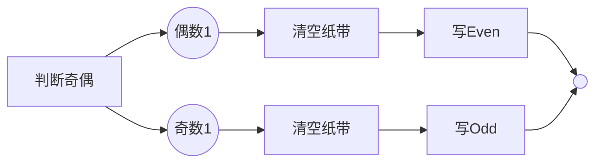
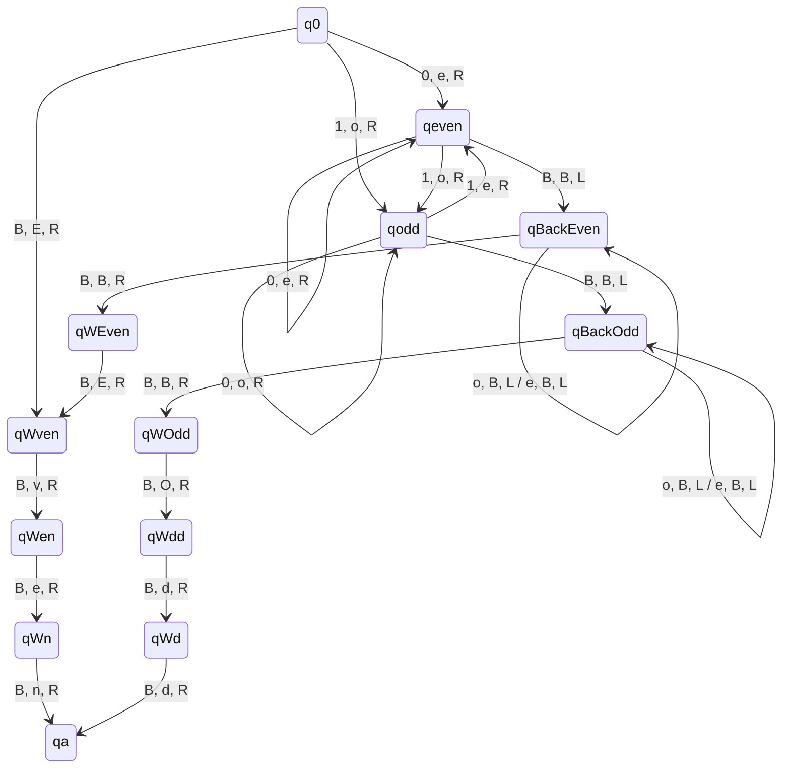
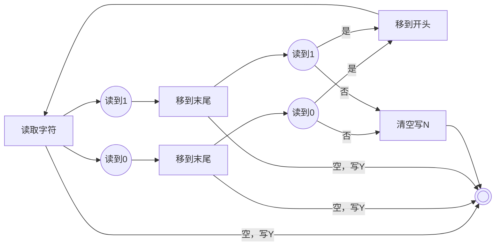

<!-- Page 1 -->

# 实验-计算机科学导论-课件4

# 图灵机-1

## 奇偶判定， 4位一进制加法器

大湾区大学

1

---

<!-- Page 2 -->

# 提纲

- 三周学习目的：实现模拟器，理解图灵机和非标量数据类型
  - 掌握图灵机基本概念 —— 4位一进制加法器（罗马计数法）
  - 实现初版图灵机模拟器，正确执行 —— 4位二进制加法器（位值计数法）
  - 改进图灵机模拟器，正确执行 —— 任意位二进制加法器
    - 解决有限状态问题
    - 改进编程风格、应对错误

- 本周学习目标
  - 初步掌握图灵机的基本概念，从而理解计算思维的状态机思路
    - 理解图灵机的状态转移解题思路
  - 正确描述并执行4位一进制加法器（下周课前提交）

---

<!-- Page 3 -->

# 图灵机-1 （4学时）

- 学时1: 掌握图灵机定义、简单示例、实验平台的使用、奇偶判断的例子
- 学时2: 掌握回文判断的例子
- 学时3: 尝试实现4位二进制加法（下周课前提交）
- 学时4: 交流4位二进制加法思路/实现方法

---

<!-- Page 4 -->

# 回顾：图灵机形式化定义

- 图灵机是一个七元组

  $$M=\{Q,\Sigma,\Gamma,\delta,q_0,q_{Accept},q_{Reject}\}$$

  - 状态集合 $Q$
  - 输入字母表 $\Sigma$
  - 带字母表 $\Gamma$：存在特殊字符 $B \in \Gamma$，表示空白符号，要求 $B \notin \Sigma$  
    且 $\Sigma \subset \Gamma$
  - 转移函数 $\delta:\ (Q-\{q_{Accept},q_{Reject}\})\times \Gamma \to Q\times \Gamma \times \{\to,\leftarrow\}$
  - 起始状态 $q_0 \in Q$
  - 接受状态 $q_{Accept} \in Q$
  - 拒绝状态 $q_{Reject} \in Q$

---

<!-- Page 5 -->

# 1. 图灵机

- 图灵机包含一个读写头、有限状态转移图（保存在有限状态控制器中）、无限长纸带
- 清空：把纸带上的所有符号均用空白符号（B）替换
  - 输入字符串要放到纸带上，左右两侧有空白符号B
  - 下图中是以@结尾的输入字符串

## 图示

### 图灵机结构

- 有限状态控制器
- 读写头
- 纸带

输入纸带：

| ... | B | 0 | 0 | 0 | 0 | 1 | 0 | 1 | @ | B | ... |
|---|---|---|---|---|---|---|---|---|---|---|---|

清空后纸带：

| ... | B | B | B | B | B | B | B | B | B | B | ... |
|---|---|---|---|---|---|---|---|---|---|---|---|

### 状态转移图

状态：$q_0, q_1$

转移：

- $q_0 \xrightarrow{@,B,\rightarrow} q_1$
- $q_0 \xrightarrow{0,B,\rightarrow} q_0$
- $q_0 \xrightarrow{1,B,\rightarrow} q_0$

---

<!-- Page 6 -->

# 图灵机

- 图灵机包含一个读写头、有限状态转移图（保存在有限状态控制器中）、无限长纸带

- 清空：把纸带上的所有符号均用空白符号（B）替换
  - 输入字符串要放到纸带上，左右两侧有空白符号B
  - 停机状态使用双圈

```text
          @,B,→
(q0) ───────────▶ ((q1))
 ↺
0,B,→
1,B,→
```

状态转移图

| 当前状态 | 读到的符号 | 写下的符号 | 读写头移动 | 下一状态 |
|---|---|---|---|---|
| $q_0$ | 0 | B | $\rightarrow$ | $q_0$ |
| $q_0$ | 1 | B | $\rightarrow$ | $q_0$ |
| $q_0$ | @ | B | $\rightarrow$ | $q_1$<br>(Halt) |

状态转移表

---

<!-- Page 7 -->

# 简单示例

- 判断一个 01 字符串中 “1” 的个数是否为偶数
  - 状态集合 $Q=\{q_{even},\ q_{odd},\ q_{accept},\ q_{reject}\}$
  - 输入字母表 $\Sigma=\{0,\ 1\}$
  - 带字母表 $\Gamma=\{0,\ 1,\ Y,\ N,\ B\}$
  - 转移函数 $\delta:\ (Q-\{q_{accept},\ q_{reject}\})\times\Gamma \to Q\times\Gamma\times\{\rightarrow,\ \leftarrow\}$
    - 见下一页
  - 起始状态 $q_0$
  - 接受状态 $q_{accept}$（可简写为 $q_a$）
  - 拒绝状态 $q_{reject}$（可简写为 $q_r$）

---

<!-- Page 8 -->

# 简单示例-转移函数

转移示意：

- 初始状态：$q_{\text{even}}$
- $q_{\text{even}} \xrightarrow{0/0,\rightarrow} q_{\text{even}}$
- $q_{\text{even}} \xrightarrow{1/1,\rightarrow} q_{\text{odd}}$
- $q_{\text{even}} \xrightarrow{B/Y,\rightarrow} q_{\text{accept}}$
- $q_{\text{odd}} \xrightarrow{0/0,\rightarrow} q_{\text{odd}}$
- $q_{\text{odd}} \xrightarrow{1/1,\rightarrow} q_{\text{even}}$
- $q_{\text{odd}} \xrightarrow{B/N,\rightarrow} q_{\text{reject}}$

> $0/0,\rightarrow$ 表示：  
> 读到 0 时，写 0 并右移读写头

| 当前状态 | 读到的符号 | 写下的符号 | 读写头移动 | 下一状态 |
|---|---|---|---|---|
| $q_{\text{even}}$ | 0 | 0 | $\rightarrow$ | $q_{\text{even}}$ |
| $q_{\text{even}}$ | 1 | 1 | $\rightarrow$ | $q_{\text{odd}}$ |
| $q_{\text{even}}$ | B | Y | $\rightarrow$ | $q_{\text{accept}}$ |
| $q_{\text{odd}}$ | 0 | 0 | $\rightarrow$ | $q_{\text{odd}}$ |
| $q_{\text{odd}}$ | 1 | 1 | $\rightarrow$ | $q_{\text{even}}$ |
| $q_{\text{odd}}$ | B | N | $\rightarrow$ | $q_{\text{reject}}$ |

---

<!-- Page 9 -->

# 在线模拟平台

## 状态转移图

```text
q0 -- 0,0,R --> q0
q0 -- 1,1,R --> q1
q1 -- 1,1,R --> q0
q1 -- 0,0,R --> q1
q0 -- B,E,R --> qa
q1 -- B,0,R --> qa
```

## 执行模拟

| 位置 | 0 | 1 | 2 | 3 | 4 | 5 | 6 | 7 | 8 | 9 | 10 | 11 | 12 | 13 | 14 | 15 | 16 | 17 | 18 | 19 |
|---|---|---|---|---|---|---|---|---|---|---|---|---|---|---|---|---|---|---|---|---|
| 磁带 | 0 | 0 | 1 | 0 | 1 | 1 | 0 | 1 | 1 | B | B | B | B | B | B | B | B | B | B | B |

当前步骤: 0　当前规则:　下一条规则:

```text
1  q0 0 0 R q0
2  q0 1 1 R q1
3  q0 B E R qa
4  q1 0 0 R q1
5  q1 1 1 R q0
6  q1 B 0 R qa
```

此处填入图灵机状态转移表

```text
001011011
```

| 按钮 |
|---|
| 设定机器 |
| 继续 |
| 调试 |
| 运行至结束 |
| << |
| Speed: 1.00 |
| >> |
| 获取状态转移图 |

## [在线模拟平台]

导航：首页　日程　作业　实验

### CS101 平台

在线图灵机模拟器

网址：https://turing.cs101.gbu.edu.cn

2025/9/20 16:51:59

9

---

<!-- Page 10 -->

# 实验平台

- 实验平台说明
  - 输入放到纸带上，非输入部分均为字母**B**
  - 两端无限长
  - 读写头最开始在输入字符串的最左边

- 停机判断
  - 移动步数超过10000步将视作不停机
  - 如果在某个输入上模拟超过了10000步，我们认为该图灵机在这个输入上不会停机

| 读写头 | ↓ |  |  |  |  |  |  |  |  |  |  |  |  |  |  |  |  |  |  |  |
|---|---|---|---|---|---|---|---|---|---|---|---|---|---|---|---|---|---|---|---|---|
| 纸带 | 1 | 1 | 1 | + | 1 | 1 | 1 | 1 | B | B | B | B | B | B | B | B | B | B | B | B |
| 下标 | 0 | 1 | 2 | 3 | 4 | 5 | 6 | 7 | 8 | 9 | 10 | 11 | 12 | 13 | 14 | 15 | 16 | 17 | 18 | 19 |

当前步数: 0　当前规则:　下一规则:

---

<!-- Page 11 -->

# <span style="color:#2b005e">实验平台</span>

- <span style="color:red">按钮说明</span>
  - <span style="color:red">设定机器：</span> 初始化图灵机，导入纸带数据和状态转移表
  - <span style="color:red">继续/暂停：</span> 在继续和暂停状态切换
  - <span style="color:red">调试：</span> 在暂停阶段，让图灵机根据当前规则执行下一步
  - <span style="color:red">运行至结束：</span> 跳过模拟阶段，直接显示图灵机运行结果
  - <span style="color:red">&lt;&lt;：</span> 减速图灵机模拟
  - <span style="color:red">&gt;&gt;：</span> 加速图灵机模拟
  - <span style="color:red">获取状态转移图：</span> 将当前规则绘制为状态转移图

```text
测试数据

[设定机器] [继续] [调试] [运行至结束] [<<] Speed: 1.00 [>>] [获取状态转移图]
```

11

---

<!-- Page 12 -->

# 实验平台： 如何使用?

- 只需提交状态转移表
  - 状态转移表为若干行
  - 每行只包含一条转移规则，格式如下：

    <span style="color:red">当前状态&nbsp;&nbsp;读到的符号&nbsp;&nbsp;写下的符号&nbsp;&nbsp;读写头移动&nbsp;&nbsp;下一状态</span>

    （中间是空格，如 **q0 0 0 R q0**）

  - 其中：
    - 当前状态/下一状态： 一个字符串。
      - 规定q0为起始状态，qa作为停机状态。
    - 读到的符号： 一个可见的 ASCII 字符， 表示读写头读到的符号。
    - 写下的符号： 一个可见的 ASCII字符， 表示读写头需要写下的符号。
    - 读写头移动： {L, R} 中的一个， L 表示读写头向左移一格， R 表示读写头向右移一格。  
      注意要用大写。
  - 符号大小写敏感
  - 本实验平台不含**qr**
  - <u>**不要有空行**</u>

---

<!-- Page 13 -->

# 实验平台： 如何使用？

- 图灵机以下**5**部分会由平台自动生成
  - 状态集合：$Q$ 根据状态转移生成，包含状态转移表“当前状态” / “下一状态”栏中所有出现过的状态。其中规定 $q0$ 为起始状态，$qa$ 为停机状态。
  - 带字母表：$\Gamma$ 规定为所有可见的 ASCII 字符的全体。
  - 输入字母表：$\Sigma$ 规定为 $\Gamma - \{B\}$，即集合 $\Gamma$ 去掉 $B$。
  - 起始状态：$q0$。
  - 接受状态：$qa$。
  - 本次实验不考虑拒绝状态：$qr$。

---

<!-- Page 14 -->

# 示例： 奇偶判断

- 奇偶判断
  - 判断一个 01 字符串中 “1” 个数是奇数还是偶数
  - 如果是偶数，则在纸带上写下 “Even”
  - 如果是奇数，则在纸带上写下 “Odd”



空纸带

---

<!-- Page 15 -->

# 奇偶判断：思路

- 状态转移图中的节点
  - 状态 qodd：表示在已经读到的字符串中，有奇数个“1”
  - 状态 qeven：表示在已经读到的字符串中，有偶数个“1”
  - 若读到“1”： qodd $\to$ qeven, qeven $\to$ qodd
  - 若读到“0”： qodd $\to$ qodd, qeven $\to$ qeven

- 状态转移图中的边
  - 以 qodd $\to$ qeven 为例

$\langle \text{qodd}, 1, e, R, \text{qeven} \rangle$

当前状态　读到的字符　写下的字符　移动　下一状态

状态转移图中可见的边标注：

- qodd $\to$ qodd：$0, o, R$
- qeven $\to$ qeven：$0, e, R$
- qodd $\to$ qeven：$1, e, R$
- qeven $\to$ qodd：$1, o, R$
- qeven $\to$ qodd：$B, B, L$

---

<!-- Page 16 -->

# 奇偶判断： 原理

- 循环： 使用4条规则处理任意长输入
  - 而不是使用无穷条规则，例如
    - qodd1→ qeven1, qeven2→qodd3, …

```text
qodd --1, e, R--> qeven
qeven --1, o, R--> qodd
qodd --0, o, R--> qodd
qeven --0, e, R--> qeven
qodd --B, B, L--> qBackOdd
qeven --B, B, L--> qBackEven
qBackOdd --o, B, L / e, B, L--> qBackOdd
qBackEven --o, B, L / e, B, L--> qBackEven
qBackOdd --B, B, R--> ...
```

- 读写头可以来回移动， 能够重复读纸带
  - qBackOdd: 整个字符串有Odd个1， 回到起始位置
  - qBackEven: 整个字符串有Even个1， 回到起始位置
  - qWOdd: 已在起始位置， 准备写字符串 “Odd”
  - qWEven: 已在起始位置， 准备写字符串 “Even”

注： 起始位置指输入字符串的首字母所在的位置.

---

<!-- Page 17 -->

# 奇偶判断： 状态转移图



qWOdd： 已在起始位置， 准备写字符串 “Odd”  
qWdd： 已写下 “O” ， 准备写字符串 “dd”  
qWd： 已写下 “Od” ， 准备写字符串 “d”

qWEven： 已在起始位置， 准备写字符串 “Even”  
qWven： 已写下 “E” ， 准备写字符串 “ven”  
qWen： 已写下 “Ev” ， 准备写字符串 “en”  
qWn： 已写下 “Eve” ， 准备写字符串 “n”

17

---

<!-- Page 18 -->

# 奇偶判断：状态转移图

## 状态转移

| 当前状态 | 读入 | 写入 | 移动 | 下一状态 |
|---|---|---|---|---|
| q0 | 0 | e | R | qeven |
| q0 | 1 | o | R | qodd |
| q0 | B | E | R | qWven |
| qodd | 0 | o | R | qodd |
| qodd | 1 | e | R | qeven |
| qodd | B | B | L | qBackOdd |
| qeven | 0 | e | R | qeven |
| qeven | 1 | o | R | qodd |
| qeven | B | B | L | qBackEven |
| qBackOdd | o | B | L | qBackOdd |
| qBackOdd | e | B | L | qBackOdd |
| qBackOdd | B | B | R | qWOdd |
| qBackEven | o | B | L | qBackEven |
| qBackEven | e | B | L | qBackEven |
| qBackEven | B | B | R | qWEven |
| qWOdd | B | O | R | qWdd |
| qWdd | B | d | R | qWd |
| qWd | B | d | R | qa |
| qWEven | B | E | R | qWven |
| qWven | B | v | R | qWen |
| qWen | B | e | R | qWn |
| qWn | B | n | R | qa |

## 状态说明

qWOdd: 已在起始位置，准备写字符串 “Odd”  
qWdd: 已写下 “O”，准备写字符串 “dd”  
qWd: 已写下 “Od”，准备写字符串 “d”

qWEven: 已在起始位置，准备写字符串 “Even”  
qWven: 已写下 “E”，准备写字符串 “ven”  
qWen: 已写下 “Ev”，准备写字符串 “en”  
qWn: 已写下 “Eve”，准备写字符串 “n”

## 图例

- 判断奇偶
- 清空纸带
- 写入结果

---

<!-- Page 19 -->

# 奇偶判断的状态转移规则（状态转移表）

# 共22行

|  |  |  |
|---|---|---|
| q0 1 o R qodd | qWven B v R qWen | qWOdd B O R qWdd |
| q0 0 e R qeven | qWen B e R qWn | qWdd B d R qWd |
| q0 B e R qWven | qWn B n R qa | qWd B d R qa |
|  |  |  |
| qodd 1 e R qeven | qBackOdd o B L qBackOdd | qWEven B E R qWven |
| qodd 0 o R qodd | qBackOdd e B L qBackOdd |  |
| qodd B B L qBackOdd | qBackOdd B B R qWOdd |  |
|  |  |  |
| qeven 1 o R qodd | qBackEven o B L qBackEven |  |
| qeven 0 e R qeven | qBackEven e B L qBackEven |  |
| qeven B B L qBackEven | qBackEven B B R qWEven |  |

---

<!-- Page 20 -->

# 奇偶判断的思考题

- 按照图灵机的定义，
  - 状态集 $Q=\{q0, qa, qodd, qeven, qBackEven, qWEven, qWven, qWen, qWn, qBackOdd, qWOdd, qWdd, qWd\}$
    - $|Q|=13$
  - 带字母表集 $\Gamma=\{0,1,B,e,o,n,d,v,E,O\}$
    - $|\Gamma|=10$
  - 转移函数 $\delta:\ (Q-\{q_a,q_r\})\times\Gamma \to Q\times\Gamma\times\{\to,\leftarrow\}$
    - 定义域决定了状态转移表的行数
    - 状态转移表应有 $|Q-\{q_a,q_r\}|\times|\Gamma|=12\times10=$ **120 行**
- 但我们设计的奇偶判断图灵机的状态转移表只有 **22行**！
- 我们设计的奇偶判断图灵机是错的吗？为什么？

---

<!-- Page 21 -->

# 奇偶判断的思考题：初步解答

- 对于任意状态， 可以忽略读写头不可能读到的字母。
  - 允许 $\delta$ 为偏函数， 可简化描述
- 例如
  - **q0:** 由于输入字母表是 $\{0,1\}$， 读写头只可能看到 $\{0,1,B\}$
    - 不可能看到 e,o,n,d,v,E,O
  - **qWEven:** 在读写头回到起始位置的过程中， 会把遇到的字母改写成 B， 因此 qWEven 只可能看到 $\{B\}$

| 起始状态 | 读入 | 写入 | 移动 | 目标状态 |
|---|---|---|---|---|
|  | B | B | L | qBackEven |
| qBackEven | o | B | L | qBackEven |
| qBackEven | e | B | L | qBackEven |
| qBackEven | B | B | R | qWEven |
| qWEven | B | E | R |  |

---

<!-- Page 22 -->

## 2. 回文判断

- 回文判断
  - 判断一个01字符串是否回文
  - 如果是回文，则在纸带上写下 **“Y”**
  - 如果不是回文，则在纸带上写下 **“N”**

---

<!-- Page 23 -->

# 示例

- 回文判断
  - 判断一个 `01` 字符串是否回文
  - 如果是回文，则在纸带上写下 “Y”
  - 如果不是回文，则在纸带上写下 “N”



蓝色：对比循环

---

<!-- Page 24 -->

# 回文判断： 思路

- **qSeen0**：字符串剩余部分的最左侧是 “0” 并右移至边界
- **qSeen1**：字符串剩余部分的最左侧是 “1” 并右移至边界
- **qWant0**：期望当前字符为 “0”
- **qWant1**：期望当前字符为 “1”
- **qBack**：读写头回到字符串剩余部分的最左侧

写空白符号 `B` 作为新边界

| 当前状态 | 读入 | 写入 | 移动 | 下一状态 |
|---|---|---|---|---|
| q0 | 0 | B | R | qSeen0 |
| q0 | 1 | B | R | qSeen1 |
| qSeen0 | 0 | 0 | R | qSeen0 |
| qSeen0 | 1 | 1 | R | qSeen0 |
| qSeen0 | B | B | L | qWant0 |
| qSeen1 | 0 | 0 | R | qSeen1 |
| qSeen1 | 1 | 1 | R | qSeen1 |
| qSeen1 | B | B | L | qWant1 |
| qWant0 | 0 | B | L | qBack |
| qWant1 | 1 | B | L | qBack |
| qBack | 0 | 0 | L | qBack |
| qBack | 1 | 1 | L | qBack |
| qBack | B | B | R | q0 |

---

<!-- Page 25 -->

# 回文判断： 原理

- 循环
  - 使用有限条规则处理任意长度的输入

- 读写头能来回移动、能做标记
  - 可以读纸带任意多次
  - 可以向纸带上写下符号（并赋予特定含义）
    - 写下标记符号 B，含义是“已看到边界”

      `q0,0,B,R,qSeen0`

      | 0 | 1 | 2 | 3 | 4 | 5 |
      |---|---|---|---|---|---|
      | B | 0 | 1 | 0 | 1 | 0 |

      ⟶

      | 0 | 1 | 2 | 3 | 4 | 5 |
      |---|---|---|---|---|---|
      | B | B | 1 | 0 | 1 | 0 |

- 隐含状态判断
  - 用当前状态和读到的符号作为判断条件，当该条件成立时
    - 写下一个符号，并转移到下一状态

---

<!-- Page 26 -->

# 回文判断的状态转移图

| 当前状态 | 读入 | 写入 | 移动 | 下一状态 |
|---|---|---|---|---|
| q0 | 0 | B | R | qSeen0 |
| q0 | 1 | B | R | qSeen1 |
| q0 | B | Y | L | qa |
| qSeen0 | 0 | 0 | R | qSeen0 |
| qSeen0 | 1 | 1 | R | qSeen0 |
| qSeen0 | B | B | L | qWant0 |
| qSeen1 | 0 | 0 | R | qSeen1 |
| qSeen1 | 1 | 1 | R | qSeen1 |
| qSeen1 | B | B | L | qWant1 |
| qWant0 | B | Y | L | qa |
| qWant0 | 1 | B | L | qBackErase |
| qWant0 | 0 | B | L | qBack |
| qWant1 | B | Y | L | qa |
| qWant1 | 0 | B | L | qBackErase |
| qWant1 | 1 | B | L | qBack |
| qBackErase | 0 | B | L | qBackErase |
| qBackErase | 1 | B | L | qBackErase |
| qBackErase | B | N | L | qa |
| qBack | 0 | 0 | L | qBack |
| qBack | 1 | 1 | L | qBack |
| qBack | B | B | R | q0 |

循环：q0 → qSeen0 → qWant0 → qBack → q0

26

---

<!-- Page 27 -->

# 回文判断的状态转移图

## 状态转移表

| 当前状态 | 读入 | 写入 | 移动 | 下一状态 |
|---|---:|---:|:---:|---|
| \(q0\) | \(0\) | \(B\) | \(R\) | \(qSeen0\) |
| \(q0\) | \(1\) | \(B\) | \(R\) | \(qSeen1\) |
| \(q0\) | \(B\) | \(Y\) | \(L\) | \(qa\) |
| \(qSeen0\) | \(0\) | \(0\) | \(R\) | \(qSeen0\) |
| \(qSeen0\) | \(1\) | \(1\) | \(R\) | \(qSeen0\) |
| \(qSeen0\) | \(B\) | \(B\) | \(L\) | \(qWant0\) |
| \(qSeen1\) | \(0\) | \(0\) | \(R\) | \(qSeen1\) |
| \(qSeen1\) | \(1\) | \(1\) | \(R\) | \(qSeen1\) |
| \(qSeen1\) | \(B\) | \(B\) | \(L\) | \(qWant1\) |
| \(qWant0\) | \(0\) | \(B\) | \(L\) | \(qBack\) |
| \(qWant0\) | \(1\) | \(B\) | \(L\) | \(qBackErase\) |
| \(qWant0\) | \(B\) | \(Y\) | \(L\) | \(qa\) |
| \(qWant1\) | \(0\) | \(B\) | \(L\) | \(qBackErase\) |
| \(qWant1\) | \(1\) | \(B\) | \(L\) | \(qBack\) |
| \(qWant1\) | \(B\) | \(Y\) | \(L\) | \(qa\) |
| \(qBackErase\) | \(0\) | \(B\) | \(L\) | \(qBackErase\) |
| \(qBackErase\) | \(1\) | \(B\) | \(L\) | \(qBackErase\) |
| \(qBackErase\) | \(B\) | \(N\) | \(L\) | \(qa\) |
| \(qBack\) | \(0\) | \(0\) | \(L\) | \(qBack\) |
| \(qBack\) | \(1\) | \(1\) | \(L\) | \(qBack\) |
| \(qBack\) | \(B\) | \(B\) | \(R\) | \(q0\) |

## 图中标注

- 做标记：将首字符或匹配字符写为 \(B\)。
- 循环：由 \(qBack\) 经 \(B,B,R\) 返回 \(q0\)。

---

<!-- Page 28 -->

# 回文判断的状态转移图

## 状态转移

| 当前状态 | 读入 | 写入 | 移动 | 下一状态 |
|---|---|---|---|---|
| `q0` | `0` | `B` | `R` | `qSeen0` |
| `q0` | `1` | `B` | `R` | `qSeen1` |
| `q0` | `B` | `Y` | `L` | `qa` |
| `qSeen0` | `0` | `0` | `R` | `qSeen0` |
| `qSeen0` | `1` | `1` | `R` | `qSeen0` |
| `qSeen0` | `B` | `B` | `L` | `qWant0` |
| `qSeen1` | `0` | `0` | `R` | `qSeen1` |
| `qSeen1` | `1` | `1` | `R` | `qSeen1` |
| `qSeen1` | `B` | `B` | `L` | `qWant1` |
| `qWant0` | `0` | `B` | `L` | `qBack` |
| `qWant0` | `1` | `B` | `L` | `qBackErase` |
| `qWant0` | `B` | `Y` | `L` | `qa` |
| `qWant1` | `0` | `B` | `L` | `qBackErase` |
| `qWant1` | `1` | `B` | `L` | `qBack` |
| `qWant1` | `B` | `Y` | `L` | `qa` |
| `qBackErase` | `0` | `B` | `L` | `qBackErase` |
| `qBackErase` | `1` | `B` | `L` | `qBackErase` |
| `qBackErase` | `B` | `N` | `L` | `qa` |
| `qBack` | `0` | `0` | `L` | `qBack` |
| `qBack` | `1` | `1` | `L` | `qBack` |
| `qBack` | `B` | `B` | `R` | `q0` |

## 图中标注

- 做标记
- 向回走
- 循环

---

<!-- Page 29 -->

# 回文判断的状态转移图

**qBackErase：** 读写头写下B，并回到字符串剩余部分的最左侧

## 状态转移图文字标注

### 状态

- `q0`
- `qSeen0`
- `qWant0`
- `qBackErase`
- `qBack`
- `qa`

### 转移标注

| 起始状态 | 读/写/移动 | 目标状态 |
|---|---|---|
| `q0` | `0, B, R` | `qSeen0` |
| `q0` | `B, Y, L` | `qa` |
| `qSeen0` | `0, 0, R` | `qSeen0` |
| `qSeen0` | `1, 1, R` | `qSeen0` |
| `qSeen0` | `B, B, L` | `qWant0` |
| `qWant0` | `B, Y, L` | `qa` |
| `qWant0` | `1, B, L` | `qBackErase` |
| `qWant0` | `0, B, L` | `qBackErase` |
| `qBackErase` | `0, B, L` | `qBackErase` |
| `qBackErase` | `1, B, L` | `qBackErase` |
| `qBackErase` | `B, N, L` | `qa` |
| `qBackErase` | `B, Y, L` | `qa` |
| `qBack` | `0, 0, L` | `qBack` |
| `qBack` | `1, 1, L` | `qBack` |

## 局部流程图文字

- 读取字符
- 读到0
- 读到1
- 移到末尾
- 读到0
- 读到1
- 空，写Y
- 清空写N
- 否
- 是
- 移到开头

蓝色：对比循环

29

---

<!-- Page 30 -->

# 课堂小测验

- 根据回文判断的状态转移图，完成回文判断的状态转移表并提交
  - 请在实验课下课前完成提交

## 状态转移图内容

| 当前状态 | 读入 | 写入 | 移动 | 下一状态 |
|---|---|---|---|---|
| `q0` | `0` | `B` | `R` | `qSeen0` |
| `q0` | `1` | `B` | `R` | `qSeen1` |
| `q0` | `B` | `Y` | `L` | `qa` |
| `qSeen0` | `0` | `0` | `R` | `qSeen0` |
| `qSeen0` | `1` | `1` | `R` | `qSeen0` |
| `qSeen0` | `B` | `B` | `L` | `qWant0` |
| `qSeen1` | `0` | `0` | `R` | `qSeen1` |
| `qSeen1` | `1` | `1` | `R` | `qSeen1` |
| `qSeen1` | `B` | `B` | `L` | `qWant1` |
| `qWant0` | `0` | `B` | `L` | `qBack` |
| `qWant0` | `1` | `B` | `L` | `qBackErase` |
| `qWant0` | `B` | `Y` | `L` | `qa` |
| `qWant1` | `0` | `B` | `L` | `qBackErase` |
| `qWant1` | `1` | `B` | `L` | `qBack` |
| `qWant1` | `B` | `Y` | `L` | `qa` |
| `qBackErase` | `0` | `B` | `L` | `qBackErase` |
| `qBackErase` | `1` | `B` | `L` | `qBackErase` |
| `qBackErase` | `B` | `N` | `L` | `qa` |
| `qBack` | `0` | `0` | `L` | `qBack` |
| `qBack` | `1` | `1` | `L` | `qBack` |
| `qBack` | `B` | `B` | `R` | `q0` |

[使用电脑的同学可点此链接](#)

30

---

<!-- Page 31 -->

# 3. 尝试实现4位一进制加法

- 一进制加法
  - $11 + 11 = ?$
  - $111 + 1111 = ?$

- 二进制加法
  - $1010 + 1 = ?$
  - $111 + 1111 = ?$

---

<!-- Page 32 -->

# 尝试实现4位一进制加法

- 一进制加法
  - $11 + 11 = ?$ 1111
  - $111 + 1111 = ?$ 1111111

- 二进制加法
  - $1010 + 1 = ?$ 1011
  - $111 + 1111 = ?$ 10110

---

<!-- Page 33 -->

# 四位一进制加法

- 设计一个可以完成**4**位一进制数加法的图灵机
- 格式要求：
  - **输入：** **(若干1)+(若干1)=**
    - 输入的“若干**1**”表示要做加法的一进制数，不超过**4**个**1**
    - <span style="color:red">可能是零个**1**</span>
  - **停机时纸带：** **…###=(若干1)B###…**
    - 停机时纸带上的“若干**1**”作为答案
    - 起始位置应为第一个 <span style="color:red">“=” 位置右侧一格</span>
    - <span style="color:red">其后必须紧随一个空白字符“**B**”</span>
    - **#** 为「 中任意字母

---

<!-- Page 34 -->

# 四位一进制加法

- 设计一个可以完成四位以内一进制数加法的图灵机
- 输入样例

| 位置 | 0 | 1 | 2 | 3 | 4 | 5 | 6 | 7 | 8 | 9 | 10 | 11 | 12 | 13 | 14 | 15 | 16 | 17 | 18 | 19 |
|---|---|---|---|---|---|---|---|---|---|---|---|---|---|---|---|---|---|---|---|---|
| 内容 | 1 | 1 | + | 1 | 1 | = | B | B | B | B | B | B | B | B | B | B | B | B | B | B |

- 正确输出样例 1

| 位置 | 0 | 1 | 2 | 3 | 4 | 5 | 6 | 7 | 8 | 9 | 10 | 11 | 12 | 13 | 14 | 15 | 16 | 17 | 18 | 19 |
|---|---|---|---|---|---|---|---|---|---|---|---|---|---|---|---|---|---|---|---|---|
| 内容 | 1 | 1 | + | 1 | 1 | = | 1 | 1 | 1 | 1 | B | B | B | B | B | B | B | B | B | B |

- 正确输出样例 2

| 位置 | 0 | 1 | 2 | 3 | 4 | 5 | 6 | 7 | 8 | 9 | 10 | 11 | 12 | 13 | 14 | 15 | 16 | 17 | 18 | 19 |
|---|---|---|---|---|---|---|---|---|---|---|---|---|---|---|---|---|---|---|---|---|
| 内容 | T | E | S | T | = | 1 | 1 | 1 | 1 | B | T | E | S | T | B | B | B | B | B | B |

**TEST** 可为图灵机程序字母表中除“=”外的任意字符

只判定第一个“=”之后到第一个B之间的输出

---

<!-- Page 35 -->

# 四位二进制加法

- 设计一个可以完成四位二进制数加法的图灵机
- 输入格式要求： （4位0或者1） + （4位0或者1） =
  - “（4位0或者1）” 表示要做加法的二进制数
- 输出格式要求（停机时纸带内容）： ####=（5位0或者1） B####
  - 停机时纸带上 “（5位0或者1）” 表示计算结果
  - 结果不足5位注意加**前导0**
  - 其必须放置在第一个 “=” 位置**右侧一格**
  - 其后必须**紧随一个空白字符** “B”
  - “#” 表示「」中的任意字符

---

<!-- Page 36 -->

# 四位二进制加法

- 设计一个可以完成四位二进制数加法的图灵机
- 输入样例

| 位置 | 0 | 1 | 2 | 3 | 4 | 5 | 6 | 7 | 8 | 9 | 10 | 11 | 12 | 13 | 14 | 15 | 16 | 17 | 18 | 19 |
|---|---|---|---|---|---|---|---|---|---|---|---|---|---|---|---|---|---|---|---|---|
| 符号 | 1 | 1 | 0 | 1 | + | 0 | 0 | 1 | 1 | = | B | B | B | B | B | B | B | B | B | B |

- 正确输出样例 1

| 位置 | 0 | 1 | 2 | 3 | 4 | 5 | 6 | 7 | 8 | 9 | 10 | 11 | 12 | 13 | 14 | 15 | 16 | 17 | 18 | 19 |
|---|---|---|---|---|---|---|---|---|---|---|---|---|---|---|---|---|---|---|---|---|
| 符号 | 1 | 1 | 0 | 1 | + | 0 | 0 | 1 | 1 | = | 1 | 0 | 0 | 0 | 0 | B | B | B | B | B |

- 正确输出样例 2

| 位置 | 0 | 1 | 2 | 3 | 4 | 5 | 6 | 7 | 8 | 9 | 10 | 11 | 12 | 13 | 14 | 15 | 16 | 17 | 18 | 19 |
|---|---|---|---|---|---|---|---|---|---|---|---|---|---|---|---|---|---|---|---|---|
| 符号 | T | E | S | T | = | 1 | 0 | 0 | 0 | 0 | B | T | E | S | T | B | B | B | B | B |

TEST 可为图灵机程序字母表中除 “=” 外的任意字符

---

<!-- Page 37 -->

# 任意位二进制加法

- 设计一个可以完成任意位二进制数加法的图灵机
- 输入格式要求： （若干位0或者1） + （若干位0或者1） =
  - 输入的若干位0或1中不含前导0
  - 每一个操作数的长度大于等于1
- 输出格式要求（停机时纸带内容）： ####=（若干位0或者1） B###
  - 停机时纸带上“（若干位0或者1）”表示计算结果
  - 结果不应含有**前导0**
  - 其必须放置在第一个“=”位置**右侧一格**
  - 其后必须**紧随一个空白字符**“B”
  - “#”表示 Γ 中的任意字符

---

<!-- Page 38 -->

# 任意位二进制加法

- 设计一个可以完成任意位二进制数加法的图灵机
- 输入样例

| 位置 | 0 | 1 | 2 | 3 | 4 | 5 | 6 | 7 | 8 | 9 | 10 | 11 | 12 | 13 | 14 | 15 | 16 | 17 | 18 | 19 |
|---|---|---|---|---|---|---|---|---|---|---|---|---|---|---|---|---|---|---|---|---|
| 内容 | 1 | 1 | + | 1 | 0 | 0 | 1 | = | B | B | B | B | B | B | B | B | B | B | B | B |

- 正确输出样例 1

| 位置 | 0 | 1 | 2 | 3 | 4 | 5 | 6 | 7 | 8 | 9 | 10 | 11 | 12 | 13 | 14 | 15 | 16 | 17 | 18 | 19 |
|---|---|---|---|---|---|---|---|---|---|---|---|---|---|---|---|---|---|---|---|---|
| 内容 | 1 | 1 | + | 1 | 0 | 0 | 1 | = | 1 | 1 | 0 | 0 | B | B | B | B | B | B | B | B |

- 正确输出样例 2

| 位置 | 0 | 1 | 2 | 3 | 4 | 5 | 6 | 7 | 8 | 9 | 10 | 11 | 12 | 13 | 14 | 15 | 16 | 17 | 18 | 19 |
|---|---|---|---|---|---|---|---|---|---|---|---|---|---|---|---|---|---|---|---|---|
| 内容 | T | E | S | T | = | 1 | 1 | 0 | 0 | B | T | E | S | T | B | B | B | B | B | B |

TEST 可为图灵机程序字母表中除 “=” 外的任意字符

---

<!-- Page 39 -->

# 尝试实现四位一进制加法

- 设计一个可以完成**4**位一进制数加法的图灵机
- 格式要求：
  - **输入：**（若干**1**）+（若干**1**）=
    - 输入的“若干**1**”表示要做加法的一进制数，不超过**4**个**1**
    - <span style="color:red">可能是零个**1**</span>
  - **停机时纸带：**...###=（若干**1**）B###...
    - 停机时纸带上的“若干**1**”作为答案
    - 起始位置应为第一个 <span style="color:red">“=” 位置右侧一格</span>
    - <span style="color:red">其后必须紧随一个空白字符“B”</span>
    - \# 为 $\Gamma$ 中任意字母

---

<!-- Page 40 -->

# 4. 交流讨论

- 交流你的解决方案/思路/遇到的困难

---

<!-- Page 41 -->

# 课程追求：珍惜时代、体认思维、学生走心、作品牵引

**李晓明 徐志伟 | 大湾区大学**