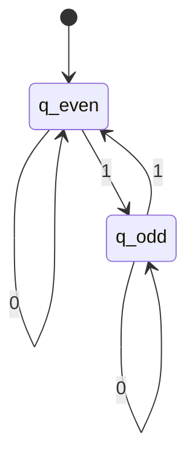
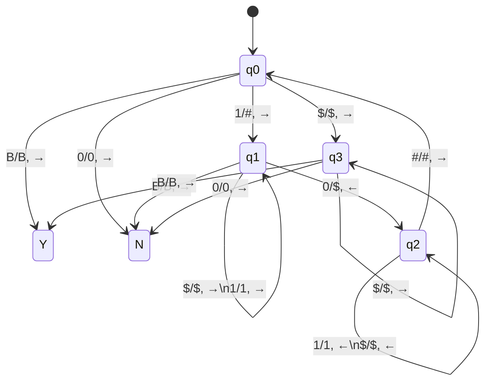

<!-- Page 1 -->

# 世界是状态机，其行为是状态变换序列  
## 每一步的状态变换，是从现有变量值生成新的变量值

Nature looks at variables, … then assign values on other variables.  
大自然观察变量值，…，然后为其他变量赋值

2012年的图灵奖演讲  
Judea Pearl（朱迪亚·珀尔），2011年图灵奖得主

## What variables? All variables!

哪些变量？宇宙中的所有变量

2018年海德堡论坛讲演  
Leslie Lamport（莱斯利·兰伯特），2013年图灵奖得主  
大家用的<span style="color:red">LaTeX</span>软件是他写的

## All of our knowledge is in our transition model.

我们所有的知识，都在我们的状态转移模型之中。  
2025年通用人工智能国际会议（AGI-2025）主旨报告  
Richard Sutton（理查德·萨顿），2024年图灵奖得主

---

<!-- Page 2 -->

# 计算机科学导论-课件4

# 逻辑思维-1

## 状态机的形式化——有限状态机、图灵机

## Acu-Exams

徐志伟（zxu@gbu.edu.cn 18910338695）  
大湾区大学 信息科学技术学院

2

---

<!-- Page 3 -->

# 提纲

- 第一单元回顾：
  - 在<span style="color:red">计算机</span>上自动执行的<span style="color:red">计算过程</span>
    - 计算机：冯诺依曼模型、笔记本电脑、云平台
    - 计算过程：**Python**程序、汇编程序、二进制可执行代码
  - 计算思维的ABC外部特性
  - 并不像数学一样形式化地严密

- 本单元<span style="color:red">形式化</span>精准地刻画计算机与计算过程
  - 从而严密地刻画计算过程的正确性与通用性
  - 本周：<span style="color:red">形式化</span>状态机
    - 有限状态自动机、图灵机
  - 下周：<span style="color:red">形式化</span>逻辑命题
    - 布尔逻辑（命题逻辑）、一阶逻辑
  - 第三周：<span style="color:red">形式化</span>自动计算的边界
    - 自动计算的能力和局限

## <span style="color:red">问题场景——最简通用计算机</span>

- 只有一条指令的通用计算机是什么？

## <span style="color:red">子场景——有限状态自动机</span>

- 最简处理器是什么？
  - 假设你的电脑没有内存和I/O
    - 只有处理器

## <span style="color:red">编程实验</span>

- 初识图灵机模拟器，并实现
  - 奇偶判定（判定问题）
  - **4位**二进制加法（计算问题）

课件中可能包含素材引用，特此致谢！

---

<!-- Page 4 -->

# 0. 要使计算现实，需要抽象它，找到本质

- 回顾第一周的诺德豪斯定律：自动执行催生**指数之妙**
  - 自动执行的 **ENIAC** 问世，其后算力随时间指数增长
- 指数增长的原因是什么？工程师和企业不断改进制造新的计算机？

**William Nordhaus**  
威廉·诺德豪斯  

耶鲁大学教授  
2018年诺贝尔经济学奖获得者

## 图：诺德豪斯定律

**图例：**

- ● 每秒运算数
- ■ 每度运算数
- ▲ 功耗（瓦）

**纵轴刻度：**

- \(1.E+24\)
- \(1.E+21\)
- \(1.E+18\)
- \(1.E+15\)
- \(1.E+12\)
- \(1.E+09\)
- \(1.E+06\)
- \(1.E+03\)
- \(1.E+00\)

**横轴年份：**

1850, 1946, 1957, 1964, 1976, 1985, 1995, 2005, 2014, 2022, 2040?, 20YY, ZZZZ

**标注：**

- ENIAC

> 假如没有自动执行的计算机革命  
> - 今天计算机速度仅为每秒万次运算（\(10^5\)），比实际情况慢了10万亿倍  
> - 21世纪文明不会出现

---

<!-- Page 5 -->

# 假如没有**CS**的抽象概念和抽象思维，会怎么样？

- 光靠工程师和企业家
  - 既不能实现10万亿倍的计算速度提升
  - 也不能实现计算机普及

| 图表元素 | 内容 |
|---|---|
| 图例 | ● 每秒运算数<br>■ 每度运算数<br>▲ 功耗（瓦） |
| 纵轴刻度 | 1.E+00, 1.E+03, 1.E+06, 1.E+09, 1.E+12, 1.E+15, 1.E+18, 1.E+21, 1.E+24 |
| 横轴刻度 | 1850, 1946, 1957, 1964, 1976, 1985, 1995, 2005, 2014, 2022, 2040?, 20YY, zzzz |
| 标注 | ENIAC |
| 标注 | 计算机科学和工程造就了10万亿倍提升 |

> IBM总裁华生（1945，据说）  
> **世界只需要五台计算机**
>
> 2025数据：全球拥有**100~200亿台**  
> 2050年预计：**万亿台**
>
> 包括  
> PCs  
> Smartphones  
> Servers  
> IoT devices

5

---

<!-- Page 6 -->

# 假如没有CS的抽象概念和抽象思维会怎么样？

- 不会有数字电路，更不会有百亿台计算机设备
- 不能精准刻画众多自动计算问题，更不会有计算机应用的繁荣

## 计算能力发展示意

图例：

- **黑色圆点实线**：每秒运算数
- **绿色方块实线**：每度运算数
- **红色三角实线**：功耗（瓦）

纵轴刻度：

- \(1.E+24\)
- \(1.E+21\)
- \(1.E+18\)
- \(1.E+15\)
- \(1.E+12\)
- \(1.E+09\)
- \(1.E+06\)
- \(1.E+03\)
- \(1.E+00\)

横轴年份：

| 年份 |
|---|
| 1850 |
| 1946 |
| 1957 |
| 1964 |
| 1976 |
| 1985 |
| 1995 |
| 2005 |
| 2014 |
| 2022 |
| 2040? |
| 20YY |
| ZZZZ |

标注：

- **ENIAC**：1946
- 计算机科学和工程造就了 **10万亿倍提升**

## 2025年9月全球市值最高的前14家公司

**9家是IT公司，包括大湾区的腾讯**

| 排名 | 公司 | 股票代码 | 市值 |
|---:|---|---|---:|
| 1 | NVIDIA | NVDA | \$4.154 T |
| 2 | Microsoft | MSFT | \$3.756 T |
| 3 | Apple | AAPL | \$3.538 T |
| 4 | Alphabet (Google) | GOOG | \$2.791 T |
| 5 | Amazon | AMZN | \$2.410 T |
| 6 | Meta Platforms (Facebook) | META | \$1.851 T |
| 7 | Saudi Aramco | 2222.SR | \$1.519 T |
| 8 | Broadcom | AVGO | \$1.422 T |
| 9 | TSMC | TSM | \$1.200 T |
| 10 | Berkshire Hathaway | BRK-B | \$1.081 T |
| 11 | Tesla | TSLA | \$1.077 T |
| 12 | JPMorgan Chase | JPM | \$823.57 B |
| 13 | Walmart | WMT | \$792.82 B |
| 14 | Tencent | TCEHY | \$699.69 B |

---

<!-- Page 7 -->

# 1. 理论研究的**极简化**思想：精简冯诺依曼模型，得到图灵机

## ① 去多

- 忽略非必要的因素
  - 去除 I/O 部件
    - 只考虑批式计算  
      Batch Processing

## 存储器

每个地址存放 1 字节

| 地址 | 内容 |
|---|---|
| 0x00000000 | 系统软件 |
| 0x00000001 | 系统软件 |
| 0x00000002 | 系统软件 |
| 0x00000003 | 系统软件 |
|  |  |
| 0x0F002000 | 程序：`01001000` `#48` |
| 0x0F002001 | `10000011` `#83` |
| 0x0F002002 | `11101100` `#EC` |
| 0x0F002003 | `00001000` `#08` |
| 0x0F002004 | `01001000` `#48` |
| 0x0F002005 | `10001011` `#8B` |
| 0x0F002006 | `00000101` `#05` |
| 0x0F002007 | `11000101` `#C5` |
| 0x0F002008 | `00111111` `#3F` |
| 0x0F002009 | `00000010` `#02` |
| 0x0F00200a | `00000000` `#00` |
| 0x0F00200b |  |
|  |  |
|  | 数据 |
| 0xFFFFFFFE |  |
| 0xFFFFFFFF |  |

## 处理器

具备指令集  
有多条指令

- 运算器
- 寄存器
- 控制器

## I/O 部件

（去除）

---

<!-- Page 8 -->

# 精简冯诺依曼模型，得到图灵机

## ① 去多

- 忽略非必要的因素
  - 去除 I/O 部件
    - 只考虑批式计算  
      Batch Processing
- 最小化必要因素
  - 最小化存储器
    - 极端情况：  
      **每个地址存放 1 比特**  
      **有效数（0 或 1），**  
      **或空白符 Blank**
    - 访问方式改变：读写头移动

## 存储器

每个地址存放 1 字节

| 地址 | 内容 |
|---|---|
| 0x00000000 | 系统软件 |
| 0x00000001 | 系统软件 |
| 0x00000002 | 系统软件 |
| 0x00000003 | 系统软件 |
|  |  |
| 0x0F002000 | 程序：`01001000` `#48` |
| 0x0F002001 | `10000011` `#83` |
| 0x0F002002 | `11101100` `#EC` |
| 0x0F002003 | `00001000` `#08` |
| 0x0F002004 | `01001000` `#48` |
| 0x0F002005 | `10001011` `#8B` |
| 0x0F002006 | `00000101` `#05` |
| 0x0F002007 | `11000101` `#C5` |
| 0x0F002008 | `00111111` `#3F` |
| 0x0F002009 | `00000010` `#02` |
| 0x0F00200a | `00000000` `#00` |
| 0x0F00200b |  |
|  |  |
|  | 数据 |
|  |  |
| 0xFFFFFFFE |  |
| 0xFFFFFFFF |  |

## 处理器

具备指令集  
有多条指令

- 运算器
- 寄存器
- 控制器

## 纸带（Tape）

读写头指向地址 `0`。

| ... | B | 1 | 1 | 0 | B | ... | 格子 |
|---|---|---|---|---|---|---|---|
| ... | -1 | 0 | 1 | 2 | 3 | ... | 地址 |

---

<!-- Page 9 -->

# 精简冯诺依曼模型，得到图灵机

## ① 去多

- 忽略非必要的因素
  - 去除 I/O 部件
    - 只考虑批式计算  
      Batch Processing

- 最小化必要因素
  - 最小化存储器
    - 极端情况：
      **每个地址存放 1 比特有效数（0 或 1），或空白符 Blank**
    - 访问方式改变：读写头移动
  - 最小化处理器
    - **有限状态控制器仅一条指令**  
      按状态转移图做一次转移

## 存储器

每个地址存放 **1 字节**

| 地址 | 内容 |
|---|---|
| 0x00000000 | 系统软件 |
| 0x00000001 | 系统软件 |
| 0x00000002 | 系统软件 |
| 0x00000003 | 系统软件 |
|  |  |
| 0x0F002000 | `01001000` `#48` |
| 0x0F002001 | `10000011` `#83` |
| 0x0F002002 | `11101100` `#EC` |
| 0x0F002003 | `00001000` `#08` |
| 0x0F002004 | `01001000` `#48` |
| 0x0F002005 | `10001011` `#8B` |
| 0x0F002006 | `00000101` `#05` |
| 0x0F002007 | `11000101` `#C5` |
| 0x0F002008 | `00111111` `#3F` |
| 0x0F002009 | `00000010` `#02` |
| 0x0F00200a | `00000000` `#00` |
| 0x0F00200b |  |
|  | 数据 |
| 0xFFFFFFFE |  |
| 0xFFFFFFFF |  |

## 处理器

具备指令集  
有多条指令

- 运算器
- 寄存器
- 控制器

## 判定一个 0/1 字符串是否包含偶数个 1

### 状态转移图 State Transition Diagram

| 当前状态 | 读入 | 下一状态 |
|---|---:|---|
| $q_{\mathrm{even}}$ | 0 | $q_{\mathrm{even}}$ |
| $q_{\mathrm{even}}$ | 1 | $q_{\mathrm{odd}}$ |
| $q_{\mathrm{odd}}$ | 0 | $q_{\mathrm{odd}}$ |
| $q_{\mathrm{odd}}$ | 1 | $q_{\mathrm{even}}$ |

## 有限状态控制器

读写头

| ... | B | 1 | 1 | 0 | B | ... | 格子 |
|---|---|---|---|---|---|---|---|
| ... | -1 | 0 | 1 | 2 | 3 | ... | 地址 |

**纸带（Tape）**

9

---

<!-- Page 10 -->

# 精简冯诺依曼模型，得到图灵机

## ① 去多

- 忽略非必要的因素
  - 去除 I/O 部件
    - 只考虑批式计算  
      Batch Processing
- 最小化必要因素
  - 最小化存储器
    - 极端情况：  
      每个地址存放 1 比特  
      有效数（0 或 1），  
      或空白符 Blank
    - 访问方式改变：读写头移动
  - 最小化处理器
    - 有限状态控制器仅一条指令  
      按状态转移图做一次转移

## ② 破少

- 破除非必要的限制
  - 存储器可有无穷地址

---

## 存储器

**每个地址存放 1 字节**

| 地址 | 内容 |
|---|---|
| 0x00000000 | 系统软件 |
| 0x00000001 | 系统软件 |
| 0x00000002 | 系统软件 |
| 0x00000003 | 系统软件 |
|  |  |
| 0x0F002000 | 01001000 &nbsp;&nbsp; #48 |
| 0x0F002001 | 10000011 &nbsp;&nbsp; #83 |
| 0x0F002002 | 11101100 &nbsp;&nbsp; #EC |
| 0x0F002003 | 00001000 &nbsp;&nbsp; #08 |
| 0x0F002004 | 01001000 &nbsp;&nbsp; #48 |
| 0x0F002005 | 10001011 &nbsp;&nbsp; #8B |
| 0x0F002006 | 00000101 &nbsp;&nbsp; #05 |
| 0x0F002007 | 11000101 &nbsp;&nbsp; #C5 |
| 0x0F002008 | 00111111 &nbsp;&nbsp; #3F |
| 0x0F002009 | 00000010 &nbsp;&nbsp; #02 |
| 0x0F00200a | 00000000 &nbsp;&nbsp; #00 |
| 0x0F00200b | 程序 |
|  |  |
|  | 数据 |
|  |  |
| 0xFFFFFFFE |  |
| 0xFFFFFFFF |  |

---

## 处理器

具备指令集，有多条指令：

- 运算器
- 寄存器
- 控制器

---

## 判定一个 0/1 字符串是否包含偶数个 1



状态转移图 State Transition Diagram

---

## 有限状态控制器与纸带

```text
有限
状态
控制器
  ↓ 读写头

... | B | 1 | 1 | 0 | B | ...
...  -1   0   1   2   3  ... 地址
```

格子

**两端可无限延伸** 的纸带（Tape）

---

<!-- Page 11 -->

# 状态转移图也可写成状态转移表

## 并有若干约定

- 初始状态
  - 纸带（无穷个格子）
    - 放入输入符号串，其它格子都是空白符 **B**
  - 读写头
    - 指向第 1 个输入符号
    - 若输入符号串为空，指向 **B**
  - 有限状态控制器
    - 存储着状态转移图，或等价的状态转移表
    - 无标签箭头指向初始状态

- 自动机行为
  - 反复执行一条指令，直至停机
    - 根据构象，即（当前状态，当前符号），执行相应的 3 个动作，即  
      写符号、右移或左移、进入下一状态
  - 如，\(\bigl((q_{\mathrm{odd}},0),(0,\rightarrow,q_{\mathrm{odd}})\bigr)\)

当前状态，当前符号，写符号，移动，下一状态

构象（**configuration**）

---

## 判定问题：答案是 **Yes** 或 **No** 的问题

实例：判定一个 0/1 字符串是否包含偶数个 1

### 状态转移图 State Transition Diagram

```text
初始 → q_even

q_even --0--> q_even
q_even --1--> q_odd

q_odd  --0--> q_odd
q_odd  --1--> q_even
```

---

## 状态转移表 State Transition Table

此例中，绿框部分可忽略掉  
完整的构象还包括读写头位置和纸带内容

| 当前状态 | 当前符号 | 写操作 | 读写头移动 | 下一状态 |
|---|---:|---|---|---|
| \(q_{\mathrm{even}}\) | 0 | 0 | 右移 | \(q_{\mathrm{even}}\) |
| \(q_{\mathrm{even}}\) | 1 | 1 | 右移 | \(q_{\mathrm{odd}}\) |
| \(q_{\mathrm{even}}\) | B | Y (Yes) | 右移 | 停机 |
| \(q_{\mathrm{odd}}\) | 0 | 0 | 右移 | \(q_{\mathrm{odd}}\) |
| \(q_{\mathrm{odd}}\) | 1 | 1 | 右移 | \(q_{\mathrm{even}}\) |
| \(q_{\mathrm{odd}}\) | B | N (No) | 右移 | 停机 |

---

```text
有限
状态
控制器
  │
  │ 读写头
  ▼
┌───┬───┬───┬───┬───┐
│ B │ 1 │ 1 │ 0 │ B │ ... 格子
└───┴───┴───┴───┴───┘
 -1   0   1   2   3   ... 地址
```

两端可无限延伸的纸带（**Tape**）

```text
有限
状态
控制器
  │
  │ 读写头
  ▼
┌───┬───┬───┬───┬───┐
│ B │ 1 │ 1 │ 0 │ B │ ... 格子
└───┴───┴───┴───┴───┘
 -1   0   1   2   3   ... 地址
```

两端可无限延伸的纸带（**Tape**）

---

<!-- Page 12 -->

# 2. 本例是<span style="color:red">确定性有限自动机</span>，是简化版的图灵机

## Deterministic Finite Automaton (DFA)

- 自动机的描述
  - 给定 DFA 的状态转移图，或状态转移表
    - 无标签箭头指向初始状态
    - 双圈标记接受状态 $q_{\text{even}}$
  - 给定输入符号串，如 110

## 判定问题：答案是 **Yes** 或 **No** 的问题

实例：判定一个 0/1 字符串是否包含偶数个 1

### 状态转移图

- 初始状态：$q_{\text{even}}$
- 接受状态：$q_{\text{even}}$
- 转移：
  - $q_{\text{even}} \xrightarrow{0} q_{\text{even}}$
  - $q_{\text{even}} \xrightarrow{1} q_{\text{odd}}$
  - $q_{\text{odd}} \xrightarrow{0} q_{\text{odd}}$
  - $q_{\text{odd}} \xrightarrow{1} q_{\text{even}}$

输入符号串 110

### 状态转移表

| 当前状态 | 当前符号 | 下一状态 |
|---|---:|---|
| $q_{\text{even}}$ | 0 | $q_{\text{even}}$ |
| $q_{\text{even}}$ | 1 | $q_{\text{odd}}$ |
| $q_{\text{odd}}$ | 0 | $q_{\text{odd}}$ |
| $q_{\text{odd}}$ | 1 | $q_{\text{even}}$ |

---

<!-- Page 13 -->

# DFA的行为

- 从左到右逐字符扫描输入字符串
  - 根据当前状态与当前符号，进入下一状态
- 扫描完输入字符串，停机
  - 如处于接受状态，判定 **Yes**（接受）
  - 如处于非接受状态，判定 **No**（拒绝）

## 判定问题：答案是 Yes 或 No 的问题

实例：判定一个 0/1 字符串是否包含偶数个 1

## 状态转移图

输入符号串 **110**


## 状态转移表

| 当前状态 | 当前符号 | 下一状态 |
|---|---:|---|
| $q_{\text{even}}$ | 0 | $q_{\text{even}}$ |
| $q_{\text{even}}$ | 1 | $q_{\text{odd}}$ |
| $q_{\text{odd}}$ | 0 | $q_{\text{odd}}$ |
| $q_{\text{odd}}$ | 1 | $q_{\text{even}}$ |

## 初始构象

### 构象 0

状态 = $q_{\text{even}}$  
符号 = 1  
输入串 **1**10


## 第 1 步

$\bigl((q_{\text{even}}, 1), q_{\text{odd}}\bigr)$

### 构象 1

状态 = $q_{\text{odd}}$  
符号 = 1  
输入串 1**1**0


## 第 2 步

$\bigl((q_{\text{odd}}, 1), q_{\text{even}}\bigr)$

### 构象 2

状态 = $q_{\text{even}}$  
符号 = 0  
输入串 11**0**


## 第 3 步

$\bigl((q_{\text{even}}, 0), q_{\text{even}}\bigr)$

## 终止构象

### 构象 3

停机在 $q_{\text{even}}$ 接受状态  
已扫描完字符串


13

---

<!-- Page 14 -->

# 奇偶判定自动机：设计思路

## ① 确定状态

- $q_{\text{even}}$：到目前为止 $1$ 的个数是偶数
- $q_{\text{odd}}$：到目前为止 $1$ 的个数是奇数
- 起始状态是 $q_{\text{even}}$
  - 起始时只扫描了空字符串
- 接受状态是 $q_{\text{even}}$
- 拒绝状态是 $q_{\text{odd}}$

## ② 确定扫描输入字符串的行为

- 在 $q_{\text{even}}$ 状态时
  - 扫描到符号 $0$，偶数，保持在此状态 $q_{\text{even}}$；扫描到符号 $1$，奇数，进入状态 $q_{\text{odd}}$
- 在 $q_{\text{odd}}$ 状态时
  - 扫描到符号 $0$，奇数，保持在此状态 $q_{\text{odd}}$；扫描到符号 $1$，偶数，进入状态 $q_{\text{even}}$
- 扫描完输入字符串时，如果在 $q_{\text{even}}$，接受；否则拒绝

## 判定问题

答案是 **Yes** 或 **No** 的问题

实例：判定一个 $0/1$ 字符串是否包含偶数个 $1$

## 状态转移图


输入符号串 $110$

## 状态转移表

| 当前状态 | 当前符号 | 下一状态 |
|---|---:|---|
| $q_{\text{even}}$ | $0$ | $q_{\text{even}}$ |
| $q_{\text{even}}$ | $1$ | $q_{\text{odd}}$ |
| $q_{\text{odd}}$ | $0$ | $q_{\text{odd}}$ |
| $q_{\text{odd}}$ | $1$ | $q_{\text{even}}$ |

---

<!-- Page 15 -->

# 奇偶判定自动机三种行为例子

## 自动机行为

- 从左到右逐字符扫描输入字符串
  - 根据当前状态与当前符号，进入下一状态
- 扫描完输入字符串，停机
  - 如处于接受状态，判定 Yes（接受）
  - 如处于非接受状态，判定 No（拒绝）

## 判定问题：答案是 Yes 或 No 的问题

实例：判定一个 0/1 字符串是否包含偶数个 1


**状态转移图**

### 状态转移表

| 当前状态 | 当前符号 | 下一状态 |
|---|---:|---|
| $q_{\text{even}}$ | 0 | $q_{\text{even}}$ |
| $q_{\text{even}}$ | 1 | $q_{\text{odd}}$ |
| $q_{\text{odd}}$ | 0 | $q_{\text{odd}}$ |
| $q_{\text{odd}}$ | 1 | $q_{\text{even}}$ |

## 例 1：输入符号串为 110

包含偶数个 1，接受

- 第 1 步：$((q_{\text{even}}, 1), q_{\text{odd}})$  
  即，在状态 $q_{\text{even}}$ 扫描到 1，进入 $q_{\text{odd}}$，继续扫描
- 第 2 步：$((q_{\text{odd}}, 1), q_{\text{even}})$；继续扫描
- 第 3 步：$((q_{\text{even}}, 0), q_{\text{even}})$；扫描完，接受

## 例 2：输入符号串 1，行为如下

包含奇数个 1，拒绝

- 第 1 步：$((q_{\text{even}}, 1), q_{\text{odd}})$；扫描完，拒绝

## 例 3：输入字符串为空串，立即接受

包含偶数个 1，不用扫描即接受

- 0 个 1，也是偶数个 1

---

<!-- Page 16 -->

# 确定性有限**自动机**的形式化定义

- 确定性有限自动机是五元组 \((Q, \Sigma, \delta, q_0, Q_{\text{accept}})\)
  - **有限**状态集合 \(Q\)  
    \(= \{q_{\text{even}}, q_{\text{odd}}\}\)
  - **有限**输入字母表 \(\Sigma\)  
    \(= \{0, 1\}\)
  - 转移函数 \(\delta: Q \times \Sigma \to Q\)  
    状态转移图或状态转移表
  - 起始状态 \(q_0 \in Q\)  
    \(= q_{\text{even}}\)
  - 终止状态集 \(Q_{\text{accept}} \subseteq Q\)  
    \(= \{q_{\text{even}}\}\)

- 确定性有限自动机（DFA）的行为
  - 无标签箭头指向初始状态，双圈标记接受状态
  - 从左到右逐字符扫描输入字符串（如 110）
    - 根据当前状态与当前符号，进入下一状态
  - 扫描完输入字符串，停机
    - 如处于接受状态，判定 Yes（接受）
    - 如处于非接受状态，判定 No（拒绝）

- 总体行为效果：自动机 \(M\) 识别的语言，记为 \(L(M)\)
  - 如字符串 \(s\) 被 \(M\) 接受，也称 \(s\) 被 \(M\) 识别
  - \(L(M)=\) 所有被自动机 \(M\) 识别的字符串的集合

# 奇偶判定自动机实例

状态转移：

- 初始状态：\(q_{\text{even}}\)
- 接受状态：\(q_{\text{even}}\)
- 转移：
  - \(q_{\text{even}} \xrightarrow{0} q_{\text{even}}\)
  - \(q_{\text{even}} \xrightarrow{1} q_{\text{odd}}\)
  - \(q_{\text{odd}} \xrightarrow{0} q_{\text{odd}}\)
  - \(q_{\text{odd}} \xrightarrow{1} q_{\text{even}}\)

| 当前状态 | 当前符号 | 下一状态 |
|---|---|---|
| \(q_{\text{even}}\) | 0 | \(q_{\text{even}}\) |
| \(q_{\text{even}}\) | 1 | \(q_{\text{odd}}\) |
| \(q_{\text{odd}}\) | 0 | \(q_{\text{odd}}\) |
| \(q_{\text{odd}}\) | 1 | \(q_{\text{even}}\) |

## 奇偶判定自动机的行为

**输入字符串 110；** 起始状态为 \(q_{\text{even}}\)，初始字符为 1

1. \((q_{\text{even}}, 1) \to q_{\text{odd}}\)；扫描下一字符
2. \((q_{\text{odd}}, 1) \to q_{\text{even}}\)；扫描下一字符
3. \((q_{\text{even}}, 0) \to q_{\text{even}}\)；字符串扫描完结，接受

**输入字符串 111；** 起始状态为 \(q_{\text{even}}\)，初始字符为 1

1. \((q_{\text{even}}, 1) \to q_{\text{odd}}\)；扫描下一字符
2. \((q_{\text{odd}}, 1) \to q_{\text{even}}\)；扫描下一字符
3. \((q_{\text{even}}, 1) \to q_{\text{odd}}\)；字符串扫描完结，拒绝

**输入字符串为空；** 起始状态为 \(q_{\text{even}}\)，无初始字符  
字符串扫描完结，接受

本自动机识别的语言：奇偶值为偶的 0/1 字符串

---

<!-- Page 17 -->

# 下列自动机接受什么语言？

- 写出它们的五元组
- 什么是 $M$ 的行为？什么是 $L(M)$？
  - 给出直观的（非形式化的）回答
  - 给出精确的（形式化的）回答

| 自动机 | 图示描述 |
|---|---|
| $M_1$ | 初始状态 $q$，非接受状态；在 $0$ 上自环 |
| $M_2$ | 初始状态 $q$，接受状态；在 $0$ 上自环 |
| $M_3$ | 初始状态 $q$，非接受状态；在 $0,1$ 上自环 |
| $M_4$ | 初始状态 $q$，接受状态；在 $0,1$ 上自环 |

---

## $M_3$

初始状态 $q$，非接受状态；在 $0,1$ 上自环。

| 当前状态 | 当前符号 | 下一状态 |
|---|---|---|
| q | 0 | q |
| q | 1 | q |

**五元组** $(Q,\Sigma,\delta,q_0,Q_{\text{accept}})$

$Q=\{q\};\quad \Sigma=\{0,1\};\quad \delta:Q\times\Sigma\to Q$ 如上图表

$q_0=q;\quad Q_{\text{accept}}=\varnothing$

自动机 $M_3$ 拒绝任何长度的 0/1 字符串  
它不识别任何非空语言，$L(M_3)=\varnothing$，是空集

---

## $M_4$

初始状态 $q$，接受状态；在 $0,1$ 上自环。

| 当前状态 | 当前符号 | 下一状态 |
|---|---|---|
| q | 0 | q |
| q | 1 | q |

**五元组**

$Q=\{q\};\quad \Sigma=\{0,1\};\quad \delta:Q\times\Sigma\to Q$ 如上图表

$q_0=q;\quad Q_{\text{accept}}=\{q\}$

自动机 $M_4$ 接受任何长度的 0/1 字符串  
它识别的语言是

$L(M_4)=\{(0\ \text{or}\ 1)^n\mid n\ge 0\}=\{0,1\}^*$

注意：克莱尼星号（**Kleene star**）操作符

$L(M_4)$ 包含下列元素：

1. 空串
2. 任意自然数的二进制表示，如 5 的二进制表示 101
3. 上述元素加任意有限个前缀 0，如 0101，00101

---

<!-- Page 18 -->

# 3. 图灵机的形式化定义

- 图灵机是一个七元组 $(Q, \Sigma, \Gamma, \delta, q_0, q_{accept}, q_{reject})$  
  其中 $Q, \Sigma, \Gamma$ 是**有限**集合
- 状态集合 $Q$
- 输入字母表 $\Sigma$
  - $\Sigma$ 不包括空白符，即 $B \notin \Gamma$；空白符记为 $B$
- 纸带字母表 $\Gamma$
  - $\Gamma$ 必包含 $\Sigma$ 且包括空白符，即 $\Sigma \subset \Gamma,\ B \in \Gamma$
- 转移函数 $\delta: (Q - \{q_{accept}, q_{reject}\}) \times \Gamma \to \Gamma \times \{\to, \leftarrow\} \times Q$
  - 定义**图灵机的单条指令**：根据构象执行三动作，产生新构象
- 起始状态 $q_0 \in Q$
- 终止状态（注意 $q_{reject} \ne q_{accept}$）
  - 接受状态 $q_{accept} \in Q$
  - 拒绝状态 $q_{reject} \in Q$

转移函数形式化定义图灵机的指令  
即，根据构象执行三动作

数学中，$\delta$ 常用于标记系统变化  
delta

**理解创新的常见问题：what’s the delta?**

图灵机用 $\delta$ 标记自动机构象变化  
这就是转移函数的作用

当处于终止状态时，自动机停机，不  
会再发生状态转移产生新构象，因此  
$\delta$ 无定义

---

<!-- Page 19 -->

# 图灵机的形式化定义

- 图灵机是一个七元组  
  \[
  (Q, \Sigma, \Gamma, \delta, q_0, q_{accept}, q_{reject})
  \]  
  其中 \(Q, \Sigma, \Gamma\) 是**有限**集合

- 状态集合 \(Q\)  
  \[
  = \{q_{even}, q_{odd}, q_{accept}, q_{reject}\}
  \]

- 输入字母表 \(\Sigma\)  
  \[
  = \{0, 1\}
  \]
  - \(\Sigma\) 不包括空白符，即 \(B \notin \Sigma\)

- 带字母表 \(\Gamma\)  
  \[
  = \{0, 1, B\}
  \]
  - \(\Gamma\) 必包含 \(\Sigma\) 且包括空白符，  
    即 \(\Sigma \subset \Gamma,\ B \in \Gamma\)

- 转移函数  
  \[
  \delta: (Q - \{q_{accept}, q_{reject}\}) \times \Gamma
  \to \Gamma \times \{\to, \leftarrow\} \times Q
  \]

- 起始状态 \(q_0 \in Q\)  
  \[
  q_{even}
  \]

- 终止状态（状态转移图中的双圈）
  - 接受状态 \(q_{accept} \in Q\)  
    \[
    q_{accept}
    \]
  - 拒绝状态 \(q_{reject} \in Q\)  
    \[
    q_{reject}
    \]
    - 且有 \(q_{reject} \ne q_{accept}\)

## 奇偶判定图灵机实例

### 状态转移图或状态转移表

状态转移关系：

- \(q_{even}\)：
  - \(0/0,\to \rightarrow q_{even}\)
  - \(1/1,\to \rightarrow q_{odd}\)
  - \(B/Y,\to \rightarrow q_{accept}\)

- \(q_{odd}\)：
  - \(0/0,\to \rightarrow q_{odd}\)
  - \(1/1,\to \rightarrow q_{even}\)
  - \(B/N,\to \rightarrow q_{reject}\)

| 当前状态 | 当前符号 | 写操作 | 读写头移动 | 下一状态 |
|---|---:|---:|---|---|
| \(q_{even}\) | 0 | 0 | 右移 | \(q_{even}\) |
| \(q_{even}\) | 1 | 1 | 右移 | \(q_{odd}\) |
| \(q_{even}\) | B | Y | 右移 | \(q_{accept}\) |
| \(q_{odd}\) | 0 | 0 | 右移 | \(q_{odd}\) |
| \(q_{odd}\) | 1 | 1 | 右移 | \(q_{even}\) |
| \(q_{odd}\) | B | N | 右移 | \(q_{reject}\) |

---

<!-- Page 20 -->

# 示例：给定输入111···11000···00，判断1和0的个数是否相等

- 即，给定输入字符串 $1^m0^n$，判断 $m=n$ 是否成立
  - 给定110，不成立，拒绝；给定1100，成立，接受
- 设计思路：将1和0配对，成功则接受，否则拒绝
  - $q_0$ 表示扫描过的字符串1和0已配对（空字符串也满足配对要求）
    - 读到0，直接拒绝；读到空字符B，直接接受
    - 读到1时，写#（抹去1），右移，进入 $q_1$
    - 读到\$时，写\$，右移，进入 $q_3$
  - $q_1$ 表示已读到1，期望配对的0；被读到的1变成了#
  - $q_2$ 表示已读到配对的0；将其标为\$，左移，并试图回溯到匹配的#
  - $q_3$ 是 $q_0$ 状态读到\$的下一状态，用于处理纸带上残留的\$
    - 向右扫描，如果\$则右移，读到空字符B则接受，读到0则拒绝
  - 状态Y是接受状态Yes，状态N是拒绝状态No

---

<!-- Page 21 -->

# 给定输入 111···11000···00，判断1和0的个数是否相等

输入为11000，拒绝（N）；输入为11100，拒绝；输入为1100，接受（Y）

## $1^n0^n$图灵机

### 状态转移

| 当前状态 | 读入/写入/移动 | 下一状态 |
|---|---|---|
| $q_0$ | $1/\#,\rightarrow$ | $q_1$ |
| $q_0$ | $\$/\$,\rightarrow$ | $q_3$ |
| $q_0$ | $B/B,\rightarrow$ | $Y$ |
| $q_0$ | $0/0,\rightarrow$ | $N$ |
| $q_1$ | $1/1,\rightarrow$ | $q_1$ |
| $q_1$ | $\$/\$,\rightarrow$ | $q_1$ |
| $q_1$ | $0/\$,\leftarrow$ | $q_2$ |
| $q_1$ | $B/B,\rightarrow$ | $N$ |
| $q_2$ | $1/1,\leftarrow$ | $q_2$ |
| $q_2$ | $\$/\$,\leftarrow$ | $q_2$ |
| $q_2$ | $\#/\#,\rightarrow$ | $q_0$ |
| $q_3$ | $\$/\$,\rightarrow$ | $q_3$ |
| $q_3$ | $B/B,\rightarrow$ | $Y$ |
| $q_3$ | $0/0,\rightarrow$ | $N$ |

### 运行过程

| 输入 11000 | 输入 11100 | 输入 1100 |
|---|---|---|
| $q_0,\ \mathbf{1}1000$ | $q_0,\ \mathbf{1}1100$ | $q_0,\ \mathbf{1}100$ |
| $q_1,\ \#\mathbf{1}000$ | $q_1,\ \#\mathbf{1}100$ | $q_1,\ \#\mathbf{1}00$ |
| $q_1,\ \#1\mathbf{0}00$ | $q_1,\ \#1\mathbf{1}00$ | $q_1,\ \#1\mathbf{0}0$ |
| $q_2,\ \#\mathbf{1}\$00$ | $q_1,\ \#11\mathbf{0}0$ | $q_2,\ \#\mathbf{1}\$0$ |
| $q_2,\ \mathbf{\#}1\$00$ | $q_2,\ \#1\mathbf{1}\$0$ | $q_2,\ \mathbf{\#}1\$0$ |
| $q_0,\ \#\mathbf{1}\$00$ | $q_2,\ \#\mathbf{1}1\$0$ | $q_0,\ \#\mathbf{1}\$0$ |
| $q_1,\ \#\#\mathbf{\$}00$ | $q_2,\ \mathbf{\#}11\$0$ | $q_1,\ \#\#\mathbf{\$}0$ |
| $q_1,\ \#\#\$\mathbf{0}0$ | $q_0,\ \#\mathbf{1}1\$0$ | $q_1,\ \#\#\$\mathbf{0}$ |
| $q_2,\ \#\#\mathbf{\$}\$0$ | $q_1,\ \#\#\mathbf{1}\$0$ | $q_2,\ \#\#\mathbf{\$}\$$ |
| $q_2,\ \#\mathbf{\#}\$\$0$ | $q_1,\ \#\#1\mathbf{\$}0$ | $q_2,\ \#\mathbf{\#}\$\$$ |
| $q_0,\ \#\#\mathbf{\$}\$0$ | $q_1,\ \#\#1\$\mathbf{0}$ | $q_0,\ \#\#\mathbf{\$}\$$ |
| $q_3,\ \#\#\$\mathbf{\$}0$ | $q_2,\ \#\#1\mathbf{\$}\$$ | $q_3,\ \#\#\$\mathbf{\$}$ |
| $q_3,\ \#\#\$\$\mathbf{0}$ | $q_2,\ \#\#\mathbf{1}\$\$$ | $q_3,\ \#\#\$\$\mathbf{B}$ |
| N | $q_2,\ \#\mathbf{\#}1\$\$$ | Y |
|  | $q_0,\ \#\#\mathbf{1}\$\$$ |  |
|  | $q_1,\ \#\#\#\mathbf{\$}\$$ |  |
|  | $q_1,\ \#\#\#\$\mathbf{\$}$ |  |
|  | $q_1,\ \#\#\#\$\$\mathbf{B}$ |  |
|  | N |  |

---

<!-- Page 22 -->

# 写出状态转移表，有利于完备

## <span style="color:red">标红项</span>不可能出现，在状态转移图中往往没有画出



| 当前状态 | 当前符号 | 写操作 | 读写头移动 | 下一状态 |
|---|---|---|---|---|
| $q_0$ | 0 | 0 | $\rightarrow$ | N |
|  | 1 | # | $\rightarrow$ | $q_1$ |
|  | <span style="color:red">#</span> |  |  |  |
|  | \$ | \$ | $\rightarrow$ | $q_3$ |
|  | B | B | $\rightarrow$ | Y |
| $q_1$ | 0 | \$ | $\leftarrow$ | $q_2$ |
|  | 1 | 1 | $\rightarrow$ | $q_1$ |
|  | <span style="color:red">#</span> |  |  |  |
|  | \$ | \$ | $\rightarrow$ | $q_1$ |
|  | B | B | $\rightarrow$ | N |
| $q_2$ | <span style="color:red">0</span> |  |  |  |
|  | 1 | 1 | $\leftarrow$ | $q_2$ |
|  | # | # | $\rightarrow$ | $q_0$ |
|  | \$ | \$ | $\leftarrow$ | $q_2$ |
|  | <span style="color:red">B</span> |  |  |  |
| $q_3$ | 0 | 0 | $\rightarrow$ | N |
|  | <span style="color:red">1</span> |  |  |  |
|  | <span style="color:red">#</span> |  |  |  |
|  | \$ | \$ | $\rightarrow$ | $q_3$ |
|  | B | B | $\rightarrow$ | Y |

---

<!-- Page 23 -->

# 4. 图灵机概念的难点要点（注意事项）

- **空白符属于（不属于）哪个集合？ 答案：** \(B \notin \Sigma, B \in \Gamma\)
  - 空白符 \(B\) 必属于**带字母表 \(\Gamma\)**（tape alphabet），但不属于**输入字母表 \(\Sigma\)**（input alphabet）
  - 带字母表包含输入字母表与空白符：\(\Sigma \cup \{B\} \subseteq \Gamma\)
    - 不要混淆：空白符（blank）\(B\)、英文大写字母 \(B\)（0x42）
    - 假如输入字母表需要大写字母 \(B\)（0x42），用 \(\beta\) 标记空白符

- **状态转移表的行数 \(= (|Q|-2)\times|\Gamma|\)，为什么？**
  - 其中，\(-2\) 是因为有两个终止状态 \(q_{\text{Accept}}\)、\(q_{\text{Reject}}\)
    - 位于终止状态的图灵机会停机，不需要定义状态转移

- **状态转移表有限**（只有有限行）
  - 因为状态集合 \(Q\)、带字母表 \(\Gamma\)，都是有限集合
  - 不依赖于问题规模，即不依赖于输入字符串的长度 \(n\)
  - 奇偶判定图灵机：6 行；\(1^n0^n\) 图灵机：20 行

- **图灵机不会停在中间**（计算过程的非终止状态）
  - 图灵机只会进入终止状态 \(q_{\text{Accept}}\) 或 \(q_{\text{Reject}}\) 时才停机
    - 注意：图灵机的转移函数 \(\delta\) 是一个数学函数
    - 换言之，针对其定义域的每一个元素，\(\delta\) 都会产生值
    - 针对任意非终止状态 \(s\) 和带符号 \(t\)，\(\delta(s,t)\) 是有定义的，必有下一状态

## 奇偶判定图灵机

### 状态转移图

- \(q_{\text{even}} \xrightarrow{0/0,\rightarrow} q_{\text{even}}\)
- \(q_{\text{even}} \xrightarrow{1/1,\rightarrow} q_{\text{odd}}\)
- \(q_{\text{even}} \xrightarrow{B/Y,\rightarrow} q_{\text{accept}}\)
- \(q_{\text{odd}} \xrightarrow{0/0,\rightarrow} q_{\text{odd}}\)
- \(q_{\text{odd}} \xrightarrow{1/1,\rightarrow} q_{\text{even}}\)
- \(q_{\text{odd}} \xrightarrow{B/N,\rightarrow} q_{\text{reject}}\)

### 状态转移表

| 当前状态 | 当前符号 | 写操作 | 读写头移动 | 下一状态 |
|---|---:|---:|---|---|
| \(q_{\text{even}}\) | 0 | 0 | 右移 | \(q_{\text{even}}\) |
| \(q_{\text{even}}\) | 1 | 1 | 右移 | \(q_{\text{odd}}\) |
| \(q_{\text{even}}\) | B | Y | 右移 | \(q_{\text{accept}}\) |
| \(q_{\text{odd}}\) | 0 | 0 | 右移 | \(q_{\text{odd}}\) |
| \(q_{\text{odd}}\) | 1 | 1 | 右移 | \(q_{\text{even}}\) |
| \(q_{\text{odd}}\) | B | N | 右移 | \(q_{\text{reject}}\) |

### 奇偶判定图灵机的主要参数

| 参数 | 值 |
|---|---|
| 输入字母表 | \(\Sigma=\{0,1\}\) |
| 带字母表 | \(\Gamma=\{0,1,B\}\) |
| 状态集 | \(Q=\{q_{\text{even}}, q_{\text{odd}}, q_{\text{accept}}, q_{\text{reject}}\}\) |
| 转移表行数 | \((|Q|-2)\times|\Gamma|=2\times3=6\) |

---

<!-- Page 24 -->

# 函数 (function) 与偏函数 (partial function)

- 回顾基本数学概念：**函数**，也称为全函数，total function
  - 函数 $f$ 将其定义域的任意元素 $a$ 映射到其值域的唯一元素 $b$，写为 $f(a)=b$
    - 定义域（domain of definition）；陪域（codomain）、值域（range，image 象）
      - 为什么需要陪域？直接用值域不更精准且简单可行吗？

- 设 $f(x)$ 为求平方根 $x \mapsto \sqrt{x}$，考虑三种场景，那种定义了函数？

① $f:\mathbb{N}\to\mathbb{R}$；  
② $f:\mathbb{N}\to\{0\}\cup\mathbb{R}_{+}$；  
③ $f:\mathbb{Z}\to\mathbb{R}$

## ① $f:\mathbb{N}\to\mathbb{R}$

| 定义域 $\mathbb{N}$<br>domain | 陪域 $\mathbb{R}$<br>codomain |
|---|---|
| $0$ | $\cdots$ |
| $1$ | $-1.414\ldots$ |
| $2$ | $-1$ |
| $\cdots$ | $0$ |
|  | $1$ |
|  | $1.414\ldots$ |
|  | $\cdots$ |

映射关系：

- $0 \mapsto 0$
- $1 \mapsto -1$
- $1 \mapsto 1$
- $2 \mapsto -1.414\ldots$
- $2 \mapsto 1.414\ldots$

## ② $f:\mathbb{N}\to\{0\}\cup\mathbb{R}_{+}$

| 定义域 $\mathbb{N}$<br>domain | 陪域 $\{0\}\cup\mathbb{R}_{+}$<br>codomain |
|---|---|
| $0$ | $0$ |
| $1$ | $1$ |
| $2$ | $1.414\ldots$ |
| $\cdots$ | $\cdots$ |

映射关系：

- $0 \mapsto 0$
- $1 \mapsto 1$
- $2 \mapsto 1.414\ldots$

## ③ $f:\mathbb{Z}\to\mathbb{R}$

| 论域 $\mathbb{Z}$<br>domain | 陪域 $\mathbb{R}$<br>codomain |
|---|---|
| $\cdots$ | $0$ |
| $-2$ | $1$ |
| $-1$ | $1.414\ldots$ |
| $0$ | $\cdots$ |
| $1$ |  |
| $2$ |  |
| $\cdots$ |  |

映射关系：

- $0 \mapsto 0$
- $1 \mapsto 1$
- $2 \mapsto 1.414\ldots$

---

<!-- Page 25 -->

# 函数 (function) 与偏函数 (partial function)

- 设 $f(x)$ 为求平方根 $x \mapsto \sqrt{x}$，考虑三种场景，那种定义了函数？

  ① $f:\mathbb{N}\to\mathbb{R};$  
  ② $f:\mathbb{N}\to\{0\}\cup\mathbb{R}_{+};$  
  ③ $f:\mathbb{Z}\to\mathbb{R}$

- 第③种场景定义了<span style="color:red">偏函数</span>
  - 函数 $f$ 将其论域的<span style="color:red">某些</span>元素 $a$ 映射到其值域的唯一元素 $b$，写为 $f(a)=b$
    - 其它元素无定义  
      $f:\mathbb{Z}\to\mathbb{R}$，当 $f(x)$ 为求平方根 $x\mapsto\sqrt{x}$ 时，对论域 $\mathbb{Z}$ 中负整数无定义
    - 同学们熟知的除法就是偏函数：除零无定义

## 映射示意

### ① $f:\mathbb{N}\to\mathbb{R}$

| 定义域 $\mathbb{N}$<br>domain | 陪域 $\mathbb{R}$<br>codomain |
|---|---|
| $0$ | $0$ |
| $1$ | $-1,\ 1$ |
| $2$ | $-1.414\ldots,\ 1.414\ldots$ |
| $\cdots$ | $\cdots$ |

### ② $f:\mathbb{N}\to\{0\}\cup\mathbb{R}_{+}$

| 定义域 $\mathbb{N}$<br>domain | 陪域 $\{0\}\cup\mathbb{R}_{+}$<br>codomain |
|---|---|
| $0$ | $0$ |
| $1$ | $1$ |
| $2$ | $1.414\ldots$ |
| $\cdots$ | $\cdots$ |

### ③ $f:\mathbb{Z}\to\mathbb{R}$

| 论域 $\mathbb{Z}$<br>domain | 陪域 $\mathbb{R}$<br>codomain |
|---|---|
| $\cdots$ |  |
| $-2$ | 无定义 |
| $-1$ | 无定义 |
| $0$ | $0$ |
| $1$ | $1$ |
| $2$ | $1.414\ldots$ |
| $\cdots$ | $\cdots$ |

---

<!-- Page 26 -->

# 允许δ为偏函数，可简化描述

- 偏函数意味着某些构象无定义，停机
- 停机在Y状态，接受；停机在非Y状态，拒绝
- 继续省略<span style="color:red">不可能构象</span>

## 状态图转移

| 当前状态 | 读符号 | 写符号 | 读写头移动 | 下一状态 |
|---|---:|---:|:---:|---|
| $q_0$ | 0 | 0 | $\rightarrow$ | N |
| $q_0$ | 1 | # | $\rightarrow$ | $q_1$ |
| $q_0$ | # |  |  |  |
| $q_0$ | \$ | \$ | $\rightarrow$ | $q_3$ |
| $q_0$ | B | B | $\rightarrow$ | Y |
| $q_1$ | 0 | \$ | $\leftarrow$ | $q_2$ |
| $q_1$ | 1 | 1 | $\rightarrow$ | $q_1$ |
| $q_1$ | # |  |  |  |
| $q_1$ | \$ | \$ | $\rightarrow$ | $q_1$ |
| $q_1$ | B | B | $\rightarrow$ | N |
| $q_2$ | 0 |  |  |  |
| $q_2$ | 1 | 1 | $\leftarrow$ | $q_2$ |
| $q_2$ | # | # | $\rightarrow$ | $q_0$ |
| $q_2$ | \$ | \$ | $\leftarrow$ | $q_2$ |
| $q_2$ | B |  |  |  |
| $q_3$ | 0 | 0 | $\rightarrow$ | N |
| $q_3$ | 1 |  |  |  |
| $q_3$ | # |  |  |  |
| $q_3$ | \$ | \$ | $\rightarrow$ | $q_3$ |
| $q_3$ | B | B | $\rightarrow$ | Y |

---

<!-- Page 27 -->

| 当前状态 | 当前符号 | 写操作 | 读写头移动 | 下一状态 |
|---|---|---|---|---|
| $q_0$ | 0 | 0 | $\rightarrow$ | <span style="color:red">N</span> |
| $q_0$ | 1 | # | $\rightarrow$ | $q_1$ |
| $q_0$ | <span style="color:red">#</span> |  |  |  |
| $q_0$ | $ | $ | $\rightarrow$ | $q_3$ |
| $q_0$ | B | B | $\rightarrow$ | Y |
| $q_1$ | 0 | $ | $\leftarrow$ | $q_2$ |
| $q_1$ | 1 | 1 | $\rightarrow$ | $q_1$ |
| $q_1$ | <span style="color:red">#</span> |  |  |  |
| $q_1$ | $ | $ | $\rightarrow$ | $q_1$ |
| $q_1$ | B | B | $\rightarrow$ | <span style="color:red">N</span> |
| $q_2$ | <span style="color:red">0</span> |  |  |  |
| $q_2$ | 1 | 1 | $\leftarrow$ | $q_2$ |
| $q_2$ | # | # | $\rightarrow$ | $q_0$ |
| $q_2$ | $ | $ | $\leftarrow$ | $q_2$ |
| $q_2$ | <span style="color:red">B</span> |  |  |  |
| $q_3$ | 0 | 0 | $\rightarrow$ | <span style="color:red">N</span> |
| $q_3$ | <span style="color:red">1</span> |  |  |  |
| $q_3$ | <span style="color:red">#</span> |  |  |  |
| $q_3$ | $ | $ | $\rightarrow$ | $q_3$ |
| $q_3$ | B | B | $\rightarrow$ | Y |

从20行  
简化至  
仅11行

| 当前状态 | 当前符号 | 写操作 | 读写头移动 | 下一状态 |
|---|---|---|---|---|
| $q_0$ | 1 | # | $\rightarrow$ | $q_1$ |
| $q_0$ | $ | $ | $\rightarrow$ | $q_3$ |
| $q_0$ | B | B | $\rightarrow$ | Y |
| $q_1$ | 0 | $ | $\leftarrow$ | $q_2$ |
| $q_1$ | 1 | 1 | $\rightarrow$ | $q_1$ |
| $q_1$ | $ | $ | $\rightarrow$ | $q_1$ |
| $q_2$ | 1 | 1 | $\leftarrow$ | $q_2$ |
| $q_2$ | # | # | $\rightarrow$ | $q_0$ |
| $q_2$ | $ | $ | $\leftarrow$ | $q_2$ |
| $q_3$ | $ | $ | $\rightarrow$ | $q_3$ |
| $q_3$ | B | B | $\rightarrow$ | Y |

---

<!-- Page 28 -->

# 5. 图灵机与笔记本电脑的对应

- 硬件
  - 图灵机略去了 I/O 设备、简化了处理器、既简化又拓展了存储器
    - 处理器（有限状态控制器及读写头）的指令集只有一条指令
    - 不能随机访问存储器的任意地址，只能读写头左移或右移
  - 图灵机的纸带可无穷长（任意长）
    - 内存可任意大的笔记本电脑，等价于图灵机

```text
┌────────┐
│  有限  │
│  状态  │
│ 控制器 │
└────────┘
     │
     ▼  读写头
… ┌───┬───┬───┬───┬───┐ …
  │ B │ B │ B │ B │ B │
… └───┴───┴───┴───┴───┘ …
   -1   0   1   2   3      格子
                            地址
```

两端可无限延伸的**纸带（Tape）**

28

---

<!-- Page 29 -->

# 图灵机与笔记本电脑的对应

- 数据
  - 输出数据：输入字符串，如，<span style="color:red">110</span>
  - 中间结果数据，本例没有
  - 输出数据：纸带上的输出字符串计算过程结果，如，<span style="color:red">偶</span>

- 软件（程序），有限行代码
  - 状态转移表，或状态转移图

- 系统软件（操作系统、编程语言工具，等）
  - 图灵机行为的约定
    - 初始构象：输入字符串在纸带上摆放、初始状态、读写头初始位置
    - 每条指令的执行行为：每一步的状态转移、产生新构象

- 硬件
  - 图灵机略去了 I/O 设备、简化了处理器、既简化又拓展了存储器
    - 处理器（有限状态控制器及读写头）的指令集只有一条指令
    - 不能随机访问存储器的任意地址，只能读写头左移或右移
  - 图灵机的纸带可无穷长（任意长）
    - 内存可任意大的笔记本电脑，等价于图灵机

---

判定一个 0/1 字符串是否包含偶数个 1

输入字符串：110  
输出字符串：110偶


状态转移图 State Transition Diagram

---

```text
        ┌──────┐
        │ 有限 │
        │ 状态 │
        │ 控制器 │
        └───┬──┘
            │ 读写头
            ▼
...  ┌───┬───┬───┬───┬───┐  ...
     │ B │ 1 │ 1 │ 0 │ B │      格子
...  └───┴───┴───┴───┴───┘  ...
     -1   0   1   2   3        地址
```

两端可无限延伸的<span style="color:red">纸带</span>（<span style="color:red">Tape</span>）

29

---

<!-- Page 30 -->

# 6. 用**Python**程序模拟图灵机

- 图灵机不光是可用于求解判定问题（decision problem）
  - 如，给定输入 $111\cdots11000\cdots00$，判断 $1$ 和 $0$ 的个数是否相等
- 图灵机可用于计算函数（Turing machine M computes function f）
- 如，实现2位一进制加法　　这是罗马数制的早期形态，适合小量加法（合并两堆木棍）

|  |  |
|---|---|
| `B    +    =    B` | `B+=B` |
| `B  1+   =1   B` | `B1+=1B` |
| `B    +1 =1   B` | `B+1=1B` |
| `B  1+1 =11  B` | `B1+1=11B` |
| `B11+1 =111 B` | `B11+1=111B` |
| `B  1+11=111 B` | `B1+11=111B` |
| `B11+11=1111B` | `B11+11=1111B` |

- 上述加法任务等价于：设计图灵机解决如下判定问题
  - 接受上述字符串，且拒绝其它字符串（如，拒绝B1+1=1B）

---

<!-- Page 31 -->

# 2位一进制加法图灵机（有错）

- 求 $1+1=11$
  - 给定输入字符串 $1+1=$，停机时纸带上为 B1+1=11B…B

给定合规输入，图灵机终止时纸带上的 7 种可能情况：

```text
B+=B
B1+=1B
B+1=1B
B1+1=11B
B11+1=111B
B1+11=111B
B11+11=1111B
```

## 图灵机转移图（文字转写）

| 当前状态 | 读/写，移动 | 下一状态 |
|---|---|---|
| $q_0$ | $1/1,\rightarrow$ | $q_1$ |
| $q_0$ | $+/+,\rightarrow$ | $p_0$ |
| $q_0$ | $=/=,\rightarrow$ | N |
| $q_1$ | $+/+,\rightarrow$ | $q_1$ |
| $q_1$ | $1/1,\rightarrow$ | $q_2$ |
| $q_1$ | $=/=,\rightarrow$ | $p_1$ |
| $q_2$ | $+/+,\rightarrow$ | $q_2$ |
| $q_2$ | $1/1,\rightarrow$ | $q_3$ |
| $q_2$ | $=/=,\rightarrow$ | $p_2$ |
| $q_3$ | $1/1,\rightarrow$ | $q_4$ |
| $q_3$ | $=/=,\rightarrow$ | $p_3$ |
| $q_4$ | $=/=,\rightarrow$ | $p_4$ |
| $p_4$ | $B/1,\rightarrow$ | $p_3$ |
| $p_3$ | $B/1,\rightarrow$ | $p_2$ |
| $p_2$ | $B/1,\rightarrow$ | $p_1$ |
| $p_1$ | $B/1,\rightarrow$ | Y |
| $p_0$ | $=/=,\rightarrow$ | Y |

## 当前状态，纸带情况

```html
q0, B<span style="color:red">1</span>+1=BBB
q1, B1<span style="color:red">+</span>1=BBB
q1, B1+<span style="color:red">1</span>=BBB
q2, B1+1<span style="color:red">=</span>BBB
p2, B1+1=<span style="color:red">B</span>BB
p1, B1+1=1<span style="color:red">B</span>B
Y,  B1+1=11<span style="color:red">B</span>
```

思路有错：状态数与位数成正比  
N位一进制加法图灵机有 $O(N)$ 个状态  
<span style="color:red">违反了有限状态要求（N是很小常数时，OK）</span>  
还有多个细节错误

---

<!-- Page 32 -->

# Python程序概要

- 总思路： 构建**通用图灵机**解释器
  - 执行之初填入**状态转移表**和**输入字符串**

    ```text
    q0  1  1  R  q1
    ...
    q0  1  1  R  q1
    END
    1+1=
    ```

  - 正确执行应生成包含结果的输出字符串

    ```text
    1+1=11
    ```

- 关键点： 如何表示转移函数 $\delta$
  - 如何查状态转移表
  - 如何表示一步构象变换，如 $((q_0, 1), (1, \to, q_1))$
  - 深入理解： $\delta$ 不只是状态变换，而是构象变换
    - 不只从状态 $q_0$ 变到 $q_1$，而是按三动作 $(1, \to, q_1)$ 变到新构象

- 需要新的数据类型
  - 元组（tuple）和字典（dictionary）

## 状态转移表

| 当前状态 | 当前符号 | 写操作 | 读写头移动 | 下一状态 |
|---|---|---|---|---|
| $q_0$ | 1 | 1 | $\to$ | $q_1$ |
|  | + | + | $\to$ | $p_0$ |
|  | = | = | $\to$ | N |
| $q_1$ | 1 | 1 | $\to$ | $q_2$ |
|  | + | + | $\to$ | $q_1$ |
|  | = | = | $\to$ | $p_1$ |
| $q_2$ | 1 | 1 | $\to$ | $q_3$ |
|  | + | + | $\to$ | $q_2$ |
|  | = | = | $\to$ | $p_2$ |
| $q_3$ | 1 | 1 | $\to$ | $q_4$ |
|  | = | = | $\to$ | $p_3$ |
| $q_4$ | = | = | $\to$ | $p_4$ |
| $p_0$ | = | = | $\to$ | Y |
| $p_1$ | 1 | 1 | $\to$ | Y |
| $p_2$ | B | 1 | $\to$ | $p_1$ |
| $p_3$ | B | 1 | $\to$ | $p_2$ |
| $p_4$ | B | 1 | $\to$ | $p_3$ |

---

<!-- Page 33 -->

# 奇偶判定自动机展示： 需要元组和字典

- 列表（**list**）不利于查状态转移表实现转移函数 $\delta$
- 用字典（**dictionary**）和元组（**tuple**）实现更为自然
  - `((q0, 1), (q1))` 实现为**键值对**（key-value pair）
    - `('q0', '1') : 'q1'`
      - 其中**键（key）**是二元组 `('q0', '1')`，表示构象
      - 值（value）是下一状态 `q1`
      - 键、值之间用冒号 `:` 分开
  - 字典是一组键值对元素，用花括号 `{}` 括起来
    - 奇偶判定自动机的状态转移表 **table** 是如下字典

```python
{('q0', '0'): 'q0', ('q0', '1'): 'q1', ('q1', '0'): 'q1', ('q1', '1'): 'q0'}
```

- 通过键，一步查状态转移表访问元素 `table[('q0', '1')]`
  - 并将对应的值 `q1` 赋给下一状态 `state = table[('q0', '1')]`
- **注意三类括号**　　　　　　以后还会碰到尖括号 `<>`
  - 大括号，花括号 `{}`　curly braces
  - 中括号，方括号 `[]`　square brackets
  - 小括号，圆括号 `()`　parentheses

## DFA模拟器执行样例

```text
$ python3 simParity.py
q0 0 q0
q0 1 q1
q1 0 q1
q1 1 q0
END
101101
偶
$
$
$
$ python3 simParity.py
q0 0 q0
q0 1 q1
q1 0 q1
q1 1 q0
END
100
奇
$
```

```mermaid
stateDiagram-v2
    [*] --> q_even
    q_even --> q_even: 0
    q_odd --> q_odd: 0
    q_even --> q_odd: 1
    q_odd --> q_even: 1

---

<!-- Page 34 -->

# simParity.py程序（模拟DFA）

- `read_table`函数（用了字典、元组）
  - while循环的计算逻辑
    - 一行一行地用`input()`读入状态转移表
      - `strip()`去掉串前和串后的空白符号（whitespace）
    - `split()`将该行切分成三个字符串，如`"q0"`、`"1"`、`"q1"`
    - 添加状态转移行到字典`table`
    - 直至遇到`END`，函数结束

- `simulate`函数
  - 设置初始状态为`q0`
  - 用for循环实现逐步构象变换，从第0步到第N步
    - `state = table[(state, tape[i])]`
  - 模拟终止，打印出纸带内容

- 主程序

```python
table = read_table()              # 读入状态转移表
tape = list(input().strip())      # 读入输入字符串
simulate(table, tape)             # 模拟并打印结果
```

```python
def read_table():      # simParity.py
    table = {}         # table是状态转移表，初始为空
    while True:
        line = input().strip()    # 读入一行状态转移行，清除前后空白符号
        if line == “END” :        # END 隔离状态转移表和输入字符串
            break
        current_state, symbol, next_state = line.split()
        table[(current_state, symbol)] = next_state
    return table


def simulate(table, tape):    # 模拟奇偶判定DFA行为，而非一般图灵机行为
    state = "q0"              # 初始状态为q0
    for i in range(len(tape)):    # 逐步构象变换
        state = table[(state, tape[i])]
    if state == "q0" :            # 模拟终止，打印结果
        print("偶")               # hardwired code
    else:
        print("奇")


table = read_table()              # 读入状态转移表
tape = list(input().strip())      # 读入输入字符串，放在纸带上
simulate(table, tape)             # 模拟并打印结果
```

```text
$ python3 simParity.py
q0 0 q0
q0 1 q1
q1 0 q1
q1 1 q0
END
101101
偶
$
```

状态转移表：

```text
q0 0 q0
q0 1 q1
q1 0 q1
q1 1 q0
```

隔离字符串：

```text
END
```

输入字符串：

```text
101101
```

```text
$ python3 simParity.py
q0 0 q0
q0 1 q1
q1 0 q1
q1 1 q0
END
100
奇
$

---

<!-- Page 35 -->

# <span style="color:red">课程追求：珍惜时代、体认思维、学生走心、作品牵引</span>

## <span style="color:#2b0056">李晓明 徐志伟 | 大湾区大学</span>