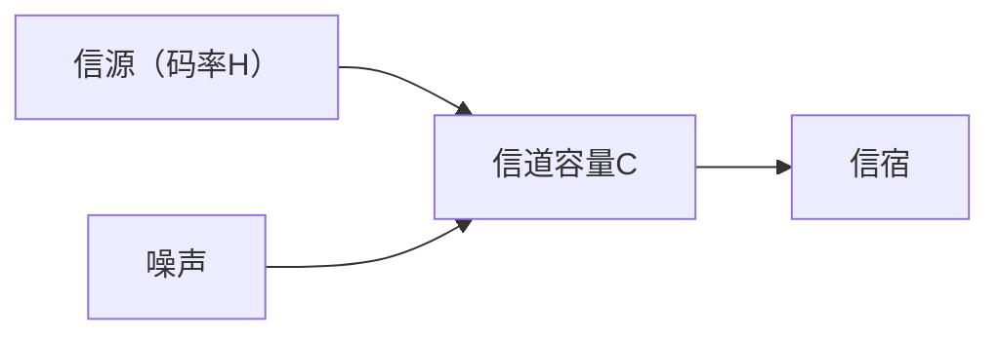

<!-- Page 1 -->

# 算法比程序更简练

## 算法是给人看的；

算法 + 数据结构 = 程序

**Algorithms + Data Structures = Programs**

Nicklaus Wirth（尼克劳斯·维尔特），1984年图灵奖得主

Title of his1976 book

# 程序比算法更详细

## 程序多了数据结构，不仅给人看，还要给计算机看

如果说算法是理想的菜谱，程序就是给机器人厨师的详细指令；这位机器人厨师的任务是为正在作战的一个军团准备一个月的早中晚餐。

So if an algorithm is an idealized recipe, a program is the detailed set of instructions for a cooking robot preparing a month of meals for an army while under enemy attack.

《理解数字世界 Understanding the Digital World》，2017

Brian Kernighan（布莱恩·克尼汉），Unix和C的贡献者

---

<!-- Page 2 -->

# 计算机科学导论-课件7

# 算法思维-1

## 文件，高德纳算法定义，复杂度渐进记号

# Acu-<span style="color:red">Ex</span>ams

徐志伟（zxu@gbu.edu.cn 18910338695）  
大湾区大学 信息科学技术学院

2

---

<!-- Page 3 -->

# 提纲

- 同学们已经取得了长足的进步 <span style="color:red">Acu</span>-Exams
  - 计算过程单元
    - 计算思维ABC、冯诺依曼模型、Python编程入门
  - 逻辑思维单元
    - 计算机和计算过程的正确性、通用性、图灵计算边界

- 体认算法与程序的异同 Acu-<span style="color:red">Exams</span>
  - 图片隐写：程序有点难，算法很简单

- 领悟算法思维妙在何处
  - 巧妙的算法概念定义（高德纳算法定义） Acu-<span style="color:red">E</span>xams
  - 巧妙的算法效率度量（复杂度概念） Acu-E<span style="color:red">x</span>ams
  - 巧妙的算法设计范式（分治、贪心等）
  - 巧妙的变奏（利用问题特色）

## 程序类型

直线程序、循环、（递归）函数

## 数据类型

标量类型：  
　布尔，整数，浮点，None

容器类型：序列，字典  
　序列包括字符串、列表、元组

## <span style="color:red">本周学习新数据类型</span>

文件（file）  
字节数组（bytearray）

## <span style="color:red">问题场景——最简算法</span>

学习文件操作，完成**图片隐写**任务

- 就像直线程序是最简程序一样
- 体认高德纳算法定义
- 了解算法复杂度概念

---

<!-- Page 4 -->

# 1. 文件与文件系统

- **持久存储**数据和程序文件，下电后还存在
- 文件系统是一颗树
  - 叶子节点（文件），内部节点（目录）
  - 文件名（路径）；绝对路径，相对路径
  - 目录；主目录，当前目录，根目录，父目录，子目录
- 数据与元数据
  - 文件格式，文件大小，访问权限
- 如何读入文件
  - 有利于定位及操作
- 如何支持循环
  - 迭代操作文件元素

```text
/  root directory
├── math101/
├── cs101/
│   ├── Prj1/
│   ├── Prj2/
│   │   ├── hide-0.go
│   │   ├── hamlet.txt
│   │   ├── ucas.bmp
│   │   ├── doctoredUCAS.bmp
│   │   ├── Richard_Karp.txt
│   │   ├── Autumn.bmp
│   │   └── doctoredAutumn.bmp
│   ├── Prj3/
│   └── Prj4/
└── physics101/

---

<!-- Page 5 -->

# 1.1 文件、文件系统，及其操作

- 文件系统是一颗树（颠倒的树；树根在最上面，叶子在最下面）
  - Leaf nodes are files 叶子节点是文件；Internal nodes are <span style="color:red">directories</span> 内部节点是目录 (special files)
  - 一个节点的下一级节点是它的子节点（child, children），每个节点有唯一的父节点（parent）
    - 在工作目录 Prj2 中，执行 `cd ..` 命令，将工作目录变成 cs101，即 Prj2 的父节点
    - 根目录是所有节点的家长；假如当前目录是根目录，执行 `cd ..` 命令之后，当前目录仍是根目录

- 用文件名（又称为文件路径，简称路径）指明某一文件
  - <span style="color:red">Home directory</span> <span style="color:red">缺省目录、主目录</span>
    - The default directory when log in. 假设是 `/cs101/`
  - <span style="color:red">Absolute path</span> 绝对路径: all the way from the root (`/`) 根目录
    - Absolute path of **autumn.bmp**: `/cs101/Prj2/autumn.bmp`
  - <span style="color:red">Relative path</span> 相对路径 <span style="color:red">of</span> **autumn.bmp**
    - Related to the <span style="color:red">current directory</span> 当前目录,  
      i.e., <span style="color:red">working directory</span> 也称为工作目录
    - `./autumn.bmp` if the working directory is `/cs101/Prj2/`
    - `../Prj2/autumn.bmp` if the working directory is `/cs101/Prj3/`

```text
/                         root directory
├── math101/
├── cs101/
│   ├── Prj1/
│   ├── Prj2/
│   │   ├── hide-0.go
│   │   ├── hamlet.txt
│   │   ├── ucas.bmp
│   │   ├── doctoredUCAS.bmp
│   │   ├── Richard_Karp.txt
│   │   ├── Autumn.bmp
│   │   └── doctoredAutumn.bmp
│   ├── Prj3/
│   └── Prj4/
└── physics101/
```

主目录是 `/cs101/`

```text
>pwd
/cs101/
>cd Prj2
>

---

<!-- Page 6 -->

# <span style="color:#2b005c">包含操作文件的图片隐写算法</span>

## 文本隐藏算法

- <span style="color:red">输入：</span> 文本文件hamlet.txt 与图像文件 autumn.bmp。
- <span style="color:red">输出：</span> 新图像文件doctoredAutumn.bmp，它隐藏了hamlet.txt的全部内容，且与原图像文件autumn.bmp无可见差别。
- <span style="color:red">步骤：</span>

1. 将文本文件hamlet.txt读进变量　　# t 代表文本（text）
2. 将图像文件autumn.bmp读进变量p　　# p 代表图像（picture）
3. 将hamlet.txt的文件长度隐藏到变量p的<span style="color:red">Pixel Array</span>的前32个字节
4. 将hamlet.txt的文件内容隐藏到变量p的<span style="color:red">像素阵列</span>的剩余字节
5. 将p写到新文件doctoredAutumn.bmp

<div style="background-color:#ffff33; padding:10px;">

HAMLET

DRAMATIS PERSONAE

CLAUDIUS　　　　king of Denmark. (KING CLAUDIUS:)

HAMLET　　　　　son to the late, and nephew to the present king.

.....

ACT ISCENE I  Elsinore. A platform before the castle.  
.....  
PRINCE FORTINBRAS　　　　　Let four captains  
　　　　　　　　　　　　　Bear Hamlet, like a soldier, to the stage;  
　　　　　　　　　　　　　For he was likely, had he been put on,  
　　　　　　　　　　　　　To have proved most royally: and, for his passage,  
　　　　　　　　　　　　　The soldiers' music and the rites of war  
　　　　　　　　　　　　　Speak loudly for him.  
　　　　　　　　　　　　　Take up the bodies: such a sight as this  
　　　　　　　　　　　　　Becomes the field, but here shows much amiss.  
　　　　　　　　　　　　　Go, bid the soldiers shoot.  
　　　　　　　　　　　　　[A dead march. Exeunt, bearing off the dead  
　　　　　　　　　　　　　bodies; after which a peal of ordnance is shot off]  
.....  
I换行键0x0A

</div>

|  |  |  |  |
|---|---|---|---|
| Original picture | After careless hiding | After careful hiding | 一个动态网页思路 |

---

<!-- Page 7 -->

# 包含操作文件的图片隐写算法

## 文本隐藏算法

- **输入：** 文本文件hamlet.txt 与图像文件 autumn.bmp。
- **输出：** 新图像文件doctoredAutumn.bmp，它隐藏了hamlet.txt的全部内容，且与原图像文件autumn.bmp无可见差别。
- **步骤：**

1. 将文本文件hamlet.txt读进变量t　　# t 代表文本（text）
2. 将图像文件autumn.bmp读进变量p　　# p 代表图像（picture）
3. 将hamlet.txt的文件长度隐藏到变量p的Pixel Array的前32个字节  
   文件长度是64比特整数，如182397（通过ls -l hamlet.txt可看到）  
   将182397二进制表示的每两比特放入像素阵列的一个字节的最低两比特
4. 将hamlet.txt的文件内容隐藏到变量p的像素阵列的剩余字节
5. 将p写到新文件doctoredAutumn.bmp

**自顶向下**

**自底向上**

```text
HAMLET

DRAMATIS PERSONAE

CLAUDIUS        king of Denmark. (KING CLAUDIUS:)

HAMLET          son to the late, and nephew to the present king.

.....

ACT ISCENE I  Elsinore. A platform before the castle.
.....
PRINCE FORTINBRAS            Let four captains
                Bear Hamlet, like a soldier, to the stage;
                For he was likely, had he been put on,
                To have proved most royally: and, for his passage,
                The soldiers' music and the rites of war
                Speak loudly for him.
                Take up the bodies: such a sight as this
                Becomes the field, but here shows much amiss.
                Go, bid the soldiers shoot.
                [A dead march. Exeunt, bearing off the dead
                bodies; after which a peal of ordnance is shot off]
.....
] 换行键0x0A
```


**Original picture**


**After careless hiding**


**After careful hiding**

7

---

<!-- Page 8 -->

# 1.2 数据与元数据

- Data and metadata of file autumn.bmp
  - Data: payload bits of the actual picture (Pixel Array)
  - Metadata: data about the picture data  
    元数据描述文件格式等信息
    - BMP format in the file: File Header, Info Header
    - Other data associated with the file

> Addresses 0~53 hold metadata  
>
> The pixel array for actual image data starts at address 54


autumn.bmp

The extension（扩展名）bmp says 文件格式是bit map image位图图像

| Address | Content |
|---:|---|
| 0 | BMP File Header |
| 1 | BMP File Header |
| ... | BMP File Header |
| 13 | BMP File Header |
| 14 | BMP Info Header |
| 15 | BMP Info Header |
| ... | BMP Info Header |
| 53 | BMP Info Header |
| 54 | Pixel Array |
| 55 | Pixel Array |
| 56 | Pixel Array |
| ... | Pixel Array |

元数据  
**Metadata**

数据  
**data**

---

<!-- Page 9 -->

# Other types of metadata 其他元数据由系统管理，不在文件中

- Can be seen by running “ls -l autumn.bmp”
  - ls -l autumn.bmp中，l是小写的L，不是大写的i

```bash
$ ls -l autumn.bmp
-rw-r--r-- 1 coder coder 9144630 Oct 27 17:07 autumn.bmp
```

<span style="color:red">请同学们指出</span>上行输出中的： The file name, the file size, the time of creation (last modification)

---

<!-- Page 10 -->

# Other types of metadata 其他元数据由系统管理，不在文件中

- Can be seen by running “ls -l autumn.bmp”
  - ls -l autumn.bmp中，l是小写的L，不是大写的i

    ```bash
    $ ls -l autumn.bmp
    -rw-r--r-- 1 coder coder 9144630 Oct 27 17:07 autumn.bmp
    ```

    请同学们指出上行输出中的： The file name, the file size, the time of creation (last modification)

- Access permissions 针对三类用户的三种权限
  - Rights to <span style="color:red">read</span>, <span style="color:red">write</span>, and <span style="color:red">execute</span> a file by the <span style="color:red">owner</span> of the file, by the <span style="color:red">group</span> the owner belonging to, and by <span style="color:red">other</span> users

- Example of access permissions
  - `-rw-r--r-- 1 coder coder 9144630 Oct 28 01:18 doctoredAutumn.bmp`
  - <span style="color:red">请同学们指出</span>上行输出中的owner 是谁，并填右表  
    拥有者（用户本人）可读、可写，但不可执行；  
    组（用户所在组）、他人仅可读
  - `-rw-r--r--          0644 = 0 110 100 100`
  - 最左0说，这是文件（不是目录）

<table>
  <tr>
    <th colspan="3">Owner</th>
    <th colspan="3">Group</th>
    <th colspan="3">Others</th>
  </tr>
  <tr>
    <td>r</td>
    <td>w</td>
    <td>e</td>
    <td>r</td>
    <td>w</td>
    <td>e</td>
    <td>r</td>
    <td>w</td>
    <td>e</td>
  </tr>
  <tr>
    <td>1</td>
    <td>1</td>
    <td>-</td>
    <td></td>
    <td></td>
    <td></td>
    <td></td>
    <td></td>
    <td></td>
  </tr>
</table>

0644：拥有者可读、可写，但不可执行；组、他人仅可读  
这是一个数据文件，不是程序文件

10

---

<!-- Page 11 -->

# 1.3 如何读文件

- 将文件以合适的格式读进内存，便于**定位**
  - 后续操作方便地定位到文件所需区域并处理该区域的数据

- 什么是合适的格式呢？
  - 是**字节数组**（bytearray）
    - 匹配当代计算机的字节寻址内存结构
    - 便于定位任意字节

- 使用 Python 语言提供的内置函数及 with 语句

```python
with open('./autumn.bmp', 'rb') as f:
    p = bytearray(f.read())
```

  - 打开当前目录中的 autumn.bmp 图像文件文件，指定文件句柄为变量 f
  - 将文件内容读进内存，形成一个包含 9144630 个元素的字节数组
  - 绑定到变量 p

| 字节位置 | 内容 |
|---:|---|
| 0 | BMP FILE |
| 1 | HEADER |
| ... |  |
| 13 |  |
| 14 | BMP INFO |
| 15 | HEADER |
| ... |  |
| 53 |  |
| 54 | 0th Pixel-B |
| 55 | 0th Pixel-G |
| 56 | 0th Pixel-R |
| ... | ... |
| 85 | 10th Pixel-G |
| 86 | 01111011 |
| 87 | 10111011 |
| 88 | 01011010 |
| 89 | 10100111 |
| 90 |  |
| 91 |  |
| 92 | Pixel Array |
| 93 |  |
| 9144629 |  |

---

<!-- Page 12 -->

# How is the image of autumn.bmp stored in Pixel Array?

- Pixel = Picture Element
- Pixel Array holds the pixels of the image, starting from the low-left corner going right, and then up, row by row
- Each pixel has three bytes for
  - Color depth values of RGB, i.e., the primary colors of red, green, blue
  - BGR values = (0, 0, 0) → Black
  - BGR values = (255, 255, 255) → White
  - BGR values = (0, 0, 255) → Red
  - BGR values = (0, 255, 0) → Green
  - BGR values = (255, 0, 0) → Blue
- The first pixel is the 0th element of Pixel Array
  - Uses addresses 54, 55, and 56 to store its three BGR color depth values

| Color | Chinese |
|---|---|
| Black | 黑 |
| White | 白 |
| Red | 红 |
| Green | 绿 |
| Blue | 蓝 |

## BMP file structure

| Address | Content |
|---:|---|
| 0 | BMP FILE HEADER |
| 1 | BMP FILE HEADER |
| ... | BMP FILE HEADER |
| 13 | BMP FILE HEADER |
| 14 | BMP INFO HEADER |
| 15 | BMP INFO HEADER |
| ... | BMP INFO HEADER |
| 53 | BMP INFO HEADER |
| 54 | 0th Pixel-B |
| 55 | 0th Pixel-G |
| 56 | 0th Pixel-R |
| ... | ... |
| 85 | 10th Pixel-G |
| 86 | 01111011 |
| 87 | 10111011 |
| 88 | 01011010 |
| 89 | 10100111 |
| 90 |  |
| 91 |  |
| 92 |  |
| 93 |  |
| ... | Pixel Array / 像素阵列 |
| 9144629 | Pixel Array / 像素阵列 |

---

<!-- Page 13 -->

# 1.4 如何在图片文件中隐藏信息

- 在图片文件 `autumn.bmp` 中隐藏文本文件 `hamlet.txt` 的长度

```python
S = 54   # BMP文件元数据大小为54字节，其后是Pixel Array
T = 32   # 隐藏文本长度最大所需的像素阵列字节数
C = 4    # 隐藏一个字符所需的像素阵列字节数

# 读入文本文件
with open('hamlet.txt', 'rb') as f:
    t = bytearray(f.read())

# 读入图像文件
with open('./autumn.bmp', 'rb') as f:
    p = bytearray(f.read())

# 隐藏文本长度到图像字节数组中
modify(len(t), p, S, T)
```

**autumn.bmp**  
**Original p**

| 字节位置 | 内容 |
|---:|---|
| 0 | BMP FILE HEADER |
| 1 | BMP FILE HEADER |
| ... | BMP FILE HEADER |
| 13 | BMP FILE HEADER |
| 14 | BMP INFO HEADER |
| 15 | BMP INFO HEADER |
| ... | BMP INFO HEADER |
| 53 | BMP INFO HEADER |
| 54 | 0th Pixel-B |
| 55 | 0th Pixel-G |
| 56 | 0th Pixel-R |
| ... | ... |
| 85 | 10th Pixel-G |
| 86 | `01111011` |
| 87 | `10111011` |
| 88 | `01011010` |
| 89 | `10100111` |
| 90 | Pixel Array |
| 91 | Pixel Array |
| 92 | Pixel Array |
| 93 | Pixel Array |

**Pixel Array**

13

---

<!-- Page 14 -->

# 简化观察： 像素阵列可视为字节数组

## 不用管哪个像素、哪个色深

```python
S = 54    # BMP文件元数据大小为54字节，其后是Pixel Array
T = 32    # 隐藏文本文件长度，最大所需的像素阵列字节数
C = 4     # 隐藏一个字符所需的像素阵列字节数

# 读入文本文件
with open('hamlet.txt', 'rb') as f:
    t = bytearray(f.read())

# 读入图像文件
with open('./autumn.bmp', 'rb') as f:
    p = bytearray(f.read())

# 隐藏文本长度到图像字节数组中
modify( len(t), p, S, T )
```

将 `len(t)` 隐藏在 `p[54:86]`

- 文本文件长度：**182397**
- 图像字节数组：`p`
- 像素阵列（在图像字节数组中）的起始索引：**54**
- 隐藏文本文件长度最大所需字节数：**32字节（64位）**

---

## autumn.bmp

**Original `p`**

| 索引 | 内容 |
|---:|---|
| 0 | BMP FILE HEADER |
| 1 | BMP FILE HEADER |
| … | BMP FILE HEADER |
| 13 | BMP FILE HEADER |
| 14 | BMP INFO HEADER |
| 15 | BMP INFO HEADER |
| … | BMP INFO HEADER |
| 53 | BMP INFO HEADER |
| 54 | 0th Pixel-B |
| 55 | 0th Pixel-G |
| 56 | 0th Pixel-R |
| … | … |
| 85 | 10th Pixel-G |
| 86 | `0111011` |
| 87 | `10111011` |
| 88 | `01011010` |
| 89 | `10100111` |
| 90 | Pixel Array |
| 91 | Pixel Array |
| 92 | Pixel Array |
| 93 | Pixel Array |

---

## doctoredAutumn.bmp

**Modified `p`**

| 索引 | 内容 |
|---:|---|
| 0 | BMP FILE HEADER |
| 1 | BMP FILE HEADER |
| … | BMP FILE HEADER |
| 13 | BMP FILE HEADER |
| 14 | BMP INFO HEADER |
| 15 | BMP INFO HEADER |
| … | BMP INFO HEADER |
| 53 | BMP INFO HEADER |
| 54 | Hide 2 bits of `len(t)` |
| 55 | Hide 2 bits of `len(t)` |
| 56 | Hide 2 bits of `len(t)` |
| … | … |
| 85 | Hide 2 bits of `len(t)` |
| 86 | `01110000` |
| 87 | `10111010` |
| 88 | `01011000` |
| 89 | `10100101` |
| 90 | Pixel Array |
| 91 | Pixel Array |
| 92 | Pixel Array |
| 93 | Pixel Array |

14

---

<!-- Page 15 -->

# 隐藏文本文件的内容

## 隐藏**hamlet.txt**的第一个字符

> HAMLET  
>
> DRAMATIS PERSONAE  
>
> CLAUDIUS &nbsp;&nbsp; king of Denmark. (KING CLAUDIUS:)  
>
> HAMLET &nbsp;&nbsp;&nbsp;&nbsp; son to the late, and nephew to the present king.  
>
> .....  
>
> ACT ISCENE I &nbsp;&nbsp;&nbsp;&nbsp;&nbsp;&nbsp;&nbsp;&nbsp;&nbsp;&nbsp; Elsinore. A platform before the castle.  
> .....  
> ] 换行键0x0A

- `t[0]` holds the <span style="color:red">1st character</span> `‘H’ = 72`

\[
\text{offset} = S + T + C * 0
\]

\[
\text{modify}(t[0], p, \text{offset}, C)
\]

其中，

- `t[0]` is `‘H’ = 72 =` <span style="color:red">`01001000`</span>
- `S = 54, T = 32, C = 4`

## Original `p[86:90]` → Modified `p[86:90]`

| Index | Original `p[86:90]` | Modified `p[86:90]` |
|---:|:---:|:---:|
| 86 | `01111011` | `01111000` |
| 87 | `10111011` | `10111010` |
| 88 | `01011010` | `01011000` |
| 89 | `10100111` | `10100101` |

## BMP structure comparison

| Offset | `autumn.bmp`<br>Original `p` | Offset | `doctoredAutumn.bmp`<br>Modified `p` |
|---:|:---|---:|:---|
| 0 | BMP FILE<br>HEADER | 0 | BMP FILE<br>HEADER |
| 1 |  | 1 |  |
| ... |  | ... |  |
| 13 |  | 13 |  |
| 14 | BMP INFO<br>HEADER | 14 | BMP INFO<br>HEADER |
| 15 |  | 15 |  |
| ... |  | ... |  |
| 53 |  | 53 |  |
| 54 | 0th Pixel-B | 54 | Hide 2 bits of len(t) |
| 55 | 0th Pixel-G | 55 | Hide 2 bits of len(t) |
| 56 | 0th Pixel-R | 56 | Hide 2 bits of len(t) |
| ... | ... | ... | ... |
| 85 | 10th Pixel-G | 85 | Hide 2 bits of len(t) |
| 86 | `01111011` | 86 | `01111000` |
| 87 | `10111011` | 87 | `10111010` |
| 88 | `01011010` | 88 | `01011000` |
| 89 | `10100111` | 89 | `10100101` |
| 90 |  | 90 |  |
| 91 |  | 91 |  |
| 92 |  | 92 |  |
| 93 | <span style="color:red">Pixel Array</span> | 93 | <span style="color:red">Pixel Array</span> |

---

<!-- Page 16 -->

# 隐藏文本文件的内容

## 隐藏hamlet.txt的每一个字符

```python
for i in range(len(t)):
    offset = S + T + i * C
    modify(t[i], p, offset, C)
```

$$
\text{offset} = S + T + i \times C
$$

- 比例因子是4，因为每个字符有8位，需要p的4个字节。
- 这4个字节的偏移量分别是0、1、2、3。
- 第0次迭代执行`modify(t[0], p, S+T, C)`，修改`P[86]`，`P[87]`，`P[88]`，`P[89]`
- 第1次迭代执行`modify(t[1], p, S+T+C, C)`，修改`P[90]`，`P[91]`，`P[92]`，`P[93]`

基址+索引*4+偏移量

- 回忆计算机指令集中的支持循环的**基址+索引\*比例因子+偏移量**寻址模式

```text
HAMLET

DRAMATIS PERSONAE

CLAUDIUS    king of Denmark. (KING CLAUDIUS;)

HAMLET      son to the late, and nephew to the present king.

.....

ACT ISCENE I             Elsinore. A platform before the castle.
.....
] 换行键0x0A
```

| autumn.bmp<br>Original p | doctoredAutumn.bmp<br>Modified p |
|---|---|
| ```text<br>0          BMP FILE<br>1          HEADER<br>...<br>13<br>14         BMP INFO<br>15         HEADER<br>...<br>53<br>54         0th Pixel-B<br>55         0th Pixel-G<br>56         0th Pixel-R<br>...        ...<br>85         10th Pixel-G<br>86         01111011<br>87         10111011<br>88         01011010<br>89         10100111<br>90<br>91<br>92<br>93<br><br>           Pixel Array<br>``` | ```text<br>0          BMP FILE<br>1          HEADER<br>...<br>13<br>14         BMP INFO<br>15         HEADER<br>...<br>53<br>54         Hide 2 bits of len(t)<br>55         Hide 2 bits of len(t)<br>56         Hide 2 bits of len(t)<br>...        ...<br>85         Hide 2 bits of len(t)<br>86         01111000<br>87         10111010<br>88         01011000<br>89         10100101<br>90<br>91<br>92<br>93<br><br>           Pixel Array<br>``` |

16

---

<!-- Page 17 -->

# 2. 算法思维妙在何处？

- 算法概念的巧妙定义（高德纳算法定义）
  - 简洁、通用、可检验；future-proof，适合今天的人工智能时代
- 巧妙的效率度量（复杂度的 $o$，$O$，$\Omega$，$\Theta$ 渐进记号表达）
  - 忽略不重要细节，简化算法分析
    - 快速排序：最坏复杂度 $O(n^2)$，平均复杂度 $O(n \log n)$
- 巧妙的算法设计方法（algorithmic paradigms）
  - 分治、动态规划、贪心、随机，等
- 巧妙的变奏，适应问题特色
  - 单因素优选法中的 0.618 法，为什么优于二分查找法
    - 复用查询结果，将时间复杂度降到 $\log_{1.618} n$
    - 二分法的时间复杂度是 $\log_{\sqrt{2}} n \approx \log_{1.414} n$，大于 $\log_{1.618} n$

---

<!-- Page 18 -->

# 3. 掌握高德纳的算法定义

一个算法是一组有限条规则，给出求解特定类型问题的操作序列，并具备下列五个特征：

①　有限性：算法在有限步骤之后必然要终止。  
②　确定性：算法的每个步骤都必须精确地（严格地和无歧义地）定义。  
③　输入：算法有零个或多个输入，在算法开始或中途动态地给定。  
④　输出：算法有一个或多个输出。  
⑤　能行性：算法的所有操作必须是充分基本的，原则上一个人能够用笔和纸在有限时间内精确地完成每个操作。

---

**冒泡排序算法**　　**满足高德纳的算法定义吗？**

- **输入：** 待排序的数组 \(A\)，数组 \(A\) 的长度为 \(n\)。
- **输出：** 排好序的数组 \(A\)。
- **步骤描述：** （一般用有限行伪代码）

  for \(i = 1\) to \(n - 1\)  
  　for \(j = 1\) to \(n - i\)  
  　　if \(A[j] > A[j+1]\)  
  　　　exchange \(A[j]\) with \(A[j+1]\).

---

<!-- Page 19 -->

# 冒泡排序： 给定n个正整数， 把它们从小到大排起来

```text
初始：        交换：        交换：        交换：        交换后：

76           76           76           76           12
18           18           18           12           76
99           99           12           18           18
35           12           99           99           99
12           35           35           35           35

12 → 12 → 12 → 12 → 12

继续排

---

<!-- Page 20 -->

# 冒泡排序

| 01 |  |  |  |  |
|---|---|---|---|---|
| <span style="color:blue">12</span><br>76<br>18<br>99<br><span style="color:red">35</span> | <span style="color:blue">12</span><br>76<br>18<br><span style="color:red">35</span><br>99 | <span style="color:blue">12</span><br>76<br><span style="color:red">18</span><br>35<br>99 | <span style="color:blue">12</span><br><span style="color:red">18</span><br>76<br>35<br>99 | <span style="color:blue">12</span><br><span style="color:blue">18</span><br><span style="color:gray">76</span><br>35<br>99 |

---

<!-- Page 21 -->

# 确定性是什么意思？

一个算法是一组有限条规则，给出求解特定类型问题的操作序列，并具备下列五个特征：

①　有限性：算法在有限步骤之后必然要终止。  
②　确定性：算法的每个步骤都必须精确地（严格地和无歧义地）定义。

**比特精准！**

①　输入：算法有零个或多个输入，在算法开始或中途动态地给定。  
②　输出：算法有一个或多个输出，输出是与输入有特定关系的数值。  
③　能行性：算法的所有操作必须是充分基本的，原则上一个人能够用笔和纸在有限时间内精确地完成它们。

> **冒泡排序算法**
>
> - 输入：待排序的数组 $A$，数组 $A$ 的长度 $n$。
> - 输出：排好序的数组 $A$。
> - 算法步骤描述：
>
> for i = 1 to $n - 1$  
> 　　for j = 1 to $n - i$  
> 　　　　if A[j]>A[j+1]  
> 　　　　　　exchange A[j] with A[j+1].
>
> ## **什么不是算法？**
>
> - 包含非比特精准的操作步骤

---

<!-- Page 22 -->

# 确定性是什么意思？

一个算法是一组有限条规则，给出求解特定类型问题的操作序列，并具备下列五个特征：

① 有限性：算法在有限步骤之后必然要终止。

② 确定性：算法的每个步骤都必须精确地（严格地和无歧义地）定义。

③ 输入：算法有零个或多个输入，在算法开始或中途动态地给定。

④ 输出：算法有一个或多个输出，输出是与输入有特定关系的数值。

⑤ 能行性：算法的所有操作必须是充分基本的，原则上一个人能够用笔和纸在有限时间内精确地完成它们。

## 冒泡排序算法

- 输入：待排序的整数数组 $A$，数组 $A$ 的长度为 $n$。
- 输出：排好序的数组 $A$。
- 算法步骤描述：

```text
for i = 1 to n − 1
    for j = 1 to n − i
        if A[j]>A[j+1]
            exchange A[j] with A[j+1].
```

## 什么不是算法？

- 比较两个物理线段的长度

```text
If 线段A长度==线段B长度
    return f(x)
```

22

---

<!-- Page 23 -->

# 审视高德纳的算法定义

- 注意三种有穷性

一个算法是一组**有限**条规则，给出求解特定类型问题的操作序列，并具备下列五个特征：

① 有限性：算法在**有限**步骤之后必然要终止。

② 确定性：算法的每个步骤都必须精确地（严格地和无歧义地）定义。

③ 输入：算法有零个或多个输入，在算法开始或中途动态地给定。

④ 输出：算法有一个或多个输出。

⑤ 能行性：算法的所有操作必须是充分基本的，原则上一个人能够用笔和纸在**有限**时间内精确地完成每个操作。

---

## 冒泡排序算法

- 输入：待排序的数组 $A$，数组 $A$ 的长度 $n$。
- 输出：排好序的数组 $A$。
- 算法步骤描述：

```text
for i = 1 to n - 1
    for j = 1 to n - i
        if A[j]>A[j+1]
            exchange A[j] with A[j+1].
```

## 什么不是算法?

---

<!-- Page 24 -->

# 审视高德纳的算法定义

- 注意三种有穷性

一个算法是一组<span style="color:red">有限</span>条规则，给出求解特定类型问题的操作序列，并具备下列五个特征：

① 有限性：算法在<span style="color:red">有限</span>步骤之后必然要终止。

② 确定性：算法的每个步骤都必须精确地（严格地和无歧义地）定义。

③ 输入：算法有零个或多个输入，在算法开始或中途动态地给定。

④ 输出：算法有一个或多个输出，输出是与输入有特定关系的数值。

⑤ 能行性：算法的所有操作必须是充分基本的，原则上一个人能够用笔和纸在<span style="color:red">有限</span>时间内精确地完成它们。

---

## 冒泡排序算法

- 输入：待排序的数组 $A$，数组 $A$ 的长度 $n$。
- 输出：排好序的数组 $A$。
- 算法步骤描述：

```text
for i = 1 to n − 1
  for j = 1 to n − i
    if A[j]>A[j+1]
      exchange A[j] with A[j+1].
```

## <span style="color:red">什么不是算法?</span>

- 求斐波那契数 $F(n)$ 的直线程序
  - 程序行数正比于问题规模

---

<!-- Page 25 -->

# 审视高德纳的算法定义

- 注意三种有穷性

一个算法是一组<span style="color:red">有限</span>条规则，给出求解特定类型问题的操作序列，并具备下列五个特征：

① 有限性：算法在<span style="color:red">有限</span>步骤之后必然要终止。

② 确定性：算法的每个步骤都必须精确地（严格地和无歧义地）定义。

③ 输入：算法有零个或多个输入，在算法开始或中途动态地给定。

④ 输出：算法有一个或多个输出。

⑤ 能行性：算法的所有操作必须是充分基本的，原则上一个人能够用笔和纸在<span style="color:red">有限</span>时间内精确地完成它们。

---

## 冒泡排序算法

- 输入：待排序的数组 $A$，数组 $A$ 的长度 $n$。
- 输出：排好序的数组 $A$。
- 算法步骤描述：

```text
for i = 1 to n − 1
    for j = 1 to n − i
        if A[j]>A[j+1]
            exchange A[j] with A[j+1].
```

## 什么不是算法？

- 求斐波那契数 $F(n)$ 的直线程序
  - 程序行数正比于问题规模
- 不停机的加法图灵机

---

<!-- Page 26 -->

# 审视高德纳的算法定义

- 注意三种有穷性

一个算法是一组**有限**条规则，给出求解特定类型问题的操作序列，并具备下列五个特征：

① 有限性：算法在**有限**步骤之后必然要终止。

② 确定性：算法的每个步骤都必须精确地（严格地和无歧义地）定义。

③ 输入：算法有零个或多个输入，在算法开始或中途动态地给定。

④ 输出：算法有一个或多个输出。

⑤ 能行性：算法的所有操作必须是充分基本的，原则上一个人能够用笔和纸在**有限**时间内精确地完成它们。

## 冒泡排序算法

- 输入：待排序的数组 $A$，数组 $A$ 的长度 $n$。
- 输出：排好序的数组 $A$。
- 算法步骤描述：

```text
for i = 1 to n − 1
    for j = 1 to n − i
        if A[j] > A[j+1]
            exchange A[j] with A[j+1].
```

## 什么不是算法？

- 求斐波那契数 $F(n)$ 的直线程序
- 无穷循环不停机
- 包含下列操作
  - if **哥德巴赫猜想为真**{…}
    
    有限时间完不成！

---

<!-- Page 27 -->

# 审视高德纳的算法定义

- 注意三种有穷性

一个算法是一组**有限**条规则，给出求解特定类型问题的操作序列，并具备下列五个特征：

① 有限性：算法在**有限**步骤之后必然要终止。  
② 确定性：算法的每个步骤都必须精确地（严格地和无歧义地）定义。  
③ 输入：算法有零个或多个输入，在算法开始或中途动态地给定。  
④ 输出：算法有一个或多个输出，输出是与输入有特定关系的数值。  
⑤ 能行性：算法的所有操作必须是充分基本的，原则上一个人能够用笔和纸在**有限**时间内精确地完成它们。

## **请同学们审视：**

冒泡排序算法符合**高德纳的算法定义**吗？

### 冒泡排序算法

- 输入：待排序的数组 $A$，数组 $A$ 的长度 $n$。
- 输出：排好序的数组 $A$。
- 算法步骤描述：

```text
for i = 1 to n − 1
    for j = 1 to n − i
        if A[j]>A[j+1]
            exchange A[j] with A[j+1].
```

规则有穷性  
伪代码行数是 $O(1)$，与 $n$ 无关

步骤有穷性，对任意给定 $n$  
即算法的时间复杂度，$O(n^2)$

操作能行性  
任一操作，比较和交换，  
是充分基本的，所需时间是有限的

---

<!-- Page 28 -->

# 4. 算法的复杂度分析

- 求解斐波那契数列的递归算法耗时多少？

```python
def f(n):
    if (n==0 or n==1):
        return n
    else:
        return f(n-1)+f(n-2)
print( f(101) )
```

- 复杂度分析（常用分析方法： 求解递推式）
  - $T(n)=T(n-1)+T(n-2)=T(n-2)+T(n-3)+T(n-3)+T(n-4)$ \qquad 假设 $n>6$
  - $2*T(n-2)<T(n)<2*T(n-1)$
  - $T(n)<2*T(n-1)<4*T(n-2)<8*T(n-3)\cdots<2^n$
  - $T(n)>2*T(n-2)>4*T(n-4)>8*T(n-6)\cdots>2^{n/2}$

  - $2^{n/2}<T(n)<2^n$
  - **$T(n)=\Omega(2^{n/2}),\quad T(n)=O(2^n)$，指数复杂度！**

28

---

<!-- Page 29 -->

# 指数复杂度增长非常迅速！

两国战后谈判，**A**国要求**B**国赔偿粮食。  
在 $10\times10$ 棋盘上放满稻米：

第1格放1粒米，第2格放2粒米，第3格放4粒米，…，第k格放 $2^k$ 粒米。

**B**国该不该答应？

### $10\times10$ 棋盘

|   |   |   |   |   |   |   |   |   |   |
|---|---|---|---|---|---|---|---|---|---|
|   |   |   |   |   |   |   |   |   |   |
|   |   |   |   |   |   |   |   |   |   |
|   |   |   |   |   |   |   |   |   |   |
|   |   |   |   |   |   |   |   |   |   |
|   |   |   |   |   |   |   |   |   |   |
|   |   |   |   |   |   |   |   |   |   |
|   |   |   |   |   |   |   |   |   |   |
|   |   |   |   |   |   |   |   |   |   |
|   |   |   |   |   |   |   |   |   |   |
| 1 | 2 | 4 | 8 | 16 | 32 |   |   |   |   |

粒

---

<!-- Page 30 -->

# 指数复杂度增长非常迅速！

在 **10x10** 棋盘上放满稻米：

第1格放1粒米， 第2格放2粒米， 第3格放4粒米，...， 第k格放 $2^k$ 粒米。

每粒米质量=0.02克（50粒米=1克）

放满前10个格子， 棋盘上稻米才20来克

棋盘上放满稻米总共有 $2^{n+1}-1$ 粒米。

放满100个格子， 总共有 $2^{101}-1$ 粒米

地球的质量大约是 $6 \times 2^{24}$ 千克。

B国要赔偿的稻米重量相当于  
8个多地球！

## 10x10棋盘

|  |  |  |  |  |  |  |  |  |  |
|---|---|---|---|---|---|---|---|---|---|
|  |  |  |  |  |  |  |  |  |  |
|  |  |  |  |  |  |  |  |  |  |
|  |  |  |  |  |  |  |  |  |  |
|  |  |  |  |  |  |  |  |  |  |
|  |  |  |  |  |  |  |  |  |  |
|  |  |  |  |  |  |  |  |  |  |
|  |  |  |  |  |  |  |  |  |  |
|  |  |  |  |  |  |  |  |  |  |
| 1 | 2 | 4 | 8 | 16 | 32 | 64 | 128 | 256 | 512 |

**粒**

| 0.02 | 0.04 | 0.08 | 0.16 | 0.32 | 0.64 | 1.28 | 2.56 | 5.12 | 10.24 |
|---|---|---|---|---|---|---|---|---|---|

**克**

---

<!-- Page 31 -->

# 小o，大O，$\Omega$，$\Theta$记号

等号是单向的，不同于数学等号

$n^{1.58}=O(n^2),\quad n^{1.58}=O(n^3),\quad \text{但 } O(n^2)\ne O(n^3)$

假设：当 $n$ 足够大

$$
\lim_{n\to\infty} f(n)/G(n)=0
$$

- $f(n)=o(g(n))$
  - $n^{1.58}=o(n^2),\quad n^{1.58}\ne o(n^{1.58}),\quad n^2\ne o(n^{1.58})$

$$
\exists \text{常数 } c>0,\ f(n)\le c g(n)
$$

- $f(n)=O(g(n))$
  - $n^{1.58}=O(n^2),\quad n^{1.58}=O(n^{1.58}),\quad n^2\ne O(n^{1.58})$

$$
\exists \text{常数 } c>0,\ f(n)\ge c g(n)
$$

- $f(n)=\Omega(g(n))$
  - $n^{1.58}\ne \Omega(n^2),\quad n^{1.58}=\Omega(n^{1.58}),\quad n^2=\Omega(n^{1.58})$

$$
f(n)=O(g(n))\ \text{并且}\ f(n)=\Omega(g(n))
$$

- $f(n)=\Theta(g(n))$
  - $n^{1.58}\ne \Theta(n^2),\quad n^{1.58}=\Theta(n^{1.58}),\quad n^2\ne \Theta(n^{1.58})$

---

<!-- Page 32 -->

# 小o，大O，Ω，Θ记号

共同假设：当 \(n\) 足够大。即，存在常数 \(k\)，当 \(n > k\) 时命题成立  
这四个记号分别表示：\(g\) 是 \(f\) 的严格上阶 \(o\)、上阶 \(O\)、下阶 \(\Omega\)、等阶 \(\Theta\)

- \(f(n)=o(g(n))\)　\(g\) 是 \(f\) 的严格上界（阶）

  - \(n^{1.58}=o(n^2)\)，\(n^{1.58}\ ?\ o(n^{1.58})\)，\(n^2 \ne o(n^{1.58})\)

\[
\lim_{n\to\infty}\frac{f(n)}{G(n)}=0
\]

- \(f(n)=O(g(n))\)　上界

  - \(n^{1.58}\ ?\ O(n^2)\)，\(n^{1.58}=O(n^{1.58})\)，\(n^2 \ne O(n^{1.58})\)

\[
\exists\ \text{常数 } c>0,\ f(n)\le cg(n)
\]

- \(f(n)=\Omega(g(n))\)　下界

  - \(n^{1.58}\ ?\ \Omega(n^2)\)，\(n^{1.58}=\Omega(n^{1.58})\)，\(n^2=\Omega(n^{1.58})\)

\[
\exists\ \text{常数 } c>0,\ f(n)\ge cg(n)
\]

- \(f(n)=\Theta(g(n))\)　等阶

  - \(n^{1.58}\ ?\ \Theta(n^2)\)，\(n^{1.58}=\Theta(n^{1.58})\)，\(n^2 \ne \Theta(n^{1.58})\)

\[
f(n)=O(g(n))\ \text{并且}\ f(n)=\Omega(g(n))
\]

---

<!-- Page 33 -->

# 课程追求：珍惜时代、体认思维、学生走心、作品牵引

## 李晓明 徐志伟 | 大湾区大学

---

<!-- Page 34 -->

# 5. 什么是构造性？ <span style="float:right">Acu-<span style="color:red">E</span>xams-CP</span>

- <span style="color:#8a00d4">**Effectiveness**</span> = <span style="color:red">Constructiveness</span> + Finiteness  
  （广义）构造性 = （狭义）<span style="color:red">构造性</span> + 有穷性

- 信息论中的香农第二定理是存在性定理，不是构造性定理



假如 $H \le C$，存在编码，  
实现无错消息传递

34

---

<!-- Page 35 -->

# 什么是狭义构造性？

- Effectiveness = <span style="color:red">Constructiveness</span> + Finiteness

  （广义）构造性 = （狭义）<span style="color:red">构造性</span> + 有穷性

- 信息论中的香农第二定理是存在性定理，不是构造性定理

  ```text
                         噪声
                          ↓
  信源（码率H） ───→ [ 信道容量C ] ───→ 信宿

                                  假如 H <= C，存在编码，
                                  实现无错消息传递
  ```

- 计算过程是<span style="color:red">构造性</span>过程，能够一步一步算出（构造出）结果

  ```text
                              计算过程
  输入 ──→ ┌──────────────────────────────────────────────────────────────┐ ──→ 输出
          │ [ 第1步        ] ──→ ... ──→ [ 当前步        ] ──→ [ 下一步       ] ──→ ... ──→ [ 最后一步      ] │
          │ [ 1st Step    ]           [ Current Step ]       [ Next Step  ]             [ Final Step ] │
          └──────────────────────────────────────────────────────────────┘
                              计算系统
  ```

35

---

<!-- Page 36 -->

# <span style="color:#2b005f">什么是有穷性?</span>

- Effectiveness = Constructiveness + <span style="color:red">Finiteness</span>  
  （广义）构造性 = （狭义）构造性 + <span style="color:red">有穷性</span>

- <span style="color:red">两类有穷性</span>
  - 需要的资源量与问题规模N有关，是O(f(N));
  - 需要的资源量与问题规模N无关，是O(1)
  - 其中，问题规模N可以任意大，但不是无穷大

---

<!-- Page 37 -->

# 什么是有穷性?

- Effectiveness = Constructiveness + <span style="color:red">Finiteness</span>

  （广义）构造性 = （狭义）构造性 + <span style="color:red">有穷性</span>

- 两类有穷性： 与问题规模N有关\(O(f(N))\)； 与问题规模N无关\(O(1)\)

  - <span style="color:red">存储有穷性：</span> 与问题规模有关，空间复杂度  
    \(O(f(N))\)，N任意大

    - 笔记本电脑，与图灵机**不等价**，因为<span style="color:red">有限存储容量</span>  
      \(O(1)\)

    - （足够大存储容量的）笔记本电脑，与图灵机等价  
      \(O(f(N))\)

```text
              ┌────────┐
              │ 控制器 │
              └────────┘
                   ↓
- - - - - - ┌───┬───┬───┬───┬───┐ - - - - - -
            │ B │ 0 │ 1 │ B │ B │
- - - - - - └───┴───┴───┴───┴───┘ - - - - - -
                        O(f(N))

                   图灵机
```

```text
                         ┌────────┐  ↔  ┌────────┐
                         │ 处理器 │     │ I/O设备 │
                         └────────┘     └────────┘
                              ↕
                         ┌────────┐
                         │ 存储器 │
                         │   .    │
                         │   .    │
                         │   .    │
                         └────────┘
              O(f(N))

                              理论界常常
                              忽略掉I/O

                              冯诺依曼模型
```

37

---

<!-- Page 38 -->

# 什么是有穷性？

- Effectiveness = Constructiveness + <span style="color:red">Finiteness</span>  
  （广义）构造性 = （狭义）构造性 + <span style="color:red">有穷性</span>

- 两类有穷性： 与问题规模N有关O(f(N))； 与问题规模N无关O(1)

  - <span style="color:red">存储有穷性</span>： 与问题规模有关，空间复杂度 $O(f(N))$，N任意大

    - 笔记本电脑，与图灵机**不等价**，因为<span style="color:red">有限存储容量</span> $O(1)$
    - （足够大存储容量的）笔记本电脑，与图灵机等价 $O(f(N))$

  - <span style="color:red">程序有穷性</span>： 程序行数与问题规模无关 $O(1)$

    - 采用循环、递归函数调用等编程抽象，用有限行程序表达计算过程
    - 任何图灵机的状态转移表只有有限行
      - 加法图灵机： 几十行

```text
              控制器  O(1)
                |
                v
   --------------------------------
        B    0    1    B    B        O(f(N))
   --------------------------------

              图灵机
```

```text
O(1)      [处理器] <----> [I/O设备]
              |
              v
O(f(N))   [存储器]
             .
             .
             .

理论界常常
忽略掉I/O

冯诺依曼模型