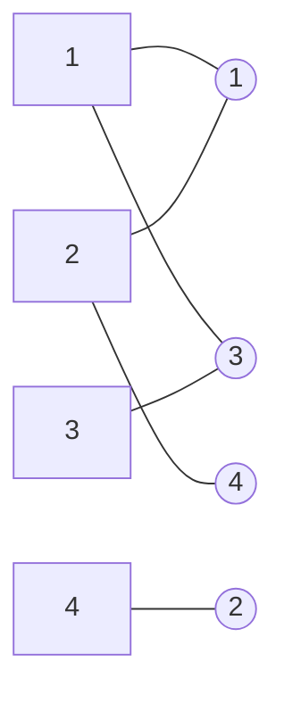

<!-- Page 1 -->

# 程序设计（编程）不是写代码&nbsp;&nbsp;&nbsp;&nbsp;Programming ≠ Coding

程序设计（编程）不只是写代码。... 需要思考...。编写调试代码之前需决定两件事：程序应该**做什么**，以及程序应该**如何做**。... 我们需要更高级、更抽象的描述...。

Programming is not just coding. It requires thinking before we code. Writing algorithms taught me that there are two things we need to decide before writing and debugging the code: *what* the program should do and *how* the program should do it. … we need a higher-level, more abstract description of what the program does.

Leslie Lamport（莱斯利·兰伯特），2013年图灵奖得主

Lamport L. *A Science of Concurrent Programs*. Cambridge University Press, 2026

https://lamport.azurewebsites.net/tla/science.pdf

2024年Stanford讲演  
2024年UC-Berkeley讲演

【Algorithm ↔ Abstract Program ↔ Concrete Program (Code)】

<span style="color:red">抽象</span> ←←←←←←←←←←←←←←←→→→→→→→→→→→→→ <span style="color:red">具体</span>

---

<!-- Page 2 -->

# 计算机科学导论-课件9

# 算法思维-3

## 算法范式，P=NP?

# Acu-Exams

徐志伟（zxu@gbu.edu.cn 18910338695）  
大湾区大学 信息科学技术学院

2

---

<!-- Page 3 -->

# 提纲

- 进一步理解算法与程序的异同
- 领悟算法思维妙在何处
  - 巧妙的算法设计范式（分治、贪心）
  - 巧妙的变奏（利用问题和算法特色）
  - 知道判断计算问题的难易：归约、**P与NP**

- 仔细学习课件和教科书
  - 中文教科书 **129-144** 页
  - 英文教科书 **4.2.2** 节
  - 如，快速矩阵乘法
    - 第一层多少次运算？
    - 第二层多少次运算？比第一层多还是少？

> **问题场景——啥是分治范式？**  
> 什么是一个分治算法的 *a, b, d, n*  
> 什么**不是**分治范式？
>
> - 学习一系列具体算法的思路
> - 初步理解算法设计和分析
> - 能够使用主方法（master method）

---

<!-- Page 4 -->

# 1. 算法范式（Algorithmic Paradigms）

- 啥是算法： 指明待解<span style="color:red">问题</span>、解题步骤序列，具备五个<span style="color:red">特征</span>的有限<span style="color:red">规则</span>
- 什么是算法范式： 算法设计和分析采用的方法大类
  - 不同问题的算法，可属于同一范式，即采用同一大类<span style="color:red">规则</span>
- 常见算法范式
  - 分治（divide and conquer）
  - 贪心（greedy）
  - 随机（random）
  - 动态规划（dynamic programming）
- 可以混合使用
  - 如，快速排序采用了分治和随机

---

<!-- Page 5 -->

# 2. 分治范式（the divide and conquer paradigm）

- 一般算法步骤
  - 分：将待解问题划分为不相交的子问题
  - 治：解决每个子问题（往往需要递归）
  - 合：合并子问题结果，得到原问题解

- 简版快速排序 fastsort 的 分、治、合

```text
fastsort(A, p, r)

if p < r
    q = partition(A, p, r)

    fastsort(A, p, q-1)
    fastsort(A, q+1, r)
```

分 divide

治 conquer

```text
d = [8 3 6 7 2 1 4 5]

d = [3 2 1 4] 5 [6 7 8]

d = [3 2 1] 4 [] 5 [6 7 8]

d = [] 1 [2 3] 4 5 [6 7 8]
d = 1 [2] 3 [] 4 5 [6 7 8]
d = 1 [] 2 [] 3 4 5 [6 7 8]
d = 1 2 3 4 5 [6 7] 8 []
d = 1 2 3 4 5 [6] 7 [] 8
d = 1 2 3 4 5 [] 6 [] 7 8
d = 1 2 3 4 5 6 7 8

---

<!-- Page 6 -->

# 归并排序 merge sort 的分、治、合

- 从中间截成两半，即 Lower 和 Upper
  - Upper 中的元素可比 Lower 中的小（与 quicksort 不同）
  - 递归求解子问题，再合并其结果
    - 将自身已排好序的 Lower 和 Upper 再排序打通

```python
mergesort(A)
if len(A) > 1
    middle = len(A)/2        # 除2取整
    Lower = A[:middle]
    Upper = A[middle:]

    merge( mergesort(Lower), mergesort(Upper) )
```

```mermaid
flowchart TD
    A["6, 2, 4, 5, 1, 7, 9"]

    A --> B["6, 2, 4"]
    A --> C["5, 1, 7, 9"]

    B --> D["6"]
    B --> E["2, 4"]

    E --> F["2"]
    E --> G["4"]
    F --> H["2, 4"]
    G --> H

    D --> I["2, 4, 6"]
    H --> I

    C --> J["5, 1"]
    C --> K["7, 9"]

    J --> L["5"]
    J --> M["1"]
    L --> N["1, 5"]
    M --> N

    K --> O["7"]
    K --> P["9"]
    O --> Q["7, 9"]
    P --> Q

    N --> R["1, 5, 7, 9"]
    Q --> R

    I --> S["1, 2, 4, 5, 6, 7, 9"]
    R --> S

---

<!-- Page 7 -->

## 2.1 主方法（Master Method）：适用于很多分治算法

- 对时间复杂度分析，给出了典型递推公式及解
  - 可用三个常数 $a,b,d$ 刻画
    - 要求：$a \ge 1,\ b > 1,\ d \ge 0$

- 主方法不适用的算法
  - 冒泡排序、快速排序、汉诺塔
    - 子问题大小不均衡

- 主方法适用的分治算法
  - 归并排序
  - 二分查找、单因素优选法
  - 大整数乘法、矩阵乘法

---

**分：** 将规模为 $n$ 的待解问题划分为 $a$ 个不相交的子问题  
　　**注意：** 1 个问题增殖成 $a$ 个子问题，$a$ 是问题增殖率

**治：** 解决每个子问题，其规模为 $n/b$；

**合：** 合并子问题结果，每一层分合开销为 $O(n^d)$。  
　　**注意：** 每个子问题的工作量收缩率是 $b^d$

时间复杂度的递推公式为

$$
T(n)=
\begin{cases}
aT\left(\dfrac{n}{b}\right)+O(n^d), & n>1 \\
O(1), & n=1
\end{cases}
$$

解递推公式，时间复杂度为

$$
T(n)=
\begin{cases}
O(n^d\cdot \log n), & a=b^d \quad \text{问题增殖率 = 工作收缩率} \\
O(n^d), & a<b^d \quad \text{增殖率 < 收缩率} \\
O(n^{\log_b a}), & a>b^d \quad \text{增殖率 > 收缩率}
\end{cases}
$$

---

<!-- Page 8 -->

# 满足主方法的算法实例（恰好 $b=2$ 大都成立）

| 算法 | $a$ | $b$ | $d$ | $a=b^d?$ | 算法复杂度 |
|---|---:|---:|---:|---|---|
| 归并<br>排序 | 2 | 2 | 1 | $a=2^d$ | $O(n\log n)$ |
| 二分<br>查找 | 1 | 2 | 0 | $a=2^d$ | $O(\log n)$<br>$2\log_2 n=\log_{\sqrt{2}} n$<br>$=\log_{1.414} n$ |
| 单因素<br>优选法 | 1 | 1.618 | 0 | $a=1.618^d$ | $O(\log n)$<br>$1.44\log_2 n$<br>$=\log_{1.618} n$ |
| 整数<br>乘法 | 3 | 2 | 1 | $a>2^d$ | $O(n^{\log_2 3})$<br>$O(n^{1.59})$ |
| 矩阵<br>乘法 | 7 | 2 | 2 | $a>2^d$ | $O(n^{\log_2 7})$<br>$O(n^{2.81})$ |

分：将规模为 $n$ 的待解问题分为 $a$ 个子问题  
治：每个子问题规模为 $n/b$  
合：合并子问题结果，分合开销为 $O(n^d)$

时间复杂度的递推公式为

$$
T(n)=
\begin{cases}
a\cdot T\left(\dfrac{n}{b}\right)+O(n^d) & n>1\\
O(1) & n=1
\end{cases}
$$

解递推公式，时间复杂度为

$$
T(n)=
\begin{cases}
O(n^d\cdot \log n) & a=b^d\\
O(n^d) & a<b^d\\
O(n^{\log_b a}) & a>b^d
\end{cases}
$$

---

<!-- Page 9 -->

## 2.2 用主方法求归并排序的时间复杂度

- 从中间截成两半，递归求解子问题，再合并其结果

```text
mergesort(A)
    if len(A) > 1
        middle = len(A)/2        # 除2取整
        Lower = A[:middle]
        Upper = A[middle:]
        merge( mergesort(Lower), mergesort(Upper) )
```

- 分治递推公式

  - $T(n)=\begin{cases}
  2T\left(\dfrac{n}{2}\right)+O(n), & n>1 \\
  O(1), & n=1
  \end{cases}$

归并排序示例：

```text
[6, 2, 4, 5, 1, 7, 9]
├── [6, 2, 4]
└── [5, 1, 7, 9]
    ...
[1, 2, 4, 5, 6, 7, 9]
```

9

---

<!-- Page 10 -->

# 用主方法求归并排序的时间复杂度

- 从中间截成两半，递归求解子问题，再合并其结果

```text
mergesort(A)
    if len(A) > 1
        middle = len(A)/2        # 除2取整
        Lower = A[:middle]
        Upper = A[middle:]
        merge( mergesort(Lower), mergesort(Upper) )
```

- 分治递推公式
  - 为啥 merge 函数的复杂度是 $O(n)$？
    - 合并时，Lower 和 Upper 已经各自排好序了
  - $$
    T(n)=
    \begin{cases}
    2T\left(\dfrac{n}{2}\right)+O(n), & n>1 \\
    O(1), & n=1
    \end{cases}
    $$

---

<!-- Page 11 -->

# 用主方法求归并排序的时间复杂度

- 从中间截成两半，递归求解子问题，再合并其结果

  ```text
  mergesort(A)
      if len(A) > 1
          middle = len(A)/2        # 除2取整
          Lower = A[:middle]
          Upper = A[middle:]
          merge( mergesort(Lower), mergesort(Upper) )
  ```

$$
T(n)=
\begin{cases}
O(n^d\cdot \log n) & a=b^d \\
O(n^d) & a<b^d \\
O(n^{\log_b a}) & a>b^d
\end{cases}
$$

```text
6, 2, 4, 5, 1, 7, 9
├── 6, 2, 4
│   ├── 6
│   └── 2, 4
│       ├── 2
│       └── 4
│       └── 2, 4
│   └── 2, 4, 6
└── 5, 1, 7, 9
    ├── 5, 1
    │   ├── 5
    │   └── 1
    │   └── 1, 5
    └── 7, 9
        ├── 7
        └── 9
        └── 7, 9
    └── 1, 5, 7, 9
└── 1, 2, 4, 5, 6, 7, 9
```

- 分治递推公式

  - $T(n)=
    \begin{cases}
    2T\left(\dfrac{n}{2}\right)+O(n) & n>1 \\
    O(1) & n=1
    \end{cases}$

- 因为 $a=2=2^1=b^d$，主方法得出 $O(n\log n)$

---

<!-- Page 12 -->

# 主方法的三种情况

## ① 平衡型，归并排序

**balanced**

- 每层 $O(n^d)$
- 一共 $\log n$ 层

## ② 根节点主导，警惕

**root dominant**

- 根节点 $O(n^d)$
- 每层递减

## ③ 叶节点主导，不少

**leaf dominant**

- 根节点 $O(n^d)$
- 每层递增

---

**分：** 规模为 $n$ 的问题划分为 $a$ 个不相交的子问题  
**注意：** 1 个问题增殖成 $a$ 个子问题  
$a$ 是问题增殖率  

**治：** 解决每个子问题，其规模为 $n/b$  

**合：** 合并子问题结果，分合开销为 $O(n^d)$ 次操作  
**注意：** 每个子问题的**工作量收缩率**是 $b^d$

时间复杂度的递推公式为

$$
T(n)=
\begin{cases}
aT\left(\dfrac{n}{b}\right)+O(n^d), & n>1 \\
O(1), & n=1
\end{cases}
$$

解递推公式，时间复杂度为

$$
T(n)=
\begin{cases}
O(n^d\cdot \log n), & a=b^d \\
O(n^d), & a<b^d \\
O(n^{\log_b a}), & a>b^d
\end{cases}
$$

① 增殖率 = 收缩率  
② 增殖率 < 收缩率  
③ 增殖率 > 收缩率

---

<!-- Page 13 -->

## 2.3 单因素优选法：问题与思路

- **问题：** 给定函数 \(f(x)\) 在区间 \([a,b]\) 上先递增后递减，求 \(\max f(x)\)

- 在区间 \([a,b]\) 上选取两点 \(x_1\) 与 \(x_2\)，计算其函数值 \(f(x_1)\)、\(f(x_2)\)

- 如 \(f(x_1) > f(x_2)\)，可知最大值位于区间 \([a,x_2]\)
  - 舍去 \([x_2,b]\)

- 如 \(f(x_1) < f(x_2)\)，最大值位于区间 \([x_1,b]\)
  - 舍去 \([a,x_1]\)

- 如 \(f(x_1) = f(x_2)\)，最大值位于区间 \([x_1,x_2]\)
  - 舍去 \([a,x_1]\) 和 \([x_2,b]\)

- 递归，直到区间为空集

```text
        f(x)
          ↑
          |
          |        /\
          |       /  \
          |      /    \
          |     /      \
          |____/________\________→ x
              a   x1  x2   b

---

<!-- Page 14 -->

# 方案一：二分法，每层递归需要计算两次函数值

- 在区间 \([a,b]\) **中点**附近选取两点 \(x_1\) 与 \(x_2\)
  - 即，设 \(x_1 \approx x_2 \approx (a+b)/2\)

- 假定将区间 \([a,b]\) 离散化成 \(n\) 个点
  - \(T(n)\) 为计算 \(f(x)\) 函数值的次数

- 可得出计算时间递推式

  \[
  T(n)=
  \begin{cases}
  T\left(\dfrac{n}{2}\right)+2, & n>2 \\
  2, & n=2
  \end{cases}
  \]

- 时间复杂度：\(T(n)=O(\log n)\)
  - 计算 \(f(x)\) 函数值的次数：\(2\cdot \log_2 n\)

---

假设：\(n=10^{12}\)（万亿）

暴力枚举法：

需要计算 \(f(x)\) 万亿次（\(10^{12}\)）

二分法：

仅需计算 \(f(x)\) 约 80 次（\(2\cdot \log_2 10^{12}\)）

---

<!-- Page 15 -->

# 方案二：优选法（0.618法），每层递归只需要计算<span style="color:red">一次</span>函数值

- 在区间 $[a,b]$ 中用黄金分割率选取两点 $x_1$ 与 $x_2$
  - 黄金分割率：$\alpha=(\sqrt{5}-1)/2\approx0.618$
  - $x_1=\alpha\cdot a+(1-\alpha)\cdot b$
  - $x_2=(1-\alpha)\cdot a+\alpha\cdot b$
  - 初始第一轮还是需要计算两次函数值

- 从第二轮开始，每轮只需计算<span style="color:red">一次</span>函数值
  - 教科书第 **133** 页的 $y_1$ 与 $y_2$ 是第二轮的两点
  - 其中第二轮的 $y_2$ 点等于第一轮的 $x_1$ 点
  - <span style="color:red">$y_2=x_1$</span>
  - <span style="color:red">利用了黄金分割率的性质</span>

- 总计只需计算 $\log_{1.618} n$ 次函数值
  - $\approx 1.44\cdot \log_2 n < 2\cdot \log_2 n$

---

<!-- Page 16 -->

# 3. 贪心范式（the greedy paradigm）

- 从2012年经济学诺贝尔奖讲起
  - 2012年经济学诺贝尔奖授予哈佛大学教授埃尔文·罗斯（Alvin E. Roth）和加州大学洛杉矶分校教授罗伊德·沙普利（Lloyd S. Shapley），以表彰他们在“稳定分配理论及其市场设计实践”的贡献。

| Alvin E. Roth | Lloyd S. Shapley |
|---|---|
|  |  |

awarded jointly to Alvin E. Roth and Lloyd S. Shapley "for the  
theory of <span style="color: blue;">stable allocations</span> and the practice of <span style="color: blue;">market design</span>"

---

<!-- Page 17 -->

# 稳定婚姻问题（stable marriage problem） 啥是稳定

- 相同数量的男士和女士结成伴侣

- 算法
  - 初始：女士“自由” available

while True

  - 男士按偏好求婚
    - 被求婚女士变成“不自由”
  - 当所有女士“不自由”，停机
  - 若存在女士“自由”
    - 某个女士有多者求婚
    - 该女士接受偏好，拒绝其他
      - 该女士变成“不自由”
    - 被拒绝男士按剩余偏好求婚

- **不稳定对（unstable pair）：**
  - 不是伴侣的一对男女，如 $(2, 1)$
  - 双方都有比当前伙伴更好的偏好

## 当前匹配示意

| 男士 | 女士 |
|---|---|
| 1 | 1 |
| 2 | 2 |
| 3 | 3 |
| 4 | 4 |

不稳定对：$(2, 1)$

## 男士偏好表

| 男士 | 第 1 偏好 | 第 2 偏好 | 第 3 偏好 | 第 4 偏好 |
|---|---|---|---|---|
| 1 | 1 | 3 | 2 | 4 |
| 2 | 3 | 4 | 1 | 2 |
| 3 | 4 | 2 | 3 | 1 |
| 4 | 3 | 2 | 1 | 4 |

## 女士偏好表

| 女士 | 第 1 偏好 | 第 2 偏好 | 第 3 偏好 | 第 4 偏好 |
|---|---|---|---|---|
| 1 | 2 | 1 | 3 | 4 |
| 2 | 4 | 1 | 2 | 3 |
| 3 | 1 | 3 | 2 | 4 |
| 4 | 2 | 3 | 1 | 4 |

---

<!-- Page 18 -->

# Gale-Shapley Algorithm (1962): 典型的贪心范式

## 男士

| 男士 | 偏好顺序（女士） |
|---|---|
| 1 | 1, 3, 2, 4 |
| 2 | 3, 4, 1, 2 |
| 3 | 4, 2, 3, 1 |
| 4 | 3, 2, 1, 4 |

## 女士

| 女士 | 偏好顺序（男士） |
|---|---|
| 1 | 2, 1, 3, 4 |
| 2 | 4, 1, 2, 3 |
| 3 | 1, 3, 2, 4 |
| 4 | 2, 3, 1, 4 |

## 当前连接

| 男士 | 女士 |
|---|---|
| 1 | 1 |
| 2 | 3 |
| 3 | 4 |
| 4 | 2 |
| 4 | 3 |

---

<!-- Page 19 -->

# Gale-Shapley Algorithm (1962)

## 男士　　女士



### 男士

|   |   |   |   |   |
|---|---|---|---|---|
| 1 | 1 | 3 | 2 | 4 |
| 2 | 3 | 4 | 1 | 2 |
| 3 | 4 | 2 | 3 | 1 |
| 4 | 3 | 2 | 1 | 4 |

### 女士

|   |   |   |   |   |
|---|---|---|---|---|
| 1 | 2 | 1 | 3 | 4 |
| 2 | 4 | 1 | 2 | 3 |
| 3 | 1 | 3 | 2 | 4 |
| 4 | 2 | 3 | 1 | 4 |

---

<!-- Page 20 -->

# Gale-Shapley Algorithm (1962)

## 男士主动

**匹配结果：**

| 男士 | 女士 |
|---:|---:|
| 1 | 1 |
| 2 | 3 |
| 3 | 4 |
| 4 | 2 |

**男士偏好表：**

| 男士 | 1 | 2 | 3 | 4 |
|---:|---:|---:|---:|---:|
| 1 | 1 | 3 | 2 | 4 |
| 2 | 3 | 4 | 1 | 2 |
| 3 | 4 | 2 | 3 | 1 |
| 4 | 3 | 2 | 1 | 4 |

## 女士主动

**匹配结果：**

| 女士 | 男士 |
|---:|---:|
| 1 | 1 |
| 2 | 4 |
| 3 | 3 |
| 4 | 2 |

**女士偏好表：**

| 女士 | 1 | 2 | 3 | 4 |
|---:|---:|---:|---:|---:|
| 1 | 2 | 1 | 3 | 4 |
| 2 | 4 | 1 | 2 | 3 |
| 3 | 1 | 3 | 2 | 4 |
| 4 | 2 | 3 | 1 | 4 |

---

<!-- Page 21 -->

# 4. 计算问题的“难”与“易”

- **算法的时间复杂度(complexity)：** 算法运行的总“步数”（时间）
  - 通常考虑在最坏的输入情况下，如冒泡排序：$O(n^2)$
  - 快速排序的期望运行时间 $O(n \log n)$，即使在最坏输入情况下也如此
- **问题的时间复杂度：** 最优算法解决此问题的时间复杂度
  - 基于比较的排序：$\Theta(n \log n)$
    - 有算法可以在 $O(n \log n)$ 内解决排序问题，最优算法也不能做得更好
- **问题的难易？**
  - 易问题：多项式时间复杂度，如本课程的很多问题
  - 难问题：超多项式时间复杂度，如汉诺塔，时间复杂度是 $O(2^n)$
  - 然而，很多问题的时间复杂度都未知

---

<!-- Page 22 -->

# 4.1 归约（reduction）

- 假设A和B是两个计算问题
- 称可以从问题A**归约**到问题B（记做 $A \le_P B$），如果任给一个求解B问题的算法，都可以“使用”此算法求解问题A
- A is “**easier**” than B

- “使用”归约：多项式次调用求解B问题的算法
  - 辅助运算也是多项式时间
- 如果问题B有多项式时间算法，那么A也有

---

<!-- Page 23 -->

# 正实数排序 vs. 凸包

**凸包**

- **sorting $\le_{\mathrm{P}}$ convex-hull**
  - sorting问题的输入 $x_1, x_2, \ldots, x_n \ (x_i > 0)$
  - 构造： $P_1(x_1, x_1^2),\ P_2(x_2, x_2^2),\ \ldots,\ P_n(x_n, x_n^2)$

---

<!-- Page 24 -->

# 4.2 P vs NP 之 P

- 多项式时间（可求解）问题（**P**olynomial time）：存在某个能解决该问题的算法A，它的时间复杂度是 $O(n^c)$，其中c是某常数
  - n是输入的规模
  - $O(n)$, $O(n^2)$, $O(n^3)$, $O(n^{10000})$, $O(n^{2^{100}})$ 都是多项式时间
  - 多项式时间问题被认为是计算机能够有效解决的问题
- 等价定义：图灵机可以多项式步求解的问题

- P是这些问题构成的集合

---

<!-- Page 25 -->

# <span style="color:#2b0055">4.3 P vs NP 之 NP</span>

- <span style="color:red">P:</span> 图灵机（又称确定性图灵机, deterministic Turing machine）能用多项式步判定的问题
- <span style="color:red">NP:</span> 非确定性图灵机（non-deterministic Turing machine）能用多项式步判定的问题
- <span style="color:blue">NP的等价定义：图灵机可以多项式时间验证的问题</span>

---

<!-- Page 26 -->

# P vs NP 之 NP

- 多项式时间可验证问题（**NP**, Non-deterministic Polynomial time）：问题的“答案”可以在多项式时间内验证
  - 存在多项式时间的验证算法，对任何输入：
    - 如果答案是“正确”（接受），那么存在证据使得验证算法能证明这一点；
    - 反之，一切证据都不能证明
  - 证据：长度是输入规模的多项式
  - 验证算法：运行时间是输入规模的多项式

- P的问题都属于NP, i.e. $P \subseteq NP$

---

<!-- Page 27 -->

# **NP**的例子： **3**染色问题

- 一张地图是否可以进行**3**染色？
  - 暴力穷举算法： $O(3^n \cdot poly(n))$
  - 目前不知道是否有多项式时间可以判定
    - 是否属于**P**，未知

- **3**染色问题属于**NP**
  - 如果答案是可以**3**染色，则证据是一种染色方式
  - 验证算法：验证所用的颜色数不超过**3**种；验证每个区域和相邻区域的染色都不同
  - 如果答案是不可以**3**染色，任何证据都无法通过验证算法

地图可以**4**染色

---

<!-- Page 28 -->

# NP的例子

- **SAT问题：** 给定布尔表达式 $\phi$，判定它是否可满足
  - 是否有一组赋值使得这个布尔表达式的取值为真？
  - 回顾逻辑思维单元的五类布尔表达式
    - 永真式、永假式、偶真式、可满足式、可证伪式
  - 例子：$\phi = x \land y$
- 暴力穷举算法：$O(2^n \cdot \mathrm{poly}(n))$
- 不知道是否有多项式时间算法可以判定
- SAT问题属于NP
  - **证据：使得取值为真的赋值**

| $x$ | $y$ | $x \land y$ |
|---|---|---|
| 0 | 0 | 0 |
| 0 | 1 | 0 |
| 1 | 0 | 0 |
| **1** | **1** | **1** |

---

<!-- Page 29 -->

## 4.4 P vs NP

- **P 是否等于 NP？**
  - 是否所有多项式时间可验证的问题都可以在多项式时间内求解？
  - 理论计算机领域最重要的开放问题
  - **千禧年七大数学难题之一：** [https://www.claymath.org/millennium-problems/p-vs-np-problem](https://www.claymath.org/millennium-problems/p-vs-np-problem)
  - 对应用领域有深远影响：密码学、信息安全等

---

<!-- Page 30 -->

# NP-完全（NP-complete）

- 目前为止，以上 **NP** 的例子都不知道是否属于 **P**！
- 这些问题都是 **NP-完全** 的
- **NP-完全：** **NP** 中最“难”的问题
  - 所有其他的 **NP** 问题都可以 <span style="color:red;">归约</span> 到它
  - 如果找到了一个 **NP-完全** 问题的多项式时间算法，则所有 **NP** 问题都有多项式时间算法，即 <span style="color:red;">P=NP</span>

---

<!-- Page 31 -->

# 课程追求：珍惜时代、体认思维、学生走心、作品牵引

## 李晓明 徐志伟｜大湾区大学

---

<!-- Page 32 -->

# 矩阵乘法(1)

$$
\left[
\begin{array}{cccc}
a_{11} & a_{12} & \cdots & a_{1n} \\
a_{21} & \ddots & & \\
\vdots & & \ddots & \\
a_{n1} & & & a_{nn}
\end{array}
\right]
\cdot
\left[
\begin{array}{cccc}
b_{11} & b_{12} & \cdots & b_{1n} \\
b_{21} & \ddots & & \\
\vdots & & \ddots & \\
b_{n1} & & & b_{nn}
\end{array}
\right]
=
\left[
\begin{array}{cccc}
c_{11} & c_{12} & \cdots & c_{1n} \\
c_{21} & \ddots & & \\
\vdots & & \ddots & \\
c_{n1} & & & c_{nn}
\end{array}
\right]
$$

$$
c_{ij}=a_{i1}b_{1j}+a_{i2}b_{2j}+\cdots+a_{in}b_{nj}
$$

$$
O(n^3)\text{次}<span style="color:red">乘法</span>\text{，}\quad O(n^3)\text{次加法}
$$

---

<!-- Page 33 -->

$$
\begin{bmatrix}
a_{11} & a_{12} \\
a_{21} & a_{22}
\end{bmatrix}
\cdot
\begin{bmatrix}
b_{11} & b_{12} \\
b_{21} & b_{22}
\end{bmatrix}
=
\begin{bmatrix}
c_{11} & c_{12} \\
c_{21} & c_{22}
\end{bmatrix}
$$

$$
\begin{aligned}
m_1 &= (a_{12} - a_{22})(b_{21} + b_{22}) \\
m_2 &= (a_{11} + a_{22})(b_{11} + b_{22}) \\
m_3 &= (a_{11} - a_{21})(b_{11} + b_{12}) \\
m_4 &= (a_{11} + a_{12})b_{22} \\
m_5 &= a_{11}(b_{12} - b_{22}) \\
m_6 &= a_{22}(b_{21} - b_{11}) \\
m_7 &= (a_{21} + a_{22})b_{11}
\end{aligned}
\qquad
\begin{aligned}
c_{11} &= m_1 + m_2 - m_4 + m_6 \\
c_{12} &= m_4 + m_5 \\
c_{21} &= m_6 + m_7 \\
c_{22} &= m_2 - m_3 + m_5 - m_7
\end{aligned}
$$

$$
O(n^{\log 7 \approx 2.81})\text{次}<span style="color:red">乘法</span>
$$

---

<!-- Page 34 -->

# 矩阵乘法(3)

- Strassen algorithm’69 $O(n^{2.81})$
- $O(n^{2.79}),\ O(n^{2.55}),\ O(n^{2.48})\ \ldots$
- Coppersmith–Winograd algorithm’89 $O(n^{2.376})$
- Stothers’10 $O(n^{2.374})$
- Williams’11 $O(n^{2.373})$
- Le Gall’14 $O(n^{2.3728639})$
- Alman, Williams’21 $O(n^{2.3728596})$
- Duan, Wu, Zhou’23 $O(n^{2.371866})$
- Williams, Xu, Xu, Zhou’23 $O(n^{2.371552})$